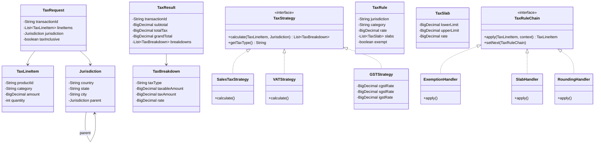

# Tax Calculation Service - LLD

## Problem Statement
Design a flexible tax calculation service supporting multiple tax types (Sales Tax, VAT, GST), jurisdiction-based rules, progressive slabs, exemptions, and composite taxes.

## UML Class Diagram


## Design Patterns
| Pattern | Usage |
|---------|-------|
| **Strategy** | Different tax calculation algorithms (Sales, VAT, GST) |
| **Chain of Responsibility** | Sequential rule application (exemption → slab → rounding) |
| **Composite** | Nested jurisdictions (country > state > city) |
| **Factory** | Create appropriate TaxStrategy based on jurisdiction |

## Complete Java Implementation

```java
// ============ MODELS ============
public class TaxLineItem {
    private String productId;
    private String category;
    private BigDecimal amount;
    private int quantity;
    // getters, constructor
}

public class Jurisdiction {
    private String country, state, city;
    private Jurisdiction parent;

    public List<Jurisdiction> getHierarchy() {
        List<Jurisdiction> chain = new ArrayList<>();
        Jurisdiction curr = this;
        while (curr != null) { chain.add(0, curr); curr = curr.parent; }
        return chain;
    }
    public String getKey() { return country + ":" + state + ":" + city; }
}

public class TaxSlab {
    private BigDecimal lowerLimit, upperLimit, rate;
    public BigDecimal calculate(BigDecimal amount) {
        BigDecimal taxable = amount.min(upperLimit).subtract(lowerLimit).max(BigDecimal.ZERO);
        return taxable.multiply(rate).divide(BigDecimal.valueOf(100));
    }
}

public class TaxRule {
    private String jurisdictionKey;
    private String category;
    private BigDecimal flatRate;
    private List<TaxSlab> slabs;
    private boolean exempt;
    private RoundingMode roundingMode;
}

public class TaxBreakdown {
    private String taxType;
    private BigDecimal taxableAmount, taxAmount, rate;
}

public class TaxRequest {
    private String transactionId;
    private List<TaxLineItem> lineItems;
    private Jurisdiction jurisdiction;
    private boolean taxInclusive;
}

public class TaxResult {
    private String transactionId;
    private BigDecimal subtotal, totalTax, grandTotal;
    private List<TaxBreakdown> breakdowns;
    private LocalDateTime calculatedAt;
}

// ============ STRATEGY PATTERN - TAX TYPES ============
public interface TaxStrategy {
    List<TaxBreakdown> calculate(TaxLineItem item, Jurisdiction jurisdiction, TaxRule rule);
    String getTaxType();
}

public class SalesTaxStrategy implements TaxStrategy {
    public List<TaxBreakdown> calculate(TaxLineItem item, Jurisdiction j, TaxRule rule) {
        BigDecimal taxable = item.getAmount().multiply(BigDecimal.valueOf(item.getQuantity()));
        BigDecimal tax = taxable.multiply(rule.getFlatRate()).divide(BigDecimal.valueOf(100));
        return List.of(new TaxBreakdown("SALES_TAX", taxable, tax, rule.getFlatRate()));
    }
    public String getTaxType() { return "SALES_TAX"; }
}

public class VATStrategy implements TaxStrategy {
    public List<TaxBreakdown> calculate(TaxLineItem item, Jurisdiction j, TaxRule rule) {
        BigDecimal taxable = item.getAmount().multiply(BigDecimal.valueOf(item.getQuantity()));
        BigDecimal tax;
        if (rule.getSlabs() != null && !rule.getSlabs().isEmpty()) {
            tax = calculateProgressive(taxable, rule.getSlabs());
        } else {
            tax = taxable.multiply(rule.getFlatRate()).divide(BigDecimal.valueOf(100));
        }
        return List.of(new TaxBreakdown("VAT", taxable, tax, rule.getFlatRate()));
    }

    private BigDecimal calculateProgressive(BigDecimal amount, List<TaxSlab> slabs) {
        BigDecimal total = BigDecimal.ZERO;
        for (TaxSlab slab : slabs) total = total.add(slab.calculate(amount));
        return total;
    }
    public String getTaxType() { return "VAT"; }
}

public class GSTStrategy implements TaxStrategy {
    // Composite tax: CGST + SGST (intra-state) or IGST (inter-state)
    public List<TaxBreakdown> calculate(TaxLineItem item, Jurisdiction j, TaxRule rule) {
        BigDecimal taxable = item.getAmount().multiply(BigDecimal.valueOf(item.getQuantity()));
        BigDecimal rate = rule.getFlatRate();
        List<TaxBreakdown> breakdowns = new ArrayList<>();

        if (isInterState(j)) {
            BigDecimal igst = taxable.multiply(rate).divide(BigDecimal.valueOf(100));
            breakdowns.add(new TaxBreakdown("IGST", taxable, igst, rate));
        } else {
            BigDecimal halfRate = rate.divide(BigDecimal.valueOf(2));
            BigDecimal cgst = taxable.multiply(halfRate).divide(BigDecimal.valueOf(100));
            BigDecimal sgst = taxable.multiply(halfRate).divide(BigDecimal.valueOf(100));
            breakdowns.add(new TaxBreakdown("CGST", taxable, cgst, halfRate));
            breakdowns.add(new TaxBreakdown("SGST", taxable, sgst, halfRate));
        }
        return breakdowns;
    }
    private boolean isInterState(Jurisdiction j) {
        return j.getParent() != null && !j.getState().equals(j.getParent().getState());
    }
    public String getTaxType() { return "GST"; }
}

public class ServiceTaxStrategy implements TaxStrategy {
    public List<TaxBreakdown> calculate(TaxLineItem item, Jurisdiction j, TaxRule rule) {
        BigDecimal taxable = item.getAmount().multiply(BigDecimal.valueOf(item.getQuantity()));
        BigDecimal tax = taxable.multiply(rule.getFlatRate()).divide(BigDecimal.valueOf(100));
        return List.of(new TaxBreakdown("SERVICE_TAX", taxable, tax, rule.getFlatRate()));
    }
    public String getTaxType() { return "SERVICE_TAX"; }
}

// ============ FACTORY ============
public class TaxStrategyFactory {
    private static final Map<String, TaxStrategy> strategies = Map.of(
        "US", new SalesTaxStrategy(),
        "UK", new VATStrategy(),
        "IN", new GSTStrategy(),
        "SERVICE", new ServiceTaxStrategy()
    );
    public static TaxStrategy getStrategy(Jurisdiction j) {
        return strategies.getOrDefault(j.getCountry(), new SalesTaxStrategy());
    }
}

// ============ CHAIN OF RESPONSIBILITY ============
public abstract class TaxRuleHandler {
    private TaxRuleHandler next;
    public TaxRuleHandler setNext(TaxRuleHandler next) { this.next = next; return next; }
    public TaxContext handle(TaxContext ctx) {
        TaxContext result = process(ctx);
        return (next != null) ? next.handle(result) : result;
    }
    protected abstract TaxContext process(TaxContext ctx);
}

public class TaxContext {
    private TaxLineItem item;
    private Jurisdiction jurisdiction;
    private TaxRule rule;
    private boolean exempt;
    private List<TaxBreakdown> breakdowns = new ArrayList<>();
}

public class ExemptionHandler extends TaxRuleHandler {
    private Set<String> exemptCategories;
    protected TaxContext process(TaxContext ctx) {
        if (ctx.getRule().isExempt() || exemptCategories.contains(ctx.getItem().getCategory())) {
            ctx.setExempt(true);
        }
        return ctx;
    }
}

public class SlabCalculationHandler extends TaxRuleHandler {
    protected TaxContext process(TaxContext ctx) {
        if (ctx.isExempt()) return ctx;
        TaxStrategy strategy = TaxStrategyFactory.getStrategy(ctx.getJurisdiction());
        List<TaxBreakdown> results = strategy.calculate(ctx.getItem(), ctx.getJurisdiction(), ctx.getRule());
        ctx.getBreakdowns().addAll(results);
        return ctx;
    }
}

public class TaxInclusiveHandler extends TaxRuleHandler {
    private boolean taxInclusive;
    protected TaxContext process(TaxContext ctx) {
        if (!taxInclusive || ctx.isExempt()) return ctx;
        // Reverse-calculate: price = amount / (1 + rate/100)
        for (TaxBreakdown b : ctx.getBreakdowns()) {
            BigDecimal divisor = BigDecimal.ONE.add(b.getRate().divide(BigDecimal.valueOf(100)));
            BigDecimal basePrice = b.getTaxableAmount().divide(divisor, 2, RoundingMode.HALF_UP);
            b.setTaxAmount(b.getTaxableAmount().subtract(basePrice));
            b.setTaxableAmount(basePrice);
        }
        return ctx;
    }
}

public class RoundingHandler extends TaxRuleHandler {
    private RoundingMode mode = RoundingMode.HALF_UP;
    private int scale = 2;
    protected TaxContext process(TaxContext ctx) {
        for (TaxBreakdown b : ctx.getBreakdowns()) {
            b.setTaxAmount(b.getTaxAmount().setScale(scale, mode));
        }
        return ctx;
    }
}

// ============ COMPOSITE JURISDICTION RESOLVER ============
public class JurisdictionTaxResolver {
    private Map<String, TaxRule> ruleStore; // jurisdictionKey:category -> rule

    public TaxRule resolve(Jurisdiction j, String category) {
        // Walk hierarchy: city -> state -> country (most specific wins)
        List<Jurisdiction> hierarchy = j.getHierarchy();
        for (int i = hierarchy.size() - 1; i >= 0; i--) {
            String key = hierarchy.get(i).getKey() + ":" + category;
            if (ruleStore.containsKey(key)) return ruleStore.get(key);
        }
        // Fallback: jurisdiction without category
        for (int i = hierarchy.size() - 1; i >= 0; i--) {
            String key = hierarchy.get(i).getKey() + ":DEFAULT";
            if (ruleStore.containsKey(key)) return ruleStore.get(key);
        }
        return TaxRule.ZERO;
    }
}

// ============ CACHING ============
public class TaxRateCache {
    private final Cache<String, TaxRule> cache = Caffeine.newBuilder()
        .maximumSize(10_000)
        .expireAfterWrite(Duration.ofHours(1))
        .build();

    public TaxRule get(String key, Supplier<TaxRule> loader) {
        return cache.get(key, k -> loader.get());
    }
    public void invalidate(String jurisdictionKey) {
        cache.asMap().keySet().removeIf(k -> k.startsWith(jurisdictionKey));
    }
}

// ============ TAX CALCULATION ENGINE ============
public class TaxCalculationService {
    private final JurisdictionTaxResolver resolver;
    private final TaxRateCache cache;

    public TaxResult calculate(TaxRequest request) {
        List<TaxBreakdown> allBreakdowns = new ArrayList<>();
        BigDecimal subtotal = BigDecimal.ZERO, totalTax = BigDecimal.ZERO;

        for (TaxLineItem item : request.getLineItems()) {
            String cacheKey = request.getJurisdiction().getKey() + ":" + item.getCategory();
            TaxRule rule = cache.get(cacheKey, () -> resolver.resolve(request.getJurisdiction(), item.getCategory()));

            // Build chain
            TaxRuleHandler chain = new ExemptionHandler(Set.of("ESSENTIAL", "MEDICINE"));
            chain.setNext(new SlabCalculationHandler())
                 .setNext(new TaxInclusiveHandler(request.isTaxInclusive()))
                 .setNext(new RoundingHandler());

            TaxContext ctx = new TaxContext(item, request.getJurisdiction(), rule);
            ctx = chain.handle(ctx);

            BigDecimal itemAmount = item.getAmount().multiply(BigDecimal.valueOf(item.getQuantity()));
            subtotal = subtotal.add(itemAmount);
            for (TaxBreakdown b : ctx.getBreakdowns()) {
                totalTax = totalTax.add(b.getTaxAmount());
            }
            allBreakdowns.addAll(ctx.getBreakdowns());
        }

        return new TaxResult(request.getTransactionId(), subtotal, totalTax,
            subtotal.add(totalTax), allBreakdowns, LocalDateTime.now());
    }
}

// ============ TAX REPORT GENERATION ============
public class TaxReportGenerator {
    public TaxReport generate(List<TaxResult> results, LocalDate from, LocalDate to) {
        Map<String, BigDecimal> taxByType = new HashMap<>();
        BigDecimal totalCollected = BigDecimal.ZERO;

        for (TaxResult r : results) {
            for (TaxBreakdown b : r.getBreakdowns()) {
                taxByType.merge(b.getTaxType(), b.getTaxAmount(), BigDecimal::add);
                totalCollected = totalCollected.add(b.getTaxAmount());
            }
        }
        return new TaxReport(from, to, totalCollected, taxByType, results.size());
    }
}

public class TaxReport {
    private LocalDate fromDate, toDate;
    private BigDecimal totalTaxCollected;
    private Map<String, BigDecimal> breakdownByType;
    private int transactionCount;
}
```

## SOLID Principles
| Principle | Application |
|-----------|-------------|
| **SRP** | Each handler/strategy has one responsibility |
| **OCP** | New tax types via new Strategy; new rules via new Handler |
| **LSP** | All strategies substitutable via TaxStrategy interface |
| **ISP** | Focused interfaces (TaxStrategy, TaxRuleHandler) |
| **DIP** | Engine depends on abstractions, not concrete strategies |

## Key Interview Points
1. **Strategy vs Chain**: Strategy selects *algorithm*, Chain applies *sequential rules*
2. **Composite Jurisdiction**: Walk parent chain for rule resolution (most specific wins)
3. **Tax-inclusive reverse calc**: `base = total / (1 + rate)` — applied as chain step
4. **GST composite**: Single strategy returns multiple breakdowns (CGST+SGST or IGST)
5. **Progressive slabs**: Each slab calculates on its bracket independently, sum gives total
6. **Caching**: Caffeine cache with jurisdiction-based invalidation for rule changes
7. **Rounding**: Configurable per jurisdiction (HALF_UP, FLOOR, CEILING) — last chain step
8. **Thread safety**: Strategies are stateless singletons; context is per-request
9. **Extensibility**: Add new country = add Strategy + configure rules — zero engine changes
10. **Audit trail**: TaxResult captures timestamp + full breakdown for compliance
