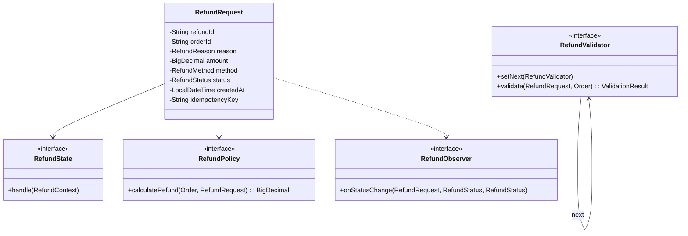
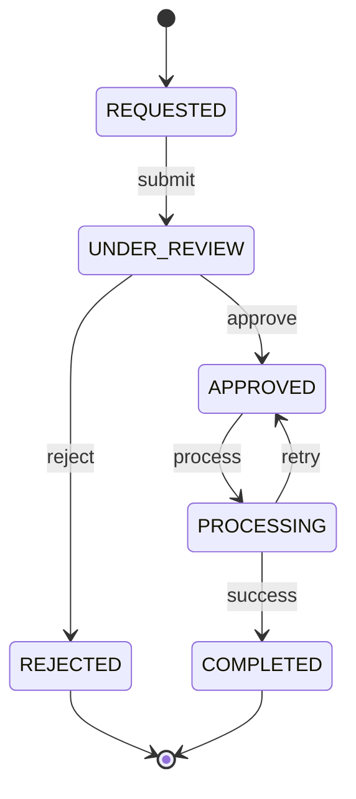

# Refund Workflow System - LLD

## Problem Statement
Design a refund workflow system that manages the complete lifecycle of refund requests with state transitions, validation chains, configurable policies, and payment integration.

## UML Class Diagram


## State Diagram


## Design Patterns
- **State**: Refund lifecycle transitions (each status = state class)
- **Strategy**: Refund calculation policies (full, partial, prorated, store credit)
- **Chain of Responsibility**: Validation pipeline (order validity → window → condition → fraud)
- **Observer**: Notifications on status changes

## Complete Java Implementation

```java
// ============ ENUMS ============
public enum RefundStatus {
    REQUESTED, UNDER_REVIEW, APPROVED, PROCESSING, COMPLETED, REJECTED
}

public enum RefundReason {
    DEFECTIVE, WRONG_ITEM, NOT_AS_DESCRIBED, CHANGED_MIND, LATE_DELIVERY
}

public enum RefundMethod {
    ORIGINAL_PAYMENT, STORE_CREDIT, BANK_TRANSFER
}

// ============ MODELS ============
public class Order {
    private String orderId;
    private BigDecimal totalAmount;
    private LocalDateTime orderDate;
    private String paymentId;
    private List<OrderItem> items;
    private boolean delivered;
    // getters/setters
}

public class Payment {
    private String paymentId;
    private String method; // CARD, UPI, WALLET
    private BigDecimal amount;
    private String transactionRef;
}

public class RefundRequest {
    private String refundId;
    private String orderId;
    private String customerId;
    private RefundReason reason;
    private BigDecimal requestedAmount;
    private BigDecimal approvedAmount;
    private RefundMethod method;
    private RefundStatus status;
    private LocalDateTime createdAt;
    private String idempotencyKey;
    private String reviewNote;
}

public class RefundResult {
    private String refundId;
    private boolean success;
    private BigDecimal refundedAmount;
    private String transactionRef;
    private String failureReason;
}

// ============ STATE PATTERN ============
public interface RefundState {
    void handle(RefundContext context);
    RefundStatus getStatus();
}

public class RefundContext {
    private RefundRequest request;
    private RefundState currentState;
    private List<RefundObserver> observers = new ArrayList<>();

    public void transitionTo(RefundState newState) {
        RefundStatus oldStatus = request.getStatus();
        this.currentState = newState;
        request.setStatus(newState.getStatus());
        notifyObservers(oldStatus, newState.getStatus());
    }

    public void proceed() { currentState.handle(this); }

    private void notifyObservers(RefundStatus from, RefundStatus to) {
        observers.forEach(o -> o.onStatusChange(request, from, to));
    }
}

public class RequestedState implements RefundState {
    public void handle(RefundContext ctx) {
        // Auto-transition to review
        ctx.transitionTo(new UnderReviewState());
    }
    public RefundStatus getStatus() { return RefundStatus.REQUESTED; }
}

public class UnderReviewState implements RefundState {
    private static final BigDecimal AUTO_APPROVE_THRESHOLD = new BigDecimal("500");

    public void handle(RefundContext ctx) {
        RefundRequest req = ctx.getRequest();
        if (req.getRequestedAmount().compareTo(AUTO_APPROVE_THRESHOLD) <= 0) {
            req.setApprovedAmount(req.getRequestedAmount());
            ctx.transitionTo(new ApprovedState());
        }
        // else wait for manual review
    }
    public RefundStatus getStatus() { return RefundStatus.UNDER_REVIEW; }
}

public class ApprovedState implements RefundState {
    public void handle(RefundContext ctx) {
        ctx.transitionTo(new ProcessingState());
    }
    public RefundStatus getStatus() { return RefundStatus.APPROVED; }
}

public class ProcessingState implements RefundState {
    private PaymentGateway gateway;

    public void handle(RefundContext ctx) {
        RefundRequest req = ctx.getRequest();
        RefundResult result = gateway.processRefund(req);
        if (result.isSuccess()) {
            ctx.transitionTo(new CompletedState());
        } else {
            ctx.transitionTo(new ApprovedState()); // retry
        }
    }
    public RefundStatus getStatus() { return RefundStatus.PROCESSING; }
}

public class CompletedState implements RefundState {
    public void handle(RefundContext ctx) { /* terminal */ }
    public RefundStatus getStatus() { return RefundStatus.COMPLETED; }
}

public class RejectedState implements RefundState {
    public void handle(RefundContext ctx) { /* terminal */ }
    public RefundStatus getStatus() { return RefundStatus.REJECTED; }
}

// ============ STRATEGY - REFUND POLICIES ============
public interface RefundPolicy {
    BigDecimal calculateRefund(Order order, RefundRequest request);
}

public class FullRefundPolicy implements RefundPolicy {
    public BigDecimal calculateRefund(Order order, RefundRequest request) {
        return order.getTotalAmount();
    }
}

public class PartialRefundPolicy implements RefundPolicy {
    public BigDecimal calculateRefund(Order order, RefundRequest request) {
        return request.getRequestedAmount().min(order.getTotalAmount());
    }
}

public class StoreCreditPolicy implements RefundPolicy {
    private static final BigDecimal BONUS = new BigDecimal("1.10"); // 10% extra
    public BigDecimal calculateRefund(Order order, RefundRequest request) {
        return request.getRequestedAmount().multiply(BONUS);
    }
}

public class ProRatedPolicy implements RefundPolicy {
    public BigDecimal calculateRefund(Order order, RefundRequest request) {
        long totalDays = 30;
        long usedDays = ChronoUnit.DAYS.between(order.getOrderDate(), LocalDateTime.now());
        double ratio = Math.max(0, (totalDays - usedDays)) / (double) totalDays;
        return order.getTotalAmount().multiply(BigDecimal.valueOf(ratio))
                    .setScale(2, RoundingMode.HALF_UP);
    }
}

// ============ CHAIN OF RESPONSIBILITY - VALIDATION ============
public class ValidationResult {
    private boolean valid;
    private String errorMessage;
    public static ValidationResult ok() { return new ValidationResult(true, null); }
    public static ValidationResult fail(String msg) { return new ValidationResult(false, msg); }
}

public abstract class RefundValidator {
    protected RefundValidator next;
    public RefundValidator setNext(RefundValidator next) { this.next = next; return next; }

    public ValidationResult validate(RefundRequest request, Order order) {
        ValidationResult result = doValidate(request, order);
        if (!result.isValid()) return result;
        if (next != null) return next.validate(request, order);
        return ValidationResult.ok();
    }
    protected abstract ValidationResult doValidate(RefundRequest request, Order order);
}

public class OrderValidityValidator extends RefundValidator {
    protected ValidationResult doValidate(RefundRequest request, Order order) {
        if (order == null) return ValidationResult.fail("Order not found");
        if (!order.isDelivered()) return ValidationResult.fail("Order not yet delivered");
        return ValidationResult.ok();
    }
}

public class RefundWindowValidator extends RefundValidator {
    private static final int REFUND_WINDOW_DAYS = 30;
    protected ValidationResult doValidate(RefundRequest request, Order order) {
        long daysSinceOrder = ChronoUnit.DAYS.between(order.getOrderDate(), LocalDateTime.now());
        if (daysSinceOrder > REFUND_WINDOW_DAYS)
            return ValidationResult.fail("Refund window expired");
        return ValidationResult.ok();
    }
}

public class ItemConditionValidator extends RefundValidator {
    protected ValidationResult doValidate(RefundRequest request, Order order) {
        if (request.getReason() == RefundReason.CHANGED_MIND && !order.isReturnReceived())
            return ValidationResult.fail("Item must be returned first");
        return ValidationResult.ok();
    }
}

public class FraudCheckValidator extends RefundValidator {
    private FraudService fraudService;
    protected ValidationResult doValidate(RefundRequest request, Order order) {
        if (fraudService.isSuspicious(request.getCustomerId()))
            return ValidationResult.fail("Flagged for fraud review");
        return ValidationResult.ok();
    }
}

// ============ OBSERVER ============
public interface RefundObserver {
    void onStatusChange(RefundRequest request, RefundStatus from, RefundStatus to);
}

public class CustomerNotificationObserver implements RefundObserver {
    public void onStatusChange(RefundRequest request, RefundStatus from, RefundStatus to) {
        System.out.println("Notify customer: Refund " + request.getRefundId() + " -> " + to);
    }
}

public class AccountingObserver implements RefundObserver {
    public void onStatusChange(RefundRequest request, RefundStatus from, RefundStatus to) {
        if (to == RefundStatus.COMPLETED) {
            // Create credit entry in accounting ledger
            createCreditEntry(request.getRefundId(), request.getApprovedAmount());
        }
    }
    private void createCreditEntry(String refundId, BigDecimal amount) {
        System.out.println("ACCOUNTING: Credit entry " + amount + " for refund " + refundId);
    }
}

public class AuditLogObserver implements RefundObserver {
    public void onStatusChange(RefundRequest request, RefundStatus from, RefundStatus to) {
        System.out.println("AUDIT: " + request.getRefundId() + " " + from + " -> " + to);
    }
}

// ============ IDEMPOTENCY & SERVICE ============
public class RefundService {
    private Map<String, RefundRequest> idempotencyStore = new ConcurrentHashMap<>();
    private Map<String, RefundRequest> refundStore = new ConcurrentHashMap<>();
    private RefundValidator validationChain;
    private Map<RefundReason, RefundPolicy> policyMap;
    private List<RefundObserver> observers;

    public RefundService() {
        // Build validation chain
        OrderValidityValidator v1 = new OrderValidityValidator();
        v1.setNext(new RefundWindowValidator())
           .setNext(new ItemConditionValidator())
           .setNext(new FraudCheckValidator());
        this.validationChain = v1;

        // Policy mapping
        policyMap = Map.of(
            RefundReason.DEFECTIVE, new FullRefundPolicy(),
            RefundReason.WRONG_ITEM, new FullRefundPolicy(),
            RefundReason.CHANGED_MIND, new PartialRefundPolicy(),
            RefundReason.LATE_DELIVERY, new ProRatedPolicy()
        );

        observers = List.of(
            new CustomerNotificationObserver(),
            new AccountingObserver(),
            new AuditLogObserver()
        );
    }

    public RefundResult submitRefund(RefundRequest request, Order order) {
        // Idempotency check
        if (idempotencyStore.containsKey(request.getIdempotencyKey())) {
            RefundRequest existing = idempotencyStore.get(request.getIdempotencyKey());
            return new RefundResult(existing.getRefundId(), true, existing.getApprovedAmount(),
                                    null, "Duplicate - returning existing");
        }

        // Validate
        ValidationResult validation = validationChain.validate(request, order);
        if (!validation.isValid()) {
            return new RefundResult(null, false, BigDecimal.ZERO, null, validation.getErrorMessage());
        }

        // Calculate refund amount via policy
        RefundPolicy policy = policyMap.getOrDefault(request.getReason(), new PartialRefundPolicy());
        BigDecimal refundAmount = policy.calculateRefund(order, request);
        request.setApprovedAmount(refundAmount);
        request.setRefundId(UUID.randomUUID().toString());

        // Store for idempotency
        idempotencyStore.put(request.getIdempotencyKey(), request);
        refundStore.put(request.getRefundId(), request);

        // Start state machine
        RefundContext context = new RefundContext(request, observers);
        context.transitionTo(new RequestedState());
        context.proceed(); // REQUESTED -> UNDER_REVIEW
        context.proceed(); // UNDER_REVIEW -> APPROVED (if auto) or wait

        if (request.getStatus() == RefundStatus.APPROVED) {
            context.proceed(); // APPROVED -> PROCESSING -> COMPLETED
        }

        return new RefundResult(request.getRefundId(), 
                                request.getStatus() == RefundStatus.COMPLETED,
                                request.getApprovedAmount(), null, null);
    }
}
```

## SOLID Principles Applied
| Principle | Application |
|-----------|-------------|
| **SRP** | Each state handles only its transition logic; validators handle single checks |
| **OCP** | New policies/validators added without modifying existing code |
| **LSP** | All RefundState/Policy/Validator implementations are interchangeable |
| **ISP** | Separate interfaces for State, Policy, Validator, Observer |
| **DIP** | Service depends on abstractions (interfaces), not concrete implementations |

## Key Interview Points
1. **State Pattern** eliminates complex if-else for status transitions; each state knows valid next states
2. **Idempotency** via unique key prevents double refunds from retries
3. **Chain of Responsibility** makes validation extensible—add/remove validators without changing service
4. **Strategy** decouples refund calculation from business logic—easy to A/B test policies
5. **Auto-approve threshold** reduces manual work for low-value refunds
6. **Observer** decouples side effects (notifications, accounting, audit) from core flow
7. **Accounting integration** creates credit entries only on COMPLETED state—ensures consistency
8. **Thread safety** with ConcurrentHashMap for idempotency store in concurrent environments
