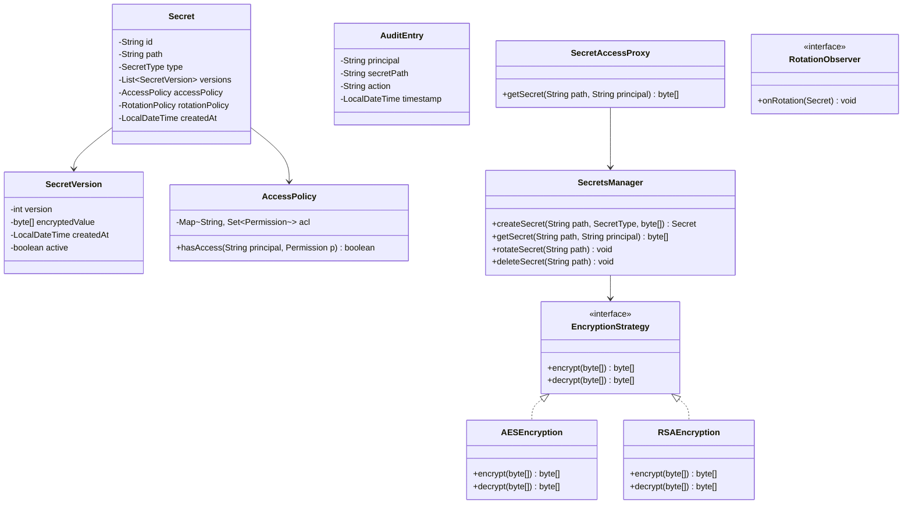

# Secrets Manager - Low Level Design

## 1. Problem Statement
Design a Secrets Manager that securely stores, rotates, and provides access to sensitive credentials (API keys, passwords, certificates, SSH keys) with encryption, versioning, access control, and audit logging.

## 2. UML Class Diagram


## 3. Design Patterns
- **Strategy**: Pluggable encryption (AES-256, RSA)
- **Proxy**: Access control enforcement before secret retrieval
- **Observer**: Notifications on rotation/access events
- **Factory**: Create encryption strategies based on secret type

## 4. SOLID Principles
- **SRP**: Each class has single responsibility (encryption, access, audit)
- **OCP**: New encryption algorithms without modifying manager
- **LSP**: All encryption strategies interchangeable
- **ISP**: Focused interfaces for encryption, observation
- **DIP**: Manager depends on EncryptionStrategy interface

## 5. Complete Java Implementation

```java
import java.time.*;
import java.util.*;
import java.util.concurrent.*;
import javax.crypto.*;
import javax.crypto.spec.*;
import java.security.*;

// ==================== Enums ====================
enum SecretType { API_KEY, PASSWORD, CERTIFICATE, SSH_KEY }
enum RotationPolicy { NONE, DAILY, WEEKLY, MONTHLY }
enum Permission { READ, WRITE, ROTATE, DELETE, ADMIN }

// ==================== Models ====================
class SecretVersion {
    private final int version;
    private final byte[] encryptedValue;
    private final LocalDateTime createdAt;
    private boolean active;

    public SecretVersion(int version, byte[] encryptedValue) {
        this.version = version;
        this.encryptedValue = encryptedValue;
        this.createdAt = LocalDateTime.now();
        this.active = true;
    }
    public int getVersion() { return version; }
    public byte[] getEncryptedValue() { return encryptedValue; }
    public boolean isActive() { return active; }
    public void setActive(boolean active) { this.active = active; }
    public LocalDateTime getCreatedAt() { return createdAt; }
}

class AccessPolicy {
    private final Map<String, Set<Permission>> acl = new ConcurrentHashMap<>();

    public void grant(String principal, Permission... perms) {
        acl.computeIfAbsent(principal, k -> EnumSet.noneOf(Permission.class))
           .addAll(Arrays.asList(perms));
    }
    public void revoke(String principal, Permission perm) {
        acl.getOrDefault(principal, Collections.emptySet()).remove(perm);
    }
    public boolean hasAccess(String principal, Permission perm) {
        Set<Permission> perms = acl.get(principal);
        return perms != null && (perms.contains(Permission.ADMIN) || perms.contains(perm));
    }
}

class Secret {
    private final String id;
    private final String path;
    private final SecretType type;
    private final List<SecretVersion> versions = new ArrayList<>();
    private final AccessPolicy accessPolicy;
    private RotationPolicy rotationPolicy;
    private final LocalDateTime createdAt;

    public Secret(String path, SecretType type, RotationPolicy rotation) {
        this.id = UUID.randomUUID().toString();
        this.path = path;
        this.type = type;
        this.rotationPolicy = rotation;
        this.accessPolicy = new AccessPolicy();
        this.createdAt = LocalDateTime.now();
    }
    public void addVersion(byte[] encrypted) {
        versions.forEach(v -> v.setActive(false));
        versions.add(new SecretVersion(versions.size() + 1, encrypted));
    }
    public SecretVersion getActiveVersion() {
        return versions.stream().filter(SecretVersion::isActive).findFirst().orElse(null);
    }
    public void rollback(int version) {
        versions.forEach(v -> v.setActive(v.getVersion() == version));
    }
    public String getId() { return id; }
    public String getPath() { return path; }
    public SecretType getType() { return type; }
    public AccessPolicy getAccessPolicy() { return accessPolicy; }
    public RotationPolicy getRotationPolicy() { return rotationPolicy; }
    public List<SecretVersion> getVersions() { return Collections.unmodifiableList(versions); }
}

class AuditEntry {
    private final String principal;
    private final String secretPath;
    private final String action;
    private final LocalDateTime timestamp;
    private final boolean success;

    public AuditEntry(String principal, String secretPath, String action, boolean success) {
        this.principal = principal;
        this.secretPath = secretPath;
        this.action = action;
        this.success = success;
        this.timestamp = LocalDateTime.now();
    }
    @Override
    public String toString() {
        return String.format("[%s] %s %s %s (success=%s)", timestamp, principal, action, secretPath, success);
    }
}

// ==================== Strategy: Encryption ====================
interface EncryptionStrategy {
    byte[] encrypt(byte[] plaintext);
    byte[] decrypt(byte[] ciphertext);
}

class AES256Encryption implements EncryptionStrategy {
    private final SecretKey key;
    public AES256Encryption(byte[] keyBytes) {
        this.key = new SecretKeySpec(keyBytes, "AES");
    }
    public byte[] encrypt(byte[] plaintext) {
        try {
            Cipher cipher = Cipher.getInstance("AES/GCM/NoPadding");
            byte[] iv = new byte[12];
            SecureRandom.getInstanceStrong().nextBytes(iv);
            cipher.init(Cipher.ENCRYPT_MODE, key, new GCMParameterSpec(128, iv));
            byte[] encrypted = cipher.doFinal(plaintext);
            byte[] result = new byte[iv.length + encrypted.length];
            System.arraycopy(iv, 0, result, 0, iv.length);
            System.arraycopy(encrypted, 0, result, iv.length, encrypted.length);
            return result;
        } catch (Exception e) { throw new RuntimeException("Encryption failed", e); }
    }
    public byte[] decrypt(byte[] ciphertext) {
        try {
            Cipher cipher = Cipher.getInstance("AES/GCM/NoPadding");
            byte[] iv = Arrays.copyOfRange(ciphertext, 0, 12);
            byte[] encrypted = Arrays.copyOfRange(ciphertext, 12, ciphertext.length);
            cipher.init(Cipher.DECRYPT_MODE, key, new GCMParameterSpec(128, iv));
            return cipher.doFinal(encrypted);
        } catch (Exception e) { throw new RuntimeException("Decryption failed", e); }
    }
}

class RSAEncryption implements EncryptionStrategy {
    private final KeyPair keyPair;
    public RSAEncryption() {
        try {
            KeyPairGenerator gen = KeyPairGenerator.getInstance("RSA");
            gen.initialize(2048);
            this.keyPair = gen.generateKeyPair();
        } catch (Exception e) { throw new RuntimeException(e); }
    }
    public byte[] encrypt(byte[] plaintext) {
        try {
            Cipher cipher = Cipher.getInstance("RSA/ECB/OAEPWithSHA-256AndMGF1Padding");
            cipher.init(Cipher.ENCRYPT_MODE, keyPair.getPublic());
            return cipher.doFinal(plaintext);
        } catch (Exception e) { throw new RuntimeException("RSA encryption failed", e); }
    }
    public byte[] decrypt(byte[] ciphertext) {
        try {
            Cipher cipher = Cipher.getInstance("RSA/ECB/OAEPWithSHA-256AndMGF1Padding");
            cipher.init(Cipher.DECRYPT_MODE, keyPair.getPrivate());
            return cipher.doFinal(ciphertext);
        } catch (Exception e) { throw new RuntimeException("RSA decryption failed", e); }
    }
}

// ==================== Factory ====================
class EncryptionFactory {
    private static final byte[] AES_KEY = new byte[32]; // In production: from KMS
    static { new SecureRandom().nextBytes(AES_KEY); }

    public static EncryptionStrategy create(SecretType type) {
        return switch (type) {
            case CERTIFICATE, SSH_KEY -> new RSAEncryption();
            default -> new AES256Encryption(AES_KEY);
        };
    }
}

// ==================== Observer ====================
interface SecretObserver {
    void onRotation(Secret secret);
    void onAccessDenied(String principal, String path);
    void onSecretAccessed(String principal, String path);
}

class NotificationObserver implements SecretObserver {
    public void onRotation(Secret secret) {
        System.out.println("[NOTIFY] Secret rotated: " + secret.getPath());
    }
    public void onAccessDenied(String principal, String path) {
        System.out.println("[ALERT] Access denied: " + principal + " -> " + path);
    }
    public void onSecretAccessed(String principal, String path) {
        System.out.println("[LOG] Secret accessed: " + principal + " -> " + path);
    }
}

// ==================== Cache ====================
class SecretCache {
    private final Map<String, CacheEntry> cache = new ConcurrentHashMap<>();
    private final long ttlMillis;

    record CacheEntry(byte[] value, long expiresAt) {}

    public SecretCache(long ttlMillis) { this.ttlMillis = ttlMillis; }

    public byte[] get(String path) {
        CacheEntry entry = cache.get(path);
        if (entry != null && System.currentTimeMillis() < entry.expiresAt()) return entry.value();
        cache.remove(path);
        return null;
    }
    public void put(String path, byte[] value) {
        cache.put(path, new CacheEntry(value, System.currentTimeMillis() + ttlMillis));
    }
    public void invalidate(String path) { cache.remove(path); }
}

// ==================== Audit Logger ====================
class AuditLogger {
    private final List<AuditEntry> log = Collections.synchronizedList(new ArrayList<>());

    public void log(String principal, String path, String action, boolean success) {
        AuditEntry entry = new AuditEntry(principal, path, action, success);
        log.add(entry);
        System.out.println("[AUDIT] " + entry);
    }
    public List<AuditEntry> getEntriesForPath(String path) {
        return log.stream().filter(e -> e.toString().contains(path)).toList();
    }
}

// ==================== Core Secrets Manager ====================
class SecretsManager {
    private final Map<String, Secret> secrets = new ConcurrentHashMap<>();
    private final Map<SecretType, EncryptionStrategy> encryptors = new ConcurrentHashMap<>();
    private final List<SecretObserver> observers = new ArrayList<>();
    private final AuditLogger auditLogger = new AuditLogger();
    private final SecretCache cache = new SecretCache(60_000); // 1 min TTL
    private final ScheduledExecutorService scheduler = Executors.newScheduledThreadPool(1);

    public void addObserver(SecretObserver observer) { observers.add(observer); }

    public Secret createSecret(String path, SecretType type, byte[] value,
                               RotationPolicy rotation, String owner) {
        EncryptionStrategy enc = encryptors.computeIfAbsent(type, EncryptionFactory::create);
        Secret secret = new Secret(path, type, rotation);
        secret.addVersion(enc.encrypt(value));
        secret.getAccessPolicy().grant(owner, Permission.ADMIN);
        secrets.put(path, secret);
        auditLogger.log(owner, path, "CREATE", true);
        scheduleRotation(secret);
        return secret;
    }

    public byte[] getSecret(String path, String principal) {
        Secret secret = secrets.get(path);
        if (secret == null) throw new NoSuchElementException("Secret not found: " + path);
        if (!secret.getAccessPolicy().hasAccess(principal, Permission.READ)) {
            auditLogger.log(principal, path, "READ_DENIED", false);
            observers.forEach(o -> o.onAccessDenied(principal, path));
            throw new SecurityException("Access denied");
        }
        byte[] cached = cache.get(path);
        if (cached != null) { auditLogger.log(principal, path, "READ_CACHED", true); return cached; }
        EncryptionStrategy enc = encryptors.get(secret.getType());
        byte[] decrypted = enc.decrypt(secret.getActiveVersion().getEncryptedValue());
        cache.put(path, decrypted);
        auditLogger.log(principal, path, "READ", true);
        observers.forEach(o -> o.onSecretAccessed(principal, path));
        return decrypted;
    }

    public void rotateSecret(String path, byte[] newValue, String principal) {
        Secret secret = secrets.get(path);
        if (secret == null) throw new NoSuchElementException("Secret not found: " + path);
        if (!secret.getAccessPolicy().hasAccess(principal, Permission.ROTATE)) {
            throw new SecurityException("No rotate permission");
        }
        EncryptionStrategy enc = encryptors.get(secret.getType());
        secret.addVersion(enc.encrypt(newValue));
        cache.invalidate(path);
        auditLogger.log(principal, path, "ROTATE", true);
        observers.forEach(o -> o.onRotation(secret));
    }

    public void deleteSecret(String path, String principal) {
        Secret secret = secrets.get(path);
        if (secret == null) return;
        if (!secret.getAccessPolicy().hasAccess(principal, Permission.DELETE)) {
            throw new SecurityException("No delete permission");
        }
        secrets.remove(path);
        cache.invalidate(path);
        auditLogger.log(principal, path, "DELETE", true);
    }

    public void rollback(String path, int version, String principal) {
        Secret secret = secrets.get(path);
        if (!secret.getAccessPolicy().hasAccess(principal, Permission.WRITE))
            throw new SecurityException("No write permission");
        secret.rollback(version);
        cache.invalidate(path);
        auditLogger.log(principal, path, "ROLLBACK_TO_V" + version, true);
    }

    private void scheduleRotation(Secret secret) {
        long interval = switch (secret.getRotationPolicy()) {
            case DAILY -> 86400;
            case WEEKLY -> 604800;
            case MONTHLY -> 2592000;
            case NONE -> 0;
        };
        if (interval > 0) {
            scheduler.scheduleAtFixedRate(() -> {
                byte[] newVal = generateRandomSecret();
                rotateSecret(secret.getPath(), newVal, "SYSTEM_ROTATION");
            }, interval, interval, TimeUnit.SECONDS);
        }
    }
    private byte[] generateRandomSecret() {
        byte[] secret = new byte[32];
        new SecureRandom().nextBytes(secret);
        return secret;
    }
}

// ==================== Proxy: Access Control ====================
class SecretAccessProxy {
    private final SecretsManager manager;
    private final AuditLogger auditLogger;

    public SecretAccessProxy(SecretsManager manager, AuditLogger auditLogger) {
        this.manager = manager;
        this.auditLogger = auditLogger;
    }
    public byte[] getSecret(String path, String principal) {
        // Additional checks: rate limiting, IP whitelisting, etc.
        System.out.println("[PROXY] Validating request from " + principal + " for " + path);
        return manager.getSecret(path, principal);
    }
}

// ==================== Demo ====================
class SecretsManagerDemo {
    public static void main(String[] args) {
        SecretsManager manager = new SecretsManager();
        manager.addObserver(new NotificationObserver());

        // Create secret with owner
        Secret dbSecret = manager.createSecret(
            "/prod/db/password", SecretType.PASSWORD,
            "super-secret-pw".getBytes(), RotationPolicy.WEEKLY, "admin"
        );

        // Grant access to app service
        dbSecret.getAccessPolicy().grant("app-service", Permission.READ);
        dbSecret.getAccessPolicy().grant("devops", Permission.READ, Permission.ROTATE);

        // Read secret
        byte[] value = manager.getSecret("/prod/db/password", "app-service");
        System.out.println("Retrieved: " + new String(value));

        // Rotate
        manager.rotateSecret("/prod/db/password", "new-password-123".getBytes(), "devops");

        // Read after rotation
        value = manager.getSecret("/prod/db/password", "admin");
        System.out.println("After rotation: " + new String(value));

        // Rollback
        manager.rollback("/prod/db/password", 1, "admin");

        // Access denied demo
        try {
            manager.getSecret("/prod/db/password", "unauthorized-user");
        } catch (SecurityException e) {
            System.out.println("Expected: " + e.getMessage());
        }
    }
}
```

## 6. Key Interview Points

| Topic | Key Points |
|-------|-----------|
| **Encryption** | AES-256-GCM for symmetric, RSA-OAEP for asymmetric; envelope encryption in production (encrypt data key with master key) |
| **Key Management** | Master keys stored in HSM/KMS; never in application memory longer than needed |
| **Versioning** | Every rotation creates new version; rollback without re-encryption of old value |
| **Access Control** | Per-secret ACLs; principle of least privilege; separate read/write/rotate/delete |
| **Audit** | Immutable log of all access attempts (success + failure); required for compliance |
| **Rotation** | Automatic scheduled rotation; zero-downtime via version overlap |
| **Caching** | Short TTL to reduce decryption overhead; invalidate on rotation |
| **Secret Paths** | Hierarchical namespace (`/env/service/key`) for organization |
| **Thread Safety** | ConcurrentHashMap, synchronized collections for multi-tenant access |
| **Production Concerns** | HSM-backed keys, mTLS for transit, secret scanning in CI/CD, break-glass procedures |
