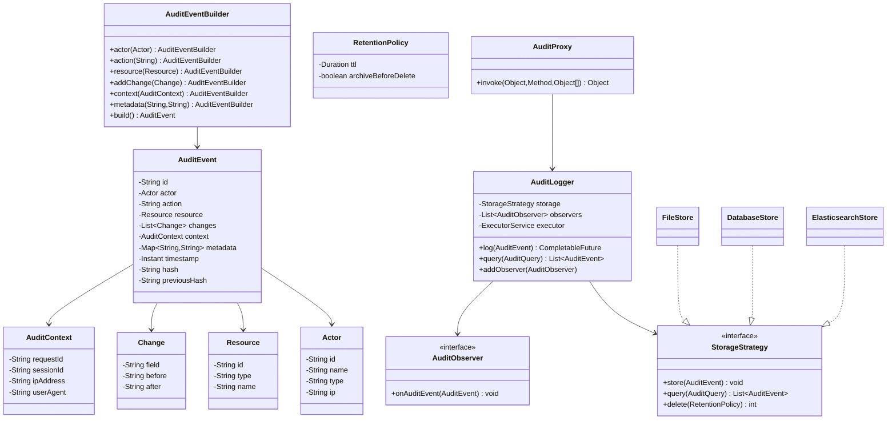

# Audit Log Library - Low Level Design

## 1. Problem Statement
Design a reusable audit log library that captures who did what, when, and to which resource. Must support immutable tamper-proof entries, multiple storage backends, async writing, search/query, retention policies, and hash-chain integrity verification.

## 2. UML Class Diagram


## 3. Design Patterns
| Pattern | Usage |
|---------|-------|
| **Builder** | AuditEventBuilder for fluent event construction |
| **Strategy** | StorageStrategy for pluggable backends |
| **Observer** | AuditObserver for notifications/alerts |
| **Decorator** | Wrapping storage with integrity verification |
| **Proxy** | AuditProxy for automatic method-level auditing |

## 4. SOLID Principles
- **S**: Each class has single responsibility (storage, building, querying)
- **O**: New storage backends without modifying AuditLogger
- **L**: All StorageStrategy implementations are interchangeable
- **I**: Separate interfaces for storage, observation, querying
- **D**: AuditLogger depends on StorageStrategy abstraction

## 5. Complete Java Implementation

```java
// ============ Models (Immutable) ============
public final class Actor {
    private final String id;
    private final String name;
    private final String type;
    private final String ip;

    public Actor(String id, String name, String type, String ip) {
        this.id = id; this.name = name; this.type = type; this.ip = ip;
    }
    public String getId() { return id; }
    public String getName() { return name; }
    public String getType() { return type; }
    public String getIp() { return ip; }
}

public final class Resource {
    private final String id;
    private final String type;
    private final String name;

    public Resource(String id, String type, String name) {
        this.id = id; this.type = type; this.name = name;
    }
    public String getId() { return id; }
    public String getType() { return type; }
    public String getName() { return name; }
}

public final class Change {
    private final String field;
    private final String before;
    private final String after;

    public Change(String field, String before, String after) {
        this.field = field; this.before = before; this.after = after;
    }
    public String getField() { return field; }
    public String getBefore() { return before; }
    public String getAfter() { return after; }
}

public final class AuditContext {
    private final String requestId;
    private final String sessionId;
    private final String ipAddress;
    private final String userAgent;

    public AuditContext(String requestId, String sessionId, String ipAddress, String userAgent) {
        this.requestId = requestId; this.sessionId = sessionId;
        this.ipAddress = ipAddress; this.userAgent = userAgent;
    }
    public String getRequestId() { return requestId; }
    public String getSessionId() { return sessionId; }
    public String getIpAddress() { return ipAddress; }
    public String getUserAgent() { return userAgent; }
}

// ============ AuditEvent (Immutable with Hash Chain) ============
public final class AuditEvent {
    private final String id;
    private final Actor actor;
    private final String action;
    private final Resource resource;
    private final List<Change> changes;
    private final AuditContext context;
    private final Map<String, String> metadata;
    private final Instant timestamp;
    private final String hash;
    private final String previousHash;

    AuditEvent(String id, Actor actor, String action, Resource resource,
               List<Change> changes, AuditContext context, Map<String, String> metadata,
               Instant timestamp, String previousHash) {
        this.id = id; this.actor = actor; this.action = action;
        this.resource = resource;
        this.changes = Collections.unmodifiableList(new ArrayList<>(changes));
        this.context = context;
        this.metadata = Collections.unmodifiableMap(new HashMap<>(metadata));
        this.timestamp = timestamp; this.previousHash = previousHash;
        this.hash = computeHash();
    }

    private String computeHash() {
        String content = id + actor.getId() + action + resource.getId()
                + timestamp.toString() + previousHash;
        return DigestUtils.sha256Hex(content); // Apache Commons or manual SHA-256
    }

    // All getters, no setters
    public String getId() { return id; }
    public Actor getActor() { return actor; }
    public String getAction() { return action; }
    public Resource getResource() { return resource; }
    public List<Change> getChanges() { return changes; }
    public AuditContext getContext() { return context; }
    public Map<String, String> getMetadata() { return metadata; }
    public Instant getTimestamp() { return timestamp; }
    public String getHash() { return hash; }
    public String getPreviousHash() { return previousHash; }
}

// ============ Builder Pattern ============
public class AuditEventBuilder {
    private Actor actor;
    private String action;
    private Resource resource;
    private List<Change> changes = new ArrayList<>();
    private AuditContext context;
    private Map<String, String> metadata = new HashMap<>();
    private String previousHash = "";

    public AuditEventBuilder actor(Actor actor) { this.actor = actor; return this; }
    public AuditEventBuilder action(String action) { this.action = action; return this; }
    public AuditEventBuilder resource(Resource resource) { this.resource = resource; return this; }
    public AuditEventBuilder addChange(String field, String before, String after) {
        this.changes.add(new Change(field, before, after)); return this;
    }
    public AuditEventBuilder context(AuditContext ctx) { this.context = ctx; return this; }
    public AuditEventBuilder metadata(String key, String value) {
        this.metadata.put(key, value); return this;
    }
    public AuditEventBuilder previousHash(String hash) { this.previousHash = hash; return this; }

    public AuditEvent build() {
        Objects.requireNonNull(actor, "Actor required");
        Objects.requireNonNull(action, "Action required");
        Objects.requireNonNull(resource, "Resource required");
        return new AuditEvent(UUID.randomUUID().toString(), actor, action, resource,
                changes, context, metadata, Instant.now(), previousHash);
    }
}

// ============ Strategy Pattern - Storage ============
public interface StorageStrategy {
    void store(AuditEvent event);
    List<AuditEvent> query(AuditQuery query);
    int applyRetention(RetentionPolicy policy);
}

public class FileStore implements StorageStrategy {
    private final Path directory;
    private final ObjectMapper mapper = new ObjectMapper();

    public FileStore(Path directory) { this.directory = directory; }

    @Override
    public void store(AuditEvent event) {
        Path file = directory.resolve(event.getTimestamp().toString().replace(":", "-") + ".json");
        Files.writeString(file, mapper.writeValueAsString(event));
    }

    @Override
    public List<AuditEvent> query(AuditQuery query) {
        return Files.list(directory)
            .map(this::readEvent)
            .filter(query::matches)
            .sorted(Comparator.comparing(AuditEvent::getTimestamp).reversed())
            .collect(Collectors.toList());
    }

    @Override
    public int applyRetention(RetentionPolicy policy) {
        Instant cutoff = Instant.now().minus(policy.getTtl());
        // Archive then delete files older than cutoff
        return (int) Files.list(directory)
            .filter(f -> getTimestamp(f).isBefore(cutoff))
            .peek(f -> { if (policy.isArchiveBeforeDelete()) archive(f); })
            .peek(Files::delete)
            .count();
    }
}

public class DatabaseStore implements StorageStrategy {
    private final DataSource dataSource;

    public DatabaseStore(DataSource dataSource) { this.dataSource = dataSource; }

    @Override
    public void store(AuditEvent event) {
        String sql = "INSERT INTO audit_events (id,actor_id,action,resource_id,resource_type," +
                     "changes,context,metadata,timestamp,hash,previous_hash) VALUES (?,?,?,?,?,?,?,?,?,?,?)";
        try (Connection conn = dataSource.getConnection();
             PreparedStatement ps = conn.prepareStatement(sql)) {
            ps.setString(1, event.getId());
            ps.setString(2, event.getActor().getId());
            ps.setString(3, event.getAction());
            ps.setString(4, event.getResource().getId());
            ps.setString(5, event.getResource().getType());
            ps.setString(6, toJson(event.getChanges()));
            ps.setString(7, toJson(event.getContext()));
            ps.setString(8, toJson(event.getMetadata()));
            ps.setTimestamp(9, Timestamp.from(event.getTimestamp()));
            ps.setString(10, event.getHash());
            ps.setString(11, event.getPreviousHash());
            ps.executeUpdate();
        }
    }

    @Override
    public List<AuditEvent> query(AuditQuery query) {
        StringBuilder sql = new StringBuilder("SELECT * FROM audit_events WHERE 1=1");
        if (query.getActorId() != null) sql.append(" AND actor_id = ?");
        if (query.getResourceId() != null) sql.append(" AND resource_id = ?");
        if (query.getAction() != null) sql.append(" AND action = ?");
        if (query.getFrom() != null) sql.append(" AND timestamp >= ?");
        if (query.getTo() != null) sql.append(" AND timestamp <= ?");
        sql.append(" ORDER BY timestamp DESC LIMIT ?");
        // Execute and map results...
        return results;
    }

    @Override
    public int applyRetention(RetentionPolicy policy) {
        String sql = "DELETE FROM audit_events WHERE timestamp < ?";
        // Execute with cutoff timestamp
        return deletedCount;
    }
}

public class ElasticsearchStore implements StorageStrategy {
    private final RestHighLevelClient client;
    private final String indexName;

    @Override
    public void store(AuditEvent event) {
        IndexRequest request = new IndexRequest(indexName)
            .id(event.getId())
            .source(toMap(event));
        client.index(request, RequestOptions.DEFAULT);
    }

    @Override
    public List<AuditEvent> query(AuditQuery query) {
        BoolQueryBuilder boolQuery = QueryBuilders.boolQuery();
        if (query.getActorId() != null)
            boolQuery.must(QueryBuilders.termQuery("actor.id", query.getActorId()));
        if (query.getFrom() != null || query.getTo() != null)
            boolQuery.must(QueryBuilders.rangeQuery("timestamp")
                .gte(query.getFrom()).lte(query.getTo()));
        // Execute search and return results
        return results;
    }
}

// ============ Query Model ============
public class AuditQuery {
    private String actorId;
    private String resourceId;
    private String resourceType;
    private String action;
    private Instant from;
    private Instant to;
    private int limit = 100;

    // Builder-style setters
    public AuditQuery actorId(String id) { this.actorId = id; return this; }
    public AuditQuery resourceId(String id) { this.resourceId = id; return this; }
    public AuditQuery action(String action) { this.action = action; return this; }
    public AuditQuery timeRange(Instant from, Instant to) {
        this.from = from; this.to = to; return this;
    }
    public boolean matches(AuditEvent event) {
        if (actorId != null && !actorId.equals(event.getActor().getId())) return false;
        if (resourceId != null && !resourceId.equals(event.getResource().getId())) return false;
        if (action != null && !action.equals(event.getAction())) return false;
        if (from != null && event.getTimestamp().isBefore(from)) return false;
        if (to != null && event.getTimestamp().isAfter(to)) return false;
        return true;
    }
}

// ============ Retention Policy ============
public class RetentionPolicy {
    private final Duration ttl;
    private final boolean archiveBeforeDelete;

    public RetentionPolicy(Duration ttl, boolean archiveBeforeDelete) {
        this.ttl = ttl; this.archiveBeforeDelete = archiveBeforeDelete;
    }
    public Duration getTtl() { return ttl; }
    public boolean isArchiveBeforeDelete() { return archiveBeforeDelete; }
}

// ============ Observer Pattern ============
public interface AuditObserver {
    void onAuditEvent(AuditEvent event);
}

public class AlertingObserver implements AuditObserver {
    private final Set<String> criticalActions = Set.of("DELETE", "PERMISSION_CHANGE", "EXPORT");

    @Override
    public void onAuditEvent(AuditEvent event) {
        if (criticalActions.contains(event.getAction())) {
            sendAlert(event);
        }
    }
}

// ============ Decorator - Integrity Verification ============
public class IntegrityVerifyingStore implements StorageStrategy {
    private final StorageStrategy delegate;

    public IntegrityVerifyingStore(StorageStrategy delegate) { this.delegate = delegate; }

    @Override
    public void store(AuditEvent event) {
        delegate.store(event);
    }

    @Override
    public List<AuditEvent> query(AuditQuery query) {
        List<AuditEvent> events = delegate.query(query);
        verifyChain(events);
        return events;
    }

    private void verifyChain(List<AuditEvent> events) {
        for (int i = 1; i < events.size(); i++) {
            if (!events.get(i).getPreviousHash().equals(events.get(i - 1).getHash())) {
                throw new TamperDetectedException("Hash chain broken at event: " + events.get(i).getId());
            }
        }
    }

    @Override
    public int applyRetention(RetentionPolicy policy) { return delegate.applyRetention(policy); }
}

// ============ Core Logger (Async + Observer) ============
public class AuditLogger {
    private final StorageStrategy storage;
    private final List<AuditObserver> observers = new CopyOnWriteArrayList<>();
    private final ExecutorService executor;
    private volatile String lastHash = "";

    public AuditLogger(StorageStrategy storage, int threadPoolSize) {
        this.storage = storage;
        this.executor = Executors.newFixedThreadPool(threadPoolSize);
    }

    public CompletableFuture<Void> log(AuditEvent event) {
        return CompletableFuture.runAsync(() -> {
            storage.store(event);
            lastHash = event.getHash();
            observers.forEach(o -> o.onAuditEvent(event));
        }, executor);
    }

    public String getLastHash() { return lastHash; }
    public void addObserver(AuditObserver observer) { observers.add(observer); }
    public List<AuditEvent> query(AuditQuery query) { return storage.query(query); }
    public int applyRetention(RetentionPolicy policy) { return storage.applyRetention(policy); }

    public void shutdown() { executor.shutdown(); }
}

// ============ Proxy - Automatic Method Auditing ============
public class AuditProxy implements InvocationHandler {
    private final Object target;
    private final AuditLogger logger;
    private final AuditContext context;

    public AuditProxy(Object target, AuditLogger logger, AuditContext context) {
        this.target = target; this.logger = logger; this.context = context;
    }

    @SuppressWarnings("unchecked")
    public static <T> T create(T target, Class<T> iface, AuditLogger logger, AuditContext ctx) {
        return (T) Proxy.newProxyInstance(iface.getClassLoader(), new Class[]{iface},
                new AuditProxy(target, logger, ctx));
    }

    @Override
    public Object invoke(Object proxy, Method method, Object[] args) throws Throwable {
        Audited annotation = method.getAnnotation(Audited.class);
        if (annotation == null) return method.invoke(target, args);

        Object result = method.invoke(target, args);

        AuditEvent event = new AuditEventBuilder()
            .actor(new Actor(context.getSessionId(), "system", "SERVICE", context.getIpAddress()))
            .action(annotation.action().isEmpty() ? method.getName() : annotation.action())
            .resource(new Resource(extractId(args), target.getClass().getSimpleName(), annotation.resourceType()))
            .context(context)
            .previousHash(logger.getLastHash())
            .build();
        logger.log(event);
        return result;
    }
}

@Retention(RetentionPolicy.RUNTIME)
@Target(ElementType.METHOD)
public @interface Audited {
    String action() default "";
    String resourceType() default "";
}

// ============ Context Propagation (ThreadLocal) ============
public class AuditContextHolder {
    private static final ThreadLocal<AuditContext> CONTEXT = new ThreadLocal<>();

    public static void set(AuditContext ctx) { CONTEXT.set(ctx); }
    public static AuditContext get() { return CONTEXT.get(); }
    public static void clear() { CONTEXT.remove(); }
}

// ============ Usage Example ============
public class UsageExample {
    public static void main(String[] args) {
        // Setup
        StorageStrategy store = new IntegrityVerifyingStore(new DatabaseStore(dataSource));
        AuditLogger logger = new AuditLogger(store, 4);
        logger.addObserver(new AlertingObserver());

        // Log an event
        AuditEvent event = new AuditEventBuilder()
            .actor(new Actor("user-123", "John", "HUMAN", "192.168.1.1"))
            .action("UPDATE")
            .resource(new Resource("order-456", "Order", "Order #456"))
            .addChange("status", "PENDING", "SHIPPED")
            .addChange("updatedAt", "2024-01-01", "2024-01-15")
            .context(new AuditContext("req-789", "sess-012", "192.168.1.1", "Chrome"))
            .metadata("reason", "Customer request")
            .previousHash(logger.getLastHash())
            .build();

        logger.log(event).join();

        // Query
        List<AuditEvent> events = logger.query(
            new AuditQuery().actorId("user-123").timeRange(Instant.now().minus(Duration.ofDays(7)), Instant.now())
        );

        // Automatic auditing via proxy
        UserService proxied = AuditProxy.create(new UserServiceImpl(), UserService.class, logger,
            AuditContextHolder.get());
        proxied.deleteUser("user-999"); // Automatically audited
    }
}
```

## 6. Key Interview Points

| Topic | Key Insight |
|-------|-------------|
| **Immutability** | All models are `final` with no setters; collections wrapped with `unmodifiableList/Map` |
| **Hash Chain** | Each event stores hash of previous event; tampering breaks the chain |
| **Async Writing** | `CompletableFuture` + thread pool prevents audit logging from blocking business logic |
| **Strategy Pattern** | Storage backend swappable without changing logger code |
| **Proxy Pattern** | Transparent auditing via `@Audited` annotation - zero code change in services |
| **Context Propagation** | ThreadLocal holds request context; passed through async boundaries |
| **Retention** | TTL-based cleanup with optional archival before deletion |
| **Query Flexibility** | Composite query object supports filtering by actor, resource, time, action |
| **Thread Safety** | `CopyOnWriteArrayList` for observers, `volatile` for lastHash |
| **Tamper Detection** | Decorator wraps storage to verify hash chain integrity on reads |
