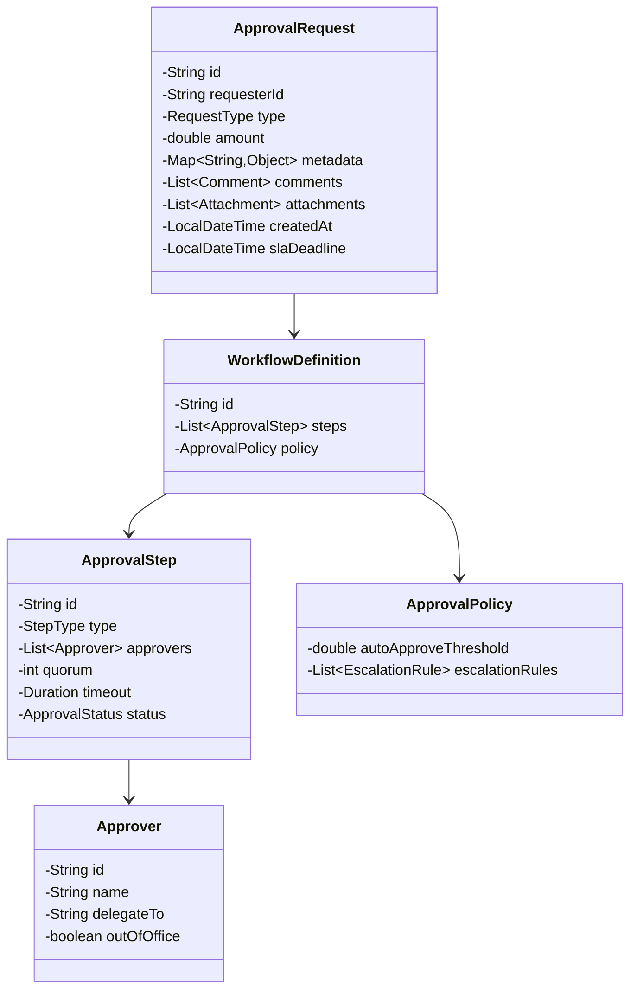

# Approval Workflow System - LLD

## Problem Statement
Design a flexible approval workflow engine supporting multi-level chains, parallel/sequential/conditional approvals, escalation, delegation, quorum-based decisions, auto-approve rules, SLA tracking, and full audit trails.

## UML Class Diagram


## Design Patterns
- **Chain of Responsibility**: Multi-level approval chain where each level handles or passes up
- **State**: Request transitions through PENDING → APPROVED/REJECTED/ESCALATED/EXPIRED
- **Observer**: Notify stakeholders at each state change
- **Strategy**: Different approval strategies (sequential, parallel, quorum)

## Java Implementation

```java
// === Enums ===
enum ApprovalStatus { PENDING, APPROVED, REJECTED, ESCALATED, EXPIRED }
enum StepType { SEQUENTIAL, PARALLEL, CONDITIONAL }
enum EventType { SUBMITTED, APPROVED, REJECTED, ESCALATED, EXPIRED, COMMENTED }

// === Models ===
@Data @Builder
class Approver {
    private String id, name, email, delegateTo;
    private boolean outOfOffice;
    public String getEffectiveApprover() {
        return outOfOffice && delegateTo != null ? delegateTo : id;
    }
}

@Data @Builder
class Comment {
    private String authorId, text;
    private LocalDateTime timestamp;
}

@Data @Builder
class Attachment {
    private String id, fileName, url;
}

@Data @Builder
class AuditEntry {
    private String actorId, action, stepId;
    private LocalDateTime timestamp;
    private String comment;
}

@Data @Builder
class ApprovalStep {
    private String id;
    private StepType type;
    private List<Approver> approvers;
    private int quorum; // for quorum-based: e.g., 2 of 3
    private Duration timeout;
    private ApprovalStatus status;
    private Map<String, ApprovalStatus> decisions; // per-approver decisions
    private LocalDateTime startedAt;
}

@Data @Builder
class EscalationRule {
    private Duration afterDuration;
    private String escalateToApproverId;
}

@Data @Builder
class ApprovalPolicy {
    private double autoApproveThreshold;
    private List<EscalationRule> escalationRules;
    private Predicate<ApprovalRequest> autoApproveCondition;
}

@Data @Builder
class WorkflowDefinition {
    private String id;
    private List<ApprovalStep> steps;
    private ApprovalPolicy policy;
}

@Data @Builder
class ApprovalRequest {
    private String id, requesterId;
    private double amount;
    private Map<String, Object> metadata;
    private List<Comment> comments;
    private List<Attachment> attachments;
    private LocalDateTime createdAt, slaDeadline;
    private WorkflowDefinition workflow;
    private ApprovalStatus status;
    private int currentStepIndex;
    private List<AuditEntry> auditTrail;
}

// === Observer Pattern ===
interface WorkflowObserver {
    void onEvent(ApprovalRequest request, EventType event, String detail);
}

class EmailNotifier implements WorkflowObserver {
    public void onEvent(ApprovalRequest req, EventType event, String detail) {
        System.out.printf("[EMAIL] Request %s: %s - %s%n", req.getId(), event, detail);
    }
}

class SlackNotifier implements WorkflowObserver {
    public void onEvent(ApprovalRequest req, EventType event, String detail) {
        System.out.printf("[SLACK] Request %s: %s - %s%n", req.getId(), event, detail);
    }
}

class AuditLogger implements WorkflowObserver {
    public void onEvent(ApprovalRequest req, EventType event, String detail) {
        req.getAuditTrail().add(AuditEntry.builder()
            .action(event.name()).comment(detail)
            .timestamp(LocalDateTime.now()).build());
    }
}

// === Strategy Pattern for Step Evaluation ===
interface ApprovalStrategy {
    ApprovalStatus evaluate(ApprovalStep step);
}

class SequentialStrategy implements ApprovalStrategy {
    public ApprovalStatus evaluate(ApprovalStep step) {
        // All must approve in order
        for (var entry : step.getDecisions().entrySet()) {
            if (entry.getValue() == ApprovalStatus.REJECTED) return ApprovalStatus.REJECTED;
            if (entry.getValue() == ApprovalStatus.PENDING) return ApprovalStatus.PENDING;
        }
        return ApprovalStatus.APPROVED;
    }
}

class ParallelQuorumStrategy implements ApprovalStrategy {
    public ApprovalStatus evaluate(ApprovalStep step) {
        long approved = step.getDecisions().values().stream()
            .filter(s -> s == ApprovalStatus.APPROVED).count();
        long rejected = step.getDecisions().values().stream()
            .filter(s -> s == ApprovalStatus.REJECTED).count();
        int total = step.getApprovers().size();
        if (approved >= step.getQuorum()) return ApprovalStatus.APPROVED;
        if (rejected > total - step.getQuorum()) return ApprovalStatus.REJECTED;
        return ApprovalStatus.PENDING;
    }
}

// === Chain of Responsibility ===
abstract class ApprovalHandler {
    protected ApprovalHandler next;
    public ApprovalHandler setNext(ApprovalHandler next) { this.next = next; return next; }
    public abstract void handle(ApprovalRequest request);
    protected void passToNext(ApprovalRequest request) {
        if (next != null) next.handle(request);
    }
}

class AutoApproveHandler extends ApprovalHandler {
    public void handle(ApprovalRequest request) {
        ApprovalPolicy policy = request.getWorkflow().getPolicy();
        if (policy != null && request.getAmount() < policy.getAutoApproveThreshold()) {
            request.setStatus(ApprovalStatus.APPROVED);
            request.getAuditTrail().add(AuditEntry.builder()
                .action("AUTO_APPROVED").comment("Below threshold").timestamp(LocalDateTime.now()).build());
            return;
        }
        passToNext(request);
    }
}

class StepExecutionHandler extends ApprovalHandler {
    private final Map<StepType, ApprovalStrategy> strategies = Map.of(
        StepType.SEQUENTIAL, new SequentialStrategy(),
        StepType.PARALLEL, new ParallelQuorumStrategy()
    );
    public void handle(ApprovalRequest request) {
        ApprovalStep step = request.getWorkflow().getSteps().get(request.getCurrentStepIndex());
        ApprovalStrategy strategy = strategies.get(step.getType());
        ApprovalStatus result = strategy.evaluate(step);
        step.setStatus(result);
        if (result == ApprovalStatus.APPROVED) {
            if (request.getCurrentStepIndex() < request.getWorkflow().getSteps().size() - 1) {
                request.setCurrentStepIndex(request.getCurrentStepIndex() + 1);
                passToNext(request); // process next step
            } else {
                request.setStatus(ApprovalStatus.APPROVED);
            }
        } else if (result == ApprovalStatus.REJECTED) {
            request.setStatus(ApprovalStatus.REJECTED);
        }
        // PENDING: wait for more decisions
    }
}

class EscalationHandler extends ApprovalHandler {
    public void handle(ApprovalRequest request) {
        ApprovalStep step = request.getWorkflow().getSteps().get(request.getCurrentStepIndex());
        if (step.getStartedAt() != null && step.getTimeout() != null) {
            if (LocalDateTime.now().isAfter(step.getStartedAt().plus(step.getTimeout()))) {
                step.setStatus(ApprovalStatus.ESCALATED);
                request.setStatus(ApprovalStatus.ESCALATED);
                return;
            }
        }
        passToNext(request);
    }
}

// === Workflow Engine ===
class WorkflowEngine {
    private final List<WorkflowObserver> observers = new ArrayList<>();
    private final ApprovalHandler chain;

    public WorkflowEngine() {
        AutoApproveHandler auto = new AutoApproveHandler();
        EscalationHandler escalation = new EscalationHandler();
        StepExecutionHandler stepExec = new StepExecutionHandler();
        auto.setNext(escalation).setNext(stepExec);
        this.chain = auto;
    }

    public void addObserver(WorkflowObserver o) { observers.add(o); }
    private void notify(ApprovalRequest req, EventType e, String d) {
        observers.forEach(o -> o.onEvent(req, e, d));
    }

    public ApprovalRequest submit(ApprovalRequest request) {
        request.setStatus(ApprovalStatus.PENDING);
        request.setCreatedAt(LocalDateTime.now());
        request.setCurrentStepIndex(0);
        request.setAuditTrail(new ArrayList<>());
        initializeStep(request);
        chain.handle(request);
        notify(request, EventType.SUBMITTED, "Workflow started");
        return request;
    }

    public void recordDecision(ApprovalRequest request, String approverId, ApprovalStatus decision, String comment) {
        ApprovalStep step = request.getWorkflow().getSteps().get(request.getCurrentStepIndex());
        // Handle delegation
        String effectiveId = step.getApprovers().stream()
            .filter(a -> a.getEffectiveApprover().equals(approverId))
            .findFirst().map(Approver::getId).orElse(approverId);
        step.getDecisions().put(effectiveId, decision);
        request.getAuditTrail().add(AuditEntry.builder()
            .actorId(approverId).action(decision.name()).stepId(step.getId())
            .comment(comment).timestamp(LocalDateTime.now()).build());
        chain.handle(request);
        notify(request, decision == ApprovalStatus.APPROVED ? EventType.APPROVED : EventType.REJECTED,
            String.format("Step %s: %s by %s", step.getId(), decision, approverId));
    }

    public void addComment(ApprovalRequest request, String authorId, String text) {
        request.getComments().add(Comment.builder()
            .authorId(authorId).text(text).timestamp(LocalDateTime.now()).build());
        notify(request, EventType.COMMENTED, text);
    }

    public void checkSLA(ApprovalRequest request) {
        if (request.getSlaDeadline() != null && LocalDateTime.now().isAfter(request.getSlaDeadline())) {
            request.setStatus(ApprovalStatus.EXPIRED);
            notify(request, EventType.EXPIRED, "SLA breached");
        }
    }

    private void initializeStep(ApprovalRequest request) {
        ApprovalStep step = request.getWorkflow().getSteps().get(request.getCurrentStepIndex());
        step.setStartedAt(LocalDateTime.now());
        step.setStatus(ApprovalStatus.PENDING);
        step.setDecisions(new HashMap<>());
        step.getApprovers().forEach(a -> step.getDecisions().put(a.getId(), ApprovalStatus.PENDING));
    }
}

// === Usage Example ===
class Main {
    public static void main(String[] args) {
        WorkflowDefinition workflow = WorkflowDefinition.builder()
            .id("expense-approval")
            .policy(ApprovalPolicy.builder().autoApproveThreshold(100.0).build())
            .steps(List.of(
                ApprovalStep.builder().id("manager").type(StepType.SEQUENTIAL).quorum(1)
                    .approvers(List.of(Approver.builder().id("mgr1").name("Manager").build()))
                    .timeout(Duration.ofHours(24)).build(),
                ApprovalStep.builder().id("finance").type(StepType.PARALLEL).quorum(2)
                    .approvers(List.of(
                        Approver.builder().id("fin1").name("Finance1").build(),
                        Approver.builder().id("fin2").name("Finance2").build(),
                        Approver.builder().id("fin3").name("Finance3").build()))
                    .timeout(Duration.ofHours(48)).build()
            )).build();

        WorkflowEngine engine = new WorkflowEngine();
        engine.addObserver(new EmailNotifier());
        engine.addObserver(new AuditLogger());

        // Auto-approved (below threshold)
        ApprovalRequest small = ApprovalRequest.builder()
            .id("REQ-001").requesterId("emp1").amount(50).workflow(workflow).comments(new ArrayList<>()).build();
        engine.submit(small); // AUTO_APPROVED

        // Multi-level approval
        ApprovalRequest large = ApprovalRequest.builder()
            .id("REQ-002").requesterId("emp1").amount(5000).workflow(workflow).comments(new ArrayList<>())
            .slaDeadline(LocalDateTime.now().plusDays(3)).build();
        engine.submit(large);
        engine.recordDecision(large, "mgr1", ApprovalStatus.APPROVED, "Looks good");
        engine.recordDecision(large, "fin1", ApprovalStatus.APPROVED, "Budget OK");
        engine.recordDecision(large, "fin2", ApprovalStatus.APPROVED, "Confirmed"); // Quorum met → APPROVED
    }
}
```

## Key Interview Points

| Topic | Detail |
|-------|--------|
| **Chain of Responsibility** | Auto-approve → Escalation check → Step execution; extensible pipeline |
| **Strategy** | Swap Sequential/Parallel/Quorum evaluation without modifying engine |
| **State transitions** | Explicit status enum; audit trail captures every transition |
| **Delegation** | `getEffectiveApprover()` transparently reroutes to delegate |
| **Quorum** | `ParallelQuorumStrategy` counts approvals vs threshold (e.g., 2-of-3) |
| **SLA/Escalation** | Timeout-based escalation per step; global SLA deadline on request |
| **Observer** | Decoupled notifications (email, Slack, audit) without touching core logic |
| **SOLID** | SRP (each handler one concern), OCP (add handlers/strategies), LSP (strategies interchangeable), ISP (observer interface minimal), DIP (engine depends on abstractions) |
| **Scalability** | Steps stored independently; easy to persist in DB; async notification dispatch |
| **Extensions** | Conditional steps (predicate-based routing), approval groups, priority queues |
