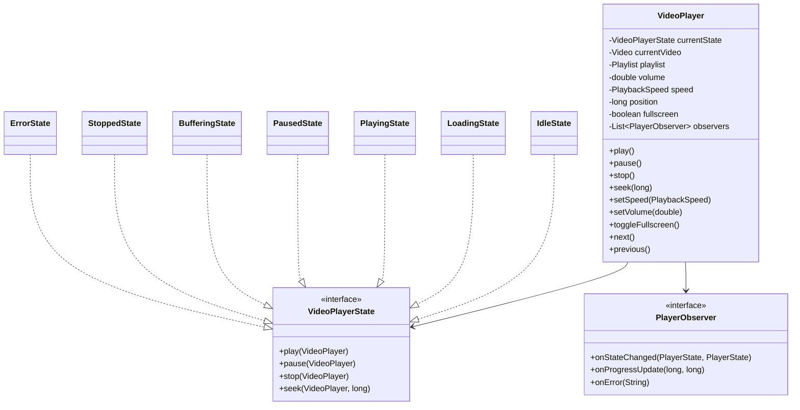

# Video Player State Machine - LLD

## Problem Statement
Design a video player with a state machine managing playback lifecycle, supporting play/pause/stop/seek/speed controls, buffering, subtitles, playlists, and observer-based UI updates.

## State Machine Diagram
```
IDLE --load()--> LOADING --loaded()--> PLAYING
PLAYING --pause()--> PAUSED --play()--> PLAYING
PLAYING --buffer()--> BUFFERING --buffered()--> PLAYING
PLAYING --stop()--> STOPPED --play()--> LOADING
PLAYING --error()--> ERROR --retry()--> LOADING
PAUSED --stop()--> STOPPED
ANY --stop()--> STOPPED
ERROR --reset()--> IDLE
```

## UML Class Diagram


## Design Patterns
| Pattern | Usage |
|---------|-------|
| **State** | Core pattern - each player state encapsulated as class |
| **Observer** | UI components notified on state/progress changes |
| **Strategy** | Pluggable buffering strategies |

## SOLID Principles
- **SRP**: Each state class handles only its own transitions
- **OCP**: New states added without modifying existing ones
- **LSP**: All states implement VideoPlayerState uniformly
- **ISP**: Observer split into state vs progress listeners
- **DIP**: VideoPlayer depends on abstractions (state interface, observers)

## Complete Java Implementation

```java
// === Enums ===
public enum PlayerState {
    IDLE, LOADING, PLAYING, PAUSED, BUFFERING, STOPPED, ERROR
}

public enum PlaybackSpeed {
    HALF(0.5), NORMAL(1.0), ONE_HALF(1.5), DOUBLE(2.0);
    private final double rate;
    PlaybackSpeed(double rate) { this.rate = rate; }
    public double getRate() { return rate; }
}

// === Observer ===
public interface PlayerObserver {
    void onStateChanged(PlayerState oldState, PlayerState newState);
    void onProgressUpdate(long currentMs, long durationMs);
    void onSpeedChanged(PlaybackSpeed speed);
    void onVolumeChanged(double volume);
    void onError(String message);
}

// === Video & Subtitle ===
public class Subtitle {
    private final long startMs, endMs;
    private final String text;
    public Subtitle(long startMs, long endMs, String text) {
        this.startMs = startMs; this.endMs = endMs; this.text = text;
    }
    public boolean isActiveAt(long positionMs) {
        return positionMs >= startMs && positionMs <= endMs;
    }
    public String getText() { return text; }
}

public class Video {
    private final String id, title, url;
    private final long durationMs;
    private final List<Subtitle> subtitles;

    public Video(String id, String title, String url, long durationMs) {
        this.id = id; this.title = title; this.url = url;
        this.durationMs = durationMs; this.subtitles = new ArrayList<>();
    }
    public void addSubtitle(Subtitle s) { subtitles.add(s); }
    public Optional<String> getSubtitleAt(long positionMs) {
        return subtitles.stream().filter(s -> s.isActiveAt(positionMs))
                .findFirst().map(Subtitle::getText);
    }
    // Getters
    public String getId() { return id; }
    public String getTitle() { return title; }
    public String getUrl() { return url; }
    public long getDurationMs() { return durationMs; }
}

// === Playlist ===
public class Playlist {
    private final List<Video> videos = new ArrayList<>();
    private int currentIndex = -1;

    public void addVideo(Video v) { videos.add(v); }
    public Video current() { return currentIndex >= 0 ? videos.get(currentIndex) : null; }
    public Video next() {
        if (currentIndex < videos.size() - 1) return videos.get(++currentIndex);
        return null;
    }
    public Video previous() {
        if (currentIndex > 0) return videos.get(--currentIndex);
        return null;
    }
    public boolean hasNext() { return currentIndex < videos.size() - 1; }
    public boolean hasPrevious() { return currentIndex > 0; }
}

// === State Interface ===
public interface VideoPlayerState {
    void play(VideoPlayer player);
    void pause(VideoPlayer player);
    void stop(VideoPlayer player);
    void seek(VideoPlayer player, long positionMs);
    PlayerState getState();
}

// === Concrete States ===
public class IdleState implements VideoPlayerState {
    public void play(VideoPlayer player) {
        if (player.getCurrentVideo() != null) {
            player.transitionTo(new LoadingState());
        }
    }
    public void pause(VideoPlayer player) { /* no-op */ }
    public void stop(VideoPlayer player) { /* no-op */ }
    public void seek(VideoPlayer player, long positionMs) { /* no-op */ }
    public PlayerState getState() { return PlayerState.IDLE; }
}

public class LoadingState implements VideoPlayerState {
    public void play(VideoPlayer player) { /* already loading */ }
    public void pause(VideoPlayer player) { /* no-op */ }
    public void stop(VideoPlayer player) { player.transitionTo(new StoppedState()); }
    public void seek(VideoPlayer player, long positionMs) { /* no-op */ }
    public PlayerState getState() { return PlayerState.LOADING; }

    public void onLoaded(VideoPlayer player) {
        player.transitionTo(new PlayingState());
    }
    public void onError(VideoPlayer player, String msg) {
        player.transitionTo(new ErrorState(msg));
    }
}

public class PlayingState implements VideoPlayerState {
    public void play(VideoPlayer player) { /* already playing */ }
    public void pause(VideoPlayer player) { player.transitionTo(new PausedState()); }
    public void stop(VideoPlayer player) {
        player.setPosition(0);
        player.transitionTo(new StoppedState());
    }
    public void seek(VideoPlayer player, long positionMs) {
        player.setPosition(Math.min(positionMs, player.getCurrentVideo().getDurationMs()));
        player.transitionTo(new BufferingState());
    }
    public PlayerState getState() { return PlayerState.PLAYING; }

    public void onBufferNeeded(VideoPlayer player) {
        player.transitionTo(new BufferingState());
    }
}

public class PausedState implements VideoPlayerState {
    public void play(VideoPlayer player) { player.transitionTo(new PlayingState()); }
    public void pause(VideoPlayer player) { /* already paused */ }
    public void stop(VideoPlayer player) {
        player.setPosition(0);
        player.transitionTo(new StoppedState());
    }
    public void seek(VideoPlayer player, long positionMs) {
        player.setPosition(Math.min(positionMs, player.getCurrentVideo().getDurationMs()));
    }
    public PlayerState getState() { return PlayerState.PAUSED; }
}

public class BufferingState implements VideoPlayerState {
    private int bufferPercent = 0;

    public void play(VideoPlayer player) { /* wait for buffer */ }
    public void pause(VideoPlayer player) { player.transitionTo(new PausedState()); }
    public void stop(VideoPlayer player) { player.transitionTo(new StoppedState()); }
    public void seek(VideoPlayer player, long positionMs) {
        player.setPosition(positionMs);
        bufferPercent = 0; // restart buffering
    }
    public PlayerState getState() { return PlayerState.BUFFERING; }

    public void onBuffered(VideoPlayer player) {
        player.transitionTo(new PlayingState());
    }
    public void updateBuffer(int percent) { this.bufferPercent = percent; }
}

public class StoppedState implements VideoPlayerState {
    public void play(VideoPlayer player) {
        player.setPosition(0);
        player.transitionTo(new LoadingState());
    }
    public void pause(VideoPlayer player) { /* no-op */ }
    public void stop(VideoPlayer player) { /* already stopped */ }
    public void seek(VideoPlayer player, long positionMs) { /* no-op */ }
    public PlayerState getState() { return PlayerState.STOPPED; }
}

public class ErrorState implements VideoPlayerState {
    private final String errorMessage;
    private int retryCount = 0;
    private static final int MAX_RETRIES = 3;

    public ErrorState(String errorMessage) { this.errorMessage = errorMessage; }

    public void play(VideoPlayer player) { retry(player); }
    public void pause(VideoPlayer player) { /* no-op */ }
    public void stop(VideoPlayer player) { player.transitionTo(new StoppedState()); }
    public void seek(VideoPlayer player, long positionMs) { /* no-op */ }
    public PlayerState getState() { return PlayerState.ERROR; }

    public void retry(VideoPlayer player) {
        if (retryCount < MAX_RETRIES) {
            retryCount++;
            player.transitionTo(new LoadingState());
        } else {
            player.notifyError("Max retries exceeded: " + errorMessage);
        }
    }
    public String getErrorMessage() { return errorMessage; }
}

// === Context: VideoPlayer ===
public class VideoPlayer {
    private VideoPlayerState state;
    private Video currentVideo;
    private Playlist playlist;
    private long positionMs;
    private double volume = 1.0;
    private PlaybackSpeed speed = PlaybackSpeed.NORMAL;
    private boolean fullscreen = false;
    private boolean subtitlesEnabled = true;
    private final List<PlayerObserver> observers = new CopyOnWriteArrayList<>();
    private ScheduledExecutorService progressExecutor;

    public VideoPlayer() {
        this.state = new IdleState();
        this.playlist = new Playlist();
    }

    // === State transitions ===
    public void transitionTo(VideoPlayerState newState) {
        PlayerState oldS = state.getState();
        PlayerState newS = newState.getState();
        this.state = newState;
        notifyStateChanged(oldS, newS);
        if (newS == PlayerState.PLAYING) startProgressTracking();
        else stopProgressTracking();
    }

    // === Actions ===
    public void load(Video video) {
        this.currentVideo = video;
        this.positionMs = 0;
        state.play(this);
    }

    public void play() { state.play(this); }
    public void pause() { state.pause(this); }
    public void stop() { state.stop(this); }
    public void seek(long positionMs) { state.seek(this, positionMs); }

    public void setSpeed(PlaybackSpeed speed) {
        this.speed = speed;
        observers.forEach(o -> o.onSpeedChanged(speed));
    }

    public void setVolume(double volume) {
        this.volume = Math.max(0.0, Math.min(1.0, volume));
        observers.forEach(o -> o.onVolumeChanged(this.volume));
    }

    public void toggleFullscreen() { this.fullscreen = !this.fullscreen; }

    public void next() {
        Video v = playlist.next();
        if (v != null) load(v);
    }

    public void previous() {
        Video v = playlist.previous();
        if (v != null) load(v);
    }

    // === Progress tracking ===
    private void startProgressTracking() {
        progressExecutor = Executors.newSingleThreadScheduledExecutor();
        progressExecutor.scheduleAtFixedRate(() -> {
            if (currentVideo != null) {
                positionMs += (long)(1000 * speed.getRate());
                if (positionMs >= currentVideo.getDurationMs()) {
                    positionMs = currentVideo.getDurationMs();
                    if (playlist.hasNext()) next();
                    else stop();
                }
                notifyProgress();
            }
        }, 0, 1000, TimeUnit.MILLISECONDS);
    }

    private void stopProgressTracking() {
        if (progressExecutor != null) { progressExecutor.shutdown(); progressExecutor = null; }
    }

    public double getProgressPercent() {
        if (currentVideo == null || currentVideo.getDurationMs() == 0) return 0;
        return (positionMs * 100.0) / currentVideo.getDurationMs();
    }

    public Optional<String> getCurrentSubtitle() {
        if (!subtitlesEnabled || currentVideo == null) return Optional.empty();
        return currentVideo.getSubtitleAt(positionMs);
    }

    // === Observer management ===
    public void addObserver(PlayerObserver o) { observers.add(o); }
    public void removeObserver(PlayerObserver o) { observers.remove(o); }

    private void notifyStateChanged(PlayerState o, PlayerState n) {
        observers.forEach(obs -> obs.onStateChanged(o, n));
    }
    private void notifyProgress() {
        observers.forEach(o -> o.onProgressUpdate(positionMs, currentVideo.getDurationMs()));
    }
    public void notifyError(String msg) { observers.forEach(o -> o.onError(msg)); }

    // === Getters/Setters ===
    public void setPosition(long pos) { this.positionMs = pos; }
    public long getPosition() { return positionMs; }
    public Video getCurrentVideo() { return currentVideo; }
    public PlayerState getPlayerState() { return state.getState(); }
    public Playlist getPlaylist() { return playlist; }
    public void setSubtitlesEnabled(boolean e) { this.subtitlesEnabled = e; }
}

// === Usage ===
public class Main {
    public static void main(String[] args) {
        VideoPlayer player = new VideoPlayer();
        player.addObserver(new PlayerObserver() {
            public void onStateChanged(PlayerState o, PlayerState n) {
                System.out.println(o + " -> " + n);
            }
            public void onProgressUpdate(long cur, long dur) {
                System.out.printf("Progress: %d/%d (%.1f%%)\n", cur, dur, (cur*100.0)/dur);
            }
            public void onSpeedChanged(PlaybackSpeed s) { System.out.println("Speed: " + s.getRate()); }
            public void onVolumeChanged(double v) { System.out.println("Volume: " + v); }
            public void onError(String msg) { System.out.println("ERROR: " + msg); }
        });

        Video video = new Video("1", "Demo", "http://example.com/v.mp4", 120000);
        video.addSubtitle(new Subtitle(0, 5000, "Welcome!"));

        player.getPlaylist().addVideo(video);
        player.load(video);           // IDLE -> LOADING
        player.play();                // Triggers loaded -> PLAYING
        player.setSpeed(PlaybackSpeed.DOUBLE);
        player.seek(30000);           // PLAYING -> BUFFERING -> PLAYING
        player.pause();               // PLAYING -> PAUSED
        player.play();                // PAUSED -> PLAYING
        player.stop();                // PLAYING -> STOPPED
    }
}
```

## Key Interview Points

1. **Why State Pattern over switch/if-else?** - Eliminates complex conditionals, makes transitions explicit, each state is testable in isolation
2. **Thread safety** - CopyOnWriteArrayList for observers, ScheduledExecutor for progress ticking
3. **Error recovery** - Retry mechanism with max attempts before giving up
4. **Extensibility** - Add new states (e.g., AD_PLAYING) without modifying existing code
5. **Buffering** - Separate state allows UI to show loading indicator while maintaining position
6. **Progress tracking** - Accounts for playback speed; auto-advances playlist
7. **Trade-offs** - More classes than switch-based approach but far more maintainable at scale
