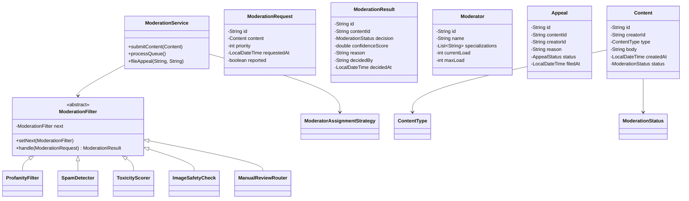

# Content Moderation Workflow - Low Level Design

## 1. Problem Statement
Design a content moderation system that automatically and manually reviews user-generated content (text, images, videos) using a pipeline of filters, supports confidence-based auto-decisions, manual review queues with priority, appeal workflows, and audit trails.

## 2. UML Class Diagram


## 3. Design Patterns
- **Chain of Responsibility**: Moderation pipeline (filters chained sequentially)
- **State**: Content lifecycle (pending → auto-approved/rejected/under_review → appealed)
- **Strategy**: Moderator assignment (round-robin, least-loaded, specialization-based)
- **Observer**: Notify content creators of decisions

## 4. SOLID Principles
- **SRP**: Each filter handles one concern; Service orchestrates
- **OCP**: New filters added without modifying existing pipeline
- **LSP**: All filters substitute for abstract ModerationFilter
- **ISP**: Separate interfaces for auto-moderation vs manual review
- **DIP**: Service depends on abstractions (filter chain, strategy interface)

## 5. Complete Java Implementation

```java
import java.util.*;
import java.time.LocalDateTime;
import java.util.concurrent.PriorityBlockingQueue;

// ==================== ENUMS ====================
enum ContentType { TEXT, IMAGE, VIDEO }

enum ModerationStatus {
    PENDING, AUTO_APPROVED, AUTO_REJECTED, UNDER_REVIEW, APPROVED, REJECTED, APPEALED
}

enum AppealStatus { FILED, UNDER_REVIEW, UPHELD, OVERTURNED }

// ==================== MODELS ====================
class Content {
    private String id;
    private String creatorId;
    private ContentType type;
    private String body;
    private LocalDateTime createdAt;
    private ModerationStatus status;

    public Content(String id, String creatorId, ContentType type, String body) {
        this.id = id; this.creatorId = creatorId; this.type = type;
        this.body = body; this.createdAt = LocalDateTime.now();
        this.status = ModerationStatus.PENDING;
    }
    // Getters and setters
    public String getId() { return id; }
    public String getCreatorId() { return creatorId; }
    public ContentType getType() { return type; }
    public String getBody() { return body; }
    public ModerationStatus getStatus() { return status; }
    public void setStatus(ModerationStatus s) { this.status = s; }
}

class ModerationRequest implements Comparable<ModerationRequest> {
    private String id;
    private Content content;
    private int priority; // higher = more urgent
    private boolean reported;
    private LocalDateTime requestedAt;

    public ModerationRequest(String id, Content content, boolean reported) {
        this.id = id; this.content = content; this.reported = reported;
        this.priority = reported ? 10 : 1;
        this.requestedAt = LocalDateTime.now();
    }
    public Content getContent() { return content; }
    public int getPriority() { return priority; }
    public boolean isReported() { return reported; }
    @Override
    public int compareTo(ModerationRequest o) {
        return Integer.compare(o.priority, this.priority); // descending
    }
}

class ModerationResult {
    private String id;
    private String contentId;
    private ModerationStatus decision;
    private double confidenceScore;
    private String reason;
    private String decidedBy; // "AUTO" or moderator ID
    private LocalDateTime decidedAt;

    public ModerationResult(String contentId, ModerationStatus decision,
                            double confidence, String reason, String decidedBy) {
        this.id = UUID.randomUUID().toString();
        this.contentId = contentId; this.decision = decision;
        this.confidenceScore = confidence; this.reason = reason;
        this.decidedBy = decidedBy; this.decidedAt = LocalDateTime.now();
    }
    public ModerationStatus getDecision() { return decision; }
    public double getConfidenceScore() { return confidenceScore; }
    public String getReason() { return reason; }
    public String toString() {
        return String.format("[%s] %s (%.2f) - %s", contentId, decision, confidenceScore, reason);
    }
}

class Moderator {
    private String id;
    private String name;
    private List<String> specializations;
    private int currentLoad;
    private int maxLoad;

    public Moderator(String id, String name, List<String> specs, int maxLoad) {
        this.id = id; this.name = name; this.specializations = specs;
        this.maxLoad = maxLoad; this.currentLoad = 0;
    }
    public String getId() { return id; }
    public boolean isAvailable() { return currentLoad < maxLoad; }
    public List<String> getSpecializations() { return specializations; }
    public void assign() { currentLoad++; }
    public void release() { currentLoad--; }
    public int getCurrentLoad() { return currentLoad; }
}

class Appeal {
    private String id;
    private String contentId;
    private String creatorId;
    private String reason;
    private AppealStatus status;
    private LocalDateTime filedAt;

    public Appeal(String contentId, String creatorId, String reason) {
        this.id = UUID.randomUUID().toString();
        this.contentId = contentId; this.creatorId = creatorId;
        this.reason = reason; this.status = AppealStatus.FILED;
        this.filedAt = LocalDateTime.now();
    }
    public String getContentId() { return contentId; }
    public void setStatus(AppealStatus s) { this.status = s; }
}

// ==================== AUDIT TRAIL ====================
class AuditEntry {
    private String contentId;
    private String action;
    private String actor;
    private LocalDateTime timestamp;

    public AuditEntry(String contentId, String action, String actor) {
        this.contentId = contentId; this.action = action;
        this.actor = actor; this.timestamp = LocalDateTime.now();
    }
    public String toString() {
        return String.format("[%s] %s by %s at %s", contentId, action, actor, timestamp);
    }
}

// ==================== OBSERVER ====================
interface ModerationObserver {
    void onDecision(Content content, ModerationResult result);
}

class CreatorNotificationObserver implements ModerationObserver {
    @Override
    public void onDecision(Content content, ModerationResult result) {
        System.out.printf("NOTIFY creator %s: Content '%s' decision=%s reason=%s%n",
            content.getCreatorId(), content.getId(),
            result.getDecision(), result.getReason());
    }
}

// ==================== CHAIN OF RESPONSIBILITY ====================
abstract class ModerationFilter {
    protected ModerationFilter next;
    protected static final double AUTO_APPROVE_THRESHOLD = 0.9;
    protected static final double AUTO_REJECT_THRESHOLD = 0.85;

    public void setNext(ModerationFilter next) { this.next = next; }

    public ModerationResult handle(ModerationRequest request) {
        ModerationResult result = doFilter(request);
        if (result != null) return result; // decision made
        if (next != null) return next.handle(request);
        // No filter decided -> route to manual review
        return new ModerationResult(request.getContent().getId(),
            ModerationStatus.UNDER_REVIEW, 0.5, "No auto-decision; needs manual review", "AUTO");
    }

    protected abstract ModerationResult doFilter(ModerationRequest request);
}

class ProfanityFilter extends ModerationFilter {
    private static final Set<String> BLOCKED = Set.of("badword1", "badword2", "slur");

    @Override
    protected ModerationResult doFilter(ModerationRequest request) {
        if (request.getContent().getType() != ContentType.TEXT) return null;
        String body = request.getContent().getBody().toLowerCase();
        for (String word : BLOCKED) {
            if (body.contains(word)) {
                return new ModerationResult(request.getContent().getId(),
                    ModerationStatus.AUTO_REJECTED, 0.95, "Profanity detected: " + word, "AUTO");
            }
        }
        return null; // pass to next
    }
}

class SpamDetector extends ModerationFilter {
    @Override
    protected ModerationResult doFilter(ModerationRequest request) {
        if (request.getContent().getType() != ContentType.TEXT) return null;
        String body = request.getContent().getBody();
        // Simple heuristic: excessive repetition or URLs
        long urlCount = Arrays.stream(body.split("\\s+"))
            .filter(w -> w.startsWith("http")).count();
        if (urlCount > 5) {
            return new ModerationResult(request.getContent().getId(),
                ModerationStatus.AUTO_REJECTED, 0.88, "Spam: excessive URLs", "AUTO");
        }
        return null;
    }
}

class ToxicityScorer extends ModerationFilter {
    @Override
    protected ModerationResult doFilter(ModerationRequest request) {
        if (request.getContent().getType() != ContentType.TEXT) return null;
        // Simulated ML score
        double toxicityScore = simulateToxicityML(request.getContent().getBody());
        if (toxicityScore > AUTO_REJECT_THRESHOLD) {
            return new ModerationResult(request.getContent().getId(),
                ModerationStatus.AUTO_REJECTED, toxicityScore, "High toxicity score", "AUTO");
        }
        if (toxicityScore < 0.2) {
            return new ModerationResult(request.getContent().getId(),
                ModerationStatus.AUTO_APPROVED, 1 - toxicityScore, "Low toxicity", "AUTO");
        }
        return null; // ambiguous -> next filter
    }
    private double simulateToxicityML(String text) {
        return text.length() > 200 ? 0.6 : 0.1; // placeholder
    }
}

class ImageSafetyCheck extends ModerationFilter {
    @Override
    protected ModerationResult doFilter(ModerationRequest request) {
        if (request.getContent().getType() != ContentType.IMAGE) return null;
        // Simulated image safety API
        double safetyScore = 0.95; // placeholder
        if (safetyScore > AUTO_APPROVE_THRESHOLD) {
            return new ModerationResult(request.getContent().getId(),
                ModerationStatus.AUTO_APPROVED, safetyScore, "Image safe", "AUTO");
        }
        return null;
    }
}

class ManualReviewRouter extends ModerationFilter {
    @Override
    protected ModerationResult doFilter(ModerationRequest request) {
        // Always routes to manual review as last resort
        return new ModerationResult(request.getContent().getId(),
            ModerationStatus.UNDER_REVIEW, 0.5, "Routed to manual review", "AUTO");
    }
}

// ==================== STRATEGY: MODERATOR ASSIGNMENT ====================
interface ModeratorAssignmentStrategy {
    Moderator assign(List<Moderator> moderators, Content content);
}

class LeastLoadedStrategy implements ModeratorAssignmentStrategy {
    @Override
    public Moderator assign(List<Moderator> moderators, Content content) {
        return moderators.stream()
            .filter(Moderator::isAvailable)
            .min(Comparator.comparingInt(Moderator::getCurrentLoad))
            .orElse(null);
    }
}

class SpecializationStrategy implements ModeratorAssignmentStrategy {
    @Override
    public Moderator assign(List<Moderator> moderators, Content content) {
        String typeStr = content.getType().name().toLowerCase();
        return moderators.stream()
            .filter(Moderator::isAvailable)
            .filter(m -> m.getSpecializations().contains(typeStr))
            .min(Comparator.comparingInt(Moderator::getCurrentLoad))
            .orElse(null);
    }
}

// ==================== SERVICE ====================
class ModerationService {
    private ModerationFilter filterChain;
    private PriorityBlockingQueue<ModerationRequest> queue = new PriorityBlockingQueue<>();
    private List<ModerationObserver> observers = new ArrayList<>();
    private List<Moderator> moderators = new ArrayList<>();
    private ModeratorAssignmentStrategy assignmentStrategy;
    private List<AuditEntry> auditTrail = new ArrayList<>();
    private Map<String, Content> contentStore = new HashMap<>();
    private List<Appeal> appeals = new ArrayList<>();

    public ModerationService(ModeratorAssignmentStrategy strategy) {
        this.assignmentStrategy = strategy;
        this.filterChain = buildChain();
    }

    private ModerationFilter buildChain() {
        ProfanityFilter f1 = new ProfanityFilter();
        SpamDetector f2 = new SpamDetector();
        ToxicityScorer f3 = new ToxicityScorer();
        ImageSafetyCheck f4 = new ImageSafetyCheck();
        ManualReviewRouter f5 = new ManualReviewRouter();
        f1.setNext(f2); f2.setNext(f3); f3.setNext(f4); f4.setNext(f5);
        return f1;
    }

    public void addObserver(ModerationObserver o) { observers.add(o); }
    public void addModerator(Moderator m) { moderators.add(m); }

    public void submitContent(Content content, boolean reported) {
        contentStore.put(content.getId(), content);
        ModerationRequest req = new ModerationRequest(UUID.randomUUID().toString(), content, reported);
        queue.offer(req);
        audit(content.getId(), "SUBMITTED" + (reported ? " (REPORTED)" : ""), content.getCreatorId());
    }

    public void processQueue() {
        while (!queue.isEmpty()) {
            ModerationRequest req = queue.poll();
            ModerationResult result = filterChain.handle(req);
            applyDecision(req.getContent(), result);
        }
    }

    private void applyDecision(Content content, ModerationResult result) {
        content.setStatus(result.getDecision());
        audit(content.getId(), "DECISION: " + result.getDecision(), result.getReason());

        if (result.getDecision() == ModerationStatus.UNDER_REVIEW) {
            Moderator mod = assignmentStrategy.assign(moderators, content);
            if (mod != null) {
                mod.assign();
                audit(content.getId(), "ASSIGNED to " + mod.getId(), "SYSTEM");
            }
        }
        notifyObservers(content, result);
    }

    public void fileAppeal(String contentId, String creatorId, String reason) {
        Content content = contentStore.get(contentId);
        if (content != null && content.getStatus() == ModerationStatus.REJECTED) {
            content.setStatus(ModerationStatus.APPEALED);
            Appeal appeal = new Appeal(contentId, creatorId, reason);
            appeals.add(appeal);
            audit(contentId, "APPEAL FILED", creatorId);
            // Re-queue with high priority for senior review
            ModerationRequest req = new ModerationRequest(UUID.randomUUID().toString(), content, true);
            queue.offer(req);
        }
    }

    private void notifyObservers(Content content, ModerationResult result) {
        observers.forEach(o -> o.onDecision(content, result));
    }

    private void audit(String contentId, String action, String actor) {
        AuditEntry entry = new AuditEntry(contentId, action, actor);
        auditTrail.add(entry);
        System.out.println("AUDIT: " + entry);
    }

    public List<AuditEntry> getAuditTrail() { return auditTrail; }
}

// ==================== DEMO ====================
class ContentModerationDemo {
    public static void main(String[] args) {
        ModerationService service = new ModerationService(new SpecializationStrategy());
        service.addObserver(new CreatorNotificationObserver());
        service.addModerator(new Moderator("mod1", "Alice", List.of("text", "image"), 10));
        service.addModerator(new Moderator("mod2", "Bob", List.of("video"), 5));

        // Submit various content
        service.submitContent(new Content("c1", "user1", ContentType.TEXT, "Hello world!"), false);
        service.submitContent(new Content("c2", "user2", ContentType.TEXT, "Buy now badword1 click here"), false);
        service.submitContent(new Content("c3", "user3", ContentType.TEXT, "Normal post"), true); // reported
        service.submitContent(new Content("c4", "user4", ContentType.IMAGE, "img_data"), false);

        // Process - reported content (c3) processed first due to priority
        service.processQueue();

        // Appeal a rejection
        service.fileAppeal("c2", "user2", "It was a joke");
        service.processQueue();
    }
}
```

## 6. Key Interview Points

| Topic | Discussion |
|-------|-----------|
| **Chain of Responsibility** | Filters are independent, ordered by cost (cheap text checks first, expensive ML last). Each can short-circuit. |
| **Threshold tuning** | High confidence auto-decides; ambiguous cases go to humans. Thresholds are configurable per content type. |
| **Priority queue** | Reported content gets higher priority. PriorityBlockingQueue for thread-safe concurrent processing. |
| **Scalability** | Filters can run in parallel for independent checks; pipeline can be async with CompletableFuture. |
| **Strategy pattern** | Moderator assignment is pluggable: least-loaded, specialization, round-robin. |
| **Audit trail** | Every state transition logged immutably for compliance and debugging. |
| **Appeal workflow** | State transition REJECTED→APPEALED re-enters queue for senior review with elevated priority. |
| **False positive handling** | Low-confidence rejections auto-route to manual; ML models retrained on appeal outcomes. |
| **Rate limiting** | Per-user submission limits prevent abuse of the moderation queue. |
| **Idempotency** | Same content ID shouldn't create duplicate moderation requests. |
