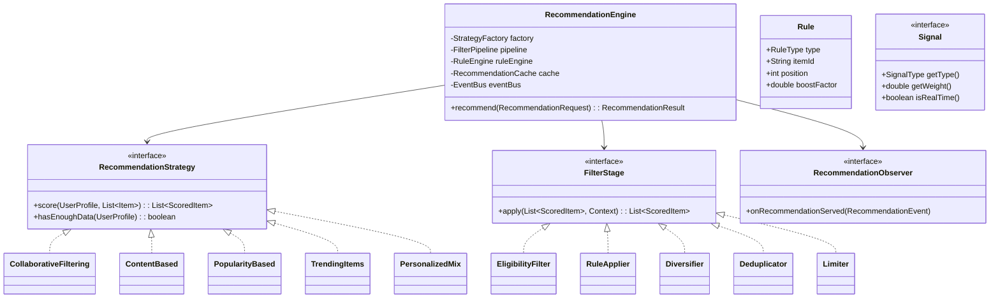

# Recommendation Rule Configuration System - LLD

## 1. Problem Statement
Design a configurable recommendation system that supports multiple algorithms (collaborative filtering, content-based, popularity, trending), configurable rules (boost/bury/pin/exclude), A/B testing of algorithm variants, real-time and batch signals, filtering pipeline, caching, and feedback loops.

## 2. UML Class Diagram


## 3. Design Patterns
- **Strategy**: Swappable recommendation algorithms
- **Chain of Responsibility**: Filtering pipeline stages
- **Factory**: Strategy creation based on A/B test config
- **Observer**: Feedback loop on recommendation served events

## 4. SOLID Principles
- **SRP**: Each strategy/filter handles one concern
- **OCP**: New algorithms/filters added without modifying engine
- **LSP**: All strategies substitutable via interface
- **ISP**: Separate interfaces for Strategy, Filter, Observer
- **DIP**: Engine depends on abstractions, not concrete algorithms

## 5. Complete Java Implementation

```java
import java.util.*;
import java.util.concurrent.*;
import java.util.stream.*;

// ========== Models ==========
enum SignalType { VIEW, PURCHASE, SEARCH, RATING, DEMOGRAPHIC }
enum RuleType { BOOST, BURY, PIN, EXCLUDE }

record Item(String id, String category, Map<String, Double> features, Set<String> tags) {}
record ScoredItem(Item item, double score, String reason) implements Comparable<ScoredItem> {
    public int compareTo(ScoredItem o) { return Double.compare(o.score, this.score); }
}

interface Signal {
    SignalType getType();
    double getWeight();
    boolean isRealTime();
    long getTimestamp();
}

record ViewSignal(String itemId, long timestamp, long durationMs) implements Signal {
    public SignalType getType() { return SignalType.VIEW; }
    public double getWeight() { return Math.min(durationMs / 30000.0, 1.0); }
    public boolean isRealTime() { return true; }
    public long getTimestamp() { return timestamp; }
}

record PurchaseSignal(String itemId, long timestamp, double amount) implements Signal {
    public SignalType getType() { return SignalType.PURCHASE; }
    public double getWeight() { return 1.0; }
    public boolean isRealTime() { return true; }
    public long getTimestamp() { return timestamp; }
}

record SearchSignal(String query, long timestamp) implements Signal {
    public SignalType getType() { return SignalType.SEARCH; }
    public double getWeight() { return 0.5; }
    public boolean isRealTime() { return true; }
    public long getTimestamp() { return timestamp; }
}

record RatingSignal(String itemId, int rating, long timestamp) implements Signal {
    public SignalType getType() { return SignalType.RATING; }
    public double getWeight() { return rating / 5.0; }
    public boolean isRealTime() { return false; }
    public long getTimestamp() { return timestamp; }
}

record DemographicSignal(String segment, Map<String, String> attrs) implements Signal {
    public SignalType getType() { return SignalType.DEMOGRAPHIC; }
    public double getWeight() { return 0.3; }
    public boolean isRealTime() { return false; }
    public long getTimestamp() { return 0; }
}

class UserProfile {
    private final String userId;
    private final List<Signal> realTimeSignals = new CopyOnWriteArrayList<>();
    private final List<Signal> batchSignals = new ArrayList<>();
    private final Map<String, Double> preferences = new HashMap<>();

    public UserProfile(String userId) { this.userId = userId; }
    public String getUserId() { return userId; }
    public void addRealTimeSignal(Signal s) { realTimeSignals.add(s); }
    public void setBatchSignals(List<Signal> signals) { batchSignals.clear(); batchSignals.addAll(signals); }
    public List<Signal> getAllSignals() {
        List<Signal> all = new ArrayList<>(batchSignals);
        all.addAll(realTimeSignals);
        return all;
    }
    public Set<String> getInteractedItemIds() {
        return getAllSignals().stream()
            .filter(s -> s instanceof ViewSignal || s instanceof PurchaseSignal)
            .map(s -> s instanceof ViewSignal v ? v.itemId() : ((PurchaseSignal)s).itemId())
            .collect(Collectors.toSet());
    }
    public Map<String, Double> getPreferences() { return preferences; }
}

record Rule(RuleType type, String itemId, int position, double boostFactor) {}

record RecommendationRequest(UserProfile user, int limit, String context, String experimentId) {}
record RecommendationResult(List<ScoredItem> items, String strategyUsed, long latencyMs, String experimentVariant) {}

// ========== Strategies ==========
interface RecommendationStrategy {
    List<ScoredItem> score(UserProfile user, List<Item> candidates);
    boolean hasEnoughData(UserProfile user);
    String getName();
}

class CollaborativeFiltering implements RecommendationStrategy {
    private final Map<String, Map<String, Double>> userItemMatrix; // simplified
    public CollaborativeFiltering(Map<String, Map<String, Double>> matrix) { this.userItemMatrix = matrix; }
    public List<ScoredItem> score(UserProfile user, List<Item> candidates) {
        Map<String, Double> userVec = userItemMatrix.getOrDefault(user.getUserId(), Map.of());
        return candidates.stream()
            .map(item -> new ScoredItem(item, userVec.getOrDefault(item.id(), 0.0), "collaborative"))
            .sorted().collect(Collectors.toList());
    }
    public boolean hasEnoughData(UserProfile user) { return userItemMatrix.containsKey(user.getUserId()); }
    public String getName() { return "collaborative_filtering"; }
}

class ContentBased implements RecommendationStrategy {
    public List<ScoredItem> score(UserProfile user, List<Item> candidates) {
        Map<String, Double> prefs = user.getPreferences();
        return candidates.stream().map(item -> {
            double score = item.features().entrySet().stream()
                .mapToDouble(e -> e.getValue() * prefs.getOrDefault(e.getKey(), 0.0)).sum();
            return new ScoredItem(item, score, "content_based");
        }).sorted().collect(Collectors.toList());
    }
    public boolean hasEnoughData(UserProfile user) { return !user.getPreferences().isEmpty(); }
    public String getName() { return "content_based"; }
}

class PopularityBased implements RecommendationStrategy {
    private final Map<String, Long> popularityCounts;
    public PopularityBased(Map<String, Long> counts) { this.popularityCounts = counts; }
    public List<ScoredItem> score(UserProfile user, List<Item> candidates) {
        long max = popularityCounts.values().stream().mapToLong(Long::longValue).max().orElse(1);
        return candidates.stream()
            .map(item -> new ScoredItem(item, popularityCounts.getOrDefault(item.id(), 0L) / (double) max, "popularity"))
            .sorted().collect(Collectors.toList());
    }
    public boolean hasEnoughData(UserProfile user) { return true; } // always works
    public String getName() { return "popularity"; }
}

class TrendingItems implements RecommendationStrategy {
    private final Map<String, Double> trendScores; // computed from recent velocity
    public TrendingItems(Map<String, Double> scores) { this.trendScores = scores; }
    public List<ScoredItem> score(UserProfile user, List<Item> candidates) {
        return candidates.stream()
            .map(item -> new ScoredItem(item, trendScores.getOrDefault(item.id(), 0.0), "trending"))
            .sorted().collect(Collectors.toList());
    }
    public boolean hasEnoughData(UserProfile user) { return true; }
    public String getName() { return "trending"; }
}

class PersonalizedMix implements RecommendationStrategy {
    private final List<RecommendationStrategy> strategies;
    private final List<Double> weights;
    public PersonalizedMix(List<RecommendationStrategy> strategies, List<Double> weights) {
        this.strategies = strategies; this.weights = weights;
    }
    public List<ScoredItem> score(UserProfile user, List<Item> candidates) {
        Map<String, Double> combined = new HashMap<>();
        for (int i = 0; i < strategies.size(); i++) {
            double w = weights.get(i);
            strategies.get(i).score(user, candidates).forEach(si ->
                combined.merge(si.item().id(), si.score() * w, Double::sum));
        }
        Map<String, Item> itemMap = candidates.stream().collect(Collectors.toMap(Item::id, i -> i));
        return combined.entrySet().stream()
            .map(e -> new ScoredItem(itemMap.get(e.getKey()), e.getValue(), "personalized_mix"))
            .sorted().collect(Collectors.toList());
    }
    public boolean hasEnoughData(UserProfile user) { return strategies.stream().anyMatch(s -> s.hasEnoughData(user)); }
    public String getName() { return "personalized_mix"; }
}

// ========== Filter Pipeline (Chain of Responsibility) ==========
interface FilterStage {
    List<ScoredItem> apply(List<ScoredItem> items, FilterContext ctx);
}

record FilterContext(UserProfile user, List<Rule> rules, int limit) {}

class EligibilityFilter implements FilterStage {
    public List<ScoredItem> apply(List<ScoredItem> items, FilterContext ctx) {
        Set<String> seen = ctx.user().getInteractedItemIds();
        return items.stream().filter(si -> !seen.contains(si.item().id())).collect(Collectors.toList());
    }
}

class RuleApplier implements FilterStage {
    public List<ScoredItem> apply(List<ScoredItem> items, FilterContext ctx) {
        Set<String> excluded = ctx.rules().stream()
            .filter(r -> r.type() == RuleType.EXCLUDE).map(Rule::itemId).collect(Collectors.toSet());
        Map<String, Double> boosts = ctx.rules().stream()
            .filter(r -> r.type() == RuleType.BOOST)
            .collect(Collectors.toMap(Rule::itemId, Rule::boostFactor));
        Map<String, Double> buries = ctx.rules().stream()
            .filter(r -> r.type() == RuleType.BURY)
            .collect(Collectors.toMap(Rule::itemId, Rule::boostFactor));

        List<ScoredItem> result = items.stream()
            .filter(si -> !excluded.contains(si.item().id()))
            .map(si -> {
                double score = si.score();
                score *= boosts.getOrDefault(si.item().id(), 1.0);
                score *= buries.getOrDefault(si.item().id(), 1.0); // bury uses factor < 1
                return new ScoredItem(si.item(), score, si.reason());
            }).sorted().collect(Collectors.toList());

        // Handle PIN rules - insert at specific positions
        for (Rule rule : ctx.rules()) {
            if (rule.type() == RuleType.PIN) {
                items.stream().filter(si -> si.item().id().equals(rule.itemId())).findFirst()
                    .ifPresent(pinned -> {
                        result.removeIf(si -> si.item().id().equals(rule.itemId()));
                        int pos = Math.min(rule.position(), result.size());
                        result.add(pos, new ScoredItem(pinned.item(), Double.MAX_VALUE, "pinned"));
                    });
            }
        }
        return result;
    }
}

class Diversifier implements FilterStage {
    private final int maxPerCategory;
    public Diversifier(int maxPerCategory) { this.maxPerCategory = maxPerCategory; }
    public List<ScoredItem> apply(List<ScoredItem> items, FilterContext ctx) {
        Map<String, Integer> catCount = new HashMap<>();
        return items.stream().filter(si -> {
            String cat = si.item().category();
            int count = catCount.getOrDefault(cat, 0);
            if (count >= maxPerCategory) return false;
            catCount.put(cat, count + 1);
            return true;
        }).collect(Collectors.toList());
    }
}

class Deduplicator implements FilterStage {
    public List<ScoredItem> apply(List<ScoredItem> items, FilterContext ctx) {
        Set<String> seen = new HashSet<>();
        return items.stream().filter(si -> seen.add(si.item().id())).collect(Collectors.toList());
    }
}

class Limiter implements FilterStage {
    public List<ScoredItem> apply(List<ScoredItem> items, FilterContext ctx) {
        return items.stream().limit(ctx.limit()).collect(Collectors.toList());
    }
}

class FilterPipeline {
    private final List<FilterStage> stages;
    public FilterPipeline(List<FilterStage> stages) { this.stages = stages; }
    public List<ScoredItem> execute(List<ScoredItem> items, FilterContext ctx) {
        List<ScoredItem> result = items;
        for (FilterStage stage : stages) result = stage.apply(result, ctx);
        return result;
    }
}

// ========== A/B Testing ==========
class ABTestConfig {
    private final Map<String, Map<String, Double>> experiments; // experimentId -> {variant -> traffic%}
    public ABTestConfig() { this.experiments = new ConcurrentHashMap<>(); }
    public void addExperiment(String id, Map<String, Double> variants) { experiments.put(id, variants); }
    public String assignVariant(String experimentId, String userId) {
        Map<String, Double> variants = experiments.get(experimentId);
        if (variants == null) return "control";
        double hash = Math.abs(userId.hashCode() % 100) / 100.0;
        double cumulative = 0;
        for (var entry : variants.entrySet()) {
            cumulative += entry.getValue();
            if (hash < cumulative) return entry.getKey();
        }
        return "control";
    }
}

// ========== Factory ==========
class StrategyFactory {
    private final Map<String, RecommendationStrategy> strategies = new HashMap<>();
    private final ABTestConfig abConfig;
    private final RecommendationStrategy fallback;

    public StrategyFactory(ABTestConfig abConfig, RecommendationStrategy fallback) {
        this.abConfig = abConfig; this.fallback = fallback;
    }
    public void register(String variant, RecommendationStrategy strategy) { strategies.put(variant, strategy); }

    public RecommendationStrategy getStrategy(RecommendationRequest request) {
        String variant = abConfig.assignVariant(request.experimentId(), request.user().getUserId());
        RecommendationStrategy strategy = strategies.getOrDefault(variant, fallback);
        // Fallback if insufficient data
        if (!strategy.hasEnoughData(request.user())) return fallback;
        return strategy;
    }
    public String getVariant(RecommendationRequest request) {
        return abConfig.assignVariant(request.experimentId(), request.user().getUserId());
    }
}

// ========== Observer ==========
record RecommendationEvent(String userId, List<String> itemIds, String strategy, String variant, long timestamp) {}

interface RecommendationObserver {
    void onRecommendationServed(RecommendationEvent event);
}

class FeedbackLoopObserver implements RecommendationObserver {
    public void onRecommendationServed(RecommendationEvent event) {
        // Log for model retraining, update impression counts, track CTR
        System.out.printf("Served %d items to %s via %s [%s]%n",
            event.itemIds().size(), event.userId(), event.strategy(), event.variant());
    }
}

class AnalyticsObserver implements RecommendationObserver {
    public void onRecommendationServed(RecommendationEvent event) {
        // Push to analytics pipeline
    }
}

// ========== Cache ==========
class RecommendationCache {
    private final Map<String, CacheEntry> cache = new ConcurrentHashMap<>();
    private final long ttlMs;

    record CacheEntry(RecommendationResult result, long expiresAt) {}

    public RecommendationCache(long ttlMs) { this.ttlMs = ttlMs; }

    public Optional<RecommendationResult> get(String key) {
        CacheEntry entry = cache.get(key);
        if (entry != null && entry.expiresAt() > System.currentTimeMillis()) return Optional.of(entry.result());
        cache.remove(key);
        return Optional.empty();
    }
    public void put(String key, RecommendationResult result) {
        cache.put(key, new CacheEntry(result, System.currentTimeMillis() + ttlMs));
    }
    public void invalidate(String userId) { cache.keySet().removeIf(k -> k.startsWith(userId)); }
}

// ========== Engine ==========
class RecommendationEngine {
    private final StrategyFactory factory;
    private final FilterPipeline pipeline;
    private final List<Rule> rules;
    private final List<RecommendationObserver> observers = new ArrayList<>();
    private final RecommendationCache cache;
    private final List<Item> itemCatalog;

    public RecommendationEngine(StrategyFactory factory, FilterPipeline pipeline,
                                List<Rule> rules, RecommendationCache cache, List<Item> catalog) {
        this.factory = factory; this.pipeline = pipeline;
        this.rules = rules; this.cache = cache; this.itemCatalog = catalog;
    }

    public void addObserver(RecommendationObserver obs) { observers.add(obs); }

    public RecommendationResult recommend(RecommendationRequest request) {
        String cacheKey = request.user().getUserId() + ":" + request.context() + ":" + request.limit();
        Optional<RecommendationResult> cached = cache.get(cacheKey);
        if (cached.isPresent()) return cached.get();

        long start = System.currentTimeMillis();
        RecommendationStrategy strategy = factory.getStrategy(request);
        String variant = factory.getVariant(request);

        List<ScoredItem> scored = strategy.score(request.user(), itemCatalog);
        FilterContext ctx = new FilterContext(request.user(), rules, request.limit());
        List<ScoredItem> filtered = pipeline.execute(scored, ctx);

        RecommendationResult result = new RecommendationResult(
            filtered, strategy.getName(), System.currentTimeMillis() - start, variant);
        cache.put(cacheKey, result);

        // Notify observers
        RecommendationEvent event = new RecommendationEvent(
            request.user().getUserId(),
            filtered.stream().map(si -> si.item().id()).toList(),
            strategy.getName(), variant, System.currentTimeMillis());
        observers.forEach(obs -> obs.onRecommendationServed(event));

        return result;
    }
}
```

## 6. Key Interview Points

| Topic | Detail |
|-------|--------|
| **Strategy Pattern** | Swap algorithms without changing engine; fallback when data insufficient |
| **Chain of Responsibility** | Pipeline stages composable and reorderable |
| **A/B Testing** | Deterministic hashing ensures consistent user assignment |
| **Real-time vs Batch** | Real-time signals (views, purchases) update immediately; batch (ratings, demographics) on schedule |
| **Cache Invalidation** | Invalidate on new real-time signal; TTL for staleness |
| **Fallback** | PopularityBased always has data - cold-start solution |
| **Rules** | Business rules (pin/boost/bury/exclude) applied post-scoring |
| **Diversity** | Max items per category prevents filter bubble |
| **Feedback Loop** | Observer tracks impressions for model retraining |
| **Scalability** | Catalog sharding, precomputed scores, async signal processing |
