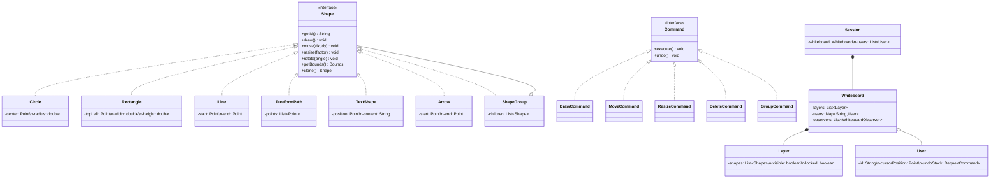

# Collaborative Whiteboard - Low Level Design

## 1. Problem Statement
Design a real-time collaborative whiteboard where multiple users can simultaneously draw shapes, freeform paths, and text. Support undo/redo per user, layer management, grouping, conflict resolution, and live cursor sharing.

## 2. UML Class Diagram


## 3. Design Patterns
| Pattern | Usage |
|---------|-------|
| **Command** | Encapsulate draw/move/resize/delete as commands for undo/redo |
| **Observer** | Notify connected users of whiteboard changes in real-time |
| **Composite** | ShapeGroup contains shapes, treated uniformly |
| **Factory** | ShapeFactory creates shapes by type |
| **Memento** | Snapshot whiteboard state for history/versioning |

## 4. SOLID Principles
- **SRP**: Shape handles geometry; Command handles execution logic; Whiteboard manages state
- **OCP**: New shapes/commands added without modifying existing code
- **LSP**: All Shape implementations substitutable via interface
- **ISP**: Shape, Drawable, Exportable as separate concerns
- **DIP**: Whiteboard depends on Shape interface, not concrete classes

## 5. Complete Java Implementation

```java
// ============ Value Objects ============
class Point {
    double x, y;
    Point(double x, double y) { this.x = x; this.y = y; }
}

class Bounds {
    Point topLeft;
    double width, height;
}

class ShapeStyle {
    String strokeColor;
    String fillColor;
    double strokeWidth;
    double opacity;
    ShapeStyle(String stroke, String fill, double width) {
        this.strokeColor = stroke; this.fillColor = fill; this.strokeWidth = width; this.opacity = 1.0;
    }
}

// ============ Shape Interface (Composite) ============
interface Shape {
    String getId();
    void draw();
    void move(double dx, double dy);
    void resize(double factor);
    void rotate(double angle);
    Bounds getBounds();
    Shape clone();
    ShapeStyle getStyle();
    void setStyle(ShapeStyle style);
    String toSVG();
}

abstract class AbstractShape implements Shape {
    protected String id;
    protected ShapeStyle style;
    protected double rotation = 0;

    AbstractShape(String id, ShapeStyle style) {
        this.id = id;
        this.style = style;
    }
    public String getId() { return id; }
    public ShapeStyle getStyle() { return style; }
    public void setStyle(ShapeStyle style) { this.style = style; }
    public void rotate(double angle) { this.rotation += angle; }
}

class Circle extends AbstractShape {
    private Point center;
    private double radius;

    Circle(String id, Point center, double radius, ShapeStyle style) {
        super(id, style);
        this.center = center; this.radius = radius;
    }
    public void draw() { System.out.println("Drawing circle at " + center.x + "," + center.y); }
    public void move(double dx, double dy) { center = new Point(center.x + dx, center.y + dy); }
    public void resize(double factor) { radius *= factor; }
    public Bounds getBounds() { return new Bounds(); }
    public Shape clone() { return new Circle(UUID.randomUUID().toString(), new Point(center.x, center.y), radius, style); }
    public String toSVG() { return String.format("<circle cx='%f' cy='%f' r='%f' stroke='%s' fill='%s'/>", center.x, center.y, radius, style.strokeColor, style.fillColor); }
}

class RectangleShape extends AbstractShape {
    private Point topLeft;
    private double width, height;

    RectangleShape(String id, Point topLeft, double w, double h, ShapeStyle style) {
        super(id, style); this.topLeft = topLeft; this.width = w; this.height = h;
    }
    public void draw() { System.out.println("Drawing rect"); }
    public void move(double dx, double dy) { topLeft = new Point(topLeft.x + dx, topLeft.y + dy); }
    public void resize(double factor) { width *= factor; height *= factor; }
    public Bounds getBounds() { return new Bounds(); }
    public Shape clone() { return new RectangleShape(UUID.randomUUID().toString(), topLeft, width, height, style); }
    public String toSVG() { return String.format("<rect x='%f' y='%f' width='%f' height='%f'/>", topLeft.x, topLeft.y, width, height); }
}

class FreeformPath extends AbstractShape {
    private List<Point> points = new ArrayList<>();

    FreeformPath(String id, List<Point> points, ShapeStyle style) {
        super(id, style); this.points = new ArrayList<>(points);
    }
    public void draw() { System.out.println("Drawing freeform path with " + points.size() + " points"); }
    public void move(double dx, double dy) { points.replaceAll(p -> new Point(p.x + dx, p.y + dy)); }
    public void resize(double factor) { /* scale from centroid */ }
    public Bounds getBounds() { return new Bounds(); }
    public Shape clone() { return new FreeformPath(UUID.randomUUID().toString(), points, style); }
    public String toSVG() { StringBuilder sb = new StringBuilder("<path d='M"); points.forEach(p -> sb.append(p.x).append(" ").append(p.y).append(" L")); return sb.append("'/>").toString(); }
}

class TextShape extends AbstractShape {
    private Point position;
    private String content;
    private int fontSize;

    TextShape(String id, Point pos, String content, int fontSize, ShapeStyle style) {
        super(id, style); this.position = pos; this.content = content; this.fontSize = fontSize;
    }
    public void draw() { System.out.println("Drawing text: " + content); }
    public void move(double dx, double dy) { position = new Point(position.x + dx, position.y + dy); }
    public void resize(double factor) { fontSize = (int)(fontSize * factor); }
    public Bounds getBounds() { return new Bounds(); }
    public Shape clone() { return new TextShape(UUID.randomUUID().toString(), position, content, fontSize, style); }
    public String toSVG() { return String.format("<text x='%f' y='%f'>%s</text>", position.x, position.y, content); }
}

class Arrow extends AbstractShape {
    private Point start, end;
    Arrow(String id, Point start, Point end, ShapeStyle style) { super(id, style); this.start = start; this.end = end; }
    public void draw() { System.out.println("Drawing arrow"); }
    public void move(double dx, double dy) { start = new Point(start.x+dx, start.y+dy); end = new Point(end.x+dx, end.y+dy); }
    public void resize(double factor) { /* scale from midpoint */ }
    public Bounds getBounds() { return new Bounds(); }
    public Shape clone() { return new Arrow(UUID.randomUUID().toString(), start, end, style); }
    public String toSVG() { return String.format("<line x1='%f' y1='%f' x2='%f' y2='%f' marker-end='url(#arrow)'/>", start.x, start.y, end.x, end.y); }
}

// ============ Composite: ShapeGroup ============
class ShapeGroup extends AbstractShape {
    private List<Shape> children = new ArrayList<>();

    ShapeGroup(String id, List<Shape> children) {
        super(id, new ShapeStyle("none", "none", 0));
        this.children.addAll(children);
    }
    public void draw() { children.forEach(Shape::draw); }
    public void move(double dx, double dy) { children.forEach(s -> s.move(dx, dy)); }
    public void resize(double factor) { children.forEach(s -> s.resize(factor)); }
    public Bounds getBounds() { return new Bounds(); }
    public Shape clone() { return new ShapeGroup(UUID.randomUUID().toString(), children.stream().map(Shape::clone).collect(Collectors.toList())); }
    public String toSVG() { StringBuilder sb = new StringBuilder("<g>"); children.forEach(s -> sb.append(s.toSVG())); return sb.append("</g>").toString(); }
    public List<Shape> getChildren() { return children; }
}

// ============ Factory ============
class ShapeFactory {
    static Shape create(String type, Map<String, Object> params, ShapeStyle style) {
        String id = UUID.randomUUID().toString();
        return switch (type) {
            case "circle" -> new Circle(id, (Point)params.get("center"), (double)params.get("radius"), style);
            case "rectangle" -> new RectangleShape(id, (Point)params.get("topLeft"), (double)params.get("width"), (double)params.get("height"), style);
            case "text" -> new TextShape(id, (Point)params.get("position"), (String)params.get("content"), 14, style);
            case "arrow" -> new Arrow(id, (Point)params.get("start"), (Point)params.get("end"), style);
            default -> throw new IllegalArgumentException("Unknown shape: " + type);
        };
    }
}

// ============ Layer Management ============
class Layer {
    private String id;
    private String name;
    private List<Shape> shapes = new ArrayList<>();
    private boolean visible = true;
    private boolean locked = false;

    Layer(String name) { this.id = UUID.randomUUID().toString(); this.name = name; }
    void addShape(Shape s) { if (!locked) shapes.add(s); }
    void removeShape(String shapeId) { if (!locked) shapes.removeIf(s -> s.getId().equals(shapeId)); }
    Shape findShape(String shapeId) { return shapes.stream().filter(s -> s.getId().equals(shapeId)).findFirst().orElse(null); }
    List<Shape> getShapes() { return Collections.unmodifiableList(shapes); }
    void setVisible(boolean v) { visible = v; }
    void setLocked(boolean l) { locked = l; }
    boolean isLocked() { return locked; }
}

// ============ Command Pattern (Undo/Redo) ============
interface Command {
    void execute();
    void undo();
    long getTimestamp();
    String getUserId();
}

class DrawCommand implements Command {
    private Whiteboard board; private Shape shape; private String layerId; private String userId; private long timestamp;
    DrawCommand(Whiteboard board, Shape shape, String layerId, String userId) {
        this.board = board; this.shape = shape; this.layerId = layerId; this.userId = userId; this.timestamp = System.currentTimeMillis();
    }
    public void execute() { board.addShape(layerId, shape); }
    public void undo() { board.removeShape(layerId, shape.getId()); }
    public long getTimestamp() { return timestamp; }
    public String getUserId() { return userId; }
}

class MoveCommand implements Command {
    private Shape shape; private double dx, dy; private String userId; private long timestamp;
    MoveCommand(Shape shape, double dx, double dy, String userId) {
        this.shape = shape; this.dx = dx; this.dy = dy; this.userId = userId; this.timestamp = System.currentTimeMillis();
    }
    public void execute() { shape.move(dx, dy); }
    public void undo() { shape.move(-dx, -dy); }
    public long getTimestamp() { return timestamp; }
    public String getUserId() { return userId; }
}

class ResizeCommand implements Command {
    private Shape shape; private double factor; private String userId; private long timestamp;
    ResizeCommand(Shape shape, double factor, String userId) {
        this.shape = shape; this.factor = factor; this.userId = userId; this.timestamp = System.currentTimeMillis();
    }
    public void execute() { shape.resize(factor); }
    public void undo() { shape.resize(1.0 / factor); }
    public long getTimestamp() { return timestamp; }
    public String getUserId() { return userId; }
}

class DeleteCommand implements Command {
    private Whiteboard board; private Shape shape; private String layerId; private String userId; private long timestamp;
    DeleteCommand(Whiteboard board, Shape shape, String layerId, String userId) {
        this.board = board; this.shape = shape; this.layerId = layerId; this.userId = userId; this.timestamp = System.currentTimeMillis();
    }
    public void execute() { board.removeShape(layerId, shape.getId()); }
    public void undo() { board.addShape(layerId, shape); }
    public long getTimestamp() { return timestamp; }
    public String getUserId() { return userId; }
}

class GroupCommand implements Command {
    private Whiteboard board; private List<Shape> shapes; private ShapeGroup group; private String layerId; private String userId; private long timestamp;
    GroupCommand(Whiteboard board, List<Shape> shapes, String layerId, String userId) {
        this.board = board; this.shapes = shapes; this.layerId = layerId; this.userId = userId; this.timestamp = System.currentTimeMillis();
        this.group = new ShapeGroup(UUID.randomUUID().toString(), shapes);
    }
    public void execute() { shapes.forEach(s -> board.removeShape(layerId, s.getId())); board.addShape(layerId, group); }
    public void undo() { board.removeShape(layerId, group.getId()); shapes.forEach(s -> board.addShape(layerId, s)); }
    public long getTimestamp() { return timestamp; }
    public String getUserId() { return userId; }
}

// ============ Observer Pattern ============
interface WhiteboardObserver {
    void onShapeAdded(Shape shape, String userId);
    void onShapeRemoved(String shapeId, String userId);
    void onShapeModified(Shape shape, String userId);
    void onCursorMoved(String userId, Point position);
}

class RemoteUserSync implements WhiteboardObserver {
    private String connectionId;
    RemoteUserSync(String connectionId) { this.connectionId = connectionId; }
    public void onShapeAdded(Shape s, String userId) { broadcast("ADD", s.toSVG(), userId); }
    public void onShapeRemoved(String id, String userId) { broadcast("REMOVE", id, userId); }
    public void onShapeModified(Shape s, String userId) { broadcast("MODIFY", s.toSVG(), userId); }
    public void onCursorMoved(String userId, Point pos) { broadcast("CURSOR", pos.x + "," + pos.y, userId); }
    private void broadcast(String type, String data, String userId) {
        System.out.println("[WS:" + connectionId + "] " + type + " by " + userId + ": " + data);
    }
}

// ============ User & Cursor Sharing ============
class User {
    private String id;
    private String name;
    private String cursorColor;
    private Point cursorPosition;
    private Deque<Command> undoStack = new ArrayDeque<>();
    private Deque<Command> redoStack = new ArrayDeque<>();

    User(String id, String name, String cursorColor) { this.id = id; this.name = name; this.cursorColor = cursorColor; }

    void executeCommand(Command cmd) { cmd.execute(); undoStack.push(cmd); redoStack.clear(); }
    void undo() { if (!undoStack.isEmpty()) { Command cmd = undoStack.pop(); cmd.undo(); redoStack.push(cmd); } }
    void redo() { if (!redoStack.isEmpty()) { Command cmd = redoStack.pop(); cmd.execute(); undoStack.push(cmd); } }
    void updateCursor(Point pos) { this.cursorPosition = pos; }
    String getId() { return id; }
    Point getCursorPosition() { return cursorPosition; }
}

// ============ Whiteboard (Core) ============
class Whiteboard {
    private String id;
    private List<Layer> layers = new ArrayList<>();
    private Map<String, User> users = new ConcurrentHashMap<>();
    private List<WhiteboardObserver> observers = new CopyOnWriteArrayList<>();
    private long version = 0;

    Whiteboard(String id) {
        this.id = id;
        layers.add(new Layer("Default"));
    }

    synchronized void addShape(String layerId, Shape shape) {
        getLayer(layerId).addShape(shape);
        version++;
        observers.forEach(o -> o.onShapeAdded(shape, "system"));
    }

    synchronized void removeShape(String layerId, String shapeId) {
        getLayer(layerId).removeShape(shapeId);
        version++;
        observers.forEach(o -> o.onShapeRemoved(shapeId, "system"));
    }

    Layer getLayer(String layerId) {
        return layers.stream().filter(l -> l.getId().equals(layerId)).findFirst().orElse(layers.get(0));
    }

    Layer addLayer(String name) { Layer l = new Layer(name); layers.add(l); return l; }
    void addObserver(WhiteboardObserver o) { observers.add(o); }
    void removeObserver(WhiteboardObserver o) { observers.remove(o); }

    void userJoin(User user) { users.put(user.getId(), user); }
    void userLeave(String userId) { users.remove(userId); }

    void moveCursor(String userId, Point pos) {
        User u = users.get(userId);
        if (u != null) { u.updateCursor(pos); observers.forEach(o -> o.onCursorMoved(userId, pos)); }
    }

    // Conflict Resolution: Last Writer Wins with version vector
    synchronized boolean applyRemoteCommand(Command cmd, long expectedVersion) {
        if (expectedVersion < version) {
            // Last writer wins - apply anyway but log conflict
            System.out.println("Conflict detected, applying last-writer-wins for user " + cmd.getUserId());
        }
        cmd.execute();
        version++;
        return true;
    }

    // Export
    String exportSVG() {
        StringBuilder svg = new StringBuilder("<svg xmlns='http://www.w3.org/2000/svg'>\n");
        for (Layer layer : layers) {
            svg.append("<g id='").append(layer.getName()).append("'>\n");
            layer.getShapes().forEach(s -> svg.append("  ").append(s.toSVG()).append("\n"));
            svg.append("</g>\n");
        }
        return svg.append("</svg>").toString();
    }
}

// ============ Session Manager ============
class Session {
    private String sessionId;
    private Whiteboard whiteboard;
    private Map<String, User> activeUsers = new ConcurrentHashMap<>();

    Session(String sessionId) {
        this.sessionId = sessionId;
        this.whiteboard = new Whiteboard(sessionId);
    }

    void join(User user) {
        activeUsers.put(user.getId(), user);
        whiteboard.userJoin(user);
        whiteboard.addObserver(new RemoteUserSync(user.getId()));
    }

    void leave(String userId) {
        activeUsers.remove(userId);
        whiteboard.userLeave(userId);
    }

    void executeAction(String userId, Command cmd) {
        User user = activeUsers.get(userId);
        if (user != null) { user.executeCommand(cmd); }
    }

    void undo(String userId) { User u = activeUsers.get(userId); if (u != null) u.undo(); }
    void redo(String userId) { User u = activeUsers.get(userId); if (u != null) u.redo(); }

    Whiteboard getWhiteboard() { return whiteboard; }
}

// ============ Memento for Snapshots ============
class WhiteboardMemento {
    private final String svgSnapshot;
    private final long version;
    private final Instant timestamp;

    WhiteboardMemento(Whiteboard board) {
        this.svgSnapshot = board.exportSVG();
        this.version = System.currentTimeMillis();
        this.timestamp = Instant.now();
    }
    String restore() { return svgSnapshot; }
}

class HistoryManager {
    private List<WhiteboardMemento> snapshots = new ArrayList<>();
    void save(Whiteboard board) { snapshots.add(new WhiteboardMemento(board)); }
    WhiteboardMemento getSnapshot(int index) { return snapshots.get(index); }
}
```

## 6. Key Interview Points

| Topic | Insight |
|-------|---------|
| **Command + Undo/Redo** | Per-user stacks; each command is invertible; redo cleared on new action |
| **Composite** | ShapeGroup holds children, all operations propagate recursively |
| **Observer** | WebSocket-based sync; observers notified on every state change |
| **Conflict Resolution** | Last-writer-wins with version counter; mention OT/CRDT for advanced |
| **Thread Safety** | `synchronized` on whiteboard mutations; `ConcurrentHashMap` for users |
| **Layer Management** | Shapes organized in layers; layers can be locked/hidden |
| **Export** | Each shape produces SVG fragment; compose into full SVG document |
| **Cursor Sharing** | Broadcast cursor position via observer; colored per user |
| **Scalability** | Shard by whiteboard ID; use Redis pub/sub for cross-server sync |
| **Memento** | Periodic snapshots for recovery; complement command log |
