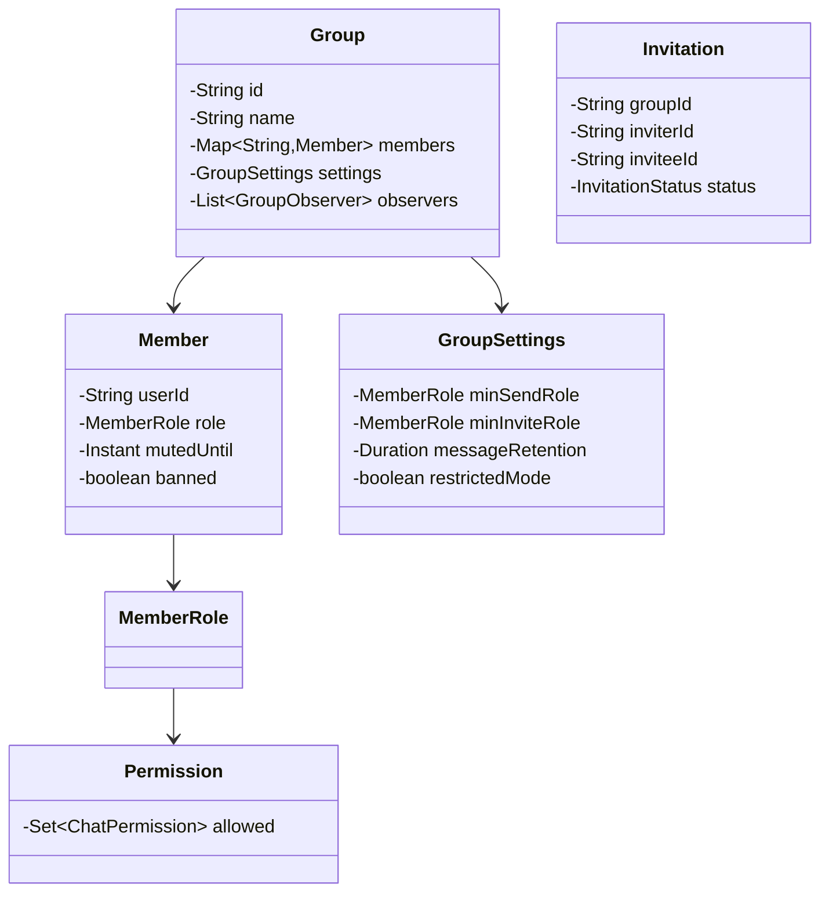

# Group Chat Permissions System - LLD

## 1. Problem Statement
Design a group chat permissions system supporting role-based access control, admin actions (mute/kick/ban/promote), invitation workflows, restricted modes, and temporary mutes with expiration.

## 2. UML Class Diagram


## 3. Design Patterns
- **Strategy**: Permission evaluation strategies per role
- **Proxy**: Permission-checking proxy wrapping group actions
- **Observer**: Notifications on member join/leave/role changes
- **Composite**: Hierarchical permission inheritance

## 4. SOLID Principles
- **SRP**: Separate classes for permissions, settings, invitations
- **OCP**: New roles/permissions without modifying existing code
- **LSP**: All roles implement same permission interface
- **ISP**: Granular permission enums
- **DIP**: Depend on abstractions (PermissionStrategy, GroupObserver)

## 5. Complete Java Implementation

```java
import java.util.*;
import java.time.*;
import java.util.concurrent.*;

// ==================== ENUMS ====================
enum MemberRole {
    GUEST(0), MEMBER(1), MODERATOR(2), ADMIN(3), OWNER(4);
    private final int level;
    MemberRole(int level) { this.level = level; }
    public int getLevel() { return level; }
    public boolean isHigherThan(MemberRole other) { return this.level > other.level; }
    public boolean isAtLeast(MemberRole other) { return this.level >= other.level; }
}

enum ChatPermission {
    SEND_MESSAGE, DELETE_MESSAGE, PIN_MESSAGE,
    INVITE_MEMBER, REMOVE_MEMBER, CHANGE_SETTINGS, MANAGE_ROLES
}

enum InvitationStatus { PENDING, APPROVED, REJECTED, EXPIRED }

// ==================== MODELS ====================
class Permission {
    private final Set<ChatPermission> allowed;
    Permission(Set<ChatPermission> allowed) { this.allowed = EnumSet.copyOf(allowed); }
    public boolean has(ChatPermission p) { return allowed.contains(p); }
    public Set<ChatPermission> getAll() { return Collections.unmodifiableSet(allowed); }
}

class Member {
    private final String userId;
    private MemberRole role;
    private Instant mutedUntil;
    private boolean banned;
    private Instant joinedAt;

    public Member(String userId, MemberRole role) {
        this.userId = userId;
        this.role = role;
        this.joinedAt = Instant.now();
    }
    public String getUserId() { return userId; }
    public MemberRole getRole() { return role; }
    public void setRole(MemberRole role) { this.role = role; }
    public boolean isMuted() { return mutedUntil != null && Instant.now().isBefore(mutedUntil); }
    public void mute(Duration duration) { this.mutedUntil = Instant.now().plus(duration); }
    public void unmute() { this.mutedUntil = null; }
    public boolean isBanned() { return banned; }
    public void setBanned(boolean banned) { this.banned = banned; }
}

class Message {
    private final String id;
    private final String senderId;
    private final String content;
    private final Instant timestamp;
    private boolean pinned;

    public Message(String senderId, String content) {
        this.id = UUID.randomUUID().toString();
        this.senderId = senderId;
        this.content = content;
        this.timestamp = Instant.now();
    }
    public String getId() { return id; }
    public String getSenderId() { return senderId; }
    public String getContent() { return content; }
    public boolean isPinned() { return pinned; }
    public void setPinned(boolean pinned) { this.pinned = pinned; }
}

class GroupSettings {
    private MemberRole minSendRole = MemberRole.MEMBER;
    private MemberRole minInviteRole = MemberRole.ADMIN;
    private Duration messageRetention = Duration.ofDays(30);
    private boolean restrictedMode = false; // only admins can post

    public MemberRole getMinSendRole() { return restrictedMode ? MemberRole.ADMIN : minSendRole; }
    public void setMinSendRole(MemberRole r) { this.minSendRole = r; }
    public MemberRole getMinInviteRole() { return minInviteRole; }
    public void setMinInviteRole(MemberRole r) { this.minInviteRole = r; }
    public boolean isRestrictedMode() { return restrictedMode; }
    public void setRestrictedMode(boolean b) { this.restrictedMode = b; }
    public Duration getMessageRetention() { return messageRetention; }
    public void setMessageRetention(Duration d) { this.messageRetention = d; }
}

class Invitation {
    private final String id;
    private final String groupId;
    private final String inviterId;
    private final String inviteeId;
    private InvitationStatus status;
    private final Instant createdAt;

    public Invitation(String groupId, String inviterId, String inviteeId) {
        this.id = UUID.randomUUID().toString();
        this.groupId = groupId;
        this.inviterId = inviterId;
        this.inviteeId = inviteeId;
        this.status = InvitationStatus.PENDING;
        this.createdAt = Instant.now();
    }
    public String getId() { return id; }
    public String getGroupId() { return groupId; }
    public String getInviterId() { return inviterId; }
    public String getInviteeId() { return inviteeId; }
    public InvitationStatus getStatus() { return status; }
    public void approve() { this.status = InvitationStatus.APPROVED; }
    public void reject() { this.status = InvitationStatus.REJECTED; }
}

// ==================== STRATEGY: Permission Evaluation ====================
interface PermissionStrategy {
    Permission getPermissions(MemberRole role);
}

class DefaultPermissionStrategy implements PermissionStrategy {
    private static final Map<MemberRole, Permission> ROLE_PERMISSIONS = Map.of(
        MemberRole.GUEST, new Permission(EnumSet.of(ChatPermission.SEND_MESSAGE)),
        MemberRole.MEMBER, new Permission(EnumSet.of(
            ChatPermission.SEND_MESSAGE, ChatPermission.INVITE_MEMBER)),
        MemberRole.MODERATOR, new Permission(EnumSet.of(
            ChatPermission.SEND_MESSAGE, ChatPermission.DELETE_MESSAGE,
            ChatPermission.PIN_MESSAGE, ChatPermission.INVITE_MEMBER, ChatPermission.REMOVE_MEMBER)),
        MemberRole.ADMIN, new Permission(EnumSet.of(
            ChatPermission.SEND_MESSAGE, ChatPermission.DELETE_MESSAGE,
            ChatPermission.PIN_MESSAGE, ChatPermission.INVITE_MEMBER,
            ChatPermission.REMOVE_MEMBER, ChatPermission.CHANGE_SETTINGS, ChatPermission.MANAGE_ROLES)),
        MemberRole.OWNER, new Permission(EnumSet.copyOf(EnumSet.allOf(ChatPermission.class)))
    );

    @Override
    public Permission getPermissions(MemberRole role) {
        return ROLE_PERMISSIONS.getOrDefault(role, new Permission(EnumSet.noneOf(ChatPermission.class)));
    }
}

// ==================== OBSERVER ====================
interface GroupObserver {
    void onMemberJoined(String groupId, String userId);
    void onMemberLeft(String groupId, String userId);
    void onRoleChanged(String groupId, String userId, MemberRole newRole);
}

class NotificationObserver implements GroupObserver {
    public void onMemberJoined(String g, String u) { System.out.println("[" + g + "] " + u + " joined"); }
    public void onMemberLeft(String g, String u) { System.out.println("[" + g + "] " + u + " left"); }
    public void onRoleChanged(String g, String u, MemberRole r) { System.out.println("[" + g + "] " + u + " now " + r); }
}

// ==================== CORE GROUP ====================
class Group {
    private final String id;
    private final String name;
    private final Map<String, Member> members = new ConcurrentHashMap<>();
    private final List<Message> messages = new CopyOnWriteArrayList<>();
    private final List<Invitation> invitations = new ArrayList<>();
    private final GroupSettings settings = new GroupSettings();
    private final List<GroupObserver> observers = new ArrayList<>();
    private final PermissionStrategy permissionStrategy;

    public Group(String id, String name, String ownerId, PermissionStrategy strategy) {
        this.id = id;
        this.name = name;
        this.permissionStrategy = strategy;
        members.put(ownerId, new Member(ownerId, MemberRole.OWNER));
    }

    public void addObserver(GroupObserver o) { observers.add(o); }
    public GroupSettings getSettings() { return settings; }
    public String getId() { return id; }

    public boolean hasPermission(String userId, ChatPermission perm) {
        Member m = members.get(userId);
        if (m == null || m.isBanned()) return false;
        return permissionStrategy.getPermissions(m.getRole()).has(perm);
    }

    public void addMember(String userId, MemberRole role) {
        members.put(userId, new Member(userId, role));
        observers.forEach(o -> o.onMemberJoined(id, userId));
    }

    public Member getMember(String userId) { return members.get(userId); }

    public List<Message> getMessages() { return Collections.unmodifiableList(messages); }
    public List<Invitation> getInvitations() { return Collections.unmodifiableList(invitations); }
    public void addInvitation(Invitation inv) { invitations.add(inv); }

    public void removeMember(String userId) {
        members.remove(userId);
        observers.forEach(o -> o.onMemberLeft(id, userId));
    }

    public void addMessage(Message msg) { messages.add(msg); }

    public void changeRole(String userId, MemberRole newRole) {
        Member m = members.get(userId);
        if (m != null) {
            m.setRole(newRole);
            observers.forEach(o -> o.onRoleChanged(id, userId, newRole));
        }
    }
}

// ==================== PROXY: Permission-Checking ====================
interface GroupActions {
    void sendMessage(String userId, String content);
    void deleteMessage(String userId, String messageId);
    void pinMessage(String userId, String messageId);
    void inviteMember(String inviterId, String inviteeId);
    void removeMember(String actorId, String targetId);
    void muteMember(String actorId, String targetId, Duration duration);
    void banMember(String actorId, String targetId);
    void promote(String actorId, String targetId);
    void demote(String actorId, String targetId);
}

class GroupActionProxy implements GroupActions {
    private final Group group;

    public GroupActionProxy(Group group) { this.group = group; }

    private void checkPermission(String userId, ChatPermission perm) {
        if (!group.hasPermission(userId, perm))
            throw new SecurityException(userId + " lacks " + perm);
    }

    private void checkHierarchy(String actorId, String targetId) {
        Member actor = group.getMember(actorId);
        Member target = group.getMember(targetId);
        if (target == null) throw new IllegalArgumentException("Target not found");
        if (!actor.getRole().isHigherThan(target.getRole()))
            throw new SecurityException("Cannot act on equal/higher role");
    }

    @Override
    public void sendMessage(String userId, String content) {
        Member m = group.getMember(userId);
        if (m == null || m.isBanned()) throw new SecurityException("Cannot send");
        if (m.isMuted()) throw new SecurityException(userId + " is muted");
        if (!m.getRole().isAtLeast(group.getSettings().getMinSendRole()))
            throw new SecurityException("Role too low to send");
        checkPermission(userId, ChatPermission.SEND_MESSAGE);
        group.addMessage(new Message(userId, content));
    }

    @Override
    public void deleteMessage(String userId, String messageId) {
        checkPermission(userId, ChatPermission.DELETE_MESSAGE);
        group.getMessages().stream().filter(msg -> msg.getId().equals(messageId)).findFirst()
            .ifPresent(msg -> group.getMessages().remove(msg));
    }

    @Override
    public void pinMessage(String userId, String messageId) {
        checkPermission(userId, ChatPermission.PIN_MESSAGE);
        group.getMessages().stream().filter(msg -> msg.getId().equals(messageId)).findFirst()
            .ifPresent(msg -> msg.setPinned(true));
    }

    @Override
    public void inviteMember(String inviterId, String inviteeId) {
        checkPermission(inviterId, ChatPermission.INVITE_MEMBER);
        Member actor = group.getMember(inviterId);
        if (!actor.getRole().isAtLeast(group.getSettings().getMinInviteRole()))
            throw new SecurityException("Role too low to invite");
        Invitation inv = new Invitation(group.getId(), inviterId, inviteeId);
        group.addInvitation(inv);
        // If actor is ADMIN+, auto-approve
        if (actor.getRole().isAtLeast(MemberRole.ADMIN)) {
            inv.approve();
            group.addMember(inviteeId, MemberRole.MEMBER);
        }
    }

    @Override
    public void removeMember(String actorId, String targetId) {
        checkPermission(actorId, ChatPermission.REMOVE_MEMBER);
        checkHierarchy(actorId, targetId);
        group.removeMember(targetId);
    }

    @Override
    public void muteMember(String actorId, String targetId, Duration duration) {
        checkPermission(actorId, ChatPermission.REMOVE_MEMBER);
        checkHierarchy(actorId, targetId);
        group.getMember(targetId).mute(duration);
    }

    @Override
    public void banMember(String actorId, String targetId) {
        checkPermission(actorId, ChatPermission.REMOVE_MEMBER);
        checkHierarchy(actorId, targetId);
        group.getMember(targetId).setBanned(true);
        group.removeMember(targetId);
    }

    @Override
    public void promote(String actorId, String targetId) {
        checkPermission(actorId, ChatPermission.MANAGE_ROLES);
        checkHierarchy(actorId, targetId);
        Member target = group.getMember(targetId);
        MemberRole[] roles = MemberRole.values();
        int next = Math.min(target.getRole().ordinal() + 1, roles.length - 2); // can't promote to OWNER
        group.changeRole(targetId, roles[next]);
    }

    @Override
    public void demote(String actorId, String targetId) {
        checkPermission(actorId, ChatPermission.MANAGE_ROLES);
        checkHierarchy(actorId, targetId);
        Member target = group.getMember(targetId);
        MemberRole[] roles = MemberRole.values();
        int prev = Math.max(target.getRole().ordinal() - 1, 0);
        group.changeRole(targetId, roles[prev]);
    }
}

// ==================== DEMO ====================
public class GroupChatPermissionsDemo {
    public static void main(String[] args) {
        Group group = new Group("g1", "Dev Team", "owner1", new DefaultPermissionStrategy());
        group.addObserver(new NotificationObserver());

        GroupActions actions = new GroupActionProxy(group);

        group.addMember("admin1", MemberRole.ADMIN);
        group.addMember("user1", MemberRole.MEMBER);
        group.addMember("guest1", MemberRole.GUEST);

        // Normal messaging
        actions.sendMessage("user1", "Hello everyone!");
        actions.sendMessage("admin1", "Welcome!");

        // Admin mutes user for 10 minutes
        actions.muteMember("admin1", "user1", Duration.ofMinutes(10));
        try { actions.sendMessage("user1", "test"); }
        catch (SecurityException e) { System.out.println("Blocked: " + e.getMessage()); }

        // Restricted mode
        group.getSettings().setRestrictedMode(true);
        try { actions.sendMessage("guest1", "hi"); }
        catch (SecurityException e) { System.out.println("Restricted: " + e.getMessage()); }

        // Promote and demote
        actions.promote("owner1", "user1");
        actions.demote("owner1", "admin1");

        // Invitation with approval
        actions.inviteMember("admin1", "newUser1");
        System.out.println("Invitations: " + group.getInvitations().size());
    }
}
```

## 6. Key Interview Points

| Topic | Highlight |
|-------|-----------|
| **Role Hierarchy** | Numeric levels ensure actors can only affect lower roles |
| **Proxy Pattern** | All permission checks centralized before action execution |
| **Strategy Pattern** | Swappable permission schemes (default, custom per group) |
| **Observer Pattern** | Decoupled notifications on membership changes |
| **Temporary Mute** | `Instant`-based expiration, checked at action time |
| **Restricted Mode** | Dynamically raises min send role to ADMIN |
| **Invitation Flow** | Auto-approve for admins, pending for lower roles |
| **Thread Safety** | `ConcurrentHashMap` + `CopyOnWriteArrayList` for concurrent access |
| **Extensibility** | New permissions/roles added without modifying existing logic |
| **Ban vs Mute** | Ban removes + blocks re-entry; mute is temporary silence |
