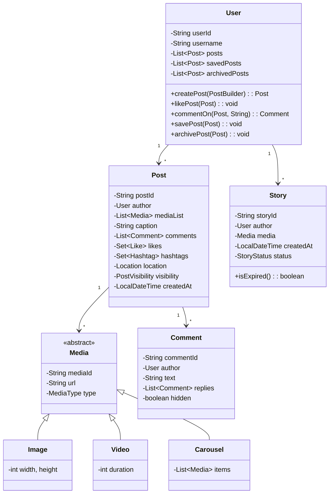

# Instagram-like Media Post Model - LLD

## Problem Statement
Design a low-level system for Instagram-like media posts supporting multiple media types, stories with expiration, hashtags, location tagging, explore feed, and social interactions (likes, comments, mentions, bookmarks).

## UML Class Diagram


## Design Patterns

| Pattern | Usage |
|---------|-------|
| Builder | Post creation with optional media, hashtags, location |
| Strategy | Feed ranking (chronological, trending, personalized) |
| Observer | Notifications on like, comment, mention |
| Factory | Media object creation (Image/Video/Carousel) |
| Iterator | Paginated feed traversal |

## Java Implementation

```java
import java.util.*;
import java.time.*;
import java.util.stream.*;

// === ENUMS ===
enum MediaType { IMAGE, VIDEO, CAROUSEL }
enum PostVisibility { PUBLIC, PRIVATE, CLOSE_FRIENDS }
enum StoryStatus { ACTIVE, EXPIRED, HIGHLIGHTED }
enum NotificationType { LIKE, COMMENT, MENTION, FOLLOW }

// === MODELS ===
class Location {
    private String id, name;
    private double latitude, longitude;
    public Location(String id, String name, double lat, double lng) {
        this.id = id; this.name = name; this.latitude = lat; this.longitude = lng;
    }
    public String getName() { return name; }
    public String getId() { return id; }
}

class Hashtag {
    private String tag;
    private List<Post> posts = new ArrayList<>();
    public Hashtag(String tag) { this.tag = tag.toLowerCase(); }
    public void addPost(Post p) { posts.add(p); }
    public String getTag() { return tag; }
    public int getPostCount() { return posts.size(); }
    public List<Post> getPosts() { return posts; }
}

abstract class Media {
    protected String mediaId, url;
    protected MediaType type;
    public Media(String id, String url, MediaType type) { this.mediaId = id; this.url = url; this.type = type; }
    public MediaType getType() { return type; }
}

class Image extends Media {
    private int width, height;
    public Image(String id, String url, int w, int h) { super(id, url, MediaType.IMAGE); width = w; height = h; }
}

class Video extends Media {
    private int durationSecs;
    public Video(String id, String url, int duration) { super(id, url, MediaType.VIDEO); this.durationSecs = duration; }
}

class Carousel extends Media {
    private List<Media> items = new ArrayList<>();
    public Carousel(String id) { super(id, null, MediaType.CAROUSEL); }
    public void addItem(Media m) { items.add(m); }
    public List<Media> getItems() { return items; }
}

// === MEDIA FACTORY ===
class MediaFactory {
    public static Media create(MediaType type, String id, String url, Map<String, Integer> props) {
        return switch (type) {
            case IMAGE -> new Image(id, url, props.getOrDefault("width", 1080), props.getOrDefault("height", 1080));
            case VIDEO -> new Video(id, url, props.getOrDefault("duration", 30));
            case CAROUSEL -> new Carousel(id);
        };
    }
}

// === COMMENT & LIKE ===
class Like {
    private String userId;
    private LocalDateTime timestamp;
    public Like(String userId) { this.userId = userId; this.timestamp = LocalDateTime.now(); }
    public String getUserId() { return userId; }
}

class Comment {
    private String commentId;
    private User author;
    private String text;
    private List<Comment> replies = new ArrayList<>();
    private boolean hidden = false;
    private LocalDateTime createdAt = LocalDateTime.now();
    private Set<String> mentionedUserIds = new HashSet<>();

    public Comment(String id, User author, String text) {
        this.commentId = id; this.author = author; this.text = text;
        parseMentions();
    }
    private void parseMentions() {
        Arrays.stream(text.split("\\s+"))
              .filter(w -> w.startsWith("@"))
              .forEach(w -> mentionedUserIds.add(w.substring(1)));
    }
    public void reply(Comment c) { replies.add(c); }
    public void hide() { hidden = true; }
    public void show() { hidden = false; }
    public boolean isHidden() { return hidden; }
    public List<Comment> getReplies() { return replies; }
    public Set<String> getMentionedUserIds() { return mentionedUserIds; }
    public User getAuthor() { return author; }
}

// === POST (BUILDER PATTERN) ===
class Post {
    private String postId;
    private User author;
    private List<Media> mediaList;
    private String caption;
    private List<Comment> comments = new ArrayList<>();
    private Set<Like> likes = new HashSet<>();
    private Set<Hashtag> hashtags;
    private Location location;
    private PostVisibility visibility;
    private LocalDateTime createdAt;
    private boolean archived = false;

    private Post(Builder b) {
        this.postId = b.postId; this.author = b.author; this.mediaList = b.mediaList;
        this.caption = b.caption; this.hashtags = b.hashtags; this.location = b.location;
        this.visibility = b.visibility; this.createdAt = LocalDateTime.now();
    }

    public void addLike(Like like) { likes.add(like); }
    public void removeLike(String userId) { likes.removeIf(l -> l.getUserId().equals(userId)); }
    public void addComment(Comment c) { comments.add(c); }
    public void archive() { archived = true; }
    public void unarchive() { archived = false; }
    public boolean isArchived() { return archived; }
    public int getLikeCount() { return likes.size(); }
    public List<Comment> getComments() { return comments; }
    public User getAuthor() { return author; }
    public String getPostId() { return postId; }
    public Set<Hashtag> getHashtags() { return hashtags; }
    public Location getLocation() { return location; }
    public PostVisibility getVisibility() { return visibility; }
    public LocalDateTime getCreatedAt() { return createdAt; }

    static class Builder {
        private String postId;
        private User author;
        private List<Media> mediaList = new ArrayList<>();
        private String caption = "";
        private Set<Hashtag> hashtags = new HashSet<>();
        private Location location;
        private PostVisibility visibility = PostVisibility.PUBLIC;

        public Builder(String postId, User author) { this.postId = postId; this.author = author; }
        public Builder media(Media m) { mediaList.add(m); return this; }
        public Builder caption(String c) { this.caption = c; return this; }
        public Builder hashtag(Hashtag h) { hashtags.add(h); return this; }
        public Builder location(Location l) { this.location = l; return this; }
        public Builder visibility(PostVisibility v) { this.visibility = v; return this; }
        public Post build() { return new Post(this); }
    }
}

// === STORY ===
class Story {
    private String storyId;
    private User author;
    private Media media;
    private LocalDateTime createdAt;
    private StoryStatus status;
    private static final int EXPIRY_HOURS = 24;

    public Story(String id, User author, Media media) {
        this.storyId = id; this.author = author; this.media = media;
        this.createdAt = LocalDateTime.now(); this.status = StoryStatus.ACTIVE;
    }
    public boolean isExpired() { return Duration.between(createdAt, LocalDateTime.now()).toHours() >= EXPIRY_HOURS; }
    public StoryStatus getStatus() {
        if (status != StoryStatus.HIGHLIGHTED && isExpired()) status = StoryStatus.EXPIRED;
        return status;
    }
    public void highlight() { status = StoryStatus.HIGHLIGHTED; }
}

// === OBSERVER PATTERN ===
interface NotificationObserver {
    void onNotify(String userId, NotificationType type, String message);
}

class PushNotificationService implements NotificationObserver {
    public void onNotify(String userId, NotificationType type, String msg) {
        System.out.println("[PUSH -> " + userId + "] " + type + ": " + msg);
    }
}

class NotificationManager {
    private List<NotificationObserver> observers = new ArrayList<>();
    public void subscribe(NotificationObserver o) { observers.add(o); }
    public void notifyUser(String userId, NotificationType type, String msg) {
        observers.forEach(o -> o.onNotify(userId, type, msg));
    }
}

// === STRATEGY: FEED RANKING ===
interface FeedStrategy {
    List<Post> rank(List<Post> posts, User viewer);
}

class ChronologicalFeed implements FeedStrategy {
    public List<Post> rank(List<Post> posts, User viewer) {
        return posts.stream().sorted(Comparator.comparing(Post::getCreatedAt).reversed()).collect(Collectors.toList());
    }
}

class TrendingFeed implements FeedStrategy {
    public List<Post> rank(List<Post> posts, User viewer) {
        return posts.stream().sorted(Comparator.comparingInt(Post::getLikeCount).reversed()).collect(Collectors.toList());
    }
}

// === ITERATOR: PAGINATED FEED ===
class FeedIterator implements Iterator<List<Post>> {
    private List<Post> allPosts;
    private int pageSize, cursor = 0;

    public FeedIterator(List<Post> posts, int pageSize) { this.allPosts = posts; this.pageSize = pageSize; }
    public boolean hasNext() { return cursor < allPosts.size(); }
    public List<Post> next() {
        List<Post> page = allPosts.subList(cursor, Math.min(cursor + pageSize, allPosts.size()));
        cursor += pageSize;
        return page;
    }
}

// === USER ===
class User {
    private String userId, username;
    private List<Post> posts = new ArrayList<>();
    private List<Story> stories = new ArrayList<>();
    private Set<String> savedPostIds = new HashSet<>();
    private Set<String> archivedPostIds = new HashSet<>();

    public User(String id, String username) { this.userId = id; this.username = username; }
    public String getUserId() { return userId; }
    public String getUsername() { return username; }

    public Post createPost(Post.Builder builder) {
        Post post = builder.build();
        posts.add(post);
        post.getHashtags().forEach(h -> h.addPost(post));
        return post;
    }
    public void likePost(Post post, NotificationManager nm) {
        post.addLike(new Like(userId));
        nm.notifyUser(post.getAuthor().getUserId(), NotificationType.LIKE, username + " liked your post");
    }
    public void unlikePost(Post post) { post.removeLike(userId); }
    public Comment commentOn(Post post, String text, NotificationManager nm) {
        Comment c = new Comment(UUID.randomUUID().toString(), this, text);
        post.addComment(c);
        nm.notifyUser(post.getAuthor().getUserId(), NotificationType.COMMENT, username + " commented: " + text);
        c.getMentionedUserIds().forEach(uid ->
            nm.notifyUser(uid, NotificationType.MENTION, username + " mentioned you"));
        return c;
    }
    public void savePost(Post post) { savedPostIds.add(post.getPostId()); }
    public void unsavePost(Post post) { savedPostIds.remove(post.getPostId()); }
    public void archivePost(Post post) { post.archive(); archivedPostIds.add(post.getPostId()); }
    public Story createStory(Media media) {
        Story s = new Story(UUID.randomUUID().toString(), this, media);
        stories.add(s);
        return s;
    }
    public List<Story> getActiveStories() {
        return stories.stream().filter(s -> s.getStatus() == StoryStatus.ACTIVE).collect(Collectors.toList());
    }
}

// === INSTAGRAM SERVICE (FACADE) ===
class InstagramService {
    private Map<String, User> users = new HashMap<>();
    private Map<String, Hashtag> hashtags = new HashMap<>();
    private Map<String, List<Post>> locationPosts = new HashMap<>();
    private List<Post> allPosts = new ArrayList<>();
    private NotificationManager notificationManager = new NotificationManager();
    private FeedStrategy feedStrategy = new ChronologicalFeed();

    public InstagramService() { notificationManager.subscribe(new PushNotificationService()); }

    public User registerUser(String id, String name) { User u = new User(id, name); users.put(id, u); return u; }
    public void setFeedStrategy(FeedStrategy s) { this.feedStrategy = s; }

    public Hashtag getOrCreateHashtag(String tag) {
        return hashtags.computeIfAbsent(tag.toLowerCase(), Hashtag::new);
    }

    public Post createPost(User author, Post.Builder builder) {
        Post post = author.createPost(builder);
        allPosts.add(post);
        if (post.getLocation() != null) locationPosts.computeIfAbsent(post.getLocation().getId(), k -> new ArrayList<>()).add(post);
        return post;
    }

    public List<Hashtag> getTrendingHashtags(int top) {
        return hashtags.values().stream()
            .sorted(Comparator.comparingInt(Hashtag::getPostCount).reversed())
            .limit(top).collect(Collectors.toList());
    }

    public FeedIterator getExploreFeed(User viewer, int pageSize) {
        List<Post> ranked = feedStrategy.rank(
            allPosts.stream().filter(p -> p.getVisibility() == PostVisibility.PUBLIC && !p.isArchived()).collect(Collectors.toList()), viewer);
        return new FeedIterator(ranked, pageSize);
    }

    public void moderateComment(Comment c, boolean hide) { if (hide) c.hide(); else c.show(); }
    public NotificationManager getNotificationManager() { return notificationManager; }
}

// === DEMO ===
class Main {
    public static void main(String[] args) {
        InstagramService ig = new InstagramService();
        User alice = ig.registerUser("u1", "alice");
        User bob = ig.registerUser("u2", "bob");

        Hashtag sunset = ig.getOrCreateHashtag("sunset");
        Location beach = new Location("loc1", "Malibu Beach", 34.0, -118.5);
        Media photo = MediaFactory.create(MediaType.IMAGE, "m1", "img.jpg", Map.of("width", 1080, "height", 1350));

        Post post = ig.createPost(alice, new Post.Builder("p1", alice)
            .media(photo).caption("Beautiful sunset! @bob").hashtag(sunset).location(beach));

        bob.likePost(post, ig.getNotificationManager());
        bob.commentOn(post, "Amazing shot @alice!", ig.getNotificationManager());
        bob.savePost(post);

        alice.createStory(MediaFactory.create(MediaType.IMAGE, "m2", "story.jpg", Map.of()));

        ig.setFeedStrategy(new TrendingFeed());
        FeedIterator feed = ig.getExploreFeed(bob, 10);
        while (feed.hasNext()) { feed.next().forEach(p -> System.out.println("Post: " + p.getPostId())); }

        System.out.println("Trending: " + ig.getTrendingHashtags(5).stream().map(Hashtag::getTag).collect(Collectors.toList()));
    }
}
```

## Key Interview Points

| Aspect | Detail |
|--------|--------|
| Builder | Post has many optional fields (location, hashtags, visibility) — perfect Builder fit |
| Observer | Decouples notification delivery from post interactions; supports multiple channels |
| Strategy | Feed ranking is swappable without changing iteration/pagination logic |
| Factory | Hides media subclass instantiation complexity |
| Iterator | Enables lazy pagination — critical for infinite scroll UX |
| SOLID-S | Each class has single responsibility (Post != Feed != Notification) |
| SOLID-O | New media types/feed strategies added without modifying existing code |
| SOLID-L | Image/Video/Carousel substitutable wherever Media is expected |
| SOLID-I | NotificationObserver is a focused interface |
| SOLID-D | Service depends on FeedStrategy abstraction, not concrete implementations |
| Story Expiry | Time-based check with status enum; highlight overrides expiry |
| Moderation | Comment hide/show without deletion preserves audit trail |
| Scalability | Hashtag index, location index, feed pagination built-in |
