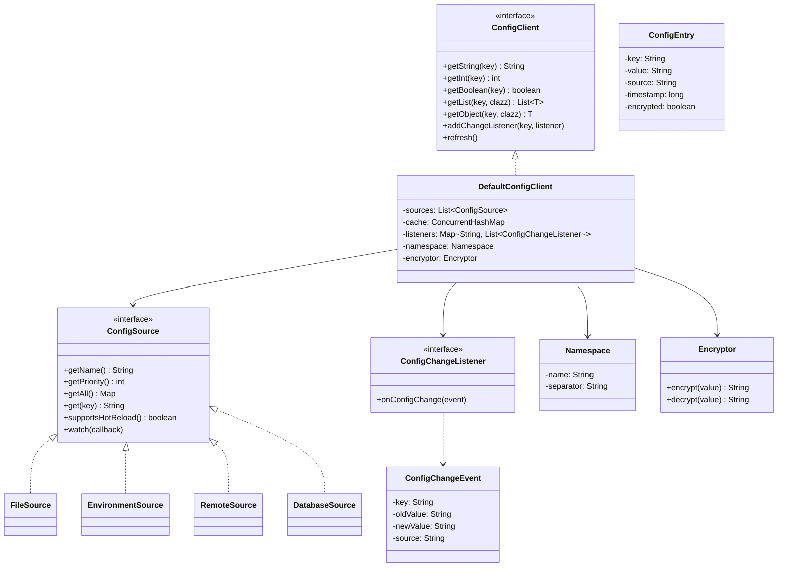

# Configuration Service Client - LLD

## 1. Problem Statement
Design a type-safe, layered configuration client that aggregates config from multiple sources (files, env vars, remote services, databases) with priority-based override, hot reload, namespace isolation, caching, encryption, and change notification.

## 2. UML Class Diagram


## 3. Design Patterns
| Pattern | Usage |
|---------|-------|
| **Strategy** | ConfigSource implementations (File, Env, Remote, DB) are interchangeable |
| **Observer** | ConfigChangeListener notified on key changes |
| **Proxy** | CachingConfigClient wraps real client with TTL cache |
| **Singleton** | ConfigClientFactory ensures one client per namespace |
| **Chain of Responsibility** | Priority-based source resolution |

## 4. SOLID Principles
- **S**: Each source handles only its retrieval logic
- **O**: New sources added without modifying client
- **L**: Any ConfigSource substitutable in the chain
- **I**: ConfigClient interface is focused; ConfigSource is separate
- **D**: Client depends on ConfigSource abstraction, not concrete sources

## 5. Complete Java Implementation

```java
// ========== Models ==========
public class ConfigEntry {
    private final String key;
    private final String value;
    private final String source;
    private final long timestamp;
    private final boolean encrypted;

    public ConfigEntry(String key, String value, String source, boolean encrypted) {
        this.key = key; this.value = value; this.source = source;
        this.timestamp = System.currentTimeMillis(); this.encrypted = encrypted;
    }
    // getters
    public String getKey() { return key; }
    public String getValue() { return value; }
    public String getSource() { return source; }
    public long getTimestamp() { return timestamp; }
    public boolean isEncrypted() { return encrypted; }
}

public class ConfigChangeEvent {
    private final String key, oldValue, newValue, source;
    public ConfigChangeEvent(String key, String oldValue, String newValue, String source) {
        this.key = key; this.oldValue = oldValue; this.newValue = newValue; this.source = source;
    }
    public String getKey() { return key; }
    public String getOldValue() { return oldValue; }
    public String getNewValue() { return newValue; }
}

public class Namespace {
    private final String name;
    private final String separator;
    public Namespace(String name) { this.name = name; this.separator = "."; }
    public String qualify(String key) { return name + separator + key; }
    public String getName() { return name; }
}

// ========== Interfaces ==========
public interface ConfigChangeListener {
    void onConfigChange(ConfigChangeEvent event);
}

public interface ConfigSource {
    String getName();
    int getPriority(); // higher = more override power
    Map<String, String> getAll();
    String get(String key);
    boolean supportsHotReload();
    void watch(Consumer<Map<String, String>> callback);
}

public interface ConfigClient {
    String getString(String key);
    String getString(String key, String defaultValue);
    int getInt(String key, int defaultValue);
    boolean getBoolean(String key, boolean defaultValue);
    <T> List<T> getList(String key, Class<T> clazz);
    <T> T getObject(String key, Class<T> clazz);
    void addChangeListener(String key, ConfigChangeListener listener);
    void refresh();
}

public interface Encryptor {
    String encrypt(String value);
    String decrypt(String value);
}

// ========== Config Sources (Strategy Pattern) ==========
public class FileSource implements ConfigSource {
    private final String filePath;
    private Properties props = new Properties();
    private WatchService watchService;

    public FileSource(String filePath) {
        this.filePath = filePath;
        load();
    }
    private void load() {
        try (InputStream is = new FileInputStream(filePath)) { props.load(is); }
        catch (IOException e) { throw new RuntimeException("Failed to load config file", e); }
    }
    public String getName() { return "FILE"; }
    public int getPriority() { return 20; }
    public Map<String, String> getAll() {
        Map<String, String> map = new HashMap<>();
        props.forEach((k, v) -> map.put(k.toString(), v.toString()));
        return map;
    }
    public String get(String key) { return props.getProperty(key); }
    public boolean supportsHotReload() { return true; }
    public void watch(Consumer<Map<String, String>> callback) {
        // File watcher thread
        Thread watcher = new Thread(() -> {
            try {
                watchService = FileSystems.getDefault().newWatchService();
                Path dir = Paths.get(filePath).getParent();
                dir.register(watchService, StandardWatchEventKinds.ENTRY_MODIFY);
                while (true) {
                    WatchKey key = watchService.take();
                    load();
                    callback.accept(getAll());
                    key.reset();
                }
            } catch (Exception e) { /* log */ }
        }, "config-file-watcher");
        watcher.setDaemon(true);
        watcher.start();
    }
}

public class EnvironmentSource implements ConfigSource {
    private final String prefix;
    public EnvironmentSource(String prefix) { this.prefix = prefix; }
    public String getName() { return "ENV"; }
    public int getPriority() { return 30; }
    public Map<String, String> getAll() {
        Map<String, String> result = new HashMap<>();
        System.getenv().forEach((k, v) -> {
            if (k.startsWith(prefix)) result.put(k.substring(prefix.length()).toLowerCase().replace("_", "."), v);
        });
        return result;
    }
    public String get(String key) {
        String envKey = prefix + key.toUpperCase().replace(".", "_");
        return System.getenv(envKey);
    }
    public boolean supportsHotReload() { return false; }
    public void watch(Consumer<Map<String, String>> callback) { /* no-op */ }
}

public class RemoteSource implements ConfigSource {
    private final String url;
    private final Duration pollInterval;
    private Map<String, String> cache = new ConcurrentHashMap<>();

    public RemoteSource(String url, Duration pollInterval) {
        this.url = url; this.pollInterval = pollInterval;
        fetchRemote();
    }
    private void fetchRemote() {
        // HTTP call to config server (e.g., Spring Cloud Config, Consul)
        // Simplified: HttpClient.newHttpClient().send(request, BodyHandlers.ofString())
        // Parse JSON response into cache map
    }
    public String getName() { return "REMOTE"; }
    public int getPriority() { return 40; } // highest priority
    public Map<String, String> getAll() { return Collections.unmodifiableMap(cache); }
    public String get(String key) { return cache.get(key); }
    public boolean supportsHotReload() { return true; }
    public void watch(Consumer<Map<String, String>> callback) {
        ScheduledExecutorService scheduler = Executors.newSingleThreadScheduledExecutor();
        scheduler.scheduleAtFixedRate(() -> {
            Map<String, String> old = new HashMap<>(cache);
            fetchRemote();
            if (!old.equals(cache)) callback.accept(cache);
        }, pollInterval.toMillis(), pollInterval.toMillis(), TimeUnit.MILLISECONDS);
    }
}

public class DatabaseSource implements ConfigSource {
    private final DataSource dataSource;
    private Map<String, String> cache = new ConcurrentHashMap<>();
    public DatabaseSource(DataSource ds) { this.dataSource = ds; load(); }
    private void load() {
        try (Connection c = dataSource.getConnection();
             PreparedStatement ps = c.prepareStatement("SELECT key, value FROM config");
             ResultSet rs = ps.executeQuery()) {
            while (rs.next()) cache.put(rs.getString("key"), rs.getString("value"));
        } catch (SQLException e) { throw new RuntimeException(e); }
    }
    public String getName() { return "DATABASE"; }
    public int getPriority() { return 10; } // lowest - defaults
    public Map<String, String> getAll() { return cache; }
    public String get(String key) { return cache.get(key); }
    public boolean supportsHotReload() { return true; }
    public void watch(Consumer<Map<String, String>> callback) {
        // Poll DB periodically
        Executors.newSingleThreadScheduledExecutor().scheduleAtFixedRate(() -> {
            load(); callback.accept(cache);
        }, 30, 30, TimeUnit.SECONDS);
    }
}

// ========== AES Encryptor ==========
public class AesEncryptor implements Encryptor {
    private static final String PREFIX = "ENC(", SUFFIX = ")";
    private final SecretKey secretKey;
    public AesEncryptor(String base64Key) {
        this.secretKey = new SecretKeySpec(Base64.getDecoder().decode(base64Key), "AES");
    }
    public String encrypt(String value) {
        try {
            Cipher cipher = Cipher.getInstance("AES");
            cipher.init(Cipher.ENCRYPT_MODE, secretKey);
            return PREFIX + Base64.getEncoder().encodeToString(cipher.doFinal(value.getBytes())) + SUFFIX;
        } catch (Exception e) { throw new RuntimeException(e); }
    }
    public String decrypt(String value) {
        if (!value.startsWith(PREFIX)) return value;
        try {
            String encoded = value.substring(4, value.length() - 1);
            Cipher cipher = Cipher.getInstance("AES");
            cipher.init(Cipher.DECRYPT_MODE, secretKey);
            return new String(cipher.doFinal(Base64.getDecoder().decode(encoded)));
        } catch (Exception e) { throw new RuntimeException(e); }
    }
    public boolean isEncrypted(String value) { return value != null && value.startsWith(PREFIX); }
}

// ========== Default Client (Core) ==========
public class DefaultConfigClient implements ConfigClient {
    private final List<ConfigSource> sources; // sorted by priority
    private final ConcurrentHashMap<String, ConfigEntry> cache = new ConcurrentHashMap<>();
    private final Map<String, List<ConfigChangeListener>> listeners = new ConcurrentHashMap<>();
    private final Namespace namespace;
    private final Encryptor encryptor;
    private final ObjectMapper mapper = new ObjectMapper();

    public DefaultConfigClient(List<ConfigSource> sources, Namespace namespace, Encryptor encryptor) {
        this.sources = sources.stream()
            .sorted(Comparator.comparingInt(ConfigSource::getPriority))
            .collect(Collectors.toList());
        this.namespace = namespace;
        this.encryptor = encryptor;
        loadAll();
        startWatchers();
    }

    private void loadAll() {
        // Lower priority loads first, higher priority overwrites
        for (ConfigSource source : sources) {
            source.getAll().forEach((k, v) ->
                cache.put(k, new ConfigEntry(k, v, source.getName(), false)));
        }
    }

    private void startWatchers() {
        for (ConfigSource source : sources) {
            if (source.supportsHotReload()) {
                source.watch(newValues -> {
                    newValues.forEach((k, v) -> {
                        ConfigEntry old = cache.get(k);
                        String oldVal = old != null ? old.getValue() : null;
                        if (!Objects.equals(oldVal, v)) {
                            cache.put(k, new ConfigEntry(k, v, source.getName(), false));
                            notifyListeners(k, oldVal, v, source.getName());
                        }
                    });
                });
            }
        }
    }

    private void notifyListeners(String key, String oldVal, String newVal, String source) {
        List<ConfigChangeListener> keyListeners = listeners.get(key);
        if (keyListeners != null) {
            ConfigChangeEvent event = new ConfigChangeEvent(key, oldVal, newVal, source);
            keyListeners.forEach(l -> l.onConfigChange(event));
        }
    }

    private String resolve(String key) {
        String qualifiedKey = namespace != null ? namespace.qualify(key) : key;
        ConfigEntry entry = cache.get(qualifiedKey);
        if (entry == null) entry = cache.get(key); // fallback to unqualified
        if (entry == null) return null;
        String val = entry.getValue();
        return encryptor != null ? encryptor.decrypt(val) : val;
    }

    public String getString(String key) { return resolve(key); }
    public String getString(String key, String defaultValue) {
        String v = resolve(key); return v != null ? v : defaultValue;
    }
    public int getInt(String key, int defaultValue) {
        String v = resolve(key); return v != null ? Integer.parseInt(v) : defaultValue;
    }
    public boolean getBoolean(String key, boolean defaultValue) {
        String v = resolve(key); return v != null ? Boolean.parseBoolean(v) : defaultValue;
    }
    public <T> List<T> getList(String key, Class<T> clazz) {
        String v = resolve(key); if (v == null) return Collections.emptyList();
        try { return mapper.readValue(v, mapper.getTypeFactory().constructCollectionType(List.class, clazz)); }
        catch (Exception e) { return Collections.emptyList(); }
    }
    public <T> T getObject(String key, Class<T> clazz) {
        String v = resolve(key); if (v == null) return null;
        try { return mapper.readValue(v, clazz); } catch (Exception e) { return null; }
    }
    public void addChangeListener(String key, ConfigChangeListener listener) {
        listeners.computeIfAbsent(key, k -> new CopyOnWriteArrayList<>()).add(listener);
    }
    public void refresh() { cache.clear(); loadAll(); }
}

// ========== Caching Proxy ==========
public class CachingConfigProxy implements ConfigClient {
    private final ConfigClient delegate;
    private final Map<String, CacheEntry> ttlCache = new ConcurrentHashMap<>();
    private final Duration ttl;

    record CacheEntry(String value, long expiry) {
        boolean isExpired() { return System.currentTimeMillis() > expiry; }
    }

    public CachingConfigProxy(ConfigClient delegate, Duration ttl) {
        this.delegate = delegate; this.ttl = ttl;
    }
    public String getString(String key) {
        CacheEntry entry = ttlCache.get(key);
        if (entry != null && !entry.isExpired()) return entry.value();
        String val = delegate.getString(key);
        ttlCache.put(key, new CacheEntry(val, System.currentTimeMillis() + ttl.toMillis()));
        return val;
    }
    // delegate remaining methods similarly...
    public String getString(String key, String dv) { return Optional.ofNullable(getString(key)).orElse(dv); }
    public int getInt(String key, int dv) { return delegate.getInt(key, dv); }
    public boolean getBoolean(String key, boolean dv) { return delegate.getBoolean(key, dv); }
    public <T> List<T> getList(String key, Class<T> c) { return delegate.getList(key, c); }
    public <T> T getObject(String key, Class<T> c) { return delegate.getObject(key, c); }
    public void addChangeListener(String key, ConfigChangeListener l) { delegate.addChangeListener(key, l); }
    public void refresh() { ttlCache.clear(); delegate.refresh(); }
}

// ========== Singleton Factory ==========
public class ConfigClientFactory {
    private static final Map<String, ConfigClient> instances = new ConcurrentHashMap<>();

    public static ConfigClient getClient(String namespace) {
        return instances.computeIfAbsent(namespace, ns -> {
            List<ConfigSource> sources = List.of(
                new DatabaseSource(getDataSource()),
                new FileSource("config/" + ns + ".properties"),
                new EnvironmentSource(ns.toUpperCase() + "_"),
                new RemoteSource("http://config-server/api/" + ns, Duration.ofSeconds(30))
            );
            Encryptor enc = new AesEncryptor(System.getenv("CONFIG_ENCRYPTION_KEY"));
            ConfigClient client = new DefaultConfigClient(sources, new Namespace(ns), enc);
            return new CachingConfigProxy(client, Duration.ofMinutes(5));
        });
    }
}

// ========== Validation ==========
public class ConfigValidator {
    private final List<ValidationRule> rules = new ArrayList<>();

    public void addRequired(String key) { rules.add(cfg -> cfg.getString(key) != null ? null : key + " is required"); }
    public void addRange(String key, int min, int max) {
        rules.add(cfg -> {
            int v = cfg.getInt(key, Integer.MIN_VALUE);
            return (v >= min && v <= max) ? null : key + " must be in [" + min + "," + max + "]";
        });
    }
    public List<String> validate(ConfigClient client) {
        return rules.stream().map(r -> r.check(client)).filter(Objects::nonNull).toList();
    }
    interface ValidationRule { String check(ConfigClient client); }
}

// ========== Usage ==========
public class Application {
    public static void main(String[] args) {
        ConfigClient config = ConfigClientFactory.getClient("payment-service");

        // Type-safe access with defaults
        String dbUrl = config.getString("db.url", "jdbc:localhost:5432/default");
        int poolSize = config.getInt("db.pool.size", 10);
        boolean sslEnabled = config.getBoolean("ssl.enabled", true);

        // Listen for changes
        config.addChangeListener("db.url", event ->
            System.out.println("DB URL changed: " + event.getOldValue() + " -> " + event.getNewValue()));

        // Validate
        ConfigValidator validator = new ConfigValidator();
        validator.addRequired("db.url");
        validator.addRange("db.pool.size", 1, 100);
        List<String> errors = validator.validate(config);
        if (!errors.isEmpty()) throw new IllegalStateException("Config errors: " + errors);
    }
}
```

## 6. Key Interview Points

| Topic | Detail |
|-------|--------|
| **Priority Chain** | DB(10) < File(20) < Env(30) < Remote(40); higher overrides lower |
| **Hot Reload** | File watcher + remote polling; observer notifies listeners per-key |
| **Thread Safety** | ConcurrentHashMap for cache, CopyOnWriteArrayList for listeners |
| **Encryption** | AES with `ENC(...)` prefix convention; decrypted at read time |
| **Namespace** | Isolates configs per service; qualified key lookup with fallback |
| **Caching Proxy** | TTL-based proxy avoids repeated source lookups |
| **Singleton** | One client per namespace via factory |
| **Extensibility** | Add new source by implementing ConfigSource interface |
| **Validation** | Rule-based validation at startup prevents misconfig |
| **Type Safety** | Generic getObject/getList using Jackson deserialization |
