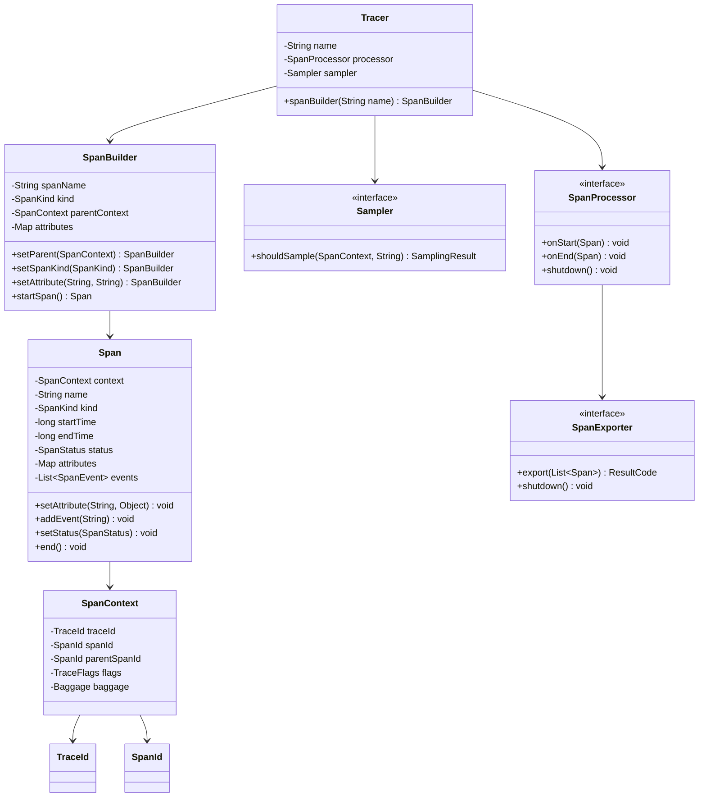

# Distributed Tracing SDK (OpenTelemetry-style) - LLD

## Problem Statement
Design a distributed tracing SDK that allows instrumenting applications to collect trace data (spans) across service boundaries, supporting context propagation, sampling, processing, and exporting to various backends.

## UML Class Diagram


## Design Patterns
| Pattern | Usage |
|---------|-------|
| Builder | SpanBuilder for constructing Span with optional params |
| Strategy | Sampler implementations (AlwaysOn, Probabilistic, RateLimiting) |
| Factory | TracerProvider creates Tracer instances |
| Observer | SpanProcessor notified on span start/end |
| Decorator | Wrapping exporters with retry/batching logic |

## Implementation

```java
// === Value Objects ===
public record TraceId(String value) {
    public static TraceId generate() { return new TraceId(UUID.randomUUID().toString().replace("-", "")); }
}
public record SpanId(String value) {
    public static SpanId generate() { return new SpanId(UUID.randomUUID().toString().substring(0, 16)); }
}

public enum SpanKind { CLIENT, SERVER, PRODUCER, CONSUMER, INTERNAL }
public enum SpanStatus { UNSET, OK, ERROR }
public enum ResultCode { SUCCESS, FAILURE }

public record SpanEvent(String name, long timestamp, Map<String, String> attributes) {}

public class Baggage {
    private final Map<String, String> entries = new ConcurrentHashMap<>();
    public void set(String key, String value) { entries.put(key, value); }
    public String get(String key) { return entries.get(key); }
    public Map<String, String> getAll() { return Collections.unmodifiableMap(entries); }
}

// === SpanContext ===
public class SpanContext {
    private final TraceId traceId;
    private final SpanId spanId;
    private final SpanId parentSpanId;
    private final boolean sampled;
    private final Baggage baggage;

    public SpanContext(TraceId traceId, SpanId spanId, SpanId parentSpanId, boolean sampled, Baggage baggage) {
        this.traceId = traceId; this.spanId = spanId;
        this.parentSpanId = parentSpanId; this.sampled = sampled; this.baggage = baggage;
    }
    // W3C TraceContext format: version-traceId-spanId-flags
    public String toW3CTraceParent() {
        return String.format("00-%s-%s-%s", traceId.value(), spanId.value(), sampled ? "01" : "00");
    }
    public static SpanContext fromW3CTraceParent(String header) {
        String[] parts = header.split("-");
        return new SpanContext(new TraceId(parts[1]), new SpanId(parts[2]), null, "01".equals(parts[3]), new Baggage());
    }
    // Getters
    public TraceId traceId() { return traceId; }
    public SpanId spanId() { return spanId; }
    public SpanId parentSpanId() { return parentSpanId; }
    public boolean isSampled() { return sampled; }
    public Baggage baggage() { return baggage; }
}

// === Span ===
public class Span {
    private final SpanContext context;
    private final String name;
    private final SpanKind kind;
    private final long startTime;
    private volatile long endTime;
    private volatile SpanStatus status = SpanStatus.UNSET;
    private final Map<String, Object> attributes = new ConcurrentHashMap<>();
    private final List<SpanEvent> events = new CopyOnWriteArrayList<>();
    private final SpanProcessor processor;

    Span(SpanContext context, String name, SpanKind kind, Map<String, Object> attrs, SpanProcessor processor) {
        this.context = context; this.name = name; this.kind = kind;
        this.startTime = System.nanoTime(); this.processor = processor;
        this.attributes.putAll(attrs);
        processor.onStart(this);
    }
    public void setAttribute(String key, Object value) { attributes.put(key, value); }
    public void addEvent(String eventName) { events.add(new SpanEvent(eventName, System.nanoTime(), Map.of())); }
    public void addEvent(String eventName, Map<String, String> attrs) { events.add(new SpanEvent(eventName, System.nanoTime(), attrs)); }
    public void setStatus(SpanStatus s) { this.status = s; }
    public void end() { this.endTime = System.nanoTime(); processor.onEnd(this); }
    // Getters
    public SpanContext context() { return context; }
    public String name() { return name; }
    public SpanKind kind() { return kind; }
    public long startTime() { return startTime; }
    public long endTime() { return endTime; }
    public SpanStatus status() { return status; }
    public Map<String, Object> attributes() { return Collections.unmodifiableMap(attributes); }
    public List<SpanEvent> events() { return Collections.unmodifiableList(events); }
}

// === SpanBuilder (Builder Pattern) ===
public class SpanBuilder {
    private final String spanName;
    private final Sampler sampler;
    private final SpanProcessor processor;
    private SpanKind kind = SpanKind.INTERNAL;
    private SpanContext parentContext;
    private final Map<String, Object> attributes = new HashMap<>();

    SpanBuilder(String name, Sampler sampler, SpanProcessor processor) {
        this.spanName = name; this.sampler = sampler; this.processor = processor;
    }
    public SpanBuilder setParent(SpanContext ctx) { this.parentContext = ctx; return this; }
    public SpanBuilder setSpanKind(SpanKind kind) { this.kind = kind; return this; }
    public SpanBuilder setAttribute(String key, Object value) { attributes.put(key, value); return this; }

    public Span startSpan() {
        TraceId traceId = (parentContext != null) ? parentContext.traceId() : TraceId.generate();
        SpanId spanId = SpanId.generate();
        SpanId parentSpanId = (parentContext != null) ? parentContext.spanId() : null;
        boolean sampled = sampler.shouldSample(parentContext, spanName).isSampled();
        SpanContext ctx = new SpanContext(traceId, spanId, parentSpanId, sampled, new Baggage());
        return new Span(ctx, spanName, kind, attributes, processor);
    }
}

// === Sampler (Strategy Pattern) ===
public interface Sampler {
    SamplingResult shouldSample(SpanContext parent, String spanName);
}
public record SamplingResult(boolean isSampled) {}

public class AlwaysOnSampler implements Sampler {
    public SamplingResult shouldSample(SpanContext p, String n) { return new SamplingResult(true); }
}
public class AlwaysOffSampler implements Sampler {
    public SamplingResult shouldSample(SpanContext p, String n) { return new SamplingResult(false); }
}
public class ProbabilisticSampler implements Sampler {
    private final double probability;
    public ProbabilisticSampler(double probability) { this.probability = probability; }
    public SamplingResult shouldSample(SpanContext p, String n) {
        return new SamplingResult(ThreadLocalRandom.current().nextDouble() < probability);
    }
}
public class RateLimitingSampler implements Sampler {
    private final AtomicLong tokens;
    private final long maxPerSecond;
    private volatile long lastRefill = System.nanoTime();
    public RateLimitingSampler(long maxPerSecond) { this.maxPerSecond = maxPerSecond; this.tokens = new AtomicLong(maxPerSecond); }
    public SamplingResult shouldSample(SpanContext p, String n) {
        refill();
        return new SamplingResult(tokens.decrementAndGet() >= 0);
    }
    private void refill() {
        long now = System.nanoTime();
        if (now - lastRefill > 1_000_000_000L) { tokens.set(maxPerSecond); lastRefill = now; }
    }
}

// === SpanExporter (Strategy Pattern) ===
public interface SpanExporter {
    ResultCode export(List<Span> spans);
    void shutdown();
}
public class ConsoleExporter implements SpanExporter {
    public ResultCode export(List<Span> spans) {
        spans.forEach(s -> System.out.printf("[%s] %s traceId=%s spanId=%s parent=%s duration=%dns%n",
            s.kind(), s.name(), s.context().traceId().value(), s.context().spanId().value(),
            s.context().parentSpanId() != null ? s.context().parentSpanId().value() : "root",
            s.endTime() - s.startTime()));
        return ResultCode.SUCCESS;
    }
    public void shutdown() {}
}
public class JaegerExporter implements SpanExporter {
    private final String endpoint;
    public JaegerExporter(String endpoint) { this.endpoint = endpoint; }
    public ResultCode export(List<Span> spans) { /* HTTP POST to Jaeger */ return ResultCode.SUCCESS; }
    public void shutdown() {}
}
public class ZipkinExporter implements SpanExporter {
    private final String endpoint;
    public ZipkinExporter(String endpoint) { this.endpoint = endpoint; }
    public ResultCode export(List<Span> spans) { /* HTTP POST to Zipkin */ return ResultCode.SUCCESS; }
    public void shutdown() {}
}

// === SpanProcessor (Observer Pattern) ===
public interface SpanProcessor {
    void onStart(Span span);
    void onEnd(Span span);
    void shutdown();
}

public class SimpleSpanProcessor implements SpanProcessor {
    private final SpanExporter exporter;
    public SimpleSpanProcessor(SpanExporter exporter) { this.exporter = exporter; }
    public void onStart(Span span) {}
    public void onEnd(Span span) {
        if (span.context().isSampled()) exporter.export(List.of(span));
    }
    public void shutdown() { exporter.shutdown(); }
}

public class BatchSpanProcessor implements SpanProcessor {
    private final SpanExporter exporter;
    private final BlockingQueue<Span> queue;
    private final int batchSize;
    private final ScheduledExecutorService scheduler;

    public BatchSpanProcessor(SpanExporter exporter, int batchSize, long flushIntervalMs) {
        this.exporter = exporter; this.batchSize = batchSize;
        this.queue = new LinkedBlockingQueue<>(2048);
        this.scheduler = Executors.newSingleThreadScheduledExecutor();
        scheduler.scheduleAtFixedRate(this::flush, flushIntervalMs, flushIntervalMs, TimeUnit.MILLISECONDS);
    }
    public void onStart(Span span) {}
    public void onEnd(Span span) {
        if (span.context().isSampled()) {
            queue.offer(span);
            if (queue.size() >= batchSize) flush();
        }
    }
    private void flush() {
        List<Span> batch = new ArrayList<>();
        queue.drainTo(batch, batchSize);
        if (!batch.isEmpty()) exporter.export(batch);
    }
    public void shutdown() { flush(); scheduler.shutdown(); exporter.shutdown(); }
}

// === Context Propagation Across Threads ===
public class Context {
    private static final ThreadLocal<SpanContext> CURRENT = new ThreadLocal<>();
    public static void setCurrent(SpanContext ctx) { CURRENT.set(ctx); }
    public static SpanContext current() { return CURRENT.get(); }
    public static Runnable wrap(Runnable r) {
        SpanContext captured = current();
        return () -> { SpanContext prev = current(); setCurrent(captured); try { r.run(); } finally { setCurrent(prev); } };
    }
    public static <T> Callable<T> wrap(Callable<T> c) {
        SpanContext captured = current();
        return () -> { SpanContext prev = current(); setCurrent(captured); try { return c.call(); } finally { setCurrent(prev); } };
    }
}

// === TracerProvider (Factory Pattern) ===
public class TracerProvider {
    private final Sampler sampler;
    private final SpanProcessor processor;
    public TracerProvider(Sampler sampler, SpanProcessor processor) { this.sampler = sampler; this.processor = processor; }
    public Tracer get(String instrumentationName) { return new Tracer(instrumentationName, sampler, processor); }
}

// === Tracer ===
public class Tracer {
    private final String name;
    private final Sampler sampler;
    private final SpanProcessor processor;
    Tracer(String name, Sampler sampler, SpanProcessor processor) { this.name = name; this.sampler = sampler; this.processor = processor; }
    public SpanBuilder spanBuilder(String spanName) { return new SpanBuilder(spanName, sampler, processor); }
}

// === Auto-Instrumentation (Decorator Pattern) ===
public class TracingInterceptor {
    private final Tracer tracer;
    public TracingInterceptor(Tracer tracer) { this.tracer = tracer; }

    public <T> T traceMethod(String name, SpanKind kind, Callable<T> method) throws Exception {
        Span span = tracer.spanBuilder(name).setSpanKind(kind).setParent(Context.current()).startSpan();
        Context.setCurrent(span.context());
        try {
            T result = method.call();
            span.setStatus(SpanStatus.OK);
            return result;
        } catch (Exception e) {
            span.setStatus(SpanStatus.ERROR);
            span.setAttribute("error.message", e.getMessage());
            throw e;
        } finally {
            span.end();
        }
    }
}

// === Usage Example ===
public class Demo {
    public static void main(String[] args) {
        SpanExporter exporter = new ConsoleExporter();
        SpanProcessor processor = new BatchSpanProcessor(exporter, 64, 5000);
        TracerProvider provider = new TracerProvider(new ProbabilisticSampler(0.5), processor);
        Tracer tracer = provider.get("order-service");

        // Manual instrumentation
        Span parentSpan = tracer.spanBuilder("handleRequest")
            .setSpanKind(SpanKind.SERVER)
            .setAttribute("http.method", "POST")
            .startSpan();
        Context.setCurrent(parentSpan.context());

        Span childSpan = tracer.spanBuilder("queryDB")
            .setSpanKind(SpanKind.CLIENT)
            .setParent(Context.current())
            .startSpan();
        childSpan.addEvent("query-started");
        childSpan.setAttribute("db.statement", "SELECT * FROM orders");
        childSpan.setStatus(SpanStatus.OK);
        childSpan.end();

        parentSpan.setStatus(SpanStatus.OK);
        parentSpan.end();

        // Async context propagation
        ExecutorService exec = Executors.newFixedThreadPool(4);
        exec.submit(Context.wrap(() -> {
            Span asyncSpan = tracer.spanBuilder("asyncTask").setParent(Context.current()).startSpan();
            asyncSpan.end();
        }));

        processor.shutdown();
    }
}
```

## Key Interview Points

| Topic | Key Insight |
|-------|-------------|
| **TraceContext** | W3C standard `traceparent: 00-traceId-spanId-flags` for cross-service propagation |
| **Sampling** | Decides early (head-based) whether to record trace; tail-based sampling defers decision |
| **Batch vs Simple** | Batch reduces network overhead; Simple is for debugging/low-throughput |
| **Thread Safety** | ThreadLocal for context, ConcurrentHashMap for attributes, CopyOnWriteArrayList for events |
| **Context Propagation** | Wrap Runnable/Callable to carry SpanContext across thread boundaries |
| **SpanKind** | CLIENT/SERVER for RPC, PRODUCER/CONSUMER for messaging, INTERNAL for in-process |
| **Auto vs Manual** | Auto uses bytecode instrumentation (Java agent); Manual uses SDK directly |
| **Baggage** | Key-value pairs propagated across all spans in a trace (use sparingly) |
| **Clock** | Use monotonic clock (System.nanoTime) for duration, wall clock for timestamps |
| **Backpressure** | Bounded queue in BatchProcessor with drop policy to prevent OOM |
