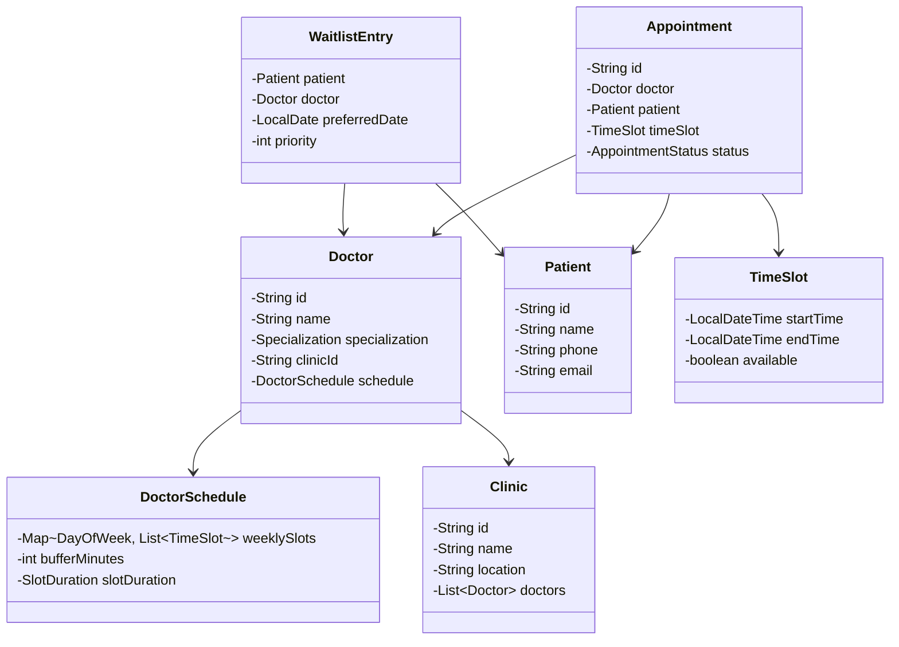

# Clinic Appointment Scheduler - Low Level Design

## 1. Problem Statement
Design a clinic appointment scheduling system that manages doctor availability, patient bookings, conflict detection, waitlist management, and notifications. Support multiple clinics, specializations, recurring appointments, and overbooking prevention.

## 2. UML Class Diagram


## 3. Design Patterns
- **Strategy**: Slot generation strategies (fixed duration, variable, break-aware)
- **Observer**: Notifications on booking, cancellation, reminders
- **State**: Appointment lifecycle (Booked → Confirmed → InProgress → Completed)
- **Factory**: Create appointments (one-time, recurring)

## 4. SOLID Principles
- **SRP**: Separate classes for scheduling, notification, search
- **OCP**: New notification channels without modifying existing code
- **LSP**: All slot strategies interchangeable
- **ISP**: Separate interfaces for booking, searching, notifications
- **DIP**: Services depend on abstractions (NotificationService interface)

## 5. Complete Java Implementation

```java
// ============ ENUMS ============
enum AppointmentStatus {
    BOOKED, CONFIRMED, IN_PROGRESS, COMPLETED, CANCELLED, NO_SHOW
}

enum SlotDuration {
    FIFTEEN(15), THIRTY(30), FORTY_FIVE(45), SIXTY(60);
    private final int minutes;
    SlotDuration(int minutes) { this.minutes = minutes; }
    public int getMinutes() { return minutes; }
}

enum Specialization {
    GENERAL, CARDIOLOGY, DERMATOLOGY, ORTHOPEDICS, PEDIATRICS, ENT, NEUROLOGY
}

// ============ MODELS ============
class TimeSlot {
    private LocalDateTime startTime;
    private LocalDateTime endTime;
    private boolean available;

    public TimeSlot(LocalDateTime startTime, LocalDateTime endTime) {
        this.startTime = startTime;
        this.endTime = endTime;
        this.available = true;
    }

    public boolean overlapsWith(TimeSlot other) {
        return startTime.isBefore(other.endTime) && other.startTime.isBefore(endTime);
    }
    // getters, setters
}

class Patient {
    private String id;
    private String name;
    private String phone;
    private String email;
    public Patient(String id, String name, String phone, String email) {
        this.id = id; this.name = name; this.phone = phone; this.email = email;
    }
    // getters
}

class DoctorSchedule {
    private Map<DayOfWeek, List<TimeSlot>> weeklyAvailability;
    private int bufferMinutes;
    private SlotDuration slotDuration;

    public DoctorSchedule(SlotDuration slotDuration, int bufferMinutes) {
        this.slotDuration = slotDuration;
        this.bufferMinutes = bufferMinutes;
        this.weeklyAvailability = new EnumMap<>(DayOfWeek.class);
    }

    public void setAvailability(DayOfWeek day, LocalTime start, LocalTime end) {
        // Stores working hours for a given day
        weeklyAvailability.put(day, generateSlots(start, end));
    }

    private List<TimeSlot> generateSlots(LocalTime start, LocalTime end) {
        List<TimeSlot> slots = new ArrayList<>();
        LocalTime current = start;
        while (current.plusMinutes(slotDuration.getMinutes()).compareTo(end) <= 0) {
            LocalTime slotEnd = current.plusMinutes(slotDuration.getMinutes());
            slots.add(new TimeSlot(
                LocalDateTime.of(LocalDate.now(), current),
                LocalDateTime.of(LocalDate.now(), slotEnd)));
            current = slotEnd.plusMinutes(bufferMinutes);
        }
        return slots;
    }
    // getters
}

class Doctor {
    private String id;
    private String name;
    private Specialization specialization;
    private String clinicId;
    private DoctorSchedule schedule;

    public Doctor(String id, String name, Specialization spec, String clinicId, DoctorSchedule schedule) {
        this.id = id; this.name = name; this.specialization = spec;
        this.clinicId = clinicId; this.schedule = schedule;
    }
    // getters
}

class Clinic {
    private String id;
    private String name;
    private String location;
    private List<Doctor> doctors;

    public Clinic(String id, String name, String location) {
        this.id = id; this.name = name; this.location = location;
        this.doctors = new ArrayList<>();
    }
    public void addDoctor(Doctor doctor) { doctors.add(doctor); }
    // getters
}

class Appointment {
    private String id;
    private Doctor doctor;
    private Patient patient;
    private TimeSlot timeSlot;
    private AppointmentStatus status;
    private boolean recurring;
    private int recurrenceWeeks;

    public Appointment(String id, Doctor doctor, Patient patient, TimeSlot slot) {
        this.id = id; this.doctor = doctor; this.patient = patient;
        this.timeSlot = slot; this.status = AppointmentStatus.BOOKED;
    }
    public void setStatus(AppointmentStatus status) { this.status = status; }
    // getters
}

class WaitlistEntry implements Comparable<WaitlistEntry> {
    private Patient patient;
    private Doctor doctor;
    private LocalDate preferredDate;
    private int priority;
    private LocalDateTime addedAt;

    public WaitlistEntry(Patient patient, Doctor doctor, LocalDate date, int priority) {
        this.patient = patient; this.doctor = doctor;
        this.preferredDate = date; this.priority = priority;
        this.addedAt = LocalDateTime.now();
    }

    @Override
    public int compareTo(WaitlistEntry other) {
        int cmp = Integer.compare(other.priority, this.priority);
        return cmp != 0 ? cmp : this.addedAt.compareTo(other.addedAt);
    }
    // getters
}

// ============ OBSERVER PATTERN ============
interface AppointmentObserver {
    void onBooked(Appointment appointment);
    void onCancelled(Appointment appointment);
    void onReminder(Appointment appointment);
}

class SMSNotificationService implements AppointmentObserver {
    public void onBooked(Appointment apt) {
        System.out.println("SMS: Appointment booked for " + apt.getPatient().getName()
            + " with Dr. " + apt.getDoctor().getName() + " at " + apt.getTimeSlot().getStartTime());
    }
    public void onCancelled(Appointment apt) {
        System.out.println("SMS: Appointment cancelled for " + apt.getPatient().getName());
    }
    public void onReminder(Appointment apt) {
        System.out.println("SMS Reminder: You have an appointment tomorrow.");
    }
}

class EmailNotificationService implements AppointmentObserver {
    public void onBooked(Appointment apt) {
        System.out.println("Email: Booking confirmation sent to " + apt.getPatient().getEmail());
    }
    public void onCancelled(Appointment apt) {
        System.out.println("Email: Cancellation notice sent to " + apt.getPatient().getEmail());
    }
    public void onReminder(Appointment apt) {
        System.out.println("Email: Appointment reminder sent.");
    }
}

// ============ STATE PATTERN ============
interface AppointmentState {
    void next(Appointment appointment);
    void cancel(Appointment appointment);
}

class BookedState implements AppointmentState {
    public void next(Appointment apt) { apt.setStatus(AppointmentStatus.CONFIRMED); }
    public void cancel(Appointment apt) { apt.setStatus(AppointmentStatus.CANCELLED); }
}

class ConfirmedState implements AppointmentState {
    public void next(Appointment apt) { apt.setStatus(AppointmentStatus.IN_PROGRESS); }
    public void cancel(Appointment apt) { apt.setStatus(AppointmentStatus.CANCELLED); }
}

class InProgressState implements AppointmentState {
    public void next(Appointment apt) { apt.setStatus(AppointmentStatus.COMPLETED); }
    public void cancel(Appointment apt) { throw new IllegalStateException("Cannot cancel in-progress appointment"); }
}

// ============ STRATEGY PATTERN - Slot Generation ============
interface SlotGenerationStrategy {
    List<TimeSlot> generateSlots(LocalDate date, LocalTime start, LocalTime end,
                                  SlotDuration duration, int bufferMinutes);
}

class FixedDurationStrategy implements SlotGenerationStrategy {
    public List<TimeSlot> generateSlots(LocalDate date, LocalTime start, LocalTime end,
                                         SlotDuration duration, int bufferMinutes) {
        List<TimeSlot> slots = new ArrayList<>();
        LocalTime current = start;
        while (current.plusMinutes(duration.getMinutes()).compareTo(end) <= 0) {
            slots.add(new TimeSlot(
                LocalDateTime.of(date, current),
                LocalDateTime.of(date, current.plusMinutes(duration.getMinutes()))));
            current = current.plusMinutes(duration.getMinutes() + bufferMinutes);
        }
        return slots;
    }
}

class BreakAwareStrategy implements SlotGenerationStrategy {
    private LocalTime breakStart;
    private LocalTime breakEnd;

    public BreakAwareStrategy(LocalTime breakStart, LocalTime breakEnd) {
        this.breakStart = breakStart; this.breakEnd = breakEnd;
    }

    public List<TimeSlot> generateSlots(LocalDate date, LocalTime start, LocalTime end,
                                         SlotDuration duration, int bufferMinutes) {
        List<TimeSlot> slots = new ArrayList<>();
        LocalTime current = start;
        while (current.plusMinutes(duration.getMinutes()).compareTo(end) <= 0) {
            if (current.compareTo(breakStart) >= 0 && current.compareTo(breakEnd) < 0) {
                current = breakEnd;
                continue;
            }
            slots.add(new TimeSlot(
                LocalDateTime.of(date, current),
                LocalDateTime.of(date, current.plusMinutes(duration.getMinutes()))));
            current = current.plusMinutes(duration.getMinutes() + bufferMinutes);
        }
        return slots;
    }
}

// ============ FACTORY PATTERN ============
class AppointmentFactory {
    private static final AtomicInteger counter = new AtomicInteger(0);

    public static Appointment createSingle(Doctor doctor, Patient patient, TimeSlot slot) {
        return new Appointment("APT-" + counter.incrementAndGet(), doctor, patient, slot);
    }

    public static List<Appointment> createRecurring(Doctor doctor, Patient patient,
                                                     TimeSlot baseSlot, int weeks) {
        List<Appointment> appointments = new ArrayList<>();
        for (int i = 0; i < weeks; i++) {
            TimeSlot slot = new TimeSlot(
                baseSlot.getStartTime().plusWeeks(i),
                baseSlot.getEndTime().plusWeeks(i));
            Appointment apt = createSingle(doctor, patient, slot);
            apt.setRecurring(true);
            apt.setRecurrenceWeeks(weeks);
            appointments.add(apt);
        }
        return appointments;
    }
}

// ============ CORE SERVICE ============
class AppointmentScheduler {
    private Map<String, List<Appointment>> doctorAppointments; // doctorId -> appointments
    private PriorityQueue<WaitlistEntry> waitlist;
    private List<AppointmentObserver> observers;
    private SlotGenerationStrategy slotStrategy;

    public AppointmentScheduler(SlotGenerationStrategy strategy) {
        this.doctorAppointments = new ConcurrentHashMap<>();
        this.waitlist = new PriorityQueue<>();
        this.observers = new ArrayList<>();
        this.slotStrategy = strategy;
    }

    public void addObserver(AppointmentObserver observer) { observers.add(observer); }

    public List<TimeSlot> getAvailableSlots(Doctor doctor, LocalDate date) {
        DoctorSchedule schedule = doctor.getSchedule();
        List<TimeSlot> allSlots = slotStrategy.generateSlots(date,
            LocalTime.of(9, 0), LocalTime.of(17, 0),
            schedule.getSlotDuration(), schedule.getBufferMinutes());

        List<Appointment> booked = doctorAppointments.getOrDefault(doctor.getId(), new ArrayList<>());
        return allSlots.stream()
            .filter(slot -> booked.stream()
                .noneMatch(apt -> apt.getStatus() != AppointmentStatus.CANCELLED
                    && apt.getTimeSlot().overlapsWith(slot)))
            .collect(Collectors.toList());
    }

    public synchronized Appointment bookAppointment(Doctor doctor, Patient patient, TimeSlot slot) {
        if (hasConflict(doctor, slot)) {
            throw new IllegalStateException("Slot not available - conflict detected");
        }
        Appointment appointment = AppointmentFactory.createSingle(doctor, patient, slot);
        doctorAppointments.computeIfAbsent(doctor.getId(), k -> new ArrayList<>()).add(appointment);
        slot.setAvailable(false);
        notifyBooked(appointment);
        return appointment;
    }

    private boolean hasConflict(Doctor doctor, TimeSlot slot) {
        return doctorAppointments.getOrDefault(doctor.getId(), new ArrayList<>()).stream()
            .anyMatch(apt -> apt.getStatus() != AppointmentStatus.CANCELLED
                && apt.getTimeSlot().overlapsWith(slot));
    }

    public void cancelAppointment(Appointment appointment) {
        appointment.setStatus(AppointmentStatus.CANCELLED);
        appointment.getTimeSlot().setAvailable(true);
        notifyCancelled(appointment);
        processWaitlist(appointment.getDoctor(), appointment.getTimeSlot());
    }

    public Appointment reschedule(Appointment existing, TimeSlot newSlot) {
        cancelAppointment(existing);
        return bookAppointment(existing.getDoctor(), existing.getPatient(), newSlot);
    }

    public void addToWaitlist(Patient patient, Doctor doctor, LocalDate date, int priority) {
        waitlist.add(new WaitlistEntry(patient, doctor, date, priority));
    }

    private void processWaitlist(Doctor doctor, TimeSlot freedSlot) {
        Iterator<WaitlistEntry> it = waitlist.iterator();
        while (it.hasNext()) {
            WaitlistEntry entry = it.next();
            if (entry.getDoctor().getId().equals(doctor.getId())) {
                try {
                    bookAppointment(doctor, entry.getPatient(), freedSlot);
                    it.remove();
                    System.out.println("Waitlist: Booked " + entry.getPatient().getName());
                    return;
                } catch (IllegalStateException e) { /* slot taken */ }
            }
        }
    }

    private void notifyBooked(Appointment apt) {
        observers.forEach(o -> o.onBooked(apt));
    }
    private void notifyCancelled(Appointment apt) {
        observers.forEach(o -> o.onCancelled(apt));
    }
}

// ============ SEARCH SERVICE ============
class DoctorSearchService {
    private List<Clinic> clinics;

    public DoctorSearchService(List<Clinic> clinics) { this.clinics = clinics; }

    public List<Doctor> findBySpecialization(Specialization spec) {
        return clinics.stream()
            .flatMap(c -> c.getDoctors().stream())
            .filter(d -> d.getSpecialization() == spec)
            .collect(Collectors.toList());
    }

    public List<Doctor> findByLocation(String location) {
        return clinics.stream()
            .filter(c -> c.getLocation().equalsIgnoreCase(location))
            .flatMap(c -> c.getDoctors().stream())
            .collect(Collectors.toList());
    }

    public List<Doctor> findAvailable(Specialization spec, String location, LocalDate date,
                                       AppointmentScheduler scheduler) {
        return clinics.stream()
            .filter(c -> c.getLocation().equalsIgnoreCase(location))
            .flatMap(c -> c.getDoctors().stream())
            .filter(d -> d.getSpecialization() == spec)
            .filter(d -> !scheduler.getAvailableSlots(d, date).isEmpty())
            .collect(Collectors.toList());
    }
}

// ============ DEMO ============
class ClinicAppointmentDemo {
    public static void main(String[] args) {
        SlotGenerationStrategy strategy = new BreakAwareStrategy(LocalTime.of(13, 0), LocalTime.of(14, 0));
        AppointmentScheduler scheduler = new AppointmentScheduler(strategy);
        scheduler.addObserver(new SMSNotificationService());
        scheduler.addObserver(new EmailNotificationService());

        DoctorSchedule schedule = new DoctorSchedule(SlotDuration.THIRTY, 5);
        Doctor doctor = new Doctor("D1", "Dr. Smith", Specialization.CARDIOLOGY, "C1", schedule);
        Patient patient = new Patient("P1", "John Doe", "9876543210", "john@email.com");

        Clinic clinic = new Clinic("C1", "HeartCare Clinic", "Downtown");
        clinic.addDoctor(doctor);

        List<TimeSlot> slots = scheduler.getAvailableSlots(doctor, LocalDate.now().plusDays(1));
        if (!slots.isEmpty()) {
            Appointment apt = scheduler.bookAppointment(doctor, patient, slots.get(0));
            System.out.println("Booked: " + apt.getId() + " Status: " + apt.getStatus());

            // Reschedule
            if (slots.size() > 1) {
                Appointment rescheduled = scheduler.reschedule(apt, slots.get(1));
                System.out.println("Rescheduled to: " + rescheduled.getTimeSlot().getStartTime());
            }
        }
    }
}
```

## 6. Key Interview Points

| Topic | Detail |
|-------|--------|
| **Conflict Detection** | `overlapsWith()` checks time overlap; `synchronized` booking prevents race conditions |
| **Overbooking Prevention** | Synchronized block + conflict check before every booking |
| **Buffer Time** | Configurable `bufferMinutes` in `DoctorSchedule` adds gap between slots |
| **Waitlist** | PriorityQueue ordered by priority + timestamp; auto-books on cancellation |
| **Recurring** | Factory generates N weekly appointments from base slot |
| **State Machine** | Appointment transitions enforced via State pattern (no illegal jumps) |
| **Observer** | Decoupled notifications - add SMS/Email/Push without changing booking logic |
| **Strategy** | Swap slot generation (fixed, break-aware) without modifying scheduler |
| **Thread Safety** | ConcurrentHashMap + synchronized booking method |
| **Search** | Multi-criteria filtering using streams (specialization + location + availability) |
| **Scalability** | Partition by clinic/doctor; cache available slots; async notifications |
| **Extensions** | Multi-doctor appointments, teleconsultation slots, insurance validation |
