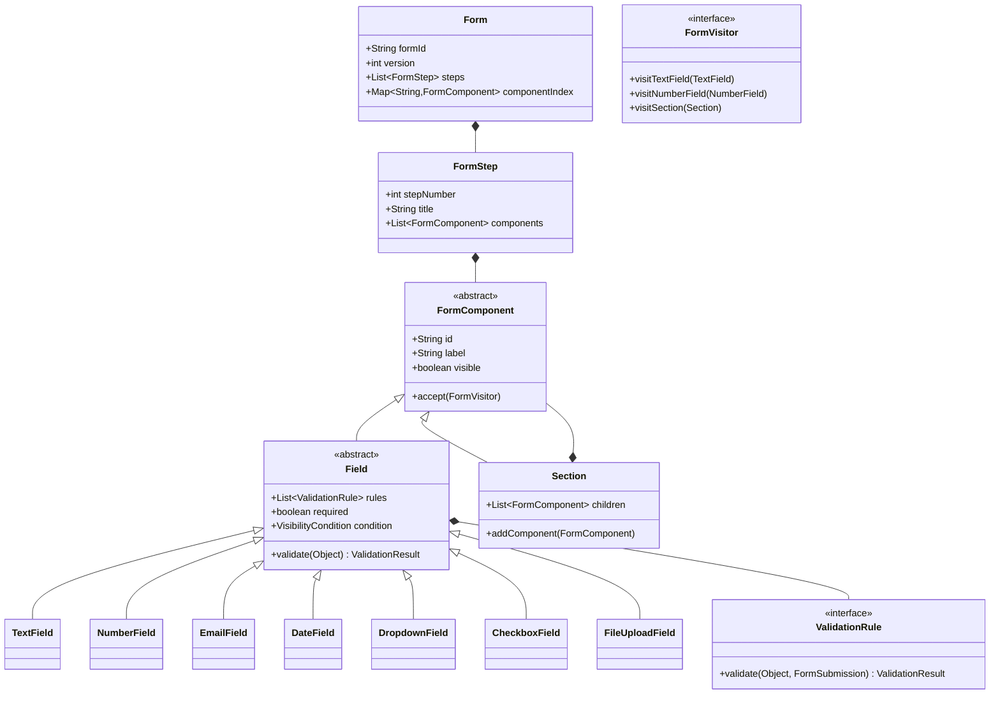

# Form Builder and Validation Engine - LLD

## Problem Statement
Design a form builder system that supports dynamic form creation with various field types, complex validation rules, conditional visibility, multi-step forms, versioning, and pluggable rendering via visitor pattern.

## UML Class Diagram


## Design Patterns
| Pattern | Usage |
|---------|-------|
| **Composite** | Form → Section → Field tree structure |
| **Strategy** | ValidationRule implementations are interchangeable |
| **Builder** | DSL-like FormBuilder for fluent construction |
| **Chain of Responsibility** | Validation rules chained per field |
| **Visitor** | Rendering/serialization without modifying components |

## Complete Java Implementation

```java
// ==================== CORE MODELS ====================
public abstract class FormComponent {
    protected String id;
    protected String label;
    protected boolean visible = true;

    public FormComponent(String id, String label) {
        this.id = id; this.label = label;
    }
    public abstract void accept(FormVisitor visitor);
    // getters
}

public abstract class Field extends FormComponent {
    private List<ValidationRule> rules = new ArrayList<>();
    private boolean required;
    private VisibilityCondition condition;

    public Field(String id, String label) { super(id, label); }

    public ValidationResult validate(Object value, FormSubmission submission) {
        // Check visibility condition - skip validation if hidden
        if (condition != null && !condition.evaluate(submission)) {
            return ValidationResult.success();
        }
        List<String> errors = new ArrayList<>();
        for (ValidationRule rule : rules) {
            ValidationResult r = rule.validate(value, submission);
            if (!r.isValid()) errors.addAll(r.getErrors());
        }
        return errors.isEmpty() ? ValidationResult.success()
            : ValidationResult.failure(id, errors);
    }
    public void addRule(ValidationRule rule) { rules.add(rule); }
    public void setCondition(VisibilityCondition c) { this.condition = c; }
}

// ==================== FIELD TYPES (Composite Leaves) ====================
public class TextField extends Field {
    private int maxLength;
    public TextField(String id, String label) { super(id, label); }
    public void accept(FormVisitor v) { v.visitTextField(this); }
}

public class NumberField extends Field {
    private double min, max;
    public NumberField(String id, String label) { super(id, label); }
    public void accept(FormVisitor v) { v.visitNumberField(this); }
}

public class EmailField extends Field {
    public EmailField(String id, String label) { super(id, label); }
    public void accept(FormVisitor v) { v.visitEmailField(this); }
}

public class DateField extends Field {
    private String format = "yyyy-MM-dd";
    public DateField(String id, String label) { super(id, label); }
    public void accept(FormVisitor v) { v.visitDateField(this); }
}

public class DropdownField extends Field {
    private List<String> options = new ArrayList<>();
    public DropdownField(String id, String label, List<String> opts) {
        super(id, label); this.options = opts;
    }
    public void accept(FormVisitor v) { v.visitDropdownField(this); }
}

public class CheckboxField extends Field {
    public CheckboxField(String id, String label) { super(id, label); }
    public void accept(FormVisitor v) { v.visitCheckboxField(this); }
}

public class FileUploadField extends Field {
    private List<String> allowedTypes;
    private long maxSizeBytes;
    public FileUploadField(String id, String label) { super(id, label); }
    public void accept(FormVisitor v) { v.visitFileUploadField(this); }
}

// Section (Composite node)
public class Section extends FormComponent {
    private List<FormComponent> children = new ArrayList<>();
    public Section(String id, String label) { super(id, label); }
    public void addComponent(FormComponent c) { children.add(c); }
    public List<FormComponent> getChildren() { return children; }
    public void accept(FormVisitor v) { v.visitSection(this); }
}

// ==================== VALIDATION RULES (Strategy) ====================
public interface ValidationRule {
    ValidationResult validate(Object value, FormSubmission submission);
}

public class RequiredRule implements ValidationRule {
    public ValidationResult validate(Object value, FormSubmission sub) {
        if (value == null || value.toString().isBlank())
            return ValidationResult.failure("Field is required");
        return ValidationResult.success();
    }
}

public class MinLengthRule implements ValidationRule {
    private int min;
    public MinLengthRule(int min) { this.min = min; }
    public ValidationResult validate(Object value, FormSubmission sub) {
        if (value != null && value.toString().length() < min)
            return ValidationResult.failure("Minimum length: " + min);
        return ValidationResult.success();
    }
}

public class MaxLengthRule implements ValidationRule {
    private int max;
    public MaxLengthRule(int max) { this.max = max; }
    public ValidationResult validate(Object value, FormSubmission sub) {
        if (value != null && value.toString().length() > max)
            return ValidationResult.failure("Maximum length: " + max);
        return ValidationResult.success();
    }
}

public class PatternRule implements ValidationRule {
    private Pattern pattern;
    private String message;
    public PatternRule(String regex, String msg) {
        this.pattern = Pattern.compile(regex); this.message = msg;
    }
    public ValidationResult validate(Object value, FormSubmission sub) {
        if (value != null && !pattern.matcher(value.toString()).matches())
            return ValidationResult.failure(message);
        return ValidationResult.success();
    }
}

public class RangeRule implements ValidationRule {
    private double min, max;
    public RangeRule(double min, double max) { this.min = min; this.max = max; }
    public ValidationResult validate(Object value, FormSubmission sub) {
        if (value == null) return ValidationResult.success();
        double v = Double.parseDouble(value.toString());
        if (v < min || v > max)
            return ValidationResult.failure("Must be between " + min + " and " + max);
        return ValidationResult.success();
    }
}

public class EmailRule implements ValidationRule {
    private static final Pattern EMAIL = Pattern.compile("^[\\w.-]+@[\\w.-]+\\.\\w+$");
    public ValidationResult validate(Object value, FormSubmission sub) {
        if (value != null && !EMAIL.matcher(value.toString()).matches())
            return ValidationResult.failure("Invalid email format");
        return ValidationResult.success();
    }
}

public class CustomRule implements ValidationRule {
    private Predicate<Object> predicate;
    private String message;
    public CustomRule(Predicate<Object> p, String msg) { this.predicate = p; this.message = msg; }
    public ValidationResult validate(Object value, FormSubmission sub) {
        return predicate.test(value) ? ValidationResult.success()
            : ValidationResult.failure(message);
    }
}

// Cross-field validation
public class CrossFieldRule implements ValidationRule {
    private String otherFieldId;
    private BiPredicate<Object, Object> predicate;
    private String message;
    public CrossFieldRule(String otherFieldId, BiPredicate<Object, Object> pred, String msg) {
        this.otherFieldId = otherFieldId; this.predicate = pred; this.message = msg;
    }
    public ValidationResult validate(Object value, FormSubmission sub) {
        Object otherValue = sub.getValue(otherFieldId);
        return predicate.test(value, otherValue) ? ValidationResult.success()
            : ValidationResult.failure(message);
    }
}

// ==================== SUPPORTING MODELS ====================
public class ValidationResult {
    private boolean valid;
    private String fieldId;
    private List<String> errors;

    public static ValidationResult success() { return new ValidationResult(true, null, List.of()); }
    public static ValidationResult failure(String error) {
        return new ValidationResult(false, null, List.of(error));
    }
    public static ValidationResult failure(String fieldId, List<String> errors) {
        return new ValidationResult(false, fieldId, errors);
    }
    // constructor, getters
}

public class FormSubmission {
    private String submissionId;
    private String formId;
    private int formVersion;
    private Map<String, Object> values = new HashMap<>();
    private LocalDateTime submittedAt;

    public Object getValue(String fieldId) { return values.get(fieldId); }
    public void setValue(String fieldId, Object val) { values.put(fieldId, val); }
}

// ==================== CONDITIONAL VISIBILITY ====================
public interface VisibilityCondition {
    boolean evaluate(FormSubmission submission);
}

public class FieldEqualsCondition implements VisibilityCondition {
    private String fieldId;
    private Object expectedValue;
    public FieldEqualsCondition(String fieldId, Object expected) {
        this.fieldId = fieldId; this.expectedValue = expected;
    }
    public boolean evaluate(FormSubmission sub) {
        return expectedValue.equals(sub.getValue(fieldId));
    }
}

public class CompositeCondition implements VisibilityCondition {
    enum Op { AND, OR }
    private List<VisibilityCondition> conditions;
    private Op operator;
    public boolean evaluate(FormSubmission sub) {
        return operator == Op.AND
            ? conditions.stream().allMatch(c -> c.evaluate(sub))
            : conditions.stream().anyMatch(c -> c.evaluate(sub));
    }
}

// ==================== FORM & MULTI-STEP ====================
public class FormStep {
    private int stepNumber;
    private String title;
    private List<FormComponent> components = new ArrayList<>();
    // getters, add
}

public class Form {
    private String formId;
    private String title;
    private int version;
    private List<FormStep> steps = new ArrayList<>();
    private Map<String, FormComponent> index = new HashMap<>();

    public void addStep(FormStep step) { steps.add(step); }
    public FormComponent getComponent(String id) { return index.get(id); }
    public void indexComponent(FormComponent c) { index.put(c.getId(), c); }
}

// ==================== FORM BUILDER (DSL) ====================
public class FormBuilder {
    private Form form = new Form();
    private FormStep currentStep;
    private Section currentSection;

    public FormBuilder(String formId, String title) {
        form.setFormId(formId); form.setTitle(title); form.setVersion(1);
    }

    public FormBuilder step(String title) {
        currentStep = new FormStep(form.getSteps().size() + 1, title);
        form.addStep(currentStep);
        currentSection = null;
        return this;
    }

    public FormBuilder section(String id, String label) {
        currentSection = new Section(id, label);
        addToCurrentContext(currentSection);
        return this;
    }

    public FormBuilder textField(String id, String label, Consumer<FieldConfig> config) {
        TextField f = new TextField(id, label);
        applyConfig(f, config);
        addToCurrentContext(f);
        return this;
    }

    public FormBuilder numberField(String id, String label, Consumer<FieldConfig> config) {
        NumberField f = new NumberField(id, label);
        applyConfig(f, config);
        addToCurrentContext(f);
        return this;
    }

    public FormBuilder emailField(String id, String label, Consumer<FieldConfig> config) {
        EmailField f = new EmailField(id, label);
        f.addRule(new EmailRule());
        applyConfig(f, config);
        addToCurrentContext(f);
        return this;
    }

    public FormBuilder dateField(String id, String label, Consumer<FieldConfig> config) {
        DateField f = new DateField(id, label);
        applyConfig(f, config);
        addToCurrentContext(f);
        return this;
    }

    public FormBuilder dropdownField(String id, String label, List<String> opts, Consumer<FieldConfig> config) {
        DropdownField f = new DropdownField(id, label, opts);
        applyConfig(f, config);
        addToCurrentContext(f);
        return this;
    }

    private void addToCurrentContext(FormComponent c) {
        form.indexComponent(c);
        if (currentSection != null && c != currentSection) currentSection.addComponent(c);
        else if (currentStep != null) currentStep.getComponents().add(c);
    }

    private void applyConfig(Field f, Consumer<FieldConfig> config) {
        if (config != null) { FieldConfig fc = new FieldConfig(f); config.accept(fc); }
    }

    public Form build() { return form; }
}

// Fluent field config helper
public class FieldConfig {
    private Field field;
    public FieldConfig(Field f) { this.field = f; }
    public FieldConfig required() { field.addRule(new RequiredRule()); return this; }
    public FieldConfig minLength(int n) { field.addRule(new MinLengthRule(n)); return this; }
    public FieldConfig maxLength(int n) { field.addRule(new MaxLengthRule(n)); return this; }
    public FieldConfig pattern(String regex, String msg) { field.addRule(new PatternRule(regex, msg)); return this; }
    public FieldConfig range(double min, double max) { field.addRule(new RangeRule(min, max)); return this; }
    public FieldConfig visibleWhen(String fieldId, Object value) {
        field.setCondition(new FieldEqualsCondition(fieldId, value)); return this;
    }
    public FieldConfig crossField(String otherId, BiPredicate<Object, Object> pred, String msg) {
        field.addRule(new CrossFieldRule(otherId, pred, msg)); return this;
    }
}

// ==================== VALIDATION ENGINE ====================
public class ValidationEngine {
    public List<ValidationResult> validate(Form form, FormSubmission submission) {
        List<ValidationResult> results = new ArrayList<>();
        for (FormStep step : form.getSteps()) {
            validateComponents(step.getComponents(), submission, results);
        }
        return results.stream().filter(r -> !r.isValid()).collect(Collectors.toList());
    }

    public List<ValidationResult> validateStep(Form form, int stepNum, FormSubmission sub) {
        FormStep step = form.getSteps().get(stepNum - 1);
        List<ValidationResult> results = new ArrayList<>();
        validateComponents(step.getComponents(), sub, results);
        return results.stream().filter(r -> !r.isValid()).collect(Collectors.toList());
    }

    private void validateComponents(List<FormComponent> components, FormSubmission sub,
                                     List<ValidationResult> results) {
        for (FormComponent c : components) {
            if (c instanceof Field field) {
                Object value = sub.getValue(field.getId());
                results.add(field.validate(value, sub));
            } else if (c instanceof Section section) {
                validateComponents(section.getChildren(), sub, results);
            }
        }
    }
}

// ==================== VISITOR (Rendering/Serialization) ====================
public interface FormVisitor {
    void visitTextField(TextField f);
    void visitNumberField(NumberField f);
    void visitEmailField(EmailField f);
    void visitDateField(DateField f);
    void visitDropdownField(DropdownField f);
    void visitCheckboxField(CheckboxField f);
    void visitFileUploadField(FileUploadField f);
    void visitSection(Section s);
}

public class HtmlRenderVisitor implements FormVisitor {
    private StringBuilder html = new StringBuilder();
    public void visitTextField(TextField f) {
        html.append("<input type=\"text\" id=\"").append(f.getId())
            .append("\" name=\"").append(f.getId()).append("\">\n");
    }
    public void visitNumberField(NumberField f) {
        html.append("<input type=\"number\" id=\"").append(f.getId()).append("\">\n");
    }
    public void visitEmailField(EmailField f) {
        html.append("<input type=\"email\" id=\"").append(f.getId()).append("\">\n");
    }
    public void visitDateField(DateField f) {
        html.append("<input type=\"date\" id=\"").append(f.getId()).append("\">\n");
    }
    public void visitDropdownField(DropdownField f) {
        html.append("<select id=\"").append(f.getId()).append("\"></select>\n");
    }
    public void visitCheckboxField(CheckboxField f) {
        html.append("<input type=\"checkbox\" id=\"").append(f.getId()).append("\">\n");
    }
    public void visitFileUploadField(FileUploadField f) {
        html.append("<input type=\"file\" id=\"").append(f.getId()).append("\">\n");
    }
    public void visitSection(Section s) {
        html.append("<fieldset><legend>").append(s.getLabel()).append("</legend>\n");
        s.getChildren().forEach(c -> c.accept(this));
        html.append("</fieldset>\n");
    }
    public String getHtml() { return html.toString(); }
}

public class JsonSerializerVisitor implements FormVisitor {
    private List<Map<String, Object>> fields = new ArrayList<>();
    public void visitTextField(TextField f) { addField(f, "text"); }
    public void visitNumberField(NumberField f) { addField(f, "number"); }
    public void visitEmailField(EmailField f) { addField(f, "email"); }
    public void visitDateField(DateField f) { addField(f, "date"); }
    public void visitDropdownField(DropdownField f) { addField(f, "dropdown"); }
    public void visitCheckboxField(CheckboxField f) { addField(f, "checkbox"); }
    public void visitFileUploadField(FileUploadField f) { addField(f, "file"); }
    public void visitSection(Section s) { addField(s, "section"); }
    private void addField(FormComponent c, String type) {
        fields.add(Map.of("id", c.getId(), "type", type, "label", c.getLabel()));
    }
}

// ==================== FORM VERSIONING & STORAGE ====================
public class FormRepository {
    private Map<String, TreeMap<Integer, Form>> formVersions = new ConcurrentHashMap<>();

    public void save(Form form) {
        formVersions.computeIfAbsent(form.getFormId(), k -> new TreeMap<>())
            .put(form.getVersion(), form);
    }
    public Form getLatest(String formId) {
        return formVersions.get(formId).lastEntry().getValue();
    }
    public Form getVersion(String formId, int version) {
        return formVersions.get(formId).get(version);
    }
}

public class SubmissionRepository {
    private Map<String, List<FormSubmission>> submissions = new ConcurrentHashMap<>();

    public void save(FormSubmission sub) {
        submissions.computeIfAbsent(sub.getFormId(), k -> new ArrayList<>()).add(sub);
    }
    public List<FormSubmission> getByForm(String formId) {
        return submissions.getOrDefault(formId, List.of());
    }
}

// ==================== USAGE EXAMPLE ====================
public class Main {
    public static void main(String[] args) {
        Form form = new FormBuilder("registration", "User Registration")
            .step("Personal Info")
                .textField("name", "Full Name", c -> c.required().minLength(2).maxLength(100))
                .emailField("email", "Email", c -> c.required())
                .dateField("dob", "Date of Birth", c -> c.required())
            .step("Employment")
                .dropdownField("empType", "Employment Type",
                    List.of("Employed", "Self-Employed", "Student", "Other"), c -> c.required())
                .textField("company", "Company Name",
                    c -> c.required().visibleWhen("empType", "Employed"))
                .dateField("startDate", "Start Date", c -> c.required())
                .dateField("endDate", "End Date", c -> c.crossField("startDate",
                    (end, start) -> end == null || start == null ||
                        LocalDate.parse(end.toString()).isAfter(LocalDate.parse(start.toString())),
                    "End date must be after start date"))
            .build();

        // Validate submission
        FormSubmission sub = new FormSubmission("sub-1", "registration", 1);
        sub.setValue("name", "John");
        sub.setValue("email", "invalid-email");
        sub.setValue("empType", "Employed");

        ValidationEngine engine = new ValidationEngine();
        List<ValidationResult> errors = engine.validate(form, sub);
        errors.forEach(e -> System.out.println(e.getFieldId() + ": " + e.getErrors()));

        // Render form
        HtmlRenderVisitor renderer = new HtmlRenderVisitor();
        form.getSteps().forEach(step ->
            step.getComponents().forEach(c -> c.accept(renderer)));
        System.out.println(renderer.getHtml());
    }
}
```

## SOLID Principles Applied
| Principle | Application |
|-----------|-------------|
| **SRP** | Each ValidationRule handles one concern; Field handles structure, not rendering |
| **OCP** | New field types/rules added without modifying existing code |
| **LSP** | All Field subtypes substitutable in validation engine |
| **ISP** | ValidationRule is minimal single-method interface |
| **DIP** | Engine depends on abstractions (Field, ValidationRule), not concrete types |

## Key Interview Points
1. **Composite** allows nested sections/fields with uniform traversal
2. **Strategy** makes validation rules pluggable and composable per field
3. **Chain of Responsibility** - rules execute in sequence, collecting all errors (not short-circuit)
4. **Visitor** enables new operations (HTML render, JSON serialize) without modifying component classes
5. **Builder DSL** provides readable, type-safe form construction
6. **Cross-field validation** passes entire submission context to rules
7. **Conditional visibility** skips validation for hidden fields - prevents false negatives
8. **Multi-step** supports progressive validation (validate per step or entire form)
9. **Versioning** ensures submissions reference correct form schema
10. **Thread-safety** via ConcurrentHashMap in repositories
