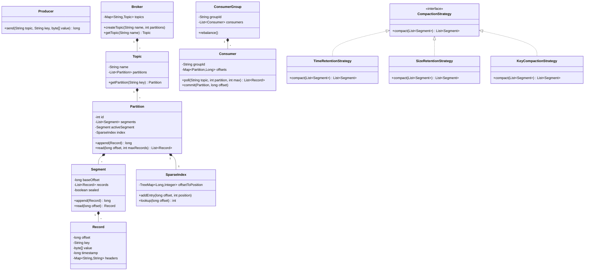

# Kafka-Style Event Log / Commit Log - LLD

## 1. Problem Statement
Design a Kafka-style append-only commit log supporting topics, partitions, segment-based storage, consumer offset tracking, and log compaction strategies.

## 2. UML Class Diagram


## 3. Design Patterns
| Pattern | Usage |
|---------|-------|
| **Strategy** | CompactionStrategy - swap retention/compaction policies |
| **Observer** | Consumer notification on new records |
| **Factory** | Topic/Partition creation via Broker |
| **Iterator** | LogIterator for sequential reads from offset |

## 4. SOLID Principles
- **S**: Segment handles storage, Index handles lookups, Consumer handles offset tracking
- **O**: New compaction strategies without modifying existing code
- **L**: All CompactionStrategy implementations are interchangeable
- **I**: Producer and Consumer have separate focused interfaces
- **D**: Partition depends on CompactionStrategy interface, not concrete implementations

## 5. Complete Java Implementation

```java
import java.util.*;
import java.util.concurrent.*;
import java.util.concurrent.atomic.*;
import java.util.stream.*;

// ==================== Models ====================
class Record {
    private final long offset;
    private final String key;
    private final byte[] value;
    private final long timestamp;
    private final Map<String, String> headers;

    public Record(long offset, String key, byte[] value, long timestamp, Map<String, String> headers) {
        this.offset = offset;
        this.key = key;
        this.value = value;
        this.timestamp = timestamp;
        this.headers = headers != null ? Collections.unmodifiableMap(headers) : Map.of();
    }

    public long getOffset() { return offset; }
    public String getKey() { return key; }
    public byte[] getValue() { return value; }
    public long getTimestamp() { return timestamp; }
    public Map<String, String> getHeaders() { return headers; }
}

// ==================== Sparse Index ====================
class SparseIndex {
    private final TreeMap<Long, Integer> offsetToPosition = new TreeMap<>();
    private final int indexIntervalBytes;

    public SparseIndex(int indexIntervalBytes) {
        this.indexIntervalBytes = indexIntervalBytes;
    }

    public void addEntry(long offset, int position) {
        offsetToPosition.put(offset, position);
    }

    // Find nearest position <= target offset
    public int lookup(long offset) {
        Map.Entry<Long, Integer> entry = offsetToPosition.floorEntry(offset);
        return entry != null ? entry.getValue() : 0;
    }
}

// ==================== Segment ====================
class Segment {
    private final long baseOffset;
    private final List<Record> records = new ArrayList<>();
    private final int maxSize;
    private volatile boolean sealed = false;

    public Segment(long baseOffset, int maxSize) {
        this.baseOffset = baseOffset;
        this.maxSize = maxSize;
    }

    public synchronized long append(Record record) {
        if (sealed) throw new IllegalStateException("Segment is sealed");
        records.add(record);
        if (records.size() >= maxSize) sealed = true;
        return record.getOffset();
    }

    public Record read(int position) {
        if (position < 0 || position >= records.size()) return null;
        return records.get(position);
    }

    public List<Record> readFrom(long startOffset, int maxRecords) {
        return records.stream()
            .filter(r -> r.getOffset() >= startOffset)
            .limit(maxRecords)
            .collect(Collectors.toList());
    }

    public boolean isSealed() { return sealed; }
    public void seal() { this.sealed = true; }
    public long getBaseOffset() { return baseOffset; }
    public long getLastOffset() { return records.isEmpty() ? baseOffset : records.get(records.size()-1).getOffset(); }
    public int size() { return records.size(); }
    public List<Record> getRecords() { return Collections.unmodifiableList(records); }
}

// ==================== Compaction Strategies ====================
interface CompactionStrategy {
    List<Segment> compact(List<Segment> segments);
}

class TimeRetentionStrategy implements CompactionStrategy {
    private final long retentionMs;

    public TimeRetentionStrategy(long retentionMs) { this.retentionMs = retentionMs; }

    @Override
    public List<Segment> compact(List<Segment> segments) {
        long cutoff = System.currentTimeMillis() - retentionMs;
        return segments.stream()
            .filter(s -> s.getRecords().stream().anyMatch(r -> r.getTimestamp() > cutoff))
            .collect(Collectors.toList());
    }
}

class SizeRetentionStrategy implements CompactionStrategy {
    private final int maxTotalRecords;

    public SizeRetentionStrategy(int maxTotalRecords) { this.maxTotalRecords = maxTotalRecords; }

    @Override
    public List<Segment> compact(List<Segment> segments) {
        int total = segments.stream().mapToInt(Segment::size).sum();
        List<Segment> result = new ArrayList<>(segments);
        while (total > maxTotalRecords && result.size() > 1) {
            total -= result.remove(0).size();
        }
        return result;
    }
}

class KeyCompactionStrategy implements CompactionStrategy {
    @Override
    public List<Segment> compact(List<Segment> segments) {
        // Keep only latest record per key
        Map<String, Record> latest = new LinkedHashMap<>();
        for (Segment seg : segments) {
            for (Record r : seg.getRecords()) {
                if (r.getKey() != null) latest.put(r.getKey(), r);
            }
        }
        Segment compacted = new Segment(0, Integer.MAX_VALUE);
        latest.values().forEach(compacted::append);
        compacted.seal();
        return List.of(compacted);
    }
}

// ==================== Partition ====================
class Partition {
    private final int id;
    private final List<Segment> sealedSegments = new CopyOnWriteArrayList<>();
    private volatile Segment activeSegment;
    private final AtomicLong nextOffset = new AtomicLong(0);
    private final SparseIndex index;
    private final int segmentMaxSize;
    private CompactionStrategy compactionStrategy;

    public Partition(int id, int segmentMaxSize, CompactionStrategy strategy) {
        this.id = id;
        this.segmentMaxSize = segmentMaxSize;
        this.index = new SparseIndex(4096);
        this.activeSegment = new Segment(0, segmentMaxSize);
        this.compactionStrategy = strategy;
    }

    public synchronized long append(String key, byte[] value, Map<String, String> headers) {
        long offset = nextOffset.getAndIncrement();
        Record record = new Record(offset, key, value, System.currentTimeMillis(), headers);

        if (activeSegment.isSealed()) {
            sealedSegments.add(activeSegment);
            activeSegment = new Segment(offset, segmentMaxSize);
        }
        activeSegment.append(record);
        index.addEntry(offset, (int)(offset - activeSegment.getBaseOffset()));
        return offset;
    }

    public List<Record> read(long fromOffset, int maxRecords) {
        List<Record> result = new ArrayList<>();
        for (Segment seg : sealedSegments) {
            if (seg.getLastOffset() < fromOffset) continue;
            result.addAll(seg.readFrom(fromOffset, maxRecords - result.size()));
            if (result.size() >= maxRecords) return result.subList(0, maxRecords);
        }
        result.addAll(activeSegment.readFrom(fromOffset, maxRecords - result.size()));
        return result.size() > maxRecords ? result.subList(0, maxRecords) : result;
    }

    public void runCompaction() {
        List<Segment> compacted = compactionStrategy.compact(new ArrayList<>(sealedSegments));
        sealedSegments.clear();
        sealedSegments.addAll(compacted);
    }

    public int getId() { return id; }
    public long getLatestOffset() { return nextOffset.get() - 1; }
}

// ==================== Log Iterator ====================
class LogIterator implements Iterator<Record> {
    private final Partition partition;
    private long currentOffset;
    private final int batchSize;
    private Queue<Record> buffer = new LinkedList<>();

    public LogIterator(Partition partition, long startOffset, int batchSize) {
        this.partition = partition;
        this.currentOffset = startOffset;
        this.batchSize = batchSize;
    }

    @Override
    public boolean hasNext() {
        if (buffer.isEmpty()) fetchNext();
        return !buffer.isEmpty();
    }

    @Override
    public Record next() {
        if (!hasNext()) throw new NoSuchElementException();
        Record r = buffer.poll();
        currentOffset = r.getOffset() + 1;
        return r;
    }

    private void fetchNext() {
        List<Record> records = partition.read(currentOffset, batchSize);
        buffer.addAll(records);
    }
}

// ==================== Topic ====================
class Topic {
    private final String name;
    private final List<Partition> partitions;

    public Topic(String name, int numPartitions, int segmentSize, CompactionStrategy strategy) {
        this.name = name;
        this.partitions = new ArrayList<>();
        for (int i = 0; i < numPartitions; i++) {
            partitions.add(new Partition(i, segmentSize, strategy));
        }
    }

    public Partition getPartition(String key) {
        int hash = key == null ? 0 : Math.abs(key.hashCode());
        return partitions.get(hash % partitions.size());
    }

    public Partition getPartition(int id) { return partitions.get(id); }
    public int getPartitionCount() { return partitions.size(); }
    public String getName() { return name; }
}

// ==================== Producer ====================
class Producer {
    private final Map<String, Topic> topics;

    public Producer(Map<String, Topic> topics) { this.topics = topics; }

    public long send(String topicName, String key, byte[] value) {
        return send(topicName, key, value, null);
    }

    public long send(String topicName, String key, byte[] value, Map<String, String> headers) {
        Topic topic = topics.get(topicName);
        if (topic == null) throw new IllegalArgumentException("Topic not found: " + topicName);
        Partition partition = topic.getPartition(key);
        return partition.append(key, value, headers);
    }
}

// ==================== Consumer ====================
class Consumer {
    private final String groupId;
    private final String consumerId;
    private final ConcurrentHashMap<String, Long> committedOffsets = new ConcurrentHashMap<>();

    public Consumer(String groupId, String consumerId) {
        this.groupId = groupId;
        this.consumerId = consumerId;
    }

    public List<Record> poll(Topic topic, int partitionId, int maxRecords) {
        String key = topic.getName() + "-" + partitionId;
        long offset = committedOffsets.getOrDefault(key, 0L);
        return topic.getPartition(partitionId).read(offset, maxRecords);
    }

    public void commit(String topicName, int partitionId, long offset) {
        committedOffsets.put(topicName + "-" + partitionId, offset);
    }

    public String getGroupId() { return groupId; }
    public String getConsumerId() { return consumerId; }
}

// ==================== Consumer Group ====================
class ConsumerGroup {
    private final String groupId;
    private final List<Consumer> consumers = new CopyOnWriteArrayList<>();
    private final Map<Consumer, List<Integer>> assignment = new ConcurrentHashMap<>();

    public ConsumerGroup(String groupId) { this.groupId = groupId; }

    public void addConsumer(Consumer consumer) {
        consumers.add(consumer);
    }

    // Round-robin partition assignment rebalance
    public void rebalance(int totalPartitions) {
        assignment.clear();
        consumers.forEach(c -> assignment.put(c, new ArrayList<>()));
        for (int p = 0; p < totalPartitions; p++) {
            Consumer c = consumers.get(p % consumers.size());
            assignment.get(c).add(p);
        }
    }

    public List<Integer> getAssignment(Consumer consumer) {
        return assignment.getOrDefault(consumer, List.of());
    }
}

// ==================== Broker (Factory) ====================
class Broker {
    private final ConcurrentHashMap<String, Topic> topics = new ConcurrentHashMap<>();
    private final int defaultSegmentSize;
    private final CompactionStrategy defaultStrategy;

    public Broker(int defaultSegmentSize, CompactionStrategy defaultStrategy) {
        this.defaultSegmentSize = defaultSegmentSize;
        this.defaultStrategy = defaultStrategy;
    }

    public Topic createTopic(String name, int partitions) {
        return topics.computeIfAbsent(name, n -> new Topic(n, partitions, defaultSegmentSize, defaultStrategy));
    }

    public Topic getTopic(String name) { return topics.get(name); }
    public Map<String, Topic> getTopics() { return Collections.unmodifiableMap(topics); }
    public Producer createProducer() { return new Producer(topics); }
}

// ==================== Demo ====================
class KafkaEventLogDemo {
    public static void main(String[] args) {
        Broker broker = new Broker(100, new TimeRetentionStrategy(86400000));
        Topic orders = broker.createTopic("orders", 3);

        Producer producer = broker.createProducer();
        for (int i = 0; i < 10; i++) {
            long offset = producer.send("orders", "key-" + i, ("order-" + i).getBytes());
            System.out.println("Produced record at offset: " + offset);
        }

        Consumer consumer = new Consumer("order-service", "consumer-1");
        List<Record> records = consumer.poll(orders, 0, 5);
        records.forEach(r -> System.out.printf("Read: offset=%d key=%s%n", r.getOffset(), r.getKey()));

        // Commit offset
        if (!records.isEmpty()) {
            consumer.commit("orders", 0, records.get(records.size()-1).getOffset() + 1);
        }

        // Iterator usage
        LogIterator iter = new LogIterator(orders.getPartition(0), 0, 10);
        while (iter.hasNext()) {
            Record r = iter.next();
            System.out.println("Iterator: " + r.getOffset());
        }
    }
}
```

## 6. Key Interview Points

| Concept | Explanation |
|---------|-------------|
| **Append-only** | Records never modified after write; enables sequential I/O, high throughput |
| **Immutability** | Records are immutable value objects; thread-safe without locking reads |
| **Ordering** | Guaranteed per-partition only; partition key determines assignment |
| **Segments** | Log split into segments; active segment accepts writes, sealed segments are read-only and eligible for compaction |
| **Sparse Index** | TreeMap storing every Nth offset→position; enables O(log N) seeks |
| **Zero-copy** | OS-level `sendfile()` transfers data from disk to network without user-space copies; Java `FileChannel.transferTo()` |
| **Consumer Groups** | Partitions assigned to consumers via rebalancing; each partition consumed by exactly one consumer in a group |
| **Compaction** | Time-based (TTL), size-based (cap), key-based (keep latest per key) |
| **Offset Commit** | Consumers track position; enables at-least-once / exactly-once semantics |
| **Sequential I/O** | Append-only writes + sequential reads exploit OS page cache and disk prefetch |
