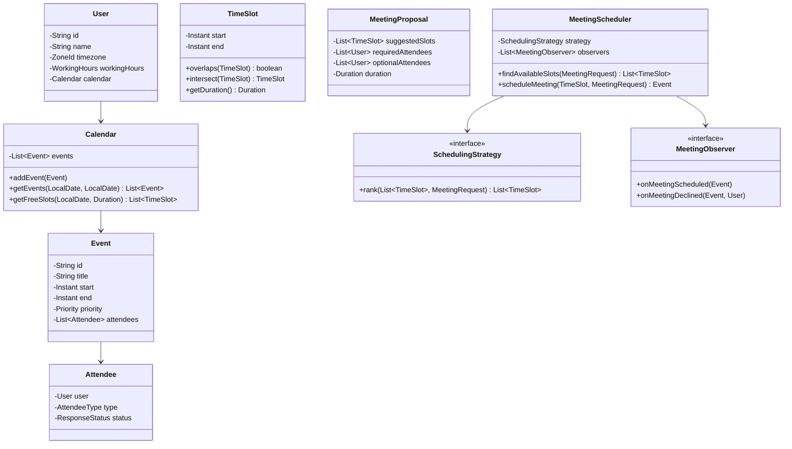

# Meeting Scheduler - Low Level Design

## 1. Problem Statement
Design a meeting scheduler that finds common free slots among multiple users, considering working hours, timezones, priorities, and optional/required attendees. Rank suggestions by scheduling strategies.

## 2. UML Class Diagram


## 3. Design Patterns
- **Strategy**: Interchangeable scheduling algorithms (EarliestAvailable, ShortestWait, PreferredTimeSlot)
- **Observer**: Notifications on meeting confirmation/decline
- **Builder**: Construct complex MeetingRequest objects

## 4. SOLID Principles
- **SRP**: Calendar manages events, Scheduler finds slots, Strategy ranks them
- **OCP**: New strategies without modifying Scheduler
- **LSP**: All strategies interchangeable via interface
- **ISP**: Separate Observer methods for different events
- **DIP**: Scheduler depends on SchedulingStrategy interface, not concrete classes

## 5. Complete Java Implementation

```java
import java.time.*;
import java.util.*;
import java.util.stream.*;

// ============ ENUMS ============
enum Priority { LOW, MEDIUM, HIGH, CRITICAL }
enum AttendeeType { REQUIRED, OPTIONAL }
enum ResponseStatus { PENDING, ACCEPTED, DECLINED }

// ============ MODELS ============
class TimeSlot implements Comparable<TimeSlot> {
    private final Instant start;
    private final Instant end;

    public TimeSlot(Instant start, Instant end) {
        if (!start.isBefore(end)) throw new IllegalArgumentException("Invalid slot");
        this.start = start;
        this.end = end;
    }

    public boolean overlaps(TimeSlot other) {
        return start.isBefore(other.end) && other.start.isBefore(end);
    }

    public TimeSlot intersect(TimeSlot other) {
        Instant s = start.isAfter(other.start) ? start : other.start;
        Instant e = end.isBefore(other.end) ? end : other.end;
        return s.isBefore(e) ? new TimeSlot(s, e) : null;
    }

    public Duration getDuration() { return Duration.between(start, end); }
    public Instant getStart() { return start; }
    public Instant getEnd() { return end; }

    @Override
    public int compareTo(TimeSlot o) { return start.compareTo(o.start); }
}

class WorkingHours {
    private final LocalTime start;
    private final LocalTime end;

    public WorkingHours(LocalTime start, LocalTime end) {
        this.start = start;
        this.end = end;
    }

    public TimeSlot toTimeSlot(LocalDate date, ZoneId zone) {
        return new TimeSlot(
            date.atTime(start).atZone(zone).toInstant(),
            date.atTime(end).atZone(zone).toInstant()
        );
    }

    public LocalTime getStart() { return start; }
    public LocalTime getEnd() { return end; }
}

class User {
    private final String id;
    private final String name;
    private final ZoneId timezone;
    private final WorkingHours workingHours;
    private final Calendar calendar;

    public User(String id, String name, ZoneId timezone, WorkingHours workingHours) {
        this.id = id;
        this.name = name;
        this.timezone = timezone;
        this.workingHours = workingHours;
        this.calendar = new Calendar();
    }

    // Getters
    public String getId() { return id; }
    public String getName() { return name; }
    public ZoneId getTimezone() { return timezone; }
    public WorkingHours getWorkingHours() { return workingHours; }
    public Calendar getCalendar() { return calendar; }
}

class Attendee {
    private final User user;
    private final AttendeeType type;
    private ResponseStatus status;

    public Attendee(User user, AttendeeType type) {
        this.user = user;
        this.type = type;
        this.status = ResponseStatus.PENDING;
    }

    public User getUser() { return user; }
    public AttendeeType getType() { return type; }
    public ResponseStatus getStatus() { return status; }
    public void setStatus(ResponseStatus status) { this.status = status; }
}

class Event {
    private final String id;
    private final String title;
    private final TimeSlot timeSlot;
    private final Priority priority;
    private final List<Attendee> attendees;

    public Event(String id, String title, TimeSlot timeSlot, Priority priority, List<Attendee> attendees) {
        this.id = id;
        this.title = title;
        this.timeSlot = timeSlot;
        this.priority = priority;
        this.attendees = attendees;
    }

    public String getId() { return id; }
    public TimeSlot getTimeSlot() { return timeSlot; }
    public Priority getPriority() { return priority; }
    public List<Attendee> getAttendees() { return attendees; }
}

class Calendar {
    private final List<Event> events = new ArrayList<>();

    public void addEvent(Event event) { events.add(event); }

    public List<Event> getEvents(Instant from, Instant to) {
        return events.stream()
            .filter(e -> e.getTimeSlot().overlaps(new TimeSlot(from, to)))
            .sorted(Comparator.comparing(e -> e.getTimeSlot().getStart()))
            .collect(Collectors.toList());
    }

    public List<TimeSlot> getBusySlots(Instant from, Instant to) {
        return getEvents(from, to).stream()
            .map(Event::getTimeSlot)
            .collect(Collectors.toList());
    }
}

// ============ MEETING REQUEST (Builder Pattern) ============
class MeetingRequest {
    private final List<User> requiredAttendees;
    private final List<User> optionalAttendees;
    private final Duration duration;
    private final LocalDate startDate;
    private final LocalDate endDate;
    private final Priority priority;

    private MeetingRequest(Builder builder) {
        this.requiredAttendees = builder.requiredAttendees;
        this.optionalAttendees = builder.optionalAttendees;
        this.duration = builder.duration;
        this.startDate = builder.startDate;
        this.endDate = builder.endDate;
        this.priority = builder.priority;
    }

    // Getters
    public List<User> getRequiredAttendees() { return requiredAttendees; }
    public List<User> getOptionalAttendees() { return optionalAttendees; }
    public Duration getDuration() { return duration; }
    public LocalDate getStartDate() { return startDate; }
    public LocalDate getEndDate() { return endDate; }
    public Priority getPriority() { return priority; }

    public static class Builder {
        private List<User> requiredAttendees = new ArrayList<>();
        private List<User> optionalAttendees = new ArrayList<>();
        private Duration duration;
        private LocalDate startDate;
        private LocalDate endDate;
        private Priority priority = Priority.MEDIUM;

        public Builder requiredAttendees(List<User> users) { this.requiredAttendees = users; return this; }
        public Builder optionalAttendees(List<User> users) { this.optionalAttendees = users; return this; }
        public Builder duration(Duration d) { this.duration = d; return this; }
        public Builder dateRange(LocalDate start, LocalDate end) { this.startDate = start; this.endDate = end; return this; }
        public Builder priority(Priority p) { this.priority = p; return this; }
        public MeetingRequest build() { return new MeetingRequest(this); }
    }
}

// ============ OBSERVER PATTERN ============
interface MeetingObserver {
    void onMeetingScheduled(Event event);
    void onMeetingDeclined(Event event, User user);
}

class EmailNotificationObserver implements MeetingObserver {
    @Override
    public void onMeetingScheduled(Event event) {
        event.getAttendees().forEach(a ->
            System.out.println("Email to " + a.getUser().getName() + ": Meeting scheduled"));
    }

    @Override
    public void onMeetingDeclined(Event event, User user) {
        System.out.println("Email to organizer: " + user.getName() + " declined");
    }
}

class CalendarSyncObserver implements MeetingObserver {
    @Override
    public void onMeetingScheduled(Event event) {
        event.getAttendees().forEach(a ->
            a.getUser().getCalendar().addEvent(event));
    }

    @Override
    public void onMeetingDeclined(Event event, User user) { /* reschedule logic */ }
}

// ============ STRATEGY PATTERN ============
interface SchedulingStrategy {
    List<TimeSlot> rank(List<TimeSlot> slots, MeetingRequest request);
}

class EarliestAvailableStrategy implements SchedulingStrategy {
    @Override
    public List<TimeSlot> rank(List<TimeSlot> slots, MeetingRequest request) {
        return slots.stream().sorted().collect(Collectors.toList());
    }
}

class ShortestWaitStrategy implements SchedulingStrategy {
    @Override
    public List<TimeSlot> rank(List<TimeSlot> slots, MeetingRequest request) {
        Instant now = Instant.now();
        return slots.stream()
            .sorted(Comparator.comparing(s -> Duration.between(now, s.getStart())))
            .collect(Collectors.toList());
    }
}

class PreferredTimeSlotStrategy implements SchedulingStrategy {
    private final LocalTime preferredStart;
    private final LocalTime preferredEnd;

    public PreferredTimeSlotStrategy(LocalTime start, LocalTime end) {
        this.preferredStart = start;
        this.preferredEnd = end;
    }

    @Override
    public List<TimeSlot> rank(List<TimeSlot> slots, MeetingRequest request) {
        return slots.stream()
            .sorted(Comparator.comparingLong(s -> distanceFromPreferred(s)))
            .collect(Collectors.toList());
    }

    private long distanceFromPreferred(TimeSlot slot) {
        LocalTime slotTime = slot.getStart().atZone(ZoneId.systemDefault()).toLocalTime();
        long diffStart = Math.abs(Duration.between(preferredStart, slotTime).toMinutes());
        return diffStart;
    }
}

// ============ CORE ALGORITHM ============
class SlotFinder {

    /**
     * Core algorithm: Merge intervals → find free slots → intersect across users
     * Time: O(N log N) per user where N = number of events
     */
    public List<TimeSlot> findCommonFreeSlots(MeetingRequest request) {
        List<TimeSlot> commonSlots = null;

        // Find free slots for each required attendee and intersect
        for (User user : request.getRequiredAttendees()) {
            List<TimeSlot> userFreeSlots = getUserFreeSlots(user, request);
            if (commonSlots == null) {
                commonSlots = userFreeSlots;
            } else {
                commonSlots = intersectSlotLists(commonSlots, userFreeSlots);
            }
        }

        if (commonSlots == null) return Collections.emptyList();

        // Filter by minimum duration
        return commonSlots.stream()
            .filter(s -> s.getDuration().compareTo(request.getDuration()) >= 0)
            .map(s -> new TimeSlot(s.getStart(), s.getStart().plus(request.getDuration())))
            .collect(Collectors.toList());
    }

    private List<TimeSlot> getUserFreeSlots(User user, MeetingRequest request) {
        List<TimeSlot> allFreeSlots = new ArrayList<>();
        LocalDate date = request.getStartDate();

        while (!date.isAfter(request.getEndDate())) {
            TimeSlot workingSlot = user.getWorkingHours().toTimeSlot(date, user.getTimezone());
            List<TimeSlot> busySlots = user.getCalendar().getBusySlots(
                workingSlot.getStart(), workingSlot.getEnd());

            // Merge overlapping busy intervals
            List<TimeSlot> merged = mergeIntervals(busySlots);

            // Subtract busy from working hours to get free slots
            allFreeSlots.addAll(subtractIntervals(workingSlot, merged));
            date = date.plusDays(1);
        }
        return allFreeSlots;
    }

    /** Merge overlapping intervals - O(N log N) */
    private List<TimeSlot> mergeIntervals(List<TimeSlot> intervals) {
        if (intervals.isEmpty()) return intervals;
        List<TimeSlot> sorted = intervals.stream().sorted().collect(Collectors.toList());
        List<TimeSlot> merged = new ArrayList<>();
        TimeSlot current = sorted.get(0);

        for (int i = 1; i < sorted.size(); i++) {
            TimeSlot next = sorted.get(i);
            if (!current.getEnd().isBefore(next.getStart())) {
                Instant end = current.getEnd().isAfter(next.getEnd()) ? current.getEnd() : next.getEnd();
                current = new TimeSlot(current.getStart(), end);
            } else {
                merged.add(current);
                current = next;
            }
        }
        merged.add(current);
        return merged;
    }

    /** Subtract busy from a working slot → free gaps */
    private List<TimeSlot> subtractIntervals(TimeSlot workSlot, List<TimeSlot> busy) {
        List<TimeSlot> free = new ArrayList<>();
        Instant pointer = workSlot.getStart();

        for (TimeSlot b : busy) {
            if (pointer.isBefore(b.getStart())) {
                free.add(new TimeSlot(pointer, b.getStart()));
            }
            pointer = b.getEnd().isAfter(pointer) ? b.getEnd() : pointer;
        }
        if (pointer.isBefore(workSlot.getEnd())) {
            free.add(new TimeSlot(pointer, workSlot.getEnd()));
        }
        return free;
    }

    /** Intersect two sorted lists of free slots - O(M + N) */
    private List<TimeSlot> intersectSlotLists(List<TimeSlot> a, List<TimeSlot> b) {
        List<TimeSlot> result = new ArrayList<>();
        int i = 0, j = 0;

        while (i < a.size() && j < b.size()) {
            TimeSlot intersection = a.get(i).intersect(b.get(j));
            if (intersection != null) result.add(intersection);

            if (a.get(i).getEnd().isBefore(b.get(j).getEnd())) i++;
            else j++;
        }
        return result;
    }
}

// ============ MAIN SCHEDULER ============
class MeetingScheduler {
    private SchedulingStrategy strategy;
    private final List<MeetingObserver> observers = new ArrayList<>();
    private final SlotFinder slotFinder = new SlotFinder();

    public MeetingScheduler(SchedulingStrategy strategy) { this.strategy = strategy; }
    public void setStrategy(SchedulingStrategy s) { this.strategy = s; }
    public void addObserver(MeetingObserver o) { observers.add(o); }

    public List<TimeSlot> findAvailableSlots(MeetingRequest request) {
        List<TimeSlot> slots = slotFinder.findCommonFreeSlots(request);
        return strategy.rank(slots, request);
    }

    public Event scheduleMeeting(TimeSlot slot, MeetingRequest request, String title) {
        List<Attendee> attendees = new ArrayList<>();
        request.getRequiredAttendees().forEach(u -> attendees.add(new Attendee(u, AttendeeType.REQUIRED)));
        request.getOptionalAttendees().forEach(u -> attendees.add(new Attendee(u, AttendeeType.OPTIONAL)));

        Event event = new Event(UUID.randomUUID().toString(), title, slot, request.getPriority(), attendees);
        observers.forEach(o -> o.onMeetingScheduled(event));
        return event;
    }

    public void declineMeeting(Event event, User user) {
        event.getAttendees().stream()
            .filter(a -> a.getUser().equals(user))
            .findFirst()
            .ifPresent(a -> {
                a.setStatus(ResponseStatus.DECLINED);
                observers.forEach(o -> o.onMeetingDeclined(event, user));
            });
    }
}

// ============ USAGE ============
class Main {
    public static void main(String[] args) {
        User alice = new User("1", "Alice", ZoneId.of("America/New_York"),
            new WorkingHours(LocalTime.of(9, 0), LocalTime.of(17, 0)));
        User bob = new User("2", "Bob", ZoneId.of("Europe/London"),
            new WorkingHours(LocalTime.of(9, 0), LocalTime.of(17, 0)));

        // Add existing events
        alice.getCalendar().addEvent(new Event("e1", "Standup",
            new TimeSlot(
                LocalDate.now().atTime(10, 0).atZone(alice.getTimezone()).toInstant(),
                LocalDate.now().atTime(10, 30).atZone(alice.getTimezone()).toInstant()),
            Priority.HIGH, List.of()));

        MeetingRequest request = new MeetingRequest.Builder()
            .requiredAttendees(List.of(alice, bob))
            .optionalAttendees(List.of())
            .duration(Duration.ofMinutes(30))
            .dateRange(LocalDate.now(), LocalDate.now().plusDays(3))
            .priority(Priority.MEDIUM)
            .build();

        MeetingScheduler scheduler = new MeetingScheduler(new EarliestAvailableStrategy());
        scheduler.addObserver(new EmailNotificationObserver());
        scheduler.addObserver(new CalendarSyncObserver());

        List<TimeSlot> slots = scheduler.findAvailableSlots(request);
        if (!slots.isEmpty()) {
            Event meeting = scheduler.scheduleMeeting(slots.get(0), request, "Design Review");
        }
    }
}
```

## 6. Algorithm Complexity

| Operation | Time | Space |
|-----------|------|-------|
| Merge intervals | O(N log N) | O(N) |
| Subtract intervals | O(N) | O(N) |
| Intersect two lists | O(M + N) | O(min(M,N)) |
| Total (K users, N events each) | O(K * N log N) | O(N) |

## 7. Key Interview Points

1. **Core Algorithm**: Merge busy intervals → subtract from working hours → intersect across users using two-pointer
2. **Timezone handling**: Store all times as `Instant` (UTC), convert to user's zone only for display/working hours
3. **Strategy Pattern**: Easily swap ranking algorithms without changing core logic
4. **Optional attendees**: Find slots where all required are free; rank higher if more optionals available
5. **Priority conflicts**: Higher priority meetings can preempt lower ones (extend with conflict resolution)
6. **Scalability**: For large orgs, pre-compute free/busy per user and cache; use interval trees for O(log N) queries
7. **Edge cases**: Cross-day meetings, DST transitions, recurring events, buffer time between meetings
8. **Extensions**: Room booking, resource allocation, recurring meeting patterns, ML-based preferred times
