# Design Patterns Quick Reference for LLD Interviews (Java)

> All 23 GoF patterns + Enterprise patterns. Organized by category with code, UML, and LLD problem mappings.

---

## CREATIONAL PATTERNS

### 1. Singleton

**What:** Ensures a class has only one instance and provides a global access point to it. Used for shared resources like connection pools, caches, and configuration.

**When to use:** Single shared resource, global state, expensive object creation that should happen once.

**Mermaid UML:**
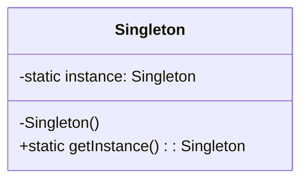
```mermaid
classDiagram
    class Singleton {
        -static instance: Singleton
        -Singleton()
        +static getInstance(): Singleton
    }
```

**Approach 1: Double-Checked Locking**
```java
public class Singleton {
    private static volatile Singleton instance;
    private Singleton() {}
    
    public static Singleton getInstance() {
        if (instance == null) {
            synchronized (Singleton.class) {
                if (instance == null) {
                    instance = new Singleton();
                }
            }
        }
        return instance;
    }
}
```

**Approach 2: Enum Singleton (Preferred - handles serialization & reflection)**
```java
public enum Singleton {
    INSTANCE;
    
    public void doSomething() { /* ... */ }
}
```

**Approach 3: Bill Pugh (Inner Static Helper Class)**
```java
public class Singleton {
    private Singleton() {}
    
    private static class Holder {
        private static final Singleton INSTANCE = new Singleton();
    }
    
    public static Singleton getInstance() {
        return Holder.INSTANCE;
    }
}
```

**LLD Problems:** Logger, Configuration Manager, Database Connection Pool, Cache Manager, Thread Pool.

---

### 2. Factory Method

**What:** Defines an interface for creating objects but lets subclasses decide which class to instantiate. Decouples object creation from usage.

**When to use:** Class doesn't know what objects it needs to create; subclasses should specify the objects.

**Mermaid UML:**
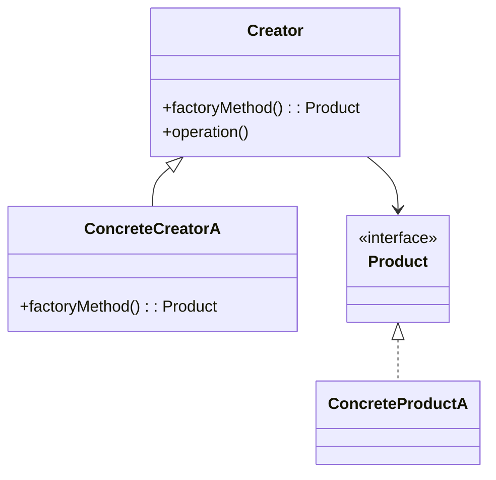
```mermaid
classDiagram
    class Creator {
        +factoryMethod(): Product
        +operation()
    }
    class ConcreteCreatorA {
        +factoryMethod(): Product
    }
    class Product {
        <<interface>>
    }
    class ConcreteProductA
    Creator <|-- ConcreteCreatorA
    Product <|.. ConcreteProductA
    Creator --> Product
```

**Code:**
```java
// Product interface
interface Notification {
    void send(String message);
}

class EmailNotification implements Notification {
    public void send(String message) { System.out.println("Email: " + message); }
}

class SMSNotification implements Notification {
    public void send(String message) { System.out.println("SMS: " + message); }
}

// Factory
class NotificationFactory {
    public static Notification create(String type) {
        return switch (type) {
            case "EMAIL" -> new EmailNotification();
            case "SMS" -> new SMSNotification();
            default -> throw new IllegalArgumentException("Unknown type: " + type);
        };
    }
}
```

**LLD Problems:** Notification System, Document Editor (PDF/Word/Excel), Payment Gateway, Vehicle Rental System, Shape Drawing.

---

### 3. Abstract Factory

**What:** Provides an interface for creating families of related objects without specifying their concrete classes. Factory of factories.

**When to use:** System needs to be independent of how its products are created; needs to work with multiple families of products.

**Mermaid UML:**
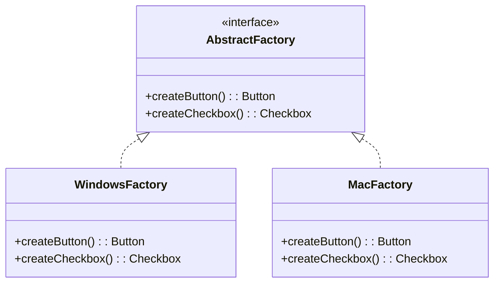
```mermaid
classDiagram
    class AbstractFactory {
        <<interface>>
        +createButton(): Button
        +createCheckbox(): Checkbox
    }
    class WindowsFactory {
        +createButton(): Button
        +createCheckbox(): Checkbox
    }
    class MacFactory {
        +createButton(): Button
        +createCheckbox(): Checkbox
    }
    AbstractFactory <|.. WindowsFactory
    AbstractFactory <|.. MacFactory
```

**Code:**
```java
interface UIFactory {
    Button createButton();
    TextField createTextField();
}

class DarkThemeFactory implements UIFactory {
    public Button createButton() { return new DarkButton(); }
    public TextField createTextField() { return new DarkTextField(); }
}

class LightThemeFactory implements UIFactory {
    public Button createButton() { return new LightButton(); }
    public TextField createTextField() { return new LightTextField(); }
}

// Client uses factory without knowing concrete classes
class Application {
    private Button button;
    public Application(UIFactory factory) {
        this.button = factory.createButton();
    }
}
```

**LLD Problems:** Cross-platform UI toolkit, Database driver family, Theme engine, Document format family.

---

### 4. Builder

**What:** Separates construction of a complex object from its representation, allowing the same construction process to create different representations. Avoids telescoping constructors.

**When to use:** Object has many optional parameters; step-by-step construction needed; immutable object with many fields.

**Mermaid UML:**
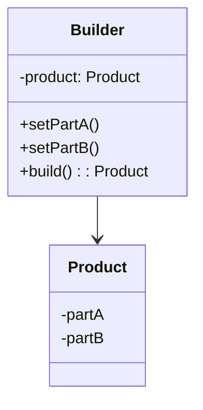
```mermaid
classDiagram
    class Builder {
        -product: Product
        +setPartA()
        +setPartB()
        +build(): Product
    }
    class Product {
        -partA
        -partB
    }
    Builder --> Product
```

**Code:**
```java
public class Pizza {
    private final String crust;
    private final String sauce;
    private final boolean cheese;
    private final List<String> toppings;

    private Pizza(Builder builder) {
        this.crust = builder.crust;
        this.sauce = builder.sauce;
        this.cheese = builder.cheese;
        this.toppings = builder.toppings;
    }

    public static class Builder {
        private String crust = "thin";
        private String sauce = "tomato";
        private boolean cheese = true;
        private List<String> toppings = new ArrayList<>();

        public Builder crust(String crust) { this.crust = crust; return this; }
        public Builder sauce(String sauce) { this.sauce = sauce; return this; }
        public Builder cheese(boolean cheese) { this.cheese = cheese; return this; }
        public Builder addTopping(String topping) { toppings.add(topping); return this; }
        public Pizza build() { return new Pizza(this); }
    }
}

// Usage: Pizza p = new Pizza.Builder().crust("thick").addTopping("mushroom").build();
```

**LLD Problems:** Query Builder, Meal Ordering System, URL Builder, Email Builder, Configuration Objects.

---

### 5. Prototype

**What:** Creates new objects by cloning existing instances rather than creating from scratch. Useful when object creation is expensive.

**When to use:** Object creation is costly; need copies with slight modifications; avoid subclasses of factories.

**Mermaid UML:**
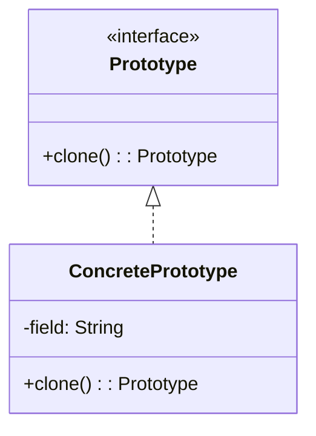
```mermaid
classDiagram
    class Prototype {
        <<interface>>
        +clone(): Prototype
    }
    class ConcretePrototype {
        -field: String
        +clone(): Prototype
    }
    Prototype <|.. ConcretePrototype
```

**Code:**
```java
public abstract class Shape implements Cloneable {
    private String color;
    private int x, y;

    public Shape(Shape source) {
        this.color = source.color;
        this.x = source.x;
        this.y = source.y;
    }

    @Override
    public Shape clone() {
        try { return (Shape) super.clone(); }
        catch (CloneNotSupportedException e) { throw new RuntimeException(e); }
    }
}

class Circle extends Shape {
    private int radius;
    public Circle(Circle source) { super(source); this.radius = source.radius; }
    @Override public Circle clone() { return new Circle(this); }
}

// Registry
class ShapeCache {
    private static Map<String, Shape> cache = new HashMap<>();
    public static Shape get(String id) { return cache.get(id).clone(); }
    public static void put(String id, Shape shape) { cache.put(id, shape); }
}
```

**LLD Problems:** Document template system, Game object spawning, Cell cloning in spreadsheet, Shape editor with copy-paste.

---

## STRUCTURAL PATTERNS

### 6. Adapter

**What:** Converts the interface of a class into another interface clients expect. Allows incompatible interfaces to work together (wrapper pattern).

**When to use:** Integrating legacy code; using third-party libraries with different interfaces; making unrelated classes work together.

**Mermaid UML:**
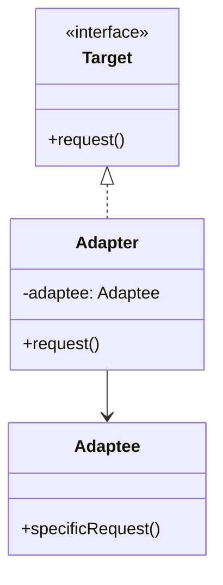
```mermaid
classDiagram
    class Target {
        <<interface>>
        +request()
    }
    class Adapter {
        -adaptee: Adaptee
        +request()
    }
    class Adaptee {
        +specificRequest()
    }
    Target <|.. Adapter
    Adapter --> Adaptee
```

**Code:**
```java
// Existing interface our system uses
interface MediaPlayer {
    void play(String filename);
}

// Third-party library with incompatible interface
class VLCPlayer {
    void playVLC(String filename) { System.out.println("VLC: " + filename); }
}

class FFmpegPlayer {
    void playFFmpeg(String filename) { System.out.println("FFmpeg: " + filename); }
}

// Adapter
class MediaAdapter implements MediaPlayer {
    private VLCPlayer vlcPlayer = new VLCPlayer();
    
    @Override
    public void play(String filename) {
        vlcPlayer.playVLC(filename);  // Adapts interface
    }
}
```

**LLD Problems:** Payment gateway integration, Legacy system migration, Third-party API wrapper, XML-to-JSON converter.

---

### 7. Bridge

**What:** Decouples an abstraction from its implementation so they can vary independently. Prefer composition over inheritance for multi-dimensional variation.

**When to use:** Avoid combinatorial explosion of subclasses; both abstraction and implementation should be extensible independently.

**Mermaid UML:**
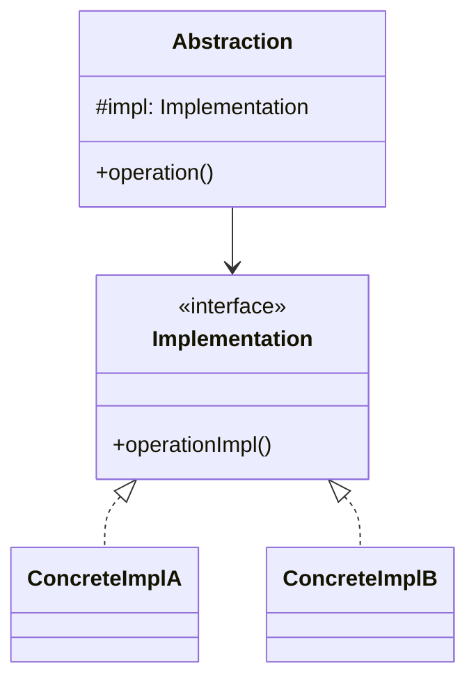
```mermaid
classDiagram
    class Abstraction {
        #impl: Implementation
        +operation()
    }
    class Implementation {
        <<interface>>
        +operationImpl()
    }
    Abstraction --> Implementation
    Implementation <|.. ConcreteImplA
    Implementation <|.. ConcreteImplB
```

**Code:**
```java
// Implementation hierarchy
interface MessageSender {
    void sendMessage(String message, String recipient);
}

class EmailSender implements MessageSender {
    public void sendMessage(String msg, String to) { System.out.println("Email to " + to); }
}

class SmsSender implements MessageSender {
    public void sendMessage(String msg, String to) { System.out.println("SMS to " + to); }
}

// Abstraction hierarchy
abstract class Notification {
    protected MessageSender sender;
    public Notification(MessageSender sender) { this.sender = sender; }
    abstract void notify(String message);
}

class UrgentNotification extends Notification {
    public UrgentNotification(MessageSender sender) { super(sender); }
    void notify(String message) { sender.sendMessage("[URGENT] " + message, "admin"); }
}
```

**LLD Problems:** Shape + Renderer, Remote + Device, Notification type + Channel, Window + Platform.

---

### 8. Composite

**What:** Composes objects into tree structures to represent part-whole hierarchies. Lets clients treat individual objects and compositions uniformly.

**When to use:** Tree structure of objects; clients should ignore difference between leaf and composite nodes.

**Mermaid UML:**
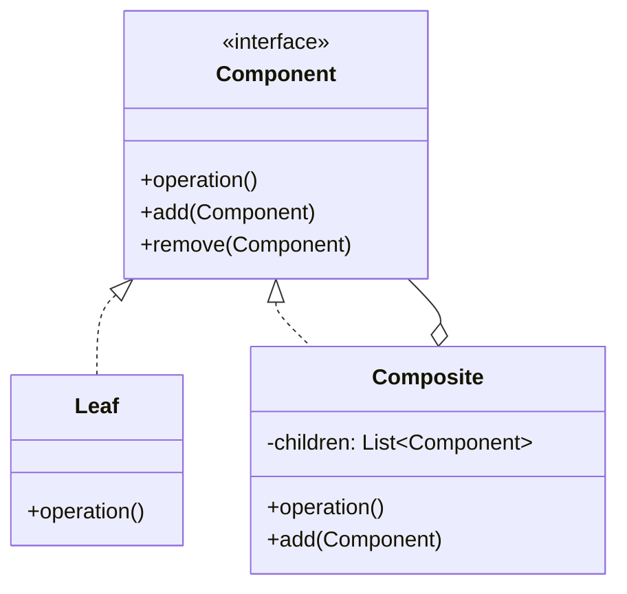
```mermaid
classDiagram
    class Component {
        <<interface>>
        +operation()
        +add(Component)
        +remove(Component)
    }
    class Leaf {
        +operation()
    }
    class Composite {
        -children: List~Component~
        +operation()
        +add(Component)
    }
    Component <|.. Leaf
    Component <|.. Composite
    Composite o-- Component
```

**Code:**
```java
interface FileSystemComponent {
    String getName();
    long getSize();
    void display(String indent);
}

class File implements FileSystemComponent {
    private String name;
    private long size;
    public File(String name, long size) { this.name = name; this.size = size; }
    public String getName() { return name; }
    public long getSize() { return size; }
    public void display(String indent) { System.out.println(indent + name + " (" + size + ")"); }
}

class Directory implements FileSystemComponent {
    private String name;
    private List<FileSystemComponent> children = new ArrayList<>();
    public Directory(String name) { this.name = name; }
    public void add(FileSystemComponent c) { children.add(c); }
    public String getName() { return name; }
    public long getSize() { return children.stream().mapToLong(FileSystemComponent::getSize).sum(); }
    public void display(String indent) {
        System.out.println(indent + name + "/");
        children.forEach(c -> c.display(indent + "  "));
    }
}
```

**LLD Problems:** File System, Organization hierarchy, Menu system, UI Component tree, Arithmetic expressions.

---

### 9. Decorator

**What:** Attaches additional responsibilities to objects dynamically. Provides a flexible alternative to subclassing for extending functionality.

**When to use:** Add behavior at runtime without modifying existing code; avoid class explosion from combining features.

**Mermaid UML:**
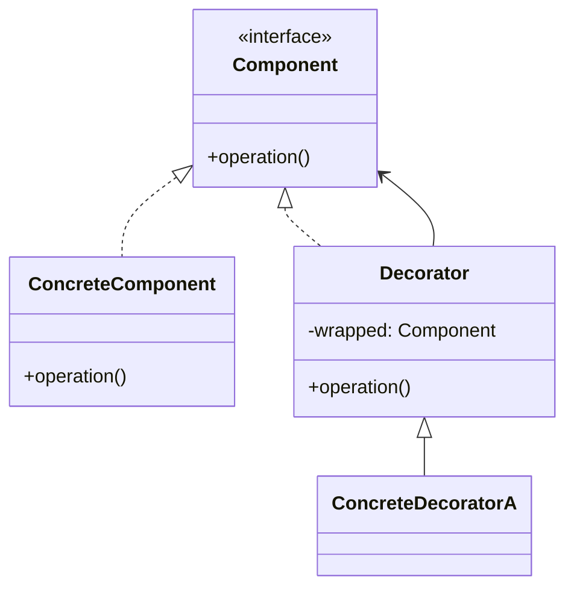
```mermaid
classDiagram
    class Component {
        <<interface>>
        +operation()
    }
    class ConcreteComponent {
        +operation()
    }
    class Decorator {
        -wrapped: Component
        +operation()
    }
    Component <|.. ConcreteComponent
    Component <|.. Decorator
    Decorator --> Component
    Decorator <|-- ConcreteDecoratorA
```

**Code:**
```java
interface Coffee {
    double getCost();
    String getDescription();
}

class SimpleCoffee implements Coffee {
    public double getCost() { return 5.0; }
    public String getDescription() { return "Simple coffee"; }
}

abstract class CoffeeDecorator implements Coffee {
    protected Coffee wrapped;
    public CoffeeDecorator(Coffee coffee) { this.wrapped = coffee; }
}

class MilkDecorator extends CoffeeDecorator {
    public MilkDecorator(Coffee coffee) { super(coffee); }
    public double getCost() { return wrapped.getCost() + 1.5; }
    public String getDescription() { return wrapped.getDescription() + ", milk"; }
}

class WhipDecorator extends CoffeeDecorator {
    public WhipDecorator(Coffee coffee) { super(coffee); }
    public double getCost() { return wrapped.getCost() + 2.0; }
    public String getDescription() { return wrapped.getDescription() + ", whip"; }
}

// Usage: Coffee c = new WhipDecorator(new MilkDecorator(new SimpleCoffee()));
```

**LLD Problems:** Pizza/Coffee topping system, I/O streams, Logging decorators, Encryption layers, Compression.

---

### 10. Facade

**What:** Provides a simplified unified interface to a complex subsystem. Doesn't prevent direct access to subsystem but provides an easy default.

**When to use:** Simplify complex subsystem usage; reduce coupling between clients and subsystem; provide layers.

**Mermaid UML:**
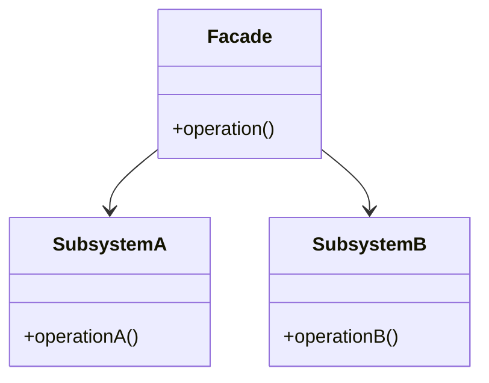
```mermaid
classDiagram
    class Facade {
        +operation()
    }
    class SubsystemA {
        +operationA()
    }
    class SubsystemB {
        +operationB()
    }
    Facade --> SubsystemA
    Facade --> SubsystemB
```

**Code:**
```java
// Complex subsystems
class InventoryService { boolean checkStock(String item) { return true; } }
class PaymentService { boolean charge(String card, double amount) { return true; } }
class ShippingService { String ship(String address) { return "TRACK123"; } }
class NotificationService { void sendEmail(String email, String msg) {} }

// Facade simplifies ordering
class OrderFacade {
    private InventoryService inventory = new InventoryService();
    private PaymentService payment = new PaymentService();
    private ShippingService shipping = new ShippingService();
    private NotificationService notification = new NotificationService();

    public String placeOrder(String item, String card, double amount, String address, String email) {
        if (!inventory.checkStock(item)) throw new RuntimeException("Out of stock");
        if (!payment.charge(card, amount)) throw new RuntimeException("Payment failed");
        String tracking = shipping.ship(address);
        notification.sendEmail(email, "Order shipped! Track: " + tracking);
        return tracking;
    }
}
```

**LLD Problems:** Home Theater system, Order processing, Hotel booking, Computer startup, Compiler.

---

### 11. Flyweight

**What:** Shares common state among many objects to reduce memory usage. Separates intrinsic (shared) state from extrinsic (unique) state.

**When to use:** Large number of similar objects consuming too much memory; most state can be made extrinsic.

**Mermaid UML:**
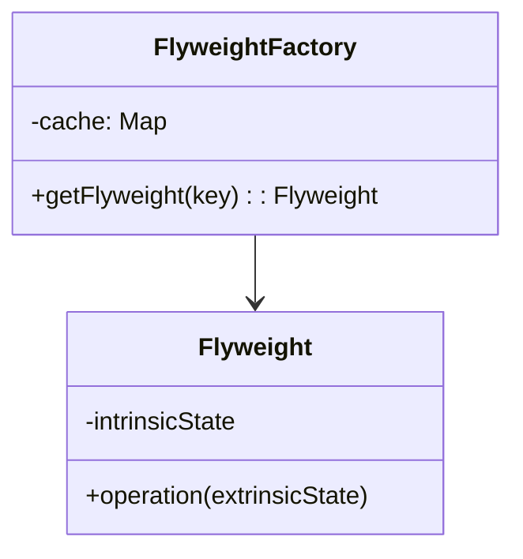
```mermaid
classDiagram
    class FlyweightFactory {
        -cache: Map
        +getFlyweight(key): Flyweight
    }
    class Flyweight {
        -intrinsicState
        +operation(extrinsicState)
    }
    FlyweightFactory --> Flyweight
```

**Code:**
```java
// Flyweight - shared intrinsic state
class CharacterStyle {
    private final String font;
    private final int size;
    private final String color;

    CharacterStyle(String font, int size, String color) {
        this.font = font; this.size = size; this.color = color;
    }
    void render(char c, int x, int y) {
        System.out.println(c + " at (" + x + "," + y + ") in " + font + "/" + size + "/" + color);
    }
}

// Factory ensures sharing
class StyleFactory {
    private static Map<String, CharacterStyle> cache = new HashMap<>();

    public static CharacterStyle getStyle(String font, int size, String color) {
        String key = font + "-" + size + "-" + color;
        return cache.computeIfAbsent(key, k -> new CharacterStyle(font, size, color));
    }
}

// Context holds extrinsic state
class Character {
    private char c;
    private int x, y;  // extrinsic
    private CharacterStyle style;  // flyweight (shared)
}
```

**LLD Problems:** Text Editor (character formatting), Game (trees/bullets), Map tiles, Icon caching, Connection pool metadata.

---

### 12. Proxy

**What:** Provides a surrogate or placeholder for another object to control access. Can add lazy loading, caching, access control, or logging.

**When to use:** Lazy initialization (virtual proxy); access control (protection proxy); caching (smart proxy); logging; remote access.

**Mermaid UML:**
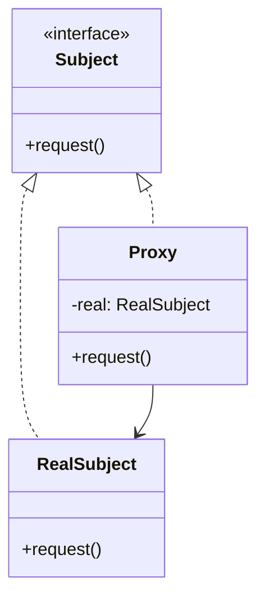
```mermaid
classDiagram
    class Subject {
        <<interface>>
        +request()
    }
    class RealSubject {
        +request()
    }
    class Proxy {
        -real: RealSubject
        +request()
    }
    Subject <|.. RealSubject
    Subject <|.. Proxy
    Proxy --> RealSubject
```

**Code:**
```java
interface Image {
    void display();
}

class RealImage implements Image {
    private String filename;
    public RealImage(String filename) {
        this.filename = filename;
        loadFromDisk();  // expensive
    }
    private void loadFromDisk() { System.out.println("Loading: " + filename); }
    public void display() { System.out.println("Displaying: " + filename); }
}

// Virtual Proxy - lazy loading
class ProxyImage implements Image {
    private String filename;
    private RealImage realImage;

    public ProxyImage(String filename) { this.filename = filename; }

    public void display() {
        if (realImage == null) realImage = new RealImage(filename);  // load on first use
        realImage.display();
    }
}

// Protection Proxy
class SecuredImage implements Image {
    private Image image;
    private User user;
    public void display() {
        if (!user.hasPermission("VIEW_IMAGE")) throw new SecurityException();
        image.display();
    }
}
```

**LLD Problems:** Virtual proxy for expensive objects, Caching proxy, Rate limiter, Access control, Remote service proxy.

---

## BEHAVIORAL PATTERNS

### 13. Chain of Responsibility

**What:** Passes requests along a chain of handlers. Each handler decides to process or pass to the next. Decouples sender from receivers.

**When to use:** Multiple objects may handle a request; handler isn't known a priori; chain should be dynamic.

**Mermaid UML:**
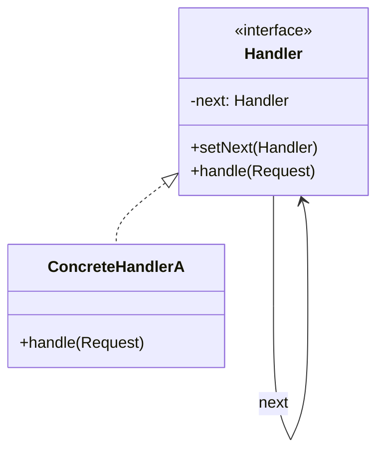
```mermaid
classDiagram
    class Handler {
        <<interface>>
        -next: Handler
        +setNext(Handler)
        +handle(Request)
    }
    class ConcreteHandlerA {
        +handle(Request)
    }
    Handler <|.. ConcreteHandlerA
    Handler --> Handler : next
```

**Code:**
```java
abstract class LogHandler {
    protected LogHandler next;
    protected int level;

    public LogHandler setNext(LogHandler next) { this.next = next; return next; }

    public void handle(int level, String message) {
        if (this.level <= level) write(message);
        if (next != null) next.handle(level, message);
    }
    protected abstract void write(String message);
}

class ConsoleLogger extends LogHandler {
    public ConsoleLogger() { this.level = 1; }
    protected void write(String msg) { System.out.println("Console: " + msg); }
}

class FileLogger extends LogHandler {
    public FileLogger() { this.level = 2; }
    protected void write(String msg) { System.out.println("File: " + msg); }
}

class ErrorLogger extends LogHandler {
    public ErrorLogger() { this.level = 3; }
    protected void write(String msg) { System.err.println("Error: " + msg); }
}

// Setup: console.setNext(file).setNext(error);
```

**LLD Problems:** Logger, Middleware pipeline, Expense approval, ATM dispenser, Request validation, Event propagation.

---

### 14. Command

**What:** Encapsulates a request as an object, allowing parameterization, queuing, logging, and undo operations. Decouples invoker from receiver.

**When to use:** Parameterize objects with operations; queue/schedule execution; support undo/redo; logging.

**Mermaid UML:**
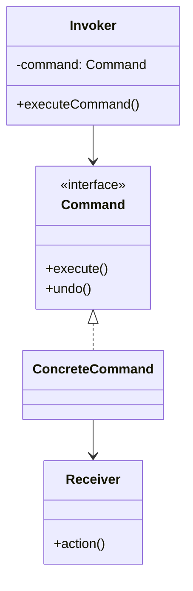
```mermaid
classDiagram
    class Command {
        <<interface>>
        +execute()
        +undo()
    }
    class Invoker {
        -command: Command
        +executeCommand()
    }
    class Receiver {
        +action()
    }
    Invoker --> Command
    Command <|.. ConcreteCommand
    ConcreteCommand --> Receiver
```

**Code:**
```java
interface Command {
    void execute();
    void undo();
}

class Light {
    void turnOn() { System.out.println("Light ON"); }
    void turnOff() { System.out.println("Light OFF"); }
}

class TurnOnCommand implements Command {
    private Light light;
    public TurnOnCommand(Light light) { this.light = light; }
    public void execute() { light.turnOn(); }
    public void undo() { light.turnOff(); }
}

class RemoteControl {
    private Deque<Command> history = new ArrayDeque<>();

    public void pressButton(Command cmd) {
        cmd.execute();
        history.push(cmd);
    }
    public void pressUndo() {
        if (!history.isEmpty()) history.pop().undo();
    }
}
```

**LLD Problems:** Text Editor (undo/redo), Remote Control, Task Scheduler, Transaction system, Macro recording.

---

### 15. Iterator

**What:** Provides a way to access elements of a collection sequentially without exposing its underlying representation.

**When to use:** Uniform traversal of different collections; multiple traversals needed simultaneously; hide collection internals.

**Mermaid UML:**
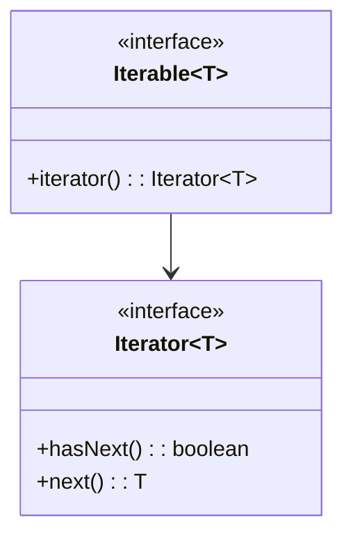
```mermaid
classDiagram
    class Iterator~T~ {
        <<interface>>
        +hasNext(): boolean
        +next(): T
    }
    class Iterable~T~ {
        <<interface>>
        +iterator(): Iterator~T~
    }
    Iterable --> Iterator
```

**Code:**
```java
class BrowserHistory implements Iterable<String> {
    private List<String> urls = new ArrayList<>();

    public void visit(String url) { urls.add(url); }

    @Override
    public Iterator<String> iterator() {
        return new Iterator<>() {
            private int index = 0;
            public boolean hasNext() { return index < urls.size(); }
            public String next() { return urls.get(index++); }
        };
    }

    // Reverse iterator
    public Iterator<String> reverseIterator() {
        return new Iterator<>() {
            private int index = urls.size() - 1;
            public boolean hasNext() { return index >= 0; }
            public String next() { return urls.get(index--); }
        };
    }
}
```

**LLD Problems:** Custom collection traversal, Tree traversal (BFS/DFS), Pagination, Playlist navigation, Social network graph traversal.

---

### 16. Mediator

**What:** Defines an object that encapsulates how a set of objects interact. Reduces chaotic many-to-many dependencies by centralizing communication.

**When to use:** Objects communicate in complex ways; tight coupling between many objects; want to reuse objects independently.

**Mermaid UML:**
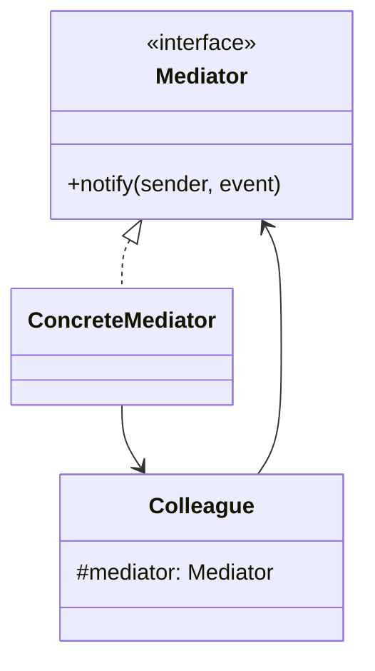
```mermaid
classDiagram
    class Mediator {
        <<interface>>
        +notify(sender, event)
    }
    class Colleague {
        #mediator: Mediator
    }
    Mediator <|.. ConcreteMediator
    Colleague --> Mediator
    ConcreteMediator --> Colleague
```

**Code:**
```java
interface ChatMediator {
    void sendMessage(String message, User sender);
    void addUser(User user);
}

class ChatRoom implements ChatMediator {
    private List<User> users = new ArrayList<>();

    public void addUser(User user) { users.add(user); }

    public void sendMessage(String message, User sender) {
        users.stream()
            .filter(u -> u != sender)
            .forEach(u -> u.receive(message, sender.getName()));
    }
}

class User {
    private String name;
    private ChatMediator mediator;

    public User(String name, ChatMediator mediator) {
        this.name = name;
        this.mediator = mediator;
    }
    public String getName() { return name; }
    public void send(String message) { mediator.sendMessage(message, this); }
    public void receive(String message, String from) {
        System.out.println(name + " received from " + from + ": " + message);
    }
}
```

**LLD Problems:** Chat Room, Air Traffic Control, UI Dialog coordination, Auction system, Smart Home controller.

---

### 17. Memento

**What:** Captures and externalizes an object's internal state without violating encapsulation, so it can be restored later.

**When to use:** Need undo/rollback; checkpoint/restore functionality; preserve encapsulation of state.

**Mermaid UML:**
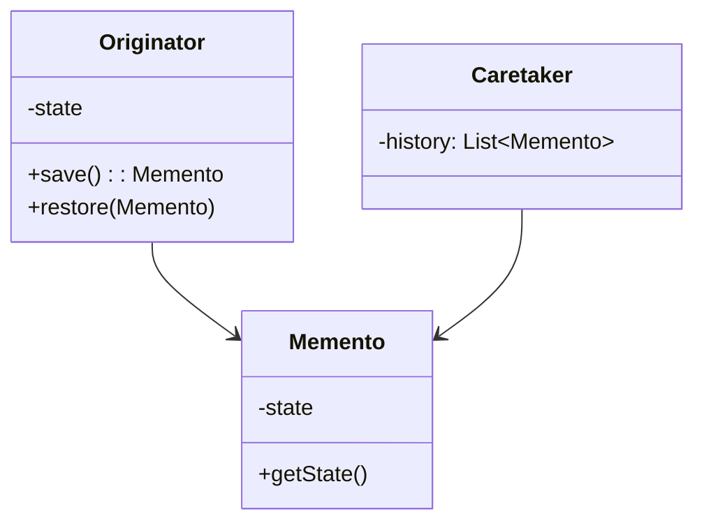
```mermaid
classDiagram
    class Originator {
        -state
        +save(): Memento
        +restore(Memento)
    }
    class Memento {
        -state
        +getState()
    }
    class Caretaker {
        -history: List~Memento~
    }
    Originator --> Memento
    Caretaker --> Memento
```

**Code:**
```java
// Memento
class EditorState {
    private final String content;
    private final int cursorPosition;
    EditorState(String content, int cursorPosition) {
        this.content = content; this.cursorPosition = cursorPosition;
    }
    String getContent() { return content; }
    int getCursorPosition() { return cursorPosition; }
}

// Originator
class TextEditor {
    private String content = "";
    private int cursorPosition = 0;

    public void type(String text) { content += text; cursorPosition += text.length(); }
    public EditorState save() { return new EditorState(content, cursorPosition); }
    public void restore(EditorState state) {
        this.content = state.getContent();
        this.cursorPosition = state.getCursorPosition();
    }
}

// Caretaker
class History {
    private Deque<EditorState> states = new ArrayDeque<>();
    public void push(EditorState state) { states.push(state); }
    public EditorState pop() { return states.pop(); }
}
```

**LLD Problems:** Text Editor undo, Game save/load, Transaction rollback, Form draft saving, Version control.

---

### 18. Observer

**What:** Defines a one-to-many dependency so that when one object changes state, all dependents are notified automatically. Pub-Sub pattern.

**When to use:** Change in one object requires changing others; don't know how many objects need to change; loose coupling between objects.

**Mermaid UML:**
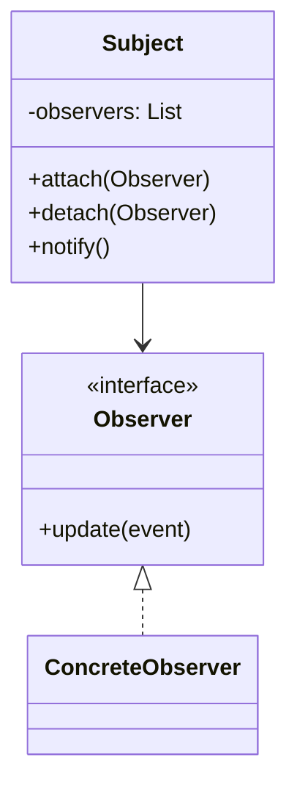
```mermaid
classDiagram
    class Subject {
        -observers: List
        +attach(Observer)
        +detach(Observer)
        +notify()
    }
    class Observer {
        <<interface>>
        +update(event)
    }
    Subject --> Observer
    Observer <|.. ConcreteObserver
```

**Code:**
```java
interface EventListener {
    void update(String eventType, String data);
}

class EventManager {
    private Map<String, List<EventListener>> listeners = new HashMap<>();

    public void subscribe(String eventType, EventListener listener) {
        listeners.computeIfAbsent(eventType, k -> new ArrayList<>()).add(listener);
    }

    public void unsubscribe(String eventType, EventListener listener) {
        listeners.getOrDefault(eventType, List.of()).remove(listener);
    }

    public void notify(String eventType, String data) {
        listeners.getOrDefault(eventType, List.of())
            .forEach(l -> l.update(eventType, data));
    }
}

class StockPriceAlert implements EventListener {
    public void update(String event, String data) {
        System.out.println("Stock alert: " + event + " - " + data);
    }
}
```

**LLD Problems:** Notification system, Stock ticker, Event bus, Social media feed, Weather station, MVC.

---

### 19. State

**What:** Allows an object to change its behavior when its internal state changes. The object appears to change its class.

**When to use:** Object behavior depends on state and changes at runtime; complex conditional state logic; finite state machine.

**Mermaid UML:**
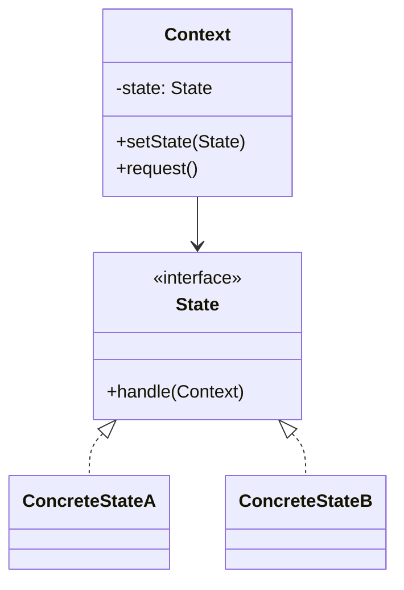
```mermaid
classDiagram
    class Context {
        -state: State
        +setState(State)
        +request()
    }
    class State {
        <<interface>>
        +handle(Context)
    }
    Context --> State
    State <|.. ConcreteStateA
    State <|.. ConcreteStateB
```

**Code:**
```java
interface VendingState {
    void insertCoin(VendingMachine machine);
    void selectProduct(VendingMachine machine);
    void dispense(VendingMachine machine);
}

class IdleState implements VendingState {
    public void insertCoin(VendingMachine m) {
        System.out.println("Coin inserted");
        m.setState(new HasCoinState());
    }
    public void selectProduct(VendingMachine m) { System.out.println("Insert coin first"); }
    public void dispense(VendingMachine m) { System.out.println("Insert coin first"); }
}

class HasCoinState implements VendingState {
    public void insertCoin(VendingMachine m) { System.out.println("Already has coin"); }
    public void selectProduct(VendingMachine m) {
        System.out.println("Product selected");
        m.setState(new DispensingState());
    }
    public void dispense(VendingMachine m) { System.out.println("Select product first"); }
}

class VendingMachine {
    private VendingState state = new IdleState();
    public void setState(VendingState state) { this.state = state; }
    public void insertCoin() { state.insertCoin(this); }
    public void selectProduct() { state.selectProduct(this); }
    public void dispense() { state.dispense(this); }
}
```

**LLD Problems:** Vending Machine, ATM, Elevator, Traffic Light, Order Status, Media Player, Document Workflow.

---

### 20. Strategy

**What:** Defines a family of algorithms, encapsulates each one, and makes them interchangeable. Lets the algorithm vary independently from clients.

**When to use:** Multiple algorithms for a task; algorithm selection at runtime; avoid conditionals for selecting behavior.

**Mermaid UML:**
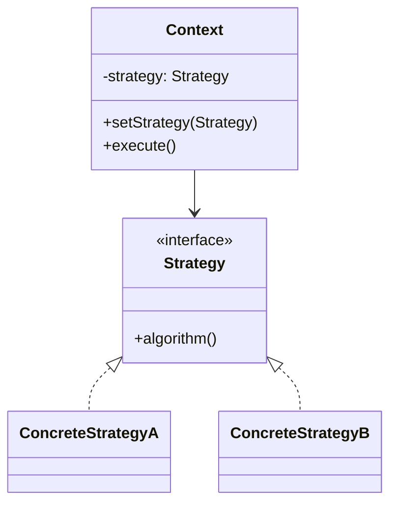
```mermaid
classDiagram
    class Context {
        -strategy: Strategy
        +setStrategy(Strategy)
        +execute()
    }
    class Strategy {
        <<interface>>
        +algorithm()
    }
    Context --> Strategy
    Strategy <|.. ConcreteStrategyA
    Strategy <|.. ConcreteStrategyB
```

**Code:**
```java
interface PaymentStrategy {
    void pay(double amount);
}

class CreditCardPayment implements PaymentStrategy {
    private String cardNumber;
    public CreditCardPayment(String card) { this.cardNumber = card; }
    public void pay(double amount) { System.out.println("Paid $" + amount + " via CC: " + cardNumber); }
}

class UPIPayment implements PaymentStrategy {
    private String upiId;
    public UPIPayment(String upi) { this.upiId = upi; }
    public void pay(double amount) { System.out.println("Paid $" + amount + " via UPI: " + upiId); }
}

class ShoppingCart {
    private PaymentStrategy strategy;
    public void setPaymentStrategy(PaymentStrategy s) { this.strategy = s; }
    public void checkout(double amount) { strategy.pay(amount); }
}

// Usage: cart.setPaymentStrategy(new UPIPayment("user@upi")); cart.checkout(100);
```

**LLD Problems:** Payment processing, Sorting algorithms, Compression, Route finding, Discount calculation, Authentication.

---

### 21. Template Method

**What:** Defines the skeleton of an algorithm in a base class, letting subclasses override specific steps without changing the algorithm's structure.

**When to use:** Multiple classes have similar algorithms with minor variations; control extension points; avoid code duplication.

**Mermaid UML:**
```mermaid
classDiagram
    class AbstractClass {
        +templateMethod()
        #step1()
        #step2()*
        #hook()
    }
    class ConcreteClass {
        #step2()
    }
    AbstractClass <|-- ConcreteClass
```

**Code:**
```java
abstract class DataParser {
    // Template method - final to prevent override
    public final void parse(String file) {
        openFile(file);
        String data = readData();
        List<Object> parsed = processData(data);
        if (shouldLog()) logResults(parsed);  // hook
        closeFile();
    }

    void openFile(String file) { System.out.println("Opening: " + file); }
    abstract String readData();
    abstract List<Object> processData(String data);
    void closeFile() { System.out.println("Closing file"); }

    // Hook - optional override
    boolean shouldLog() { return true; }
    void logResults(List<Object> results) { System.out.println("Parsed: " + results.size()); }
}

class CSVParser extends DataParser {
    String readData() { return "csv,data"; }
    List<Object> processData(String data) { return Arrays.asList(data.split(",")); }
}

class JSONParser extends DataParser {
    String readData() { return "{\"key\":\"value\"}"; }
    List<Object> processData(String data) { return List.of(data); }
    boolean shouldLog() { return false; }
}
```

**LLD Problems:** Data parsers, Game loop, Build process, Test framework, Report generation, Beverage preparation.

---

### 22. Visitor

**What:** Lets you add new operations to existing object structures without modifying them. Separates algorithm from object structure.

**When to use:** Many distinct operations on structure; structure rarely changes but operations change frequently; avoid polluting classes with unrelated operations.

**Mermaid UML:**
```mermaid
classDiagram
    class Visitor {
        <<interface>>
        +visitCircle(Circle)
        +visitRectangle(Rectangle)
    }
    class Element {
        <<interface>>
        +accept(Visitor)
    }
    Element <|.. Circle
    Element <|.. Rectangle
    Visitor <|.. AreaCalculator
    Visitor <|.. DrawingVisitor
```

**Code:**
```java
interface ShapeVisitor {
    void visit(Circle circle);
    void visit(Rectangle rectangle);
}

interface Shape {
    void accept(ShapeVisitor visitor);
}

class Circle implements Shape {
    double radius;
    Circle(double r) { radius = r; }
    public void accept(ShapeVisitor v) { v.visit(this); }
}

class Rectangle implements Shape {
    double width, height;
    Rectangle(double w, double h) { width = w; height = h; }
    public void accept(ShapeVisitor v) { v.visit(this); }
}

class AreaCalculator implements ShapeVisitor {
    private double totalArea = 0;
    public void visit(Circle c) { totalArea += Math.PI * c.radius * c.radius; }
    public void visit(Rectangle r) { totalArea += r.width * r.height; }
    public double getTotal() { return totalArea; }
}

// Usage: shapes.forEach(s -> s.accept(areaCalculator));
```

**LLD Problems:** Tax calculation on different items, Export formats, AST operations, Document rendering, Shopping cart pricing.

---

### 23. Interpreter

**What:** Defines a grammar and an interpreter to process sentences in that language. Each rule in the grammar becomes a class.

**When to use:** Simple language/grammar to interpret; grammar is simple and efficiency isn't critical.

**Mermaid UML:**
```mermaid
classDiagram
    class Expression {
        <<interface>>
        +interpret(Context): int
    }
    class NumberExpression {
        +interpret(): int
    }
    class AddExpression {
        -left: Expression
        -right: Expression
        +interpret(): int
    }
    Expression <|.. NumberExpression
    Expression <|.. AddExpression
```

**Code:**
```java
interface Expression {
    int interpret();
}

class NumberExpression implements Expression {
    private int number;
    NumberExpression(int number) { this.number = number; }
    public int interpret() { return number; }
}

class AddExpression implements Expression {
    private Expression left, right;
    AddExpression(Expression left, Expression right) { this.left = left; this.right = right; }
    public int interpret() { return left.interpret() + right.interpret(); }
}

class MultiplyExpression implements Expression {
    private Expression left, right;
    MultiplyExpression(Expression left, Expression right) { this.left = left; this.right = right; }
    public int interpret() { return left.interpret() * right.interpret(); }
}

// Usage: Expression expr = new AddExpression(new NumberExpression(3), new MultiplyExpression(new NumberExpression(2), new NumberExpression(5)));
// expr.interpret() = 13
```

**LLD Problems:** Calculator, SQL parser, Regular expressions, Rule engine, Boolean expression evaluator.

---

## ENTERPRISE / ADDITIONAL PATTERNS

### 24. Repository Pattern

**What:** Mediates between domain and data mapping layers. Provides a collection-like interface for accessing domain objects, abstracting persistence.

```java
interface UserRepository {
    Optional<User> findById(String id);
    List<User> findByName(String name);
    void save(User user);
    void delete(String id);
}

class InMemoryUserRepository implements UserRepository {
    private Map<String, User> store = new ConcurrentHashMap<>();
    public Optional<User> findById(String id) { return Optional.ofNullable(store.get(id)); }
    public List<User> findByName(String name) {
        return store.values().stream().filter(u -> u.getName().equals(name)).toList();
    }
    public void save(User user) { store.put(user.getId(), user); }
    public void delete(String id) { store.remove(id); }
}
```

**LLD Problems:** Any system with data access layer abstraction.

---

### 25. Null Object Pattern

**What:** Provides a default do-nothing object instead of null references. Eliminates null checks throughout the code.

```java
interface Logger {
    void log(String message);
}

class ConsoleLogger implements Logger {
    public void log(String message) { System.out.println(message); }
}

class NullLogger implements Logger {
    public void log(String message) { /* do nothing */ }
}

// Usage: Logger logger = config.isDebug() ? new ConsoleLogger() : new NullLogger();
// No null checks needed anywhere
```

**LLD Problems:** Optional logging, Default behaviors, Guest user with no permissions.

---

### 26. Object Pool Pattern

**What:** Reuses expensive-to-create objects from a pool instead of creating/destroying them repeatedly.

```java
class ConnectionPool {
    private final BlockingQueue<Connection> pool;
    private final int maxSize;

    public ConnectionPool(int maxSize) {
        this.maxSize = maxSize;
        this.pool = new LinkedBlockingQueue<>(maxSize);
        for (int i = 0; i < maxSize; i++) pool.offer(createConnection());
    }

    public Connection acquire() throws InterruptedException { return pool.take(); }
    public void release(Connection conn) { pool.offer(conn); }
    private Connection createConnection() { return new Connection(); }
}
```

**LLD Problems:** Database connection pool, Thread pool, Game object pool, Socket pool.

---

### 27. Event Sourcing

**What:** Stores state changes as a sequence of events rather than current state. Full audit trail and ability to rebuild state.

```java
interface DomainEvent { LocalDateTime getTimestamp(); }

class MoneyDeposited implements DomainEvent {
    double amount;
    LocalDateTime timestamp;
    // ...
}

class BankAccount {
    private List<DomainEvent> events = new ArrayList<>();
    private double balance = 0;

    public void apply(DomainEvent event) {
        events.add(event);
        if (event instanceof MoneyDeposited e) balance += e.amount;
        if (event instanceof MoneyWithdrawn e) balance -= e.amount;
    }

    public double getBalance() { return balance; }
    public List<DomainEvent> getHistory() { return Collections.unmodifiableList(events); }
}
```

**LLD Problems:** Banking system, Shopping cart, Version control, Audit logging.

---

## PATTERN SELECTION CHEAT SHEET

| Problem                                    | Pattern(s)                        |
|--------------------------------------------|-----------------------------------|
| Only one instance needed                   | Singleton                         |
| Create objects without specifying class    | Factory Method, Abstract Factory  |
| Complex object construction                | Builder                           |
| Clone expensive objects                    | Prototype                         |
| Make incompatible interfaces work          | Adapter                           |
| Separate abstraction from implementation   | Bridge                            |
| Tree structures                            | Composite                         |
| Add behavior dynamically                   | Decorator                         |
| Simplify complex subsystem                 | Facade                            |
| Share objects to save memory               | Flyweight                         |
| Control access / lazy load                 | Proxy                             |
| Pass request along chain                   | Chain of Responsibility           |
| Encapsulate request + undo                 | Command                           |
| Traverse collection uniformly             | Iterator                          |
| Centralize complex communication           | Mediator                          |
| Save/restore state                         | Memento                           |
| Notify dependents of change                | Observer                          |
| Behavior depends on state                  | State                             |
| Swap algorithms at runtime                 | Strategy                          |
| Algorithm skeleton with variable steps     | Template Method                   |
| Add operations without modifying classes   | Visitor                           |
| Parse simple grammar                       | Interpreter                       |

---

## COMMON LLD PROBLEM → PATTERN MAPPING

| LLD Problem             | Key Patterns Used                                      |
|-------------------------|--------------------------------------------------------|
| Parking Lot             | Strategy, Factory, Observer, Singleton                 |
| Elevator System         | State, Strategy, Observer, Command                     |
| Vending Machine         | State, Factory, Singleton                              |
| Chess/Tic-Tac-Toe      | State, Strategy, Command, Observer                     |
| Hotel Booking           | Builder, Factory, Observer, Strategy                   |
| File System             | Composite, Iterator, Visitor                           |
| Notification System     | Observer, Factory, Strategy, Decorator                 |
| Cache (LRU)            | Singleton, Strategy, Proxy                             |
| Logging Framework       | Singleton, Chain of Responsibility, Strategy, Decorator|
| Payment System          | Strategy, Factory, Adapter, Facade                     |
| Snake & Ladder          | State, Strategy, Observer                              |
| ATM Machine             | State, Chain of Responsibility, Command                |
| Splitwise               | Observer, Strategy, Facade, Command                    |
| Amazon/Flipkart         | Factory, Strategy, Observer, Decorator, Facade         |
| BookMyShow              | Observer, Strategy, Proxy, Singleton                   |
| Uber/Ola               | Strategy, Observer, State, Factory, Proxy              |
| Library Management      | Factory, Observer, Strategy, Iterator                  |
| Stack Overflow          | Observer, Strategy, Composite, Decorator               |

---

## KEY PRINCIPLES TO REMEMBER

1. **SOLID Principles** - Every pattern supports one or more SOLID principles
2. **Favor composition over inheritance** - Bridge, Strategy, Decorator, Composite
3. **Program to interface, not implementation** - All patterns
4. **Identify what varies and encapsulate it** - Strategy, State, Factory
5. **Open/Closed Principle** - Decorator, Strategy, Observer, Visitor
6. **Single Responsibility** - Command, Observer, Chain of Responsibility
7. **Dependency Inversion** - Factory, Abstract Factory, Strategy, Bridge

---

*Total: 23 GoF + 4 Enterprise patterns with Java implementations, UML diagrams, and LLD problem mappings.*
