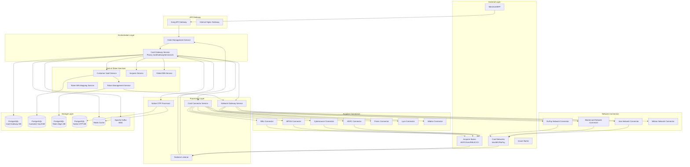
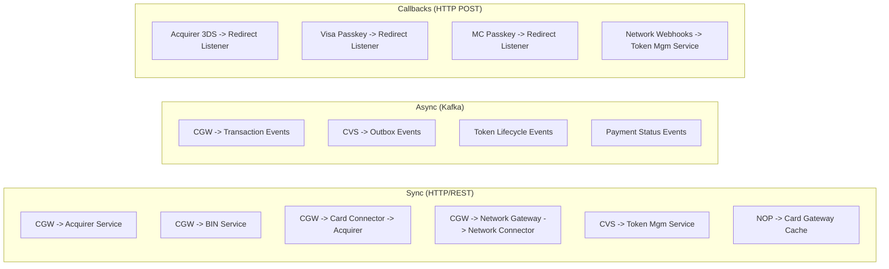
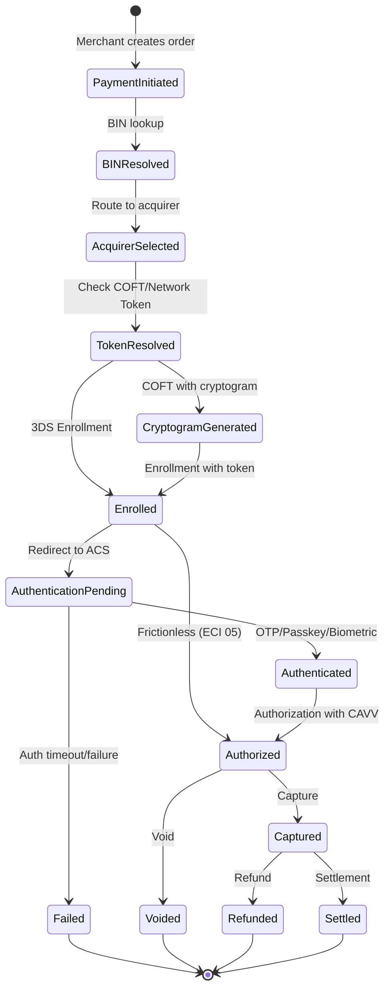
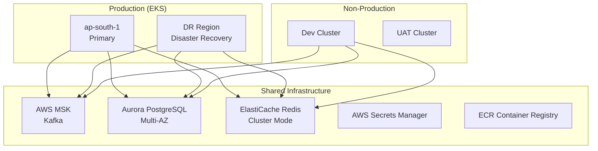

# Card Gateway Architecture Overview

## High-Level System Architecture



## Service Communication Patterns



## Technology Stack

| Layer | Technology | Details |
|-------|-----------|---------|
| **Orchestration** | Java 11, Spring Boot 2.7, WebFlux | Card Gateway, Redirect Listener, Acquirer Service |
| **NXT Services** | Kotlin 1.9+, Ktor 2.3 | Network Gateway, Customer Vault, Token Mgm, Native OTP |
| **Network Connectors** | Java, Spring Boot WebFlux | Visa, Mastercard, RuPay |
| **Acquirer Connectors** | Java, Spring Boot WebFlux | HDFC, MPGS, Cybersource, RBL, Fiserv |
| **Database** | PostgreSQL (Aurora RDS) | Primary data store (migrating from MSSQL) |
| **Cache** | Redis (ElastiCache) | Payment session, acquirer config, BIN data |
| **Messaging** | Apache Kafka (AWS MSK) | Event streaming with IAM auth |
| **Discovery** | Kubernetes DNS + Nginx Ingress | Internal service mesh |
| **Config** | Spring Cloud Config Server | Git-backed config per environment |
| **Observability** | OpenTelemetry, Prometheus, Loki, Grafana | Traces, metrics, logs |

## Data Flow - Card Payment Lifecycle



## Service Responsibilities Matrix

| Responsibility | Service | Notes |
|---------------|---------|-------|
| Payment orchestration | Card Gateway | Process, Auth, Capture, Refund, Void, Inquiry |
| Acquirer routing | Card Gateway + Acquirer Service | Based on merchant config, BIN, network |
| Connector dispatch | Card Connector Service | Routes to per-acquirer connector |
| 3DS enrollment | Acquirer Connectors | Via acquirer's 3DS server |
| Network token provisioning | Network Gateway Service | TRID, Enroll, Cryptogram, Delete |
| Token storage | Token Management Service | CRUD, lifecycle, cryptogram delegation |
| Customer management | Customer Vault Service | Profiles, saved cards, OTP |
| BIN resolution | Global BIN Service | Card type, issuer, network, country |
| Token-BIN mapping | Token BIN Mapping Service | Network token to PAN BIN resolution |
| Native OTP | Native OTP Processor | ACS page bypass for select issuers |
| Async callbacks | Redirect Listener | 3DS, passkey, wallet callbacks |
| Passkey auth | Network Gateway + VNC | Visa VPP, MC SRC passkey |

## Environment Architecture



## Key Integration Points

### External Network APIs
- **Visa**: VTS (Visa Token Service) for CoFT, VPP (Visa Payment Passkey) for authentication
- **Mastercard**: MDES (Mastercard Digital Enablement Service), SRC (Secure Remote Commerce)
- **RuPay/NPCI**: TokenHub for CoFT, via direct API or Wibmo/HDFC-FSS proxy

### Internal Service Dependencies
```
Card Gateway depends on:
  ├── Acquirer Service (merchant-acquirer config)
  ├── Global BIN Service (card metadata)
  ├── Card Connector Service (acquirer dispatch)
  ├── Network Gateway Service (tokenization + passkey)
  ├── Customer Vault Service (saved cards lookup)
  ├── Native OTP Processor (native auth)
  ├── Redirect Listener (async callback receiver)
  ├── Token BIN Mapping Service (token BIN resolution)
  └── OMS (order lifecycle management)
```
