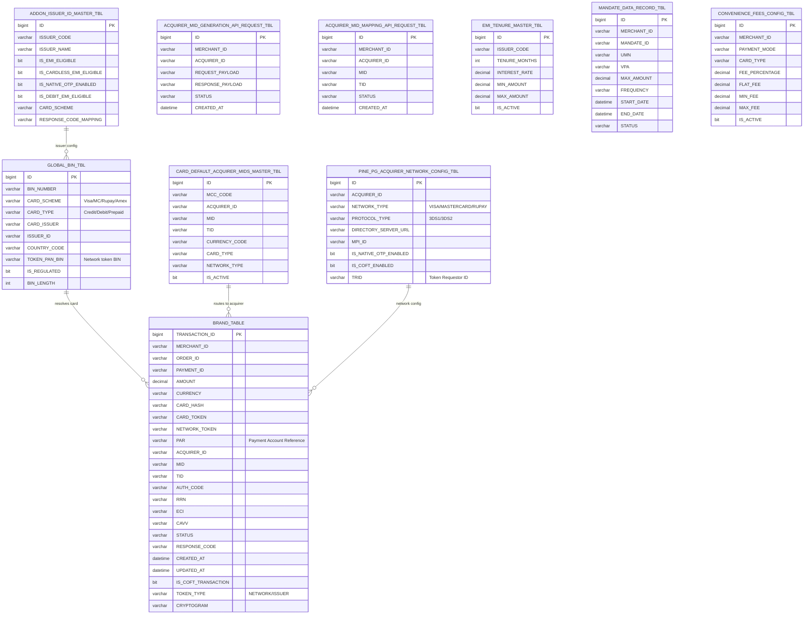

# Card Gateway Database Schema

## Entity-Relationship Diagram



## Key Tables - DDL

### GLOBAL_BIN_TBL
Primary BIN lookup table for card identification.

```sql
CREATE TABLE GLOBAL_BIN_TBL (
    ID                  BIGINT IDENTITY(1,1) PRIMARY KEY,
    BIN_NUMBER          VARCHAR(12) NOT NULL,
    CARD_SCHEME         VARCHAR(50) NOT NULL,       -- VISA, MASTERCARD, RUPAY, AMEX, DINERS
    CARD_TYPE           VARCHAR(20) NOT NULL,       -- CREDIT, DEBIT, PREPAID
    CARD_ISSUER         VARCHAR(200),
    ISSUER_ID           VARCHAR(50),
    COUNTRY_CODE        VARCHAR(5),
    TOKEN_PAN_BIN       VARCHAR(12),               -- Corresponding network token BIN
    IS_REGULATED        BIT DEFAULT 0,
    BIN_LENGTH          INT DEFAULT 6,
    CARD_CATEGORY       VARCHAR(50),               -- CONSUMER, CORPORATE, COMMERCIAL
    IS_INTERNATIONAL    BIT DEFAULT 0,
    EMI_ELIGIBLE        BIT DEFAULT 0,
    CREATED_AT          DATETIME DEFAULT GETDATE(),
    UPDATED_AT          DATETIME DEFAULT GETDATE(),
    
    INDEX IX_BIN_NUMBER (BIN_NUMBER),
    INDEX IX_ISSUER_ID (ISSUER_ID),
    INDEX IX_CARD_SCHEME (CARD_SCHEME)
);
```

### ADDON_ISSUER_ID_MASTER_TBL
Issuer configuration master controlling feature eligibility.

```sql
CREATE TABLE ADDON_ISSUER_ID_MASTER_TBL (
    ID                          BIGINT IDENTITY(1,1) PRIMARY KEY,
    ISSUER_CODE                 VARCHAR(50) NOT NULL UNIQUE,
    ISSUER_NAME                 VARCHAR(200) NOT NULL,
    IS_EMI_ELIGIBLE             BIT DEFAULT 0,
    IS_CARDLESS_EMI_ELIGIBLE    BIT DEFAULT 0,
    IS_NATIVE_OTP_ENABLED       BIT DEFAULT 0,
    IS_DEBIT_EMI_ELIGIBLE       BIT DEFAULT 0,
    CARD_SCHEME                 VARCHAR(50),
    RESPONSE_CODE_MAPPING       VARCHAR(MAX),      -- JSON response code map
    OTP_LENGTH                  INT DEFAULT 6,
    ACS_URL_PATTERN             VARCHAR(500),
    IS_ACTIVE                   BIT DEFAULT 1,
    CREATED_AT                  DATETIME DEFAULT GETDATE(),
    UPDATED_AT                  DATETIME DEFAULT GETDATE()
);
```

### PINE_PG_ACQUIRER_NETWORK_CONFIG_TBL
Acquirer-network integration configuration.

```sql
CREATE TABLE PINE_PG_ACQUIRER_NETWORK_CONFIG_TBL (
    ID                      BIGINT IDENTITY(1,1) PRIMARY KEY,
    ACQUIRER_ID             VARCHAR(50) NOT NULL,
    NETWORK_TYPE            VARCHAR(20) NOT NULL,   -- VISA, MASTERCARD, RUPAY
    PROTOCOL_TYPE           VARCHAR(10),            -- 3DS1, 3DS2
    DIRECTORY_SERVER_URL    VARCHAR(500),
    MPI_ID                  VARCHAR(100),
    IS_NATIVE_OTP_ENABLED   BIT DEFAULT 0,
    IS_COFT_ENABLED         BIT DEFAULT 0,
    TRID                    VARCHAR(100),           -- Token Requestor ID
    TRID_STATUS             VARCHAR(20),
    DS_REFERENCE_NUMBER     VARCHAR(100),
    THREE_DS_VERSION        VARCHAR(10) DEFAULT '2.2',
    IS_PASSKEY_ENABLED      BIT DEFAULT 0,
    PASSKEY_TYPE            VARCHAR(20),            -- VPP, SRC
    IS_ACTIVE               BIT DEFAULT 1,
    CREATED_AT              DATETIME DEFAULT GETDATE(),
    UPDATED_AT              DATETIME DEFAULT GETDATE(),
    
    UNIQUE INDEX IX_ACQ_NETWORK (ACQUIRER_ID, NETWORK_TYPE)
);
```

### CARD_DEFAULT_ACQUIRER_MIDS_MASTER_TBL
Default acquirer routing based on MCC and card characteristics.

```sql
CREATE TABLE CARD_DEFAULT_ACQUIRER_MIDS_MASTER_TBL (
    ID              BIGINT IDENTITY(1,1) PRIMARY KEY,
    MCC_CODE        VARCHAR(10),
    ACQUIRER_ID     VARCHAR(50) NOT NULL,
    MID             VARCHAR(50) NOT NULL,
    TID             VARCHAR(50),
    CURRENCY_CODE   VARCHAR(5) DEFAULT 'INR',
    CARD_TYPE       VARCHAR(20),                   -- CREDIT, DEBIT, ALL
    NETWORK_TYPE    VARCHAR(20),                   -- VISA, MASTERCARD, RUPAY, ALL
    PRIORITY        INT DEFAULT 1,
    IS_ACTIVE       BIT DEFAULT 1,
    CREATED_AT      DATETIME DEFAULT GETDATE(),
    
    INDEX IX_MCC_ACQUIRER (MCC_CODE, ACQUIRER_ID)
);
```

### BRAND_TABLE (Transaction Record)
Core transaction table storing payment lifecycle data.

```sql
CREATE TABLE "BRAND TABLE" (
    TRANSACTION_ID          BIGINT IDENTITY(1,1) PRIMARY KEY,
    MERCHANT_ID             VARCHAR(50) NOT NULL,
    ORDER_ID                VARCHAR(100) NOT NULL,
    PAYMENT_ID              VARCHAR(100) NOT NULL,
    AMOUNT                  DECIMAL(18,2) NOT NULL,
    CURRENCY                VARCHAR(5) DEFAULT 'INR',
    CARD_HASH               VARCHAR(128),
    CARD_NUMBER_MASKED      VARCHAR(20),
    CARD_TOKEN              VARCHAR(200),          -- Plural token reference
    NETWORK_TOKEN           VARCHAR(200),          -- Network token (DPAN)
    PAR                     VARCHAR(100),          -- Payment Account Reference
    TOKEN_REFERENCE_ID      VARCHAR(100),
    ACQUIRER_ID             VARCHAR(50),
    MID                     VARCHAR(50),
    TID                     VARCHAR(50),
    AUTH_CODE               VARCHAR(20),
    RRN                     VARCHAR(50),
    ECI                     VARCHAR(5),            -- 05=Frictionless, 06=3DS, 07=Attempted
    CAVV                    VARCHAR(100),
    XID                     VARCHAR(100),
    DS_TRANSACTION_ID       VARCHAR(100),
    STATUS                  VARCHAR(30),           -- INITIATED, ENROLLED, AUTHENTICATED, AUTHORIZED, CAPTURED, REFUNDED, VOIDED, FAILED
    RESPONSE_CODE           VARCHAR(10),
    RESPONSE_MESSAGE        VARCHAR(500),
    IS_COFT_TRANSACTION     BIT DEFAULT 0,
    TOKEN_TYPE              VARCHAR(20),           -- NETWORK, ISSUER, NONE
    CRYPTOGRAM              VARCHAR(200),
    CRYPTOGRAM_TYPE         VARCHAR(20),           -- TAVV, DTVV
    ENROLLMENT_STATUS       VARCHAR(20),
    AUTHENTICATION_STATUS   VARCHAR(20),
    THREE_DS_VERSION        VARCHAR(10),
    ACS_URL                 VARCHAR(500),
    PAREQ                   VARCHAR(MAX),
    PARES                   VARCHAR(MAX),
    CREATED_AT              DATETIME DEFAULT GETDATE(),
    UPDATED_AT              DATETIME DEFAULT GETDATE(),
    CAPTURED_AT             DATETIME,
    REFUNDED_AT             DATETIME,
    
    INDEX IX_ORDER_ID (ORDER_ID),
    INDEX IX_PAYMENT_ID (PAYMENT_ID),
    INDEX IX_MERCHANT_ORDER (MERCHANT_ID, ORDER_ID),
    INDEX IX_CARD_HASH (CARD_HASH),
    INDEX IX_STATUS (STATUS),
    INDEX IX_CREATED_AT (CREATED_AT)
);
```

### EMI_TENURE_MASTER_TBL

```sql
CREATE TABLE EMI_TENURE_MASTER_TBL (
    ID              BIGINT IDENTITY(1,1) PRIMARY KEY,
    ISSUER_CODE     VARCHAR(50) NOT NULL,
    TENURE_MONTHS   INT NOT NULL,
    INTEREST_RATE   DECIMAL(5,2) NOT NULL,
    MIN_AMOUNT      DECIMAL(18,2),
    MAX_AMOUNT      DECIMAL(18,2),
    PROCESSING_FEE  DECIMAL(18,2) DEFAULT 0,
    IS_ACTIVE       BIT DEFAULT 1,
    CARD_TYPE       VARCHAR(20),       -- CREDIT, DEBIT
    NETWORK_TYPE    VARCHAR(20),
    CREATED_AT      DATETIME DEFAULT GETDATE(),
    
    INDEX IX_ISSUER_TENURE (ISSUER_CODE, TENURE_MONTHS)
);
```

### ACQUIRER_MID_GENERATION_API_REQUEST_TBL

```sql
CREATE TABLE ACQUIRER_MID_GENERATION_API_REQUEST_TBL (
    ID                  BIGINT IDENTITY(1,1) PRIMARY KEY,
    MERCHANT_ID         VARCHAR(50) NOT NULL,
    ACQUIRER_ID         VARCHAR(50) NOT NULL,
    REQUEST_TYPE        VARCHAR(30),           -- CREATE, UPDATE, INQUIRY
    REQUEST_PAYLOAD     VARCHAR(MAX),
    RESPONSE_PAYLOAD    VARCHAR(MAX),
    STATUS              VARCHAR(20),           -- PENDING, SUCCESS, FAILED
    ERROR_CODE          VARCHAR(10),
    ERROR_MESSAGE       VARCHAR(500),
    RETRY_COUNT         INT DEFAULT 0,
    CREATED_AT          DATETIME DEFAULT GETDATE(),
    UPDATED_AT          DATETIME DEFAULT GETDATE(),
    
    INDEX IX_MERCHANT_ACQUIRER (MERCHANT_ID, ACQUIRER_ID)
);
```

### MANDATE_DATA_RECORD_TBL

```sql
CREATE TABLE MANDATE_DATA_RECORD_TBL (
    ID              BIGINT IDENTITY(1,1) PRIMARY KEY,
    MERCHANT_ID     VARCHAR(50) NOT NULL,
    MANDATE_ID      VARCHAR(100) NOT NULL UNIQUE,
    UMN             VARCHAR(100),          -- Unique Mandate Number
    VPA             VARCHAR(100),
    MAX_AMOUNT      DECIMAL(18,2) NOT NULL,
    FREQUENCY       VARCHAR(20),           -- DAILY, WEEKLY, MONTHLY, YEARLY, ONETIME
    START_DATE      DATETIME NOT NULL,
    END_DATE        DATETIME,
    STATUS          VARCHAR(20),           -- CREATED, APPROVED, PAUSED, REVOKED, EXPIRED
    DEBIT_DAY       INT,
    PAYER_NAME      VARCHAR(200),
    CREATED_AT      DATETIME DEFAULT GETDATE(),
    UPDATED_AT      DATETIME DEFAULT GETDATE(),
    
    INDEX IX_MANDATE_MERCHANT (MERCHANT_ID)
);
```

### CONVENIENCE_FEES_CONFIG_TBL

```sql
CREATE TABLE CONVENIENCE_FEES_CONFIG_TBL (
    ID                  BIGINT IDENTITY(1,1) PRIMARY KEY,
    MERCHANT_ID         VARCHAR(50) NOT NULL,
    PAYMENT_MODE        VARCHAR(30),       -- CARD, NETBANKING, UPI, WALLET
    CARD_TYPE           VARCHAR(20),       -- CREDIT, DEBIT, ALL
    CARD_NETWORK        VARCHAR(20),       -- VISA, MASTERCARD, RUPAY, ALL
    FEE_PERCENTAGE      DECIMAL(5,4),
    FLAT_FEE            DECIMAL(18,2) DEFAULT 0,
    MIN_FEE             DECIMAL(18,2) DEFAULT 0,
    MAX_FEE             DECIMAL(18,2),
    GST_PERCENTAGE      DECIMAL(5,2) DEFAULT 18.00,
    IS_ACTIVE           BIT DEFAULT 1,
    CREATED_AT          DATETIME DEFAULT GETDATE(),
    
    INDEX IX_MERCHANT_MODE (MERCHANT_ID, PAYMENT_MODE)
);
```

## Acquirer Service Tables

```sql
-- Shared with Card Gateway DB or separate Acquirer DB (dual SQL Server + PostgreSQL)

CREATE TABLE ACQUIRER_MASTER (
    ACQUIRER_ID         VARCHAR(50) PRIMARY KEY,
    ACQUIRER_NAME       VARCHAR(200) NOT NULL,
    ACQUIRER_TYPE       VARCHAR(20),           -- BANK, PSP, AGGREGATOR
    IS_ACTIVE           BIT DEFAULT 1,
    SUPPORTS_3DS2       BIT DEFAULT 0,
    SUPPORTS_COFT       BIT DEFAULT 0,
    SUPPORTS_PASSKEY    BIT DEFAULT 0,
    CREATED_AT          DATETIME DEFAULT GETDATE()
);

CREATE TABLE ACQUIRER_MERCHANT_MAPPING (
    ID                  BIGINT IDENTITY(1,1) PRIMARY KEY,
    MERCHANT_ID         VARCHAR(50) NOT NULL,
    ACQUIRER_ID         VARCHAR(50) NOT NULL REFERENCES ACQUIRER_MASTER(ACQUIRER_ID),
    MID                 VARCHAR(50) NOT NULL,
    TID                 VARCHAR(50),
    PRIORITY            INT DEFAULT 1,
    CARD_NETWORK        VARCHAR(20),
    CARD_TYPE           VARCHAR(20),
    IS_ACTIVE           BIT DEFAULT 1,
    
    INDEX IX_MERCHANT_ACQ (MERCHANT_ID, ACQUIRER_ID)
);

CREATE TABLE ACQUIRER_COMM_PARAMS (
    ID                  BIGINT IDENTITY(1,1) PRIMARY KEY,
    MERCHANT_ID         VARCHAR(50) NOT NULL,
    ACQUIRER_ID         VARCHAR(50) NOT NULL,
    MID                 VARCHAR(50) NOT NULL,
    TID                 VARCHAR(50),
    ENCRYPTION_KEY      VARCHAR(500),
    TERMINAL_KEY        VARCHAR(500),
    API_KEY             VARCHAR(500),
    API_SECRET          VARCHAR(500),
    MERCHANT_KEY_ID     VARCHAR(100),
    THREE_DS_KEY        VARCHAR(500),
    WEBHOOK_SECRET      VARCHAR(500),
    IS_ACTIVE           BIT DEFAULT 1,
    
    UNIQUE INDEX IX_MERCHANT_ACQ_MID (MERCHANT_ID, ACQUIRER_ID, MID)
);

CREATE TABLE ACQUIRER_NETWORK_CONFIG_MAPPING (
    ID                      BIGINT IDENTITY(1,1) PRIMARY KEY,
    ACQUIRER_ID             VARCHAR(50) NOT NULL,
    NETWORK_TYPE            VARCHAR(20) NOT NULL,
    DS_URL                  VARCHAR(500),
    MPI_ID                  VARCHAR(100),
    TRID                    VARCHAR(100),
    PROTOCOL_VERSION        VARCHAR(10),
    IS_NETWORK_TOKEN        BIT DEFAULT 0,
    IS_NATIVE_OTP           BIT DEFAULT 0,
    CREATED_AT              DATETIME DEFAULT GETDATE(),
    
    UNIQUE INDEX IX_ACQ_NET (ACQUIRER_ID, NETWORK_TYPE)
);
```

## Notes

- The Card Gateway DB is undergoing migration from **SQL Server to PostgreSQL** (per ADR-0002)
- Current V1 migration contains the complete legacy schema (~6000 lines)
- Flyway migrations V2-V8 add incremental schema changes
- The Acquirer Service supports **dual DB** via `RepositoryFactory` pattern (reads from either SQL Server or PostgreSQL based on config)
- All NXT services (Customer Vault, Token Mgm, Native OTP) use PostgreSQL natively from inception
