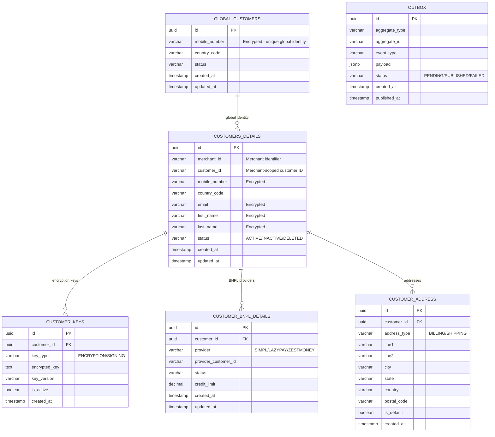
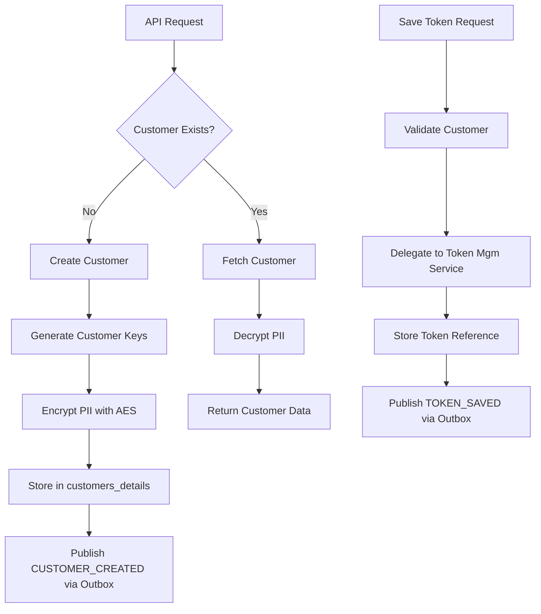

# Customer Vault Database Schema

## Entity-Relationship Diagram



## DDL Statements

### customers_details

```sql
CREATE TABLE customers_details (
    id              UUID PRIMARY KEY DEFAULT gen_random_uuid(),
    merchant_id     VARCHAR(50) NOT NULL,
    customer_id     VARCHAR(100) NOT NULL,
    mobile_number   VARCHAR(500),          -- AES encrypted
    country_code    VARCHAR(10) DEFAULT '+91',
    email           VARCHAR(500),          -- AES encrypted
    first_name      VARCHAR(500),          -- AES encrypted
    last_name       VARCHAR(500),          -- AES encrypted
    status          VARCHAR(20) NOT NULL DEFAULT 'ACTIVE',
    created_at      TIMESTAMP WITH TIME ZONE DEFAULT NOW(),
    updated_at      TIMESTAMP WITH TIME ZONE DEFAULT NOW(),
    
    CONSTRAINT uk_merchant_customer UNIQUE (merchant_id, customer_id)
);

CREATE INDEX idx_customers_merchant_id ON customers_details(merchant_id);
CREATE INDEX idx_customers_mobile ON customers_details(mobile_number);
CREATE INDEX idx_customers_status ON customers_details(status);
```

### global_customers

```sql
CREATE TABLE global_customers (
    id              UUID PRIMARY KEY DEFAULT gen_random_uuid(),
    mobile_number   VARCHAR(500) NOT NULL,  -- AES encrypted, unique global identity
    country_code    VARCHAR(10) NOT NULL DEFAULT '+91',
    status          VARCHAR(20) NOT NULL DEFAULT 'ACTIVE',
    created_at      TIMESTAMP WITH TIME ZONE DEFAULT NOW(),
    updated_at      TIMESTAMP WITH TIME ZONE DEFAULT NOW(),
    
    CONSTRAINT uk_global_mobile UNIQUE (mobile_number, country_code)
);

-- V8: Mobile number is required
ALTER TABLE global_customers ALTER COLUMN mobile_number SET NOT NULL;
```

### customer_keys

```sql
CREATE TABLE customer_keys (
    id              UUID PRIMARY KEY DEFAULT gen_random_uuid(),
    customer_id     UUID NOT NULL REFERENCES customers_details(id),
    key_type        VARCHAR(20) NOT NULL,   -- ENCRYPTION, SIGNING
    encrypted_key   TEXT NOT NULL,          -- Encrypted with master key
    key_version     VARCHAR(10) NOT NULL DEFAULT 'v1',
    is_active       BOOLEAN NOT NULL DEFAULT TRUE,
    created_at      TIMESTAMP WITH TIME ZONE DEFAULT NOW(),
    
    INDEX idx_customer_keys_cust_id (customer_id)
);
```

### customer_bnpl_details

```sql
CREATE TABLE customer_bnpl_details (
    id                      UUID PRIMARY KEY DEFAULT gen_random_uuid(),
    customer_id             UUID NOT NULL REFERENCES customers_details(id),
    provider                VARCHAR(50) NOT NULL,    -- SIMPL, LAZYPAY, ZESTMONEY
    provider_customer_id    VARCHAR(200),
    status                  VARCHAR(20) DEFAULT 'ACTIVE',
    credit_limit            DECIMAL(18,2),
    eligibility_status      VARCHAR(20),
    created_at              TIMESTAMP WITH TIME ZONE DEFAULT NOW(),
    updated_at              TIMESTAMP WITH TIME ZONE DEFAULT NOW(),
    
    CONSTRAINT uk_customer_provider UNIQUE (customer_id, provider)
);
```

### outbox (Event Sourcing)

```sql
CREATE TABLE outbox (
    id              UUID PRIMARY KEY DEFAULT gen_random_uuid(),
    aggregate_type  VARCHAR(100) NOT NULL,  -- CUSTOMER, TOKEN, OTP
    aggregate_id    VARCHAR(200) NOT NULL,  -- Changed from UUID to VARCHAR in V4
    event_type      VARCHAR(100) NOT NULL,  -- CUSTOMER_CREATED, TOKEN_SAVED, etc.
    payload         JSONB NOT NULL,
    status          VARCHAR(20) NOT NULL DEFAULT 'PENDING',
    created_at      TIMESTAMP WITH TIME ZONE DEFAULT NOW(),
    published_at    TIMESTAMP WITH TIME ZONE,
    retry_count     INT DEFAULT 0,
    error_message   TEXT,
    
    INDEX idx_outbox_status (status),
    INDEX idx_outbox_created (created_at)
);

-- V3: Performance indexes
CREATE INDEX idx_outbox_aggregate ON outbox(aggregate_type, aggregate_id);
```

## Data Flow



## Encryption at Rest

All PII fields are encrypted using AES-256 before storage:
- `mobile_number` - AES encrypted
- `email` - AES encrypted
- `first_name` / `last_name` - AES encrypted
- Customer-specific keys stored in `customer_keys` table
- Master encryption key managed via AWS Secrets Manager
