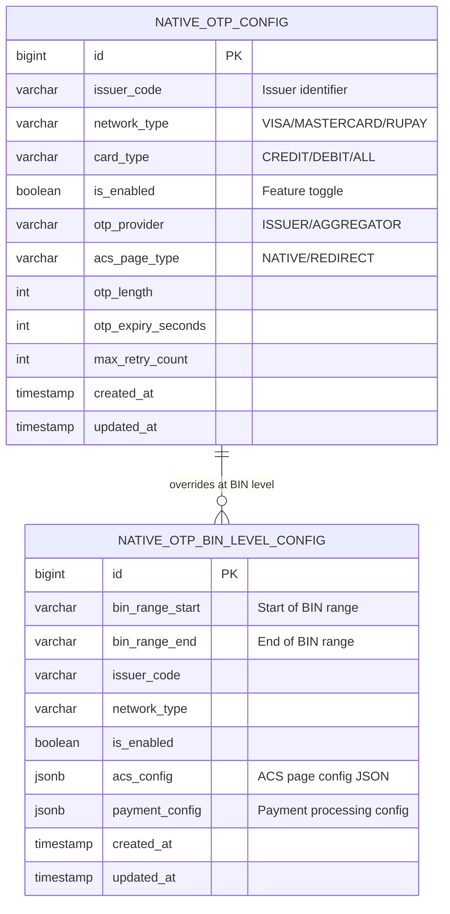
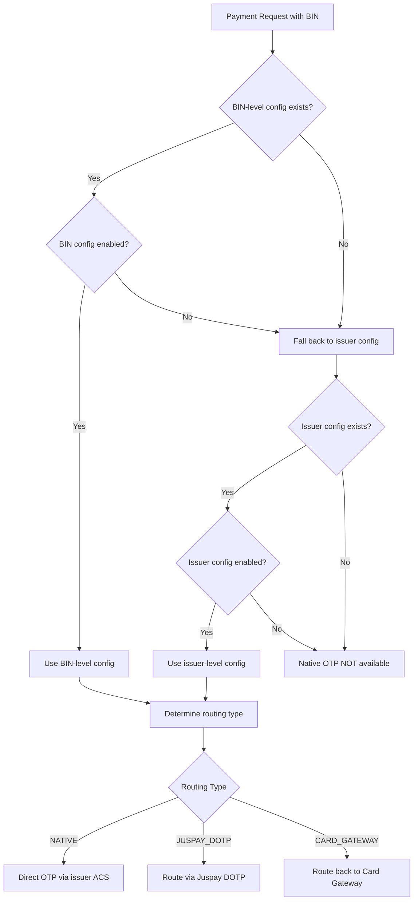

# Native OTP Processor Database Schema

## Entity-Relationship Diagram



## DDL Statements

### native_otp_config

```sql
CREATE TABLE native_otp_config (
    id                  BIGSERIAL PRIMARY KEY,
    issuer_code         VARCHAR(50) NOT NULL,
    network_type        VARCHAR(20) NOT NULL,       -- VISA, MASTERCARD, RUPAY
    card_type           VARCHAR(20) DEFAULT 'ALL',  -- CREDIT, DEBIT, PREPAID, ALL
    is_enabled          BOOLEAN NOT NULL DEFAULT FALSE,
    otp_provider        VARCHAR(30),                -- ISSUER, BANK_AGGREGATOR
    acs_page_type       VARCHAR(20),                -- NATIVE, REDIRECT, HEADLESS
    otp_length          INT DEFAULT 6,
    otp_expiry_seconds  INT DEFAULT 300,
    max_retry_count     INT DEFAULT 3,
    acquirer_id         VARCHAR(50),                -- Optional: acquirer-specific config
    priority            INT DEFAULT 1,
    metadata            JSONB DEFAULT '{}',
    created_at          TIMESTAMP WITH TIME ZONE DEFAULT NOW(),
    updated_at          TIMESTAMP WITH TIME ZONE DEFAULT NOW(),
    
    CONSTRAINT uk_issuer_network_card UNIQUE (issuer_code, network_type, card_type, acquirer_id)
);

CREATE INDEX idx_nop_config_issuer ON native_otp_config(issuer_code);
CREATE INDEX idx_nop_config_network ON native_otp_config(network_type);
CREATE INDEX idx_nop_config_enabled ON native_otp_config(is_enabled) WHERE is_enabled = TRUE;
```

### native_otp_bin_level_config

```sql
CREATE TABLE native_otp_bin_level_config (
    id                  BIGSERIAL PRIMARY KEY,
    bin_range_start     VARCHAR(12) NOT NULL,
    bin_range_end       VARCHAR(12) NOT NULL,
    issuer_code         VARCHAR(50) NOT NULL,
    network_type        VARCHAR(20) NOT NULL,
    card_type           VARCHAR(20) DEFAULT 'ALL',
    is_enabled          BOOLEAN NOT NULL DEFAULT FALSE,
    acs_config          JSONB NOT NULL DEFAULT '{}',
    -- acs_config structure:
    -- {
    --   "acs_url": "https://...",
    --   "page_type": "NATIVE|REDIRECT",
    --   "otp_field_selector": "#otp-input",
    --   "submit_button_selector": "#submit-btn",
    --   "resend_button_selector": "#resend-link",
    --   "error_message_selector": ".error-msg",
    --   "success_indicator": "responseCode=00",
    --   "timeout_ms": 120000
    -- }
    payment_config      JSONB NOT NULL DEFAULT '{}',
    -- payment_config structure:
    -- {
    --   "routing_type": "NATIVE|JUSPAY_DOTP|CARD_GATEWAY",
    --   "fallback_to_redirect": true,
    --   "headless_enabled": true,
    --   "browser_session_timeout_ms": 180000
    -- }
    priority            INT DEFAULT 1,
    created_at          TIMESTAMP WITH TIME ZONE DEFAULT NOW(),
    updated_at          TIMESTAMP WITH TIME ZONE DEFAULT NOW(),
    
    CONSTRAINT uk_bin_range UNIQUE (bin_range_start, bin_range_end, network_type)
);

CREATE INDEX idx_nop_bin_range ON native_otp_bin_level_config(bin_range_start, bin_range_end);
CREATE INDEX idx_nop_bin_issuer ON native_otp_bin_level_config(issuer_code);
CREATE INDEX idx_nop_bin_enabled ON native_otp_bin_level_config(is_enabled) WHERE is_enabled = TRUE;
```

## Configuration Resolution Flow



## ACS Config JSON Schema

```json
{
  "$schema": "http://json-schema.org/draft-07/schema#",
  "type": "object",
  "properties": {
    "acs_url": {
      "type": "string",
      "description": "ACS authentication page URL"
    },
    "page_type": {
      "type": "string",
      "enum": ["NATIVE", "REDIRECT", "HEADLESS"],
      "description": "How to handle the ACS page"
    },
    "otp_field_selector": {
      "type": "string",
      "description": "CSS selector for OTP input field"
    },
    "submit_button_selector": {
      "type": "string",
      "description": "CSS selector for submit button"
    },
    "resend_button_selector": {
      "type": "string",
      "description": "CSS selector for resend OTP link"
    },
    "error_message_selector": {
      "type": "string",
      "description": "CSS selector for error messages"
    },
    "success_indicator": {
      "type": "string",
      "description": "Pattern to detect successful OTP submission"
    },
    "timeout_ms": {
      "type": "integer",
      "description": "Max wait time for OTP page",
      "default": 120000
    }
  }
}
```
