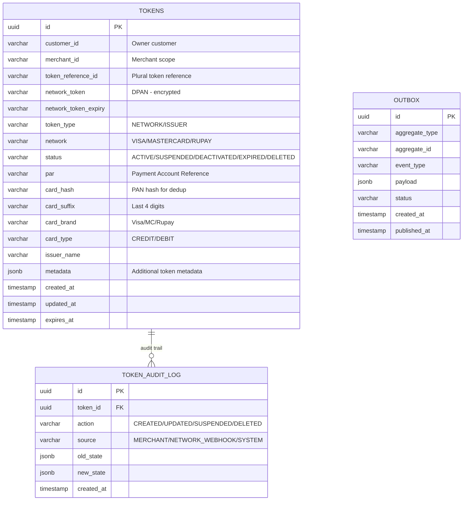
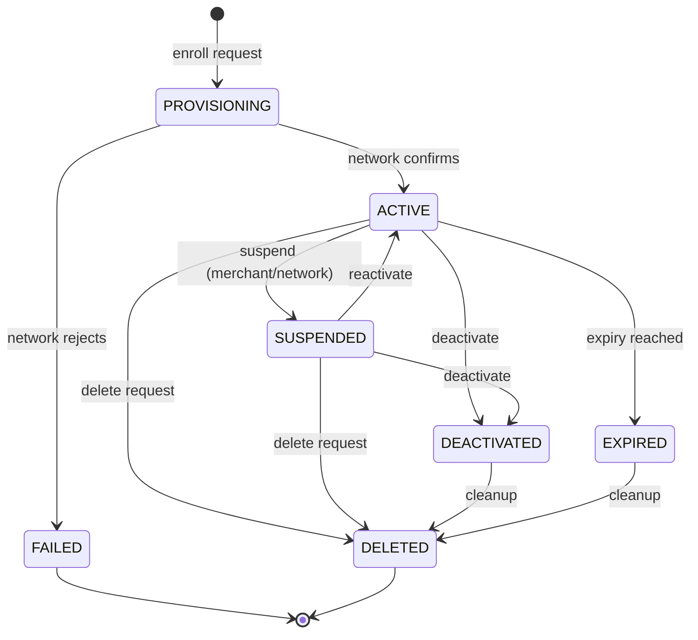

# Token Management Database Schema

## Entity-Relationship Diagram



## DDL Statements

### tokens

```sql
CREATE TABLE tokens (
    id                      UUID PRIMARY KEY DEFAULT gen_random_uuid(),
    customer_id             VARCHAR(100) NOT NULL,
    merchant_id             VARCHAR(50) NOT NULL,
    token_reference_id      VARCHAR(200) NOT NULL UNIQUE,
    network_token           VARCHAR(500),           -- Encrypted DPAN
    network_token_expiry    VARCHAR(10),            -- MM/YY format
    token_type              VARCHAR(20) NOT NULL,   -- NETWORK, ISSUER
    network                 VARCHAR(20) NOT NULL,   -- VISA, MASTERCARD, RUPAY
    status                  VARCHAR(20) NOT NULL DEFAULT 'ACTIVE',
    par                     VARCHAR(100),           -- Payment Account Reference
    card_hash               VARCHAR(128),           -- SHA-256 of PAN
    card_suffix             VARCHAR(4),             -- Last 4 digits
    card_brand              VARCHAR(20),            -- Display brand name
    card_type               VARCHAR(20),            -- CREDIT, DEBIT, PREPAID
    issuer_name             VARCHAR(200),
    issuer_code             VARCHAR(50),
    token_requestor_id      VARCHAR(100),           -- TRID used for provisioning
    network_reference_id    VARCHAR(200),           -- Network's token reference
    metadata                JSONB DEFAULT '{}',     -- Flexible metadata
    created_at              TIMESTAMP WITH TIME ZONE DEFAULT NOW(),
    updated_at              TIMESTAMP WITH TIME ZONE DEFAULT NOW(),
    expires_at              TIMESTAMP WITH TIME ZONE,
    
    CONSTRAINT uk_customer_token UNIQUE (customer_id, merchant_id, card_hash, network)
);

CREATE INDEX idx_tokens_customer ON tokens(customer_id);
CREATE INDEX idx_tokens_merchant ON tokens(merchant_id);
CREATE INDEX idx_tokens_par ON tokens(par);
CREATE INDEX idx_tokens_card_hash ON tokens(card_hash);
CREATE INDEX idx_tokens_status ON tokens(status);
CREATE INDEX idx_tokens_expires ON tokens(expires_at) WHERE status = 'ACTIVE';
```

### token_audit_log

```sql
CREATE TABLE token_audit_log (
    id              UUID PRIMARY KEY DEFAULT gen_random_uuid(),
    token_id        UUID NOT NULL REFERENCES tokens(id),
    action          VARCHAR(30) NOT NULL,   -- CREATED, UPDATED, SUSPENDED, REACTIVATED, DELETED, EXPIRED
    source          VARCHAR(30) NOT NULL,   -- MERCHANT, NETWORK_WEBHOOK, SYSTEM, CUSTOMER
    initiated_by    VARCHAR(100),           -- User/system identifier
    old_state       JSONB,                  -- Previous token state
    new_state       JSONB,                  -- New token state
    reason          VARCHAR(500),           -- Reason for change
    created_at      TIMESTAMP WITH TIME ZONE DEFAULT NOW(),
    
    INDEX idx_audit_token_id (token_id),
    INDEX idx_audit_created (created_at)
);
```

### outbox (Event Sourcing)

```sql
CREATE TABLE outbox (
    id              UUID PRIMARY KEY DEFAULT gen_random_uuid(),
    aggregate_type  VARCHAR(100) NOT NULL,  -- TOKEN
    aggregate_id    VARCHAR(200) NOT NULL,
    event_type      VARCHAR(100) NOT NULL,  -- TOKEN_PROVISIONED, TOKEN_SUSPENDED, TOKEN_DELETED, CRYPTOGRAM_GENERATED
    payload         JSONB NOT NULL,
    status          VARCHAR(20) NOT NULL DEFAULT 'PENDING',
    created_at      TIMESTAMP WITH TIME ZONE DEFAULT NOW(),
    published_at    TIMESTAMP WITH TIME ZONE,
    retry_count     INT DEFAULT 0,
    
    INDEX idx_outbox_status (status),
    INDEX idx_outbox_aggregate (aggregate_type, aggregate_id)
);
```

## Token Lifecycle State Machine



## Token Operations

| Operation | Source | Description |
|-----------|--------|-------------|
| Provision | Merchant/Customer | Create network token from PAN |
| Generate Cryptogram | Payment flow | Generate TAVV/DTVV for transaction |
| Suspend | Network webhook / Merchant | Temporarily disable token |
| Reactivate | Network webhook / Merchant | Re-enable suspended token |
| Delete | Merchant / Customer / Expiry | Permanently remove token |
| Update | Network webhook | Update expiry, status, metadata |
| Inquiry | Internal | Check token status and details |
