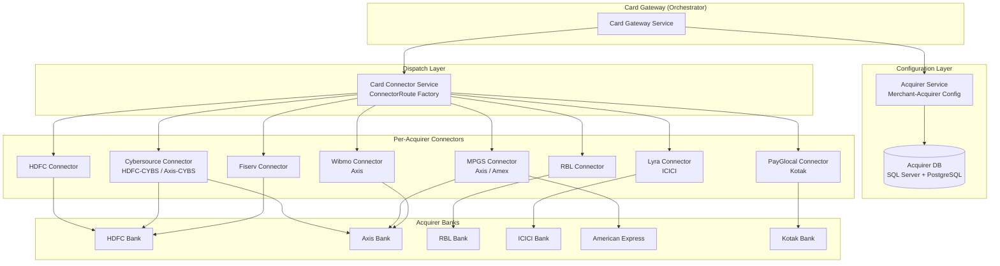
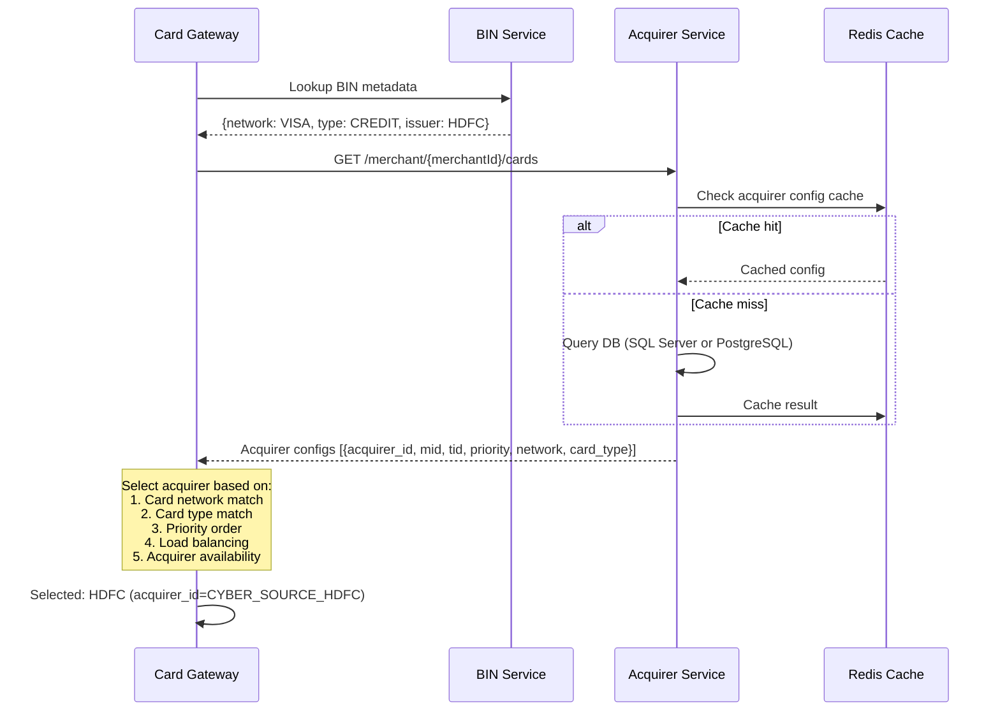
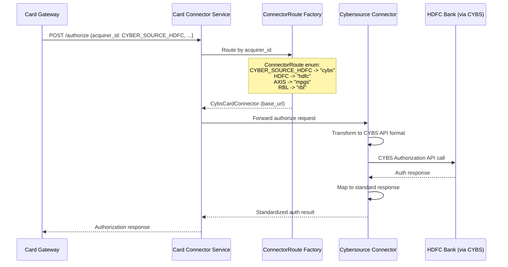
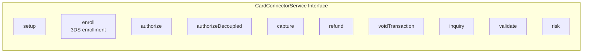
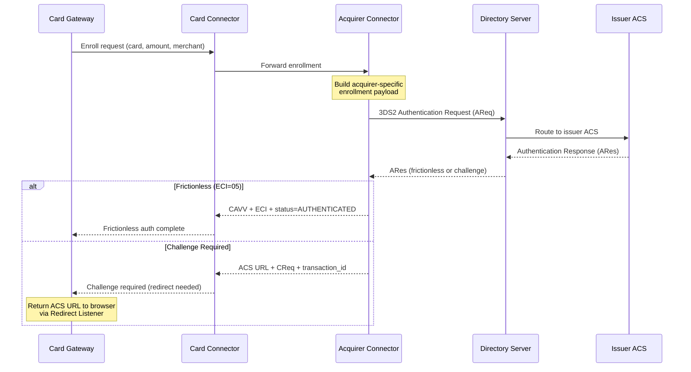
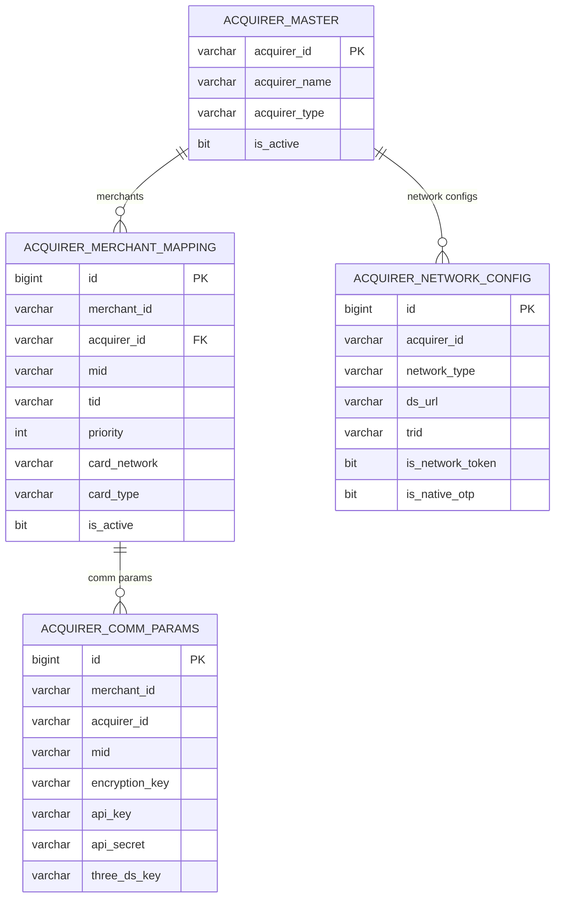
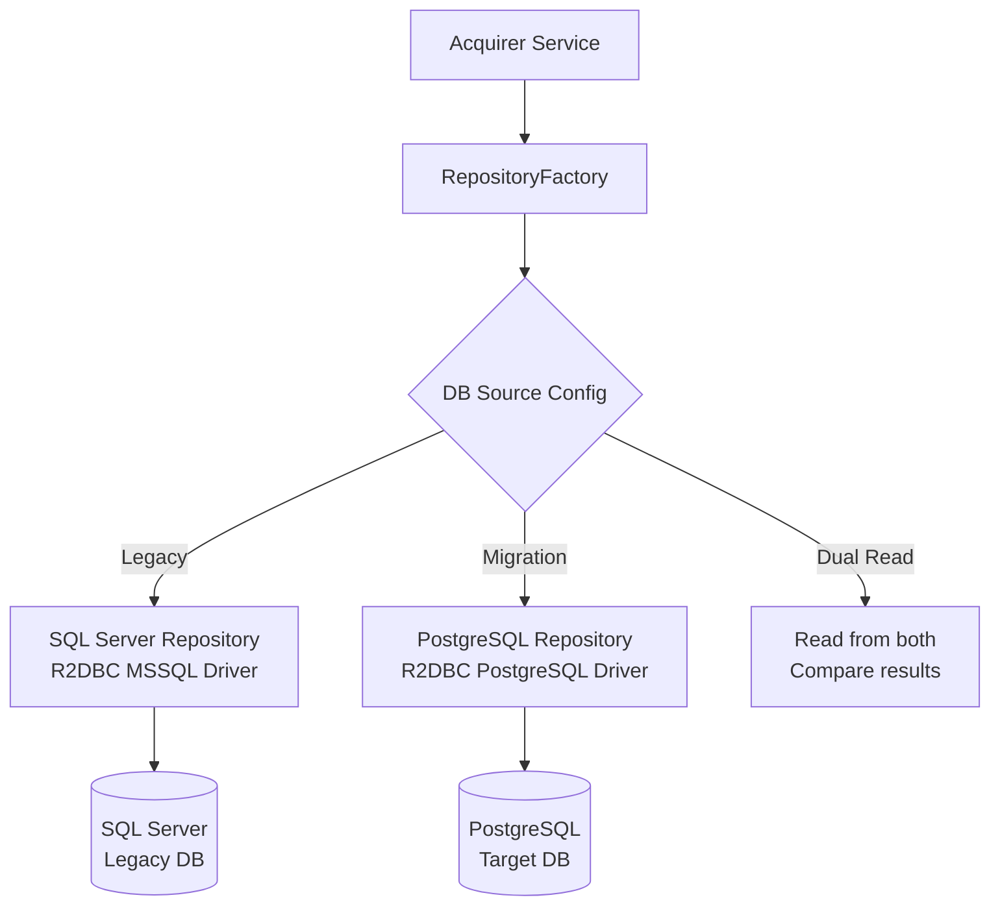

# Acquirer Services & Connector Architecture

## Overview

The acquirer layer handles routing payments to the correct banking partner (acquirer) and communicating with them via their specific APIs. It consists of the Acquirer Service (configuration/routing data) and the Card Connector Service (request dispatch to per-acquirer connectors).

## Services Involved

| Service | Role |
|---------|------|
| Acquirer Service (`Plural_AcquirerServicev21`) | Merchant-acquirer config, MID/TID data, routing rules |
| Card Connector Service (`Plural_CardConnectorService`) | Dispatch hub routing to per-acquirer connectors |
| HDFC Card Connector | HDFC bank integration |
| Cybersource Card Connector | CYBS (HDFC/Axis) integration |
| MPGS Connector | Mastercard Payment Gateway Services (Axis/Amex) |
| RBL Card Connector | RBL bank integration |
| Fiserv Connector | Fiserv bank integration |
| Lyra Connector | Lyra/ICICI integration |
| Wibmo Connector | Wibmo/Axis integration |

## Architecture



## Acquirer Selection Sequence



## Card Connector Routing Sequence



## Connector Operations Interface



### Operations by Acquirer Support

| Operation | HDFC | CYBS | MPGS | RBL | Fiserv | Lyra |
|-----------|------|------|------|-----|--------|------|
| Setup | - | - | - | - | - | - |
| Enroll (3DS) | Y | Y | Y | Y | Y | Y |
| Authorize | Y | Y | Y | Y | Y | Y |
| Capture | Y | Y | Y | Y | Y | Y |
| Refund | Y | Y | Y | Y | Y | Y |
| Void | Y | Y | Y | Y | Y | Y |
| Inquiry | Y | Y | Y | Y | Y | Y |
| Validate | Y | Y | - | - | - | - |
| Risk | - | Y | - | - | - | - |

## Acquirer Routing Table

| Acquirer ID | Connector Route | Connector Service | Bank |
|-------------|----------------|-------------------|------|
| `HDFC` | `hdfc` | HDFC Card Connector | HDFC Bank |
| `CYBER_SOURCE_HDFC` | `cybs` | Cybersource Connector | HDFC Bank (via CYBS) |
| `CYBER_SOURCE_AXIS` | `cybs` | Cybersource Connector | Axis Bank (via CYBS) |
| `AXIS` | `mpgs` | MPGS Connector | Axis Bank |
| `AMEX` | `mpgs` | MPGS Connector | American Express |
| `RBL` | `rbl` | RBL Card Connector | RBL Bank |
| `HDFC_FSS_IN_HOUSE` | `hdfc` | HDFC Card Connector | HDFC FSS |
| `PAYGLOCAL_KOTAK` | `payglocal` | PayGlocal Connector | Kotak Bank |
| `LYRA_ICICI` | `lyra` | Lyra Connector | ICICI Bank |
| `WIBMO_AXIS` | `wibmo` | Wibmo Connector | Axis Bank |

## 3DS Enrollment Flow (Per Acquirer)



## Activity Diagram - Acquirer Configuration Management

```mermaid
flowchart TB
    subgraph MerchantOnboarding["Merchant Acquirer Onboarding"]
        O1[New merchant registered] --> O2[Assign acquirer based on:<br/>- MCC code<br/>- Volume<br/>- Network support]
        O2 --> O3[Generate MID with acquirer]
        O3 --> O4[Store comm params<br/>MID, TID, keys]
        O4 --> O5[Configure network support<br/>3DS version, COFT, Passkey]
    end

    subgraph Routing["Runtime Routing"]
        R1[Payment request] --> R2[BIN lookup: network + type]
        R2 --> R3[Fetch merchant acquirer configs]
        R3 --> R4[Filter by network + card type]
        R4 --> R5{Multiple acquirers?}
        R5 -->|Yes| R6[Select by priority + availability]
        R5 -->|No| R7[Use single match]
        R6 --> R8[Route to connector]
        R7 --> R8
    end

    subgraph CacheStrategy["Caching"]
        C1[Acquirer config fetched] --> C2[Cache in Redis]
        C2 --> C3[TTL-based invalidation]
        C3 --> C4[Force refresh endpoint<br/>GET /merchant/{id}/cards/refresh]
    end
```

## Acquirer Service API Reference

| Method | Endpoint | Description |
|--------|----------|-------------|
| GET | `/acquirers` | List all acquirers |
| GET | `/merchant/{merchantId}/acquirer/{acquirerId}` | Merchant-acquirer comm params |
| GET | `/merchant/{merchantId}/acquirer/{acquirerId}/client/{clientId}` | Client-specific params |
| GET | `/merchant/{merchantId}/cards` | All acquirer configs for merchant |
| GET | `/merchant/{merchantId}/cards/refresh` | Force cache refresh |
| GET | `/merchant/{merchantId}/client/{clientId}/cards` | Client-specific cards |
| GET | `/merchant/{merchantId}/client/{clientId}/pos` | POS acquirer config |
| GET | `/pfid` | Payment Facilitator IDs |
| GET | `/pbp/{acquirerId}` | Acquirer-level config |
| GET | `/cache/clear/{id}` | Clear cache entry |

## Acquirer Service Data Model



## Dual-DB Architecture



## Connector Communication Patterns

| Acquirer | Protocol | Auth | Format |
|----------|----------|------|--------|
| HDFC | HTTPS REST | API Key + HMAC | JSON |
| Cybersource | HTTPS REST | JWT + Shared Secret | JSON |
| MPGS | HTTPS REST | API Key + Certificate | JSON |
| RBL | HTTPS REST | API Key | JSON |
| Fiserv | HTTPS REST | OAuth 2.0 | JSON |
| Lyra | HTTPS REST | HMAC SHA-256 | JSON |
| PayGlocal | HTTPS REST | RSA Signature | JSON |

## Error Handling

| Error | Connector Behavior | Gateway Behavior |
|-------|-------------------|------------------|
| Acquirer timeout | Retry once (idempotent ops) | Return timeout to merchant |
| Auth declined | Return decline reason | Map to merchant error code |
| Acquirer down | Circuit breaker opens | Route to backup acquirer if available |
| Invalid MID/TID | Return config error | Alert operations, block merchant |
| Network error | Retry with backoff | Inquiry after timeout |
| Duplicate transaction | Idempotency check | Return original result |
