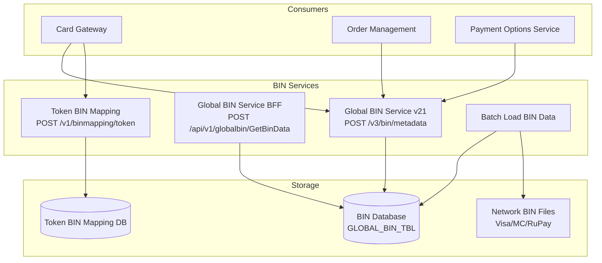
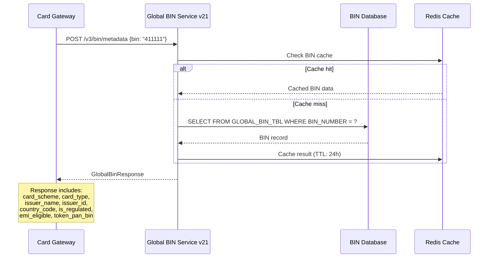
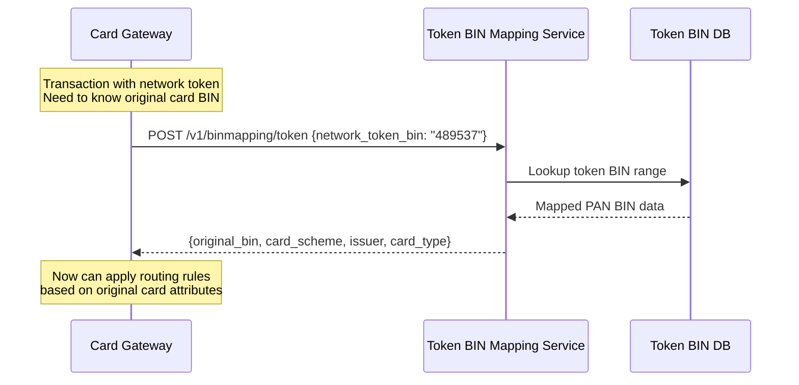
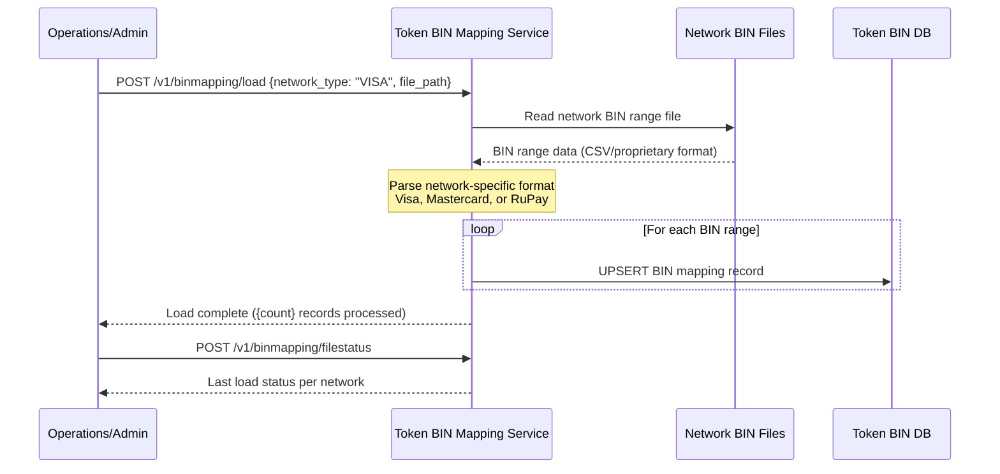
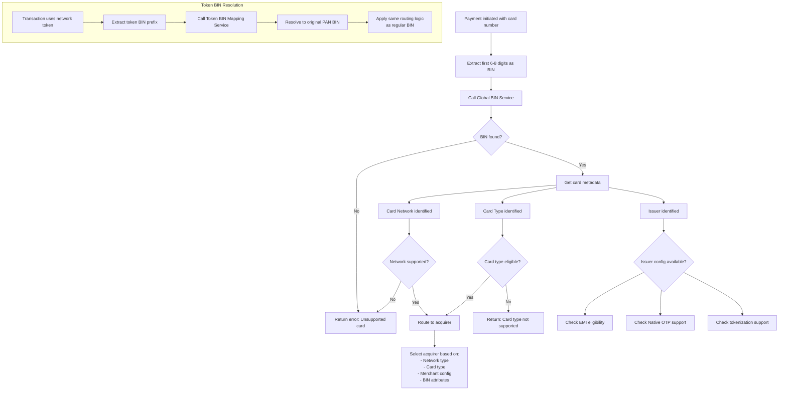
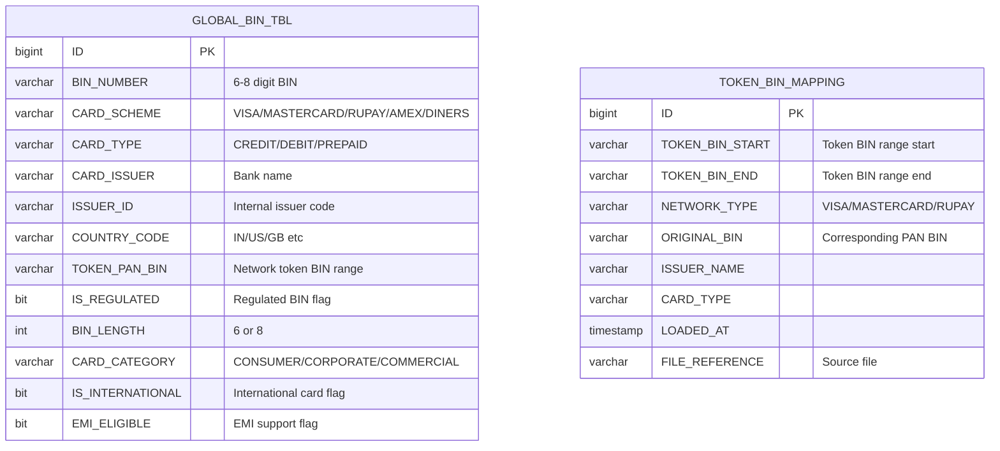

# BIN Service Workflow

## Overview

The BIN (Bank Identification Number) Service provides card metadata resolution from the first 6-8 digits of a card number. It identifies the card network, issuer, card type, and capabilities. Multiple BIN services exist for different use cases: global BIN lookup, token-to-BIN mapping, and batch BIN data loading.

## Services Involved

| Service | Tech | Role |
|---------|------|------|
| `Plural_GlobalBINServicev21` | Java, Spring Boot WebFlux | Primary BIN metadata API |
| `Plural_Repo_GlobalBinService` | Node.js/TypeScript, Express | Legacy BFF proxy to .NET service |
| `Plural_TokenBinMapping_Service` | Java, Spring Boot | Token BIN to PAN BIN resolution |
| `Plural_BatchLoadBinData_Service` | Java | Bulk BIN data loading from networks |

## Architecture



## BIN Lookup Sequence



## Token BIN Resolution Sequence



## BIN Data Loading Flow



## Activity Diagram - BIN Resolution in Payment Flow



## BIN Data Structure



## Use Cases for BIN Lookup

| Use Case | Consumer Service | What it determines |
|----------|-----------------|-------------------|
| Payment routing | Card Gateway | Which acquirer to use |
| Card validation | Payment Options | Is card type supported |
| EMI eligibility | EMI Service | Can EMI be offered |
| Native OTP | Native OTP Processor | Is native OTP available for this issuer |
| Tokenization | Token Mgm Service | Which network connector to use |
| International detection | Card Gateway | Is card international (different MDR) |
| Regulatory check | Compliance | Is BIN regulated (affects interchange) |

## API Reference

### Global BIN Service v21

```
POST /v3/bin/metadata
Request:
{
  "bins": ["411111", "524301", "607123"],
  "merchant_id": "M123" (optional)
}

Response:
{
  "data": [
    {
      "bin": "411111",
      "card_scheme": "VISA",
      "card_type": "CREDIT",
      "card_issuer": "HDFC Bank",
      "issuer_id": "HDFC",
      "country_code": "IN",
      "is_regulated": false,
      "emi_eligible": true,
      "token_pan_bin": "489537",
      "card_category": "CONSUMER"
    }
  ]
}
```

### Token BIN Mapping Service

```
POST /v1/binmapping/token
Request:
{
  "token_bin": "489537"
}

Response:
{
  "original_bin": "411111",
  "network_type": "VISA",
  "card_type": "CREDIT",
  "issuer": "HDFC Bank"
}

---

GET /v1/binmapping/bin/{BIN}
Response:
{
  "bin": "411111",
  "network_type": "VISA"
}

---

POST /v1/binmapping/load
Request:
{
  "network_type": "VISA",
  "file_path": "/data/visa-bin-ranges-2024.csv"
}
```

## Data Sources

| Network | BIN File Format | Update Frequency |
|---------|----------------|-----------------|
| Visa | VTS BIN Range file (CSV) | Monthly |
| Mastercard | MDES BIN Range file | Monthly |
| RuPay | NPCI BIN file | Quarterly |
| Global BIN | Network consortium + internal | Weekly updates |
