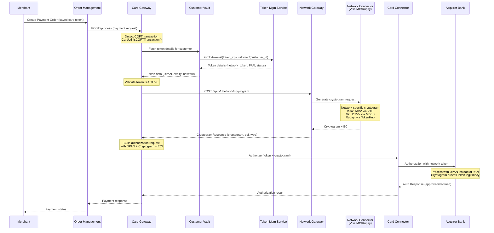
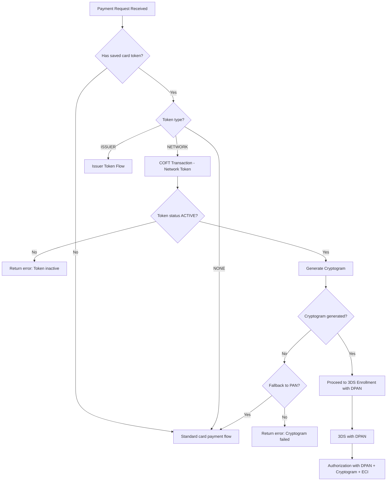

# COFT (Card on File Tokenization) Workflow

## Overview

COFT (Card on File Tokenization) enables tokenized card payments where the actual card PAN is replaced with a network-issued token (DPAN). When a customer pays with a saved/tokenized card, the system generates a cryptogram (TAVV/DTVV) that proves the token is being used by a legitimate requestor.

## Services Involved

| Service | Role |
|---------|------|
| Card Gateway | Orchestrates COFT detection and cryptogram flow |
| Network Gateway Service | Delegates to network-specific connector |
| Token Management Service | Stores tokens, manages lifecycle |
| Customer Vault Service | Manages customer-token associations |
| Visa/MC/RuPay Network Connector | Generates network-specific cryptogram |
| Acquirer Connector | Sends authorization with token + cryptogram |

## COFT Payment Sequence Diagram

## COFT Detection Logic

## Activity Diagram - COFT Full Lifecycle

```mermaid
flowchart TB
    subgraph Provisioning["Token Provisioning (One-time)"]
        P1[Customer enters card] --> P2[BIN lookup - identify network]
        P2 --> P3[Check COFT eligibility]
        P3 --> P4[Request network token]
        P4 --> P5[Network provisions DPAN]
        P5 --> P6[Store token in Token Mgm Service]
        P6 --> P7[Associate with customer in Vault]
    end

    subgraph Payment["COFT Payment (Each transaction)"]
        T1[Customer selects saved card] --> T2[Fetch token from vault]
        T2 --> T3[Validate token active]
        T3 --> T4[Generate cryptogram from network]
        T4 --> T5[3DS enrollment with DPAN]
        T5 --> T6{Frictionless?}
        T6 -->|Yes| T7[Direct authorization]
        T6 -->|No| T8[Challenge - OTP/Passkey]
        T8 --> T9[Authentication complete]
        T9 --> T7
        T7 --> T10[Send to acquirer: DPAN + Cryptogram + CAVV]
        T10 --> T11[Acquirer processes with network]
        T11 --> T12[Response to merchant]
    end

    subgraph Lifecycle["Token Lifecycle Events"]
        L1[Network webhook received] --> L2{Event type?}
        L2 -->|TOKEN_UPDATED| L3[Update expiry/status]
        L2 -->|TOKEN_SUSPENDED| L4[Suspend token]
        L2 -->|TOKEN_DELETED| L5[Delete token]
        L2 -->|CARD_UPDATED| L6[Update card metadata]
    end
```

## Cryptogram Types

| Network | Cryptogram Type | Description |
|---------|----------------|-------------|
| Visa | TAVV | Token Authentication Verification Value |
| Mastercard | DTVV | Dynamic Token Verification Value |
| RuPay | TAV | Token Authentication Value |

## ECI Values with COFT

| ECI | Meaning | Context |
|-----|---------|---------|
| 05 | Fully authenticated | COFT + 3DS frictionless |
| 06 | Attempted authentication | COFT + 3DS attempted |
| 07 | Non-authenticated e-commerce | COFT without 3DS |

## Error Handling

| Error Scenario | Handling |
|---------------|----------|
| Token expired | Return error, trigger token refresh webhook |
| Token suspended | Return error, inform merchant |
| Cryptogram generation fails | Fallback to PAN if configured, else fail |
| Network timeout | Retry with exponential backoff (max 2) |
| Token not found | Return error, invalidate cached reference |

## Configuration

COFT is enabled per acquirer-network combination in `PINE_PG_ACQUIRER_NETWORK_CONFIG_TBL`:
- `IS_COFT_ENABLED = 1` enables COFT for that acquirer+network
- `TRID` (Token Requestor ID) must be registered with the network
- Merchant must be enrolled for COFT via the Customer Vault
