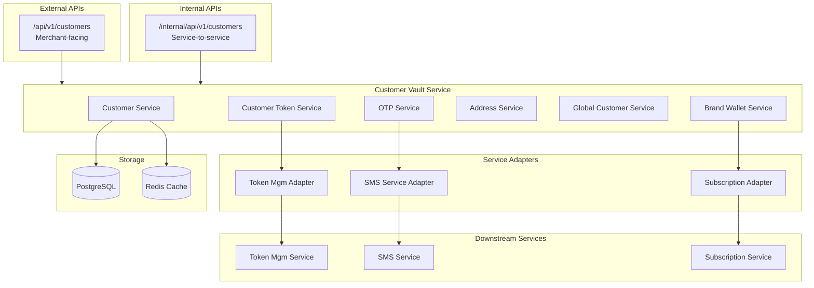
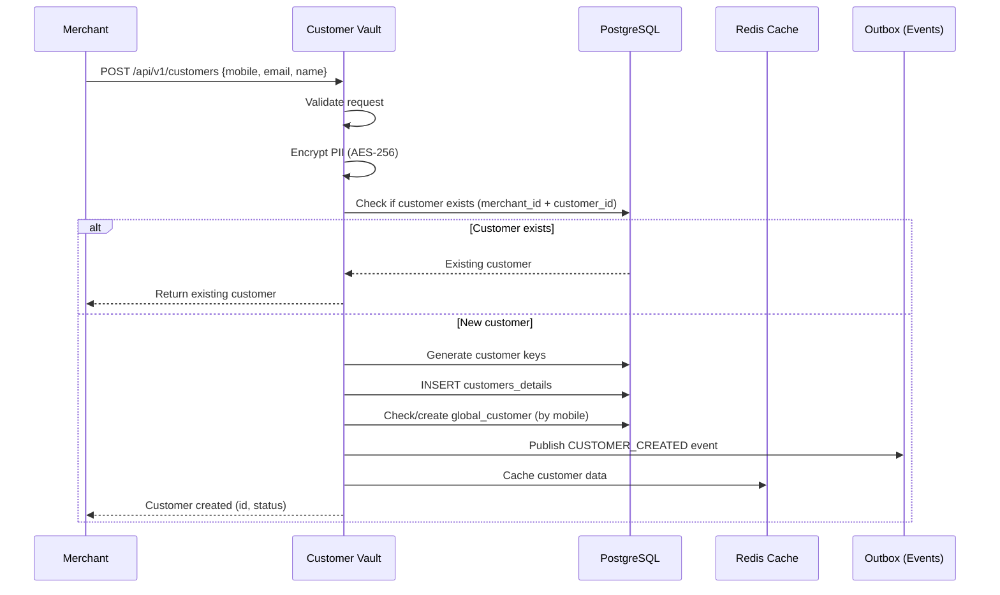
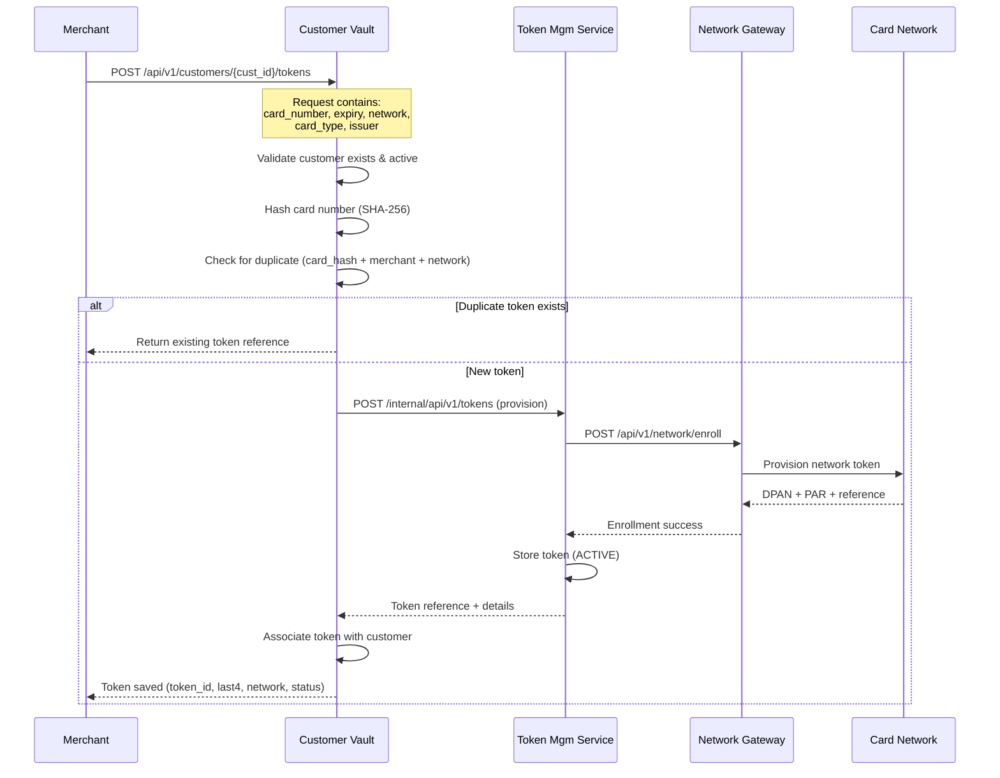
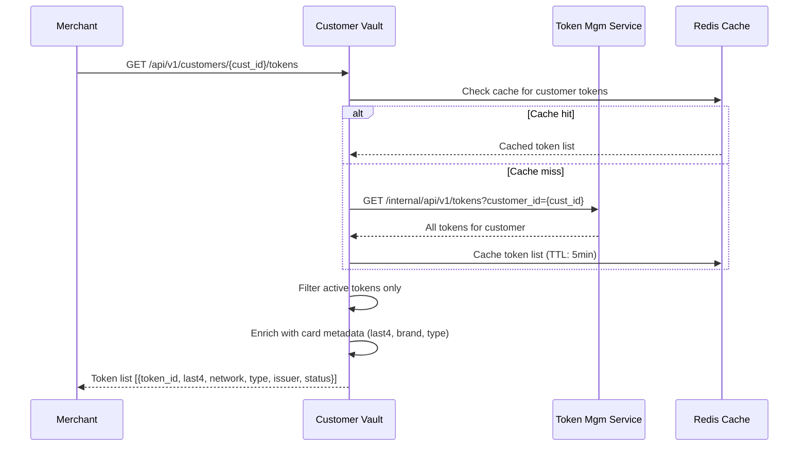
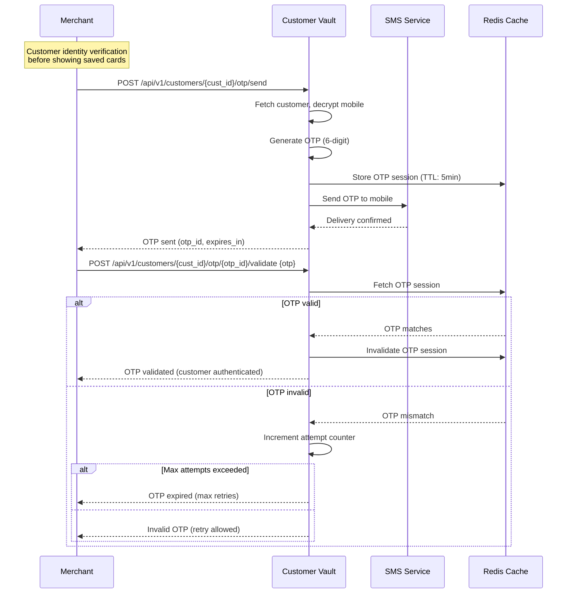
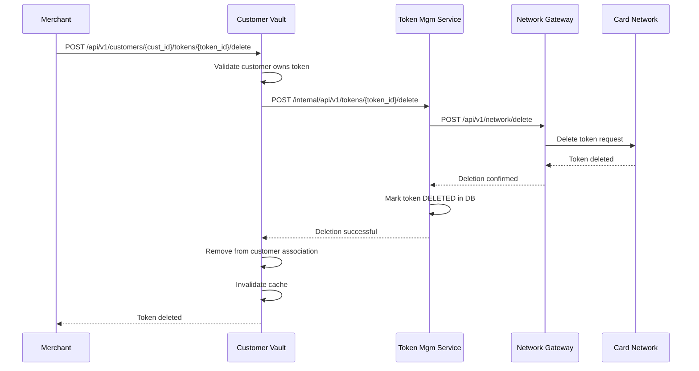
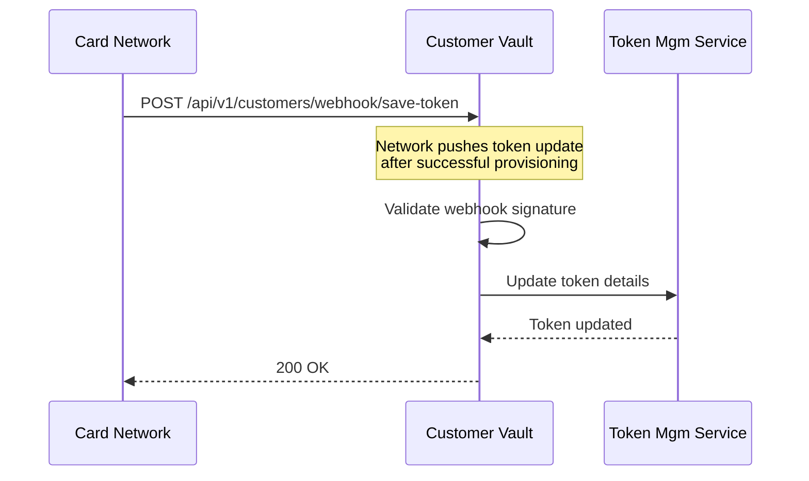
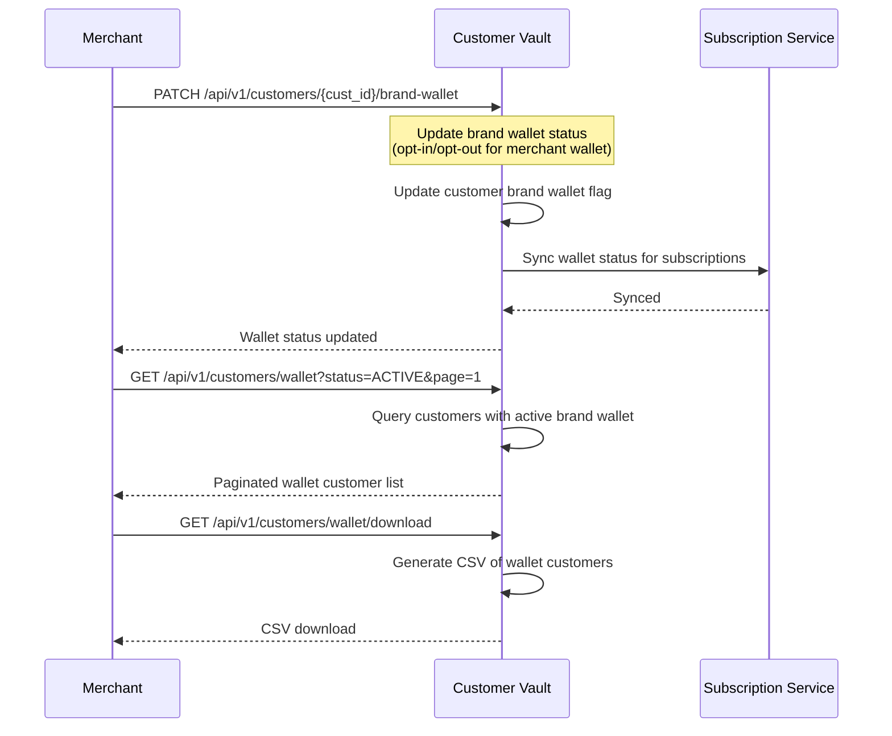

# Customer Vault Management Workflow

## Overview

The Customer Vault Management Service (`nxt-customer-vault-mgm-service`) manages customer profiles, saved cards/tokens, OTP verification, addresses, and brand wallet status. It serves as the customer-facing layer that delegates token operations to the Token Management Service.

## Services Involved

| Service | Role |
|---------|------|
| Customer Vault Service | Customer CRUD, token association, OTP, addresses |
| Token Management Service | Token storage, cryptogram delegation to networks |
| SMS Service | OTP delivery via SMS |
| Network Gateway Service | Token provisioning (via Token Mgm Service) |
| Subscription Service | SBMD (Subscription-Based Merchant Debit) |
| Redis | Caching customer data and OTP sessions |

## Architecture



## Customer Creation Flow



## Save Card Token Flow



## Fetch Saved Cards Flow



## OTP Verification Flow (Customer Identity)



## Delete Card Token Flow



## Activity Diagram - Customer Lifecycle

```mermaid
flowchart TB
    subgraph Creation["Customer Onboarding"]
        C1[Merchant API call] --> C2[Validate request]
        C2 --> C3[Encrypt PII with AES]
        C3 --> C4[Create customer record]
        C4 --> C5[Generate encryption keys]
        C5 --> C6[Create/link global customer]
        C6 --> C7[Publish event]
    end

    subgraph CardManagement["Card Management"]
        M1[Save card request] --> M2[Hash card for dedup]
        M2 --> M3{Duplicate?}
        M3 -->|Yes| M4[Return existing token]
        M3 -->|No| M5[Provision network token]
        M5 --> M6[Store in token service]
        M6 --> M7[Associate with customer]
        
        M8[List cards] --> M9[Fetch from token service]
        M9 --> M10[Filter active tokens]
        M10 --> M11[Return enriched card list]
        
        M12[Delete card] --> M13[Delete from network]
        M13 --> M14[Remove from token store]
        M14 --> M15[Update customer association]
    end

    subgraph Identity["Identity Verification"]
        I1[OTP send request] --> I2[Decrypt customer mobile]
        I2 --> I3[Generate 6-digit OTP]
        I3 --> I4[Store in Redis with TTL]
        I4 --> I5[Send via SMS]
        
        I6[OTP validate] --> I7[Fetch from Redis]
        I7 --> I8{Match?}
        I8 -->|Yes| I9[Customer authenticated]
        I8 -->|No| I10{Retries left?}
        I10 -->|Yes| I11[Allow retry]
        I10 -->|No| I12[Block + expire session]
    end

    subgraph Address["Address Management"]
        A1[Create address] --> A2[Validate + store]
        A3[Update address] --> A4[Validate ownership + update]
        A5[Delete address] --> A6[Soft delete]
        A7[List addresses] --> A8[Return by customer/mobile]
    end
```



## Webhook - Network Token Save



## Brand Wallet Management



## Global Customer Concept

```mermaid
flowchart TD
    A[Customer with mobile +91-9876543210] --> B[Global Customer<br/>Single identity across merchants]
    B --> C[Merchant A: Customer C1]
    B --> D[Merchant B: Customer C2]
    B --> E[Merchant C: Customer C3]
    
    C --> F[Token T1 - Visa card]
    C --> G[Token T2 - MC card]
    D --> H[Token T3 - Visa card<br/>same PAR as T1]
    E --> I[Token T4 - Rupay card]
    
    Note over B: Same mobile number = same global customer<br/>Tokens are merchant-scoped<br/>PAR links same card across merchants
```

## API Summary

### External APIs (Merchant-facing)
| Method | Endpoint | Description |
|--------|----------|-------------|
| POST | `/api/v1/customers` | Create customer |
| GET | `/api/v1/customers/{id}` | Get customer |
| PATCH | `/api/v1/customers/{id}` | Update customer |
| POST | `/api/v1/customers/{id}/tokens` | Save card token |
| GET | `/api/v1/customers/{id}/tokens` | List saved cards |
| POST | `/api/v1/customers/{id}/tokens/{tid}/delete` | Delete card |
| POST | `/api/v1/customers/{id}/otp/send` | Send OTP |
| POST | `/api/v1/customers/{id}/otp/{oid}/validate` | Validate OTP |
| POST | `/api/v1/customers/{id}/address` | Create address |
| PATCH | `/api/v1/customers/{id}/brand-wallet` | Update wallet status |
| GET | `/api/v1/customers/wallet` | List wallet customers |

### Internal APIs (Service-to-service)
| Method | Endpoint | Description |
|--------|----------|-------------|
| POST | `/internal/api/v1/customers` | Create customer |
| POST | `/internal/api/v1/customers/inactive` | Create inactive customer |
| DELETE | `/internal/api/v1/customers/delete-customer` | Delete customer |
| POST | `/internal/api/v1/customers/{id}/tokens/{tid}/token-transactional-data` | Generate cryptogram |
| POST | `/internal/api/v1/customers/webhook/save-token` | Network webhook |
| POST | `/internal/api/v1/customers/delete-cards` | Bulk delete by phone |

## Security

- All PII encrypted at rest (AES-256)
- Per-customer encryption keys in `customer_keys` table
- Master key from AWS Secrets Manager
- OTP sessions with TTL (5 min default)
- Rate limiting on OTP endpoints
- Webhook signature validation
