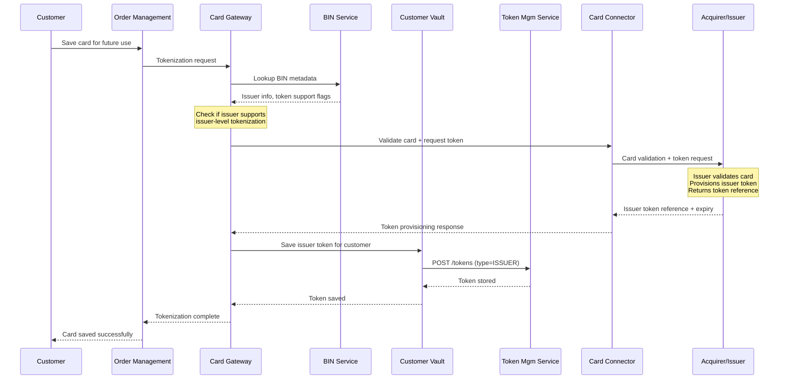
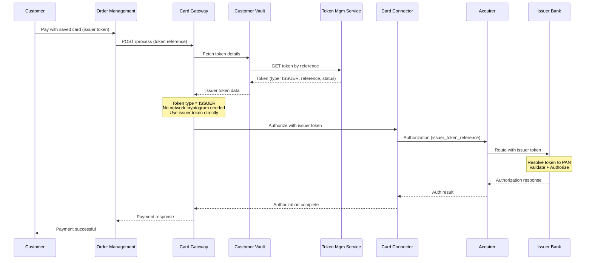
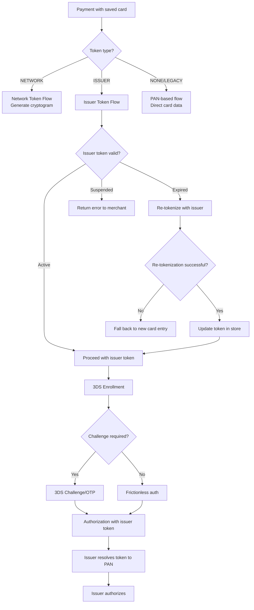
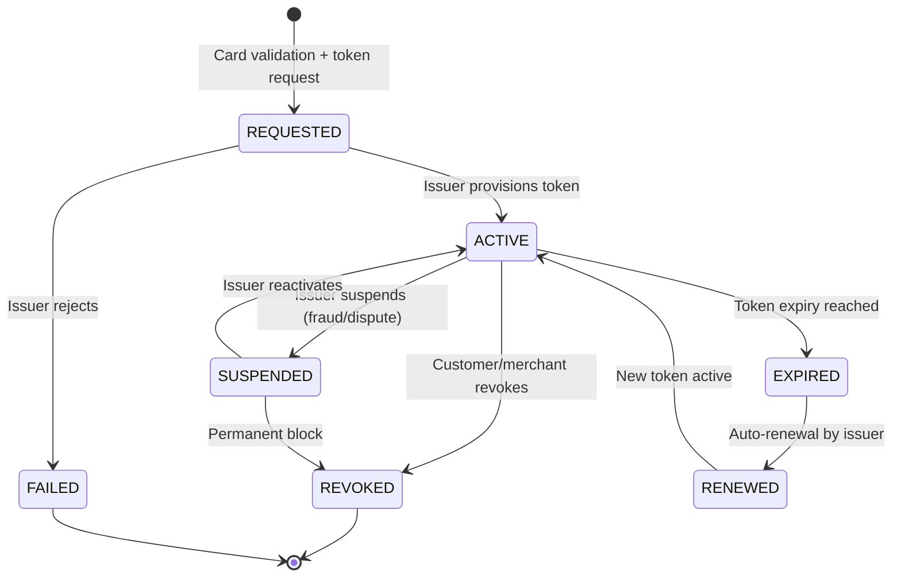

# Issuer Tokenization Workflow

## Overview

Issuer Tokenization is the process where the card issuer (bank) provisions tokens for card-on-file storage, as opposed to network tokenization where the card network (Visa/MC/RuPay) issues the token. Issuer tokens are managed directly by the issuing bank and are used for recurring payments, subscriptions, and merchant-specific card-on-file scenarios.

## Key Differences: Network vs Issuer Tokenization

| Aspect | Network Tokenization | Issuer Tokenization |
|--------|---------------------|---------------------|
| Token Issuer | Card Network (Visa/MC/RuPay) | Issuing Bank |
| Token Format | DPAN (looks like card number) | Bank-specific reference |
| Cryptogram | Required per transaction | May not be required |
| PAR | Assigned by network | Not applicable |
| Lifecycle | Network manages | Issuer manages |
| Use Case | All e-commerce | Recurring, subscriptions, merchant-specific |
| RBI Compliance | Fully compliant (CoF guidelines) | Compliant via issuer agreement |

## Services Involved

| Service | Role |
|---------|------|
| Card Gateway | Detects issuer token type, routes accordingly |
| Customer Vault Service | Stores issuer token reference |
| Token Management Service | Manages issuer token lifecycle |
| Acquirer Connector (HDFC/CYBS) | Some acquirers support issuer token provisioning |
| BIN Service | Identifies if issuer supports tokenization |

## Issuer Token Provisioning Sequence

## Issuer Token Payment Flow

## Activity Diagram - Issuer Token Decision Flow

## Issuer Token Lifecycle

## Issuer Token Types by Acquirer

| Acquirer | Token Type | Mechanism |
|----------|-----------|-----------|
| HDFC | SI Token (Standing Instruction) | Recurring mandate token |
| Cybersource | TMS Token | Cybersource Token Management |
| MPGS | Session Token | MPGS tokenization framework |
| RBL | Issuer Reference | Bank-specific token |
| Axis | Network Token (MPGS) | Routes via MDES |

## Configuration

Issuer tokenization eligibility is determined by:
1. `ADDON_ISSUER_ID_MASTER_TBL.IS_NATIVE_OTP_ENABLED` - Indicates issuer support
2. BIN metadata - Card type and issuer capabilities
3. Acquirer configuration - Whether acquirer supports issuer token for that merchant

## Error Scenarios

| Error | Handling |
|-------|----------|
| Issuer doesn't support tokenization | Fall back to network tokenization |
| Token expired during payment | Attempt re-tokenization, fail gracefully |
| Issuer token format mismatch | Log error, return generic failure |
| Recurring mandate expired | Notify merchant, request new mandate |
| Card replaced by issuer | Token invalidated, customer re-enrollment needed |
