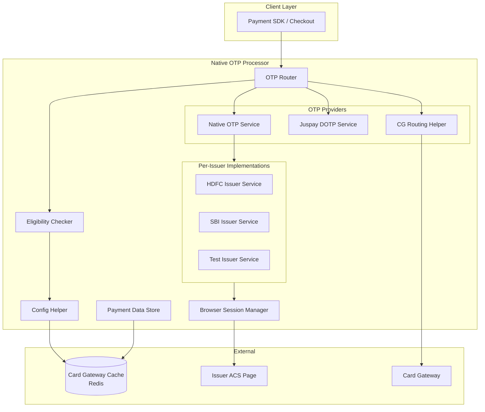
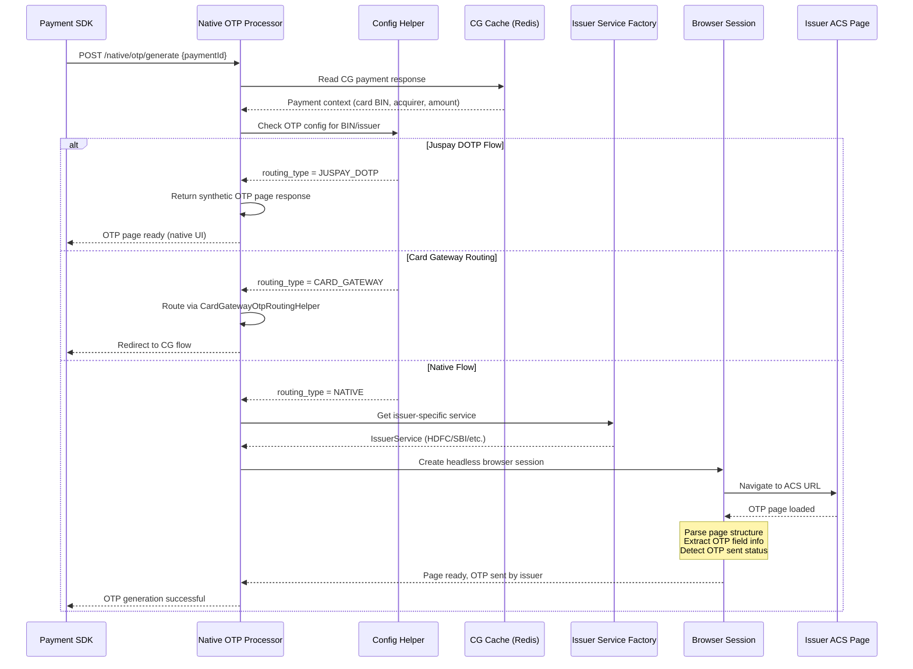
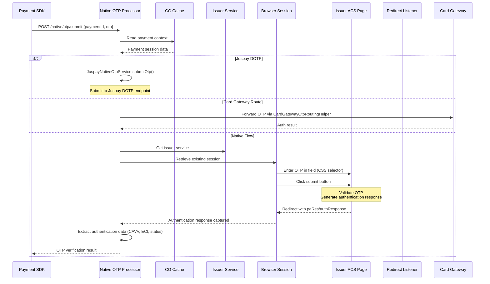
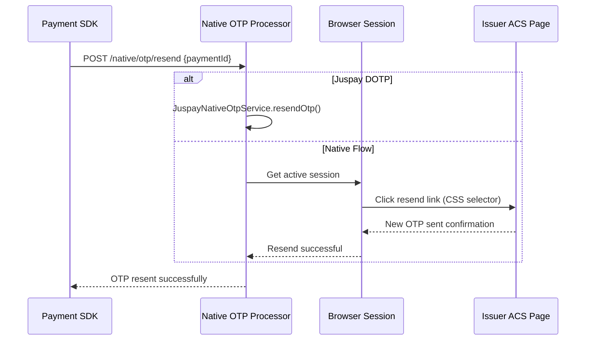
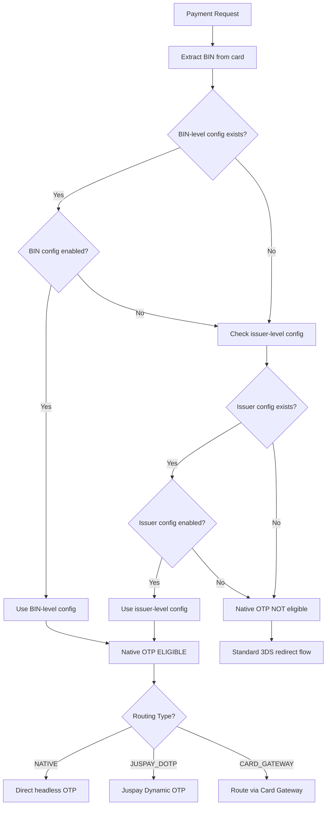

# Native OTP Workflow

## Overview

The Native OTP Processor handles inline OTP authentication for card payments, bypassing the traditional ACS redirect page. Instead of redirecting the customer to the issuer's 3DS authentication page, the system intercepts the OTP step and provides a native UI, improving conversion rates and user experience.

## Services Involved

| Service | Role |
|---------|------|
| Native OTP Processor | Core OTP orchestration (generate, submit, resend, cancel) |
| Card Gateway | Provides payment context via cache, receives routing callbacks |
| Redirect Listener | Fallback for non-native OTP scenarios |
| BIN Service | Identifies issuer for OTP config lookup |
| Card Gateway Cache (Redis) | Stores payment session data |
| Issuer ACS | Bank's authentication page (intercepted/automated) |

## Architecture



## OTP Generation Sequence



## OTP Submission Sequence



## OTP Resend Sequence



## Eligibility Check Flow



## Activity Diagram - Full Native OTP Flow

```mermaid
flowchart TB
    subgraph Setup["Payment Setup"]
        S1[Customer initiates payment] --> S2[Card Gateway processes]
        S2 --> S3[3DS Enrollment with acquirer]
        S3 --> S4[ACS URL received]
        S4 --> S5[Cache payment context in Redis]
        S5 --> S6[Return to SDK: OTP required]
    end

    subgraph OTPFlow["Native OTP Flow"]
        O1[SDK calls /native/otp/generate] --> O2[Read CG cache]
        O2 --> O3[Resolve OTP config]
        O3 --> O4[Create browser session]
        O4 --> O5[Navigate to ACS URL]
        O5 --> O6[Wait for OTP page load]
        O6 --> O7[OTP sent to customer's phone]
        O7 --> O8[Return: ready for OTP input]
        
        O8 --> O9[Customer enters OTP in SDK]
        O9 --> O10[SDK calls /native/otp/submit]
        O10 --> O11[Enter OTP in browser session]
        O11 --> O12[Submit ACS form]
        O12 --> O13{Auth successful?}
        O13 -->|Yes| O14[Extract CAVV/ECI]
        O13 -->|No| O15{Retries remaining?}
        O15 -->|Yes| O16[Allow retry]
        O15 -->|No| O17[Authentication failed]
        O14 --> O18[Complete authorization]
    end

    subgraph Cleanup["Session Cleanup"]
        C1[Auth complete or timeout] --> C2[Close browser session]
        C2 --> C3[Clear payment store]
        C3 --> C4[Release resources]
    end
```



## Configuration Hierarchy

```
┌─────────────────────────────────────┐
│ BIN-Level Config (highest priority)  │
│ native_otp_bin_level_config          │
│ - Per BIN range                      │
│ - ACS page selectors                 │
│ - Payment routing config             │
├─────────────────────────────────────┤
│ Issuer-Level Config                  │
│ native_otp_config                    │
│ - Per issuer + network + card type   │
│ - OTP provider settings              │
│ - Feature toggles                    │
├─────────────────────────────────────┤
│ Global Defaults                      │
│ - Fallback to standard 3DS redirect  │
└─────────────────────────────────────┘
```

## Supported Issuers

| Issuer | Implementation | Notes |
|--------|---------------|-------|
| HDFC | `HdfcIssuerService` | Custom ACS page handling |
| SBI | `SbiIssuerService` | Custom ACS page handling |
| Test | `TestIssuerService` | For testing environments |
| Others | Juspay DOTP / CG Route | Via aggregator or fallback |

## Error Handling

| Error | Recovery |
|-------|----------|
| Browser session timeout | Return timeout error, allow retry |
| ACS page changed layout | Fall back to redirect, alert ops |
| OTP expired | Resend OTP (max 3 attempts) |
| OTP invalid (wrong code) | Allow retry within limit |
| Network error to ACS | Retry once, then fail |
| Config not found for BIN | Fall back to standard 3DS |

## Metrics & Monitoring

- OTP generation success rate per issuer
- OTP submission success rate per issuer
- Average OTP completion time
- Browser session failure rate
- Fallback-to-redirect rate
- Resend rate per issuer
