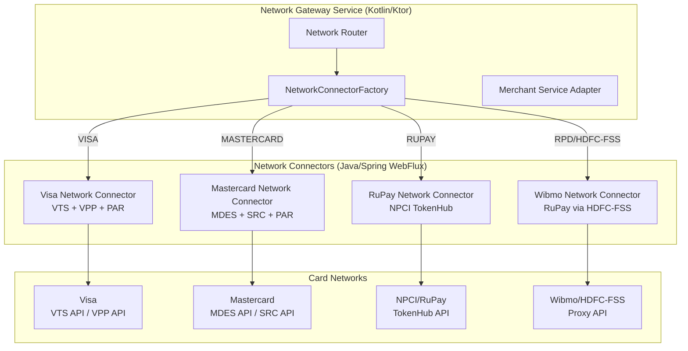
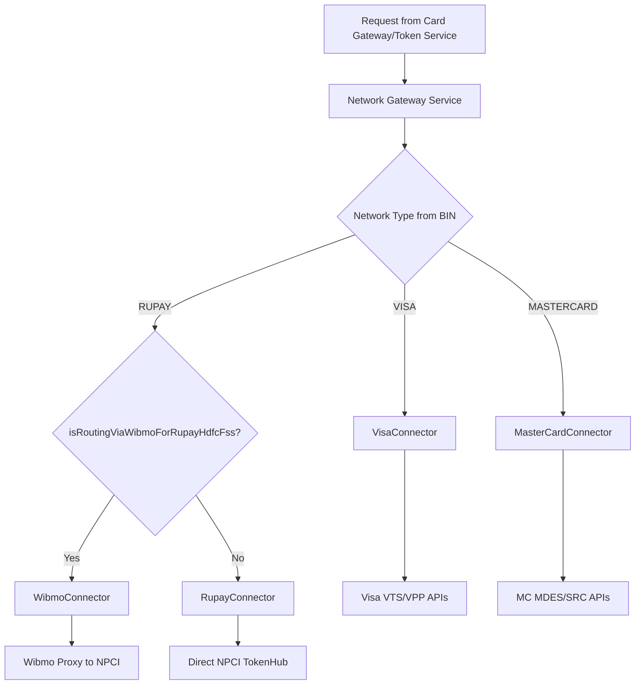
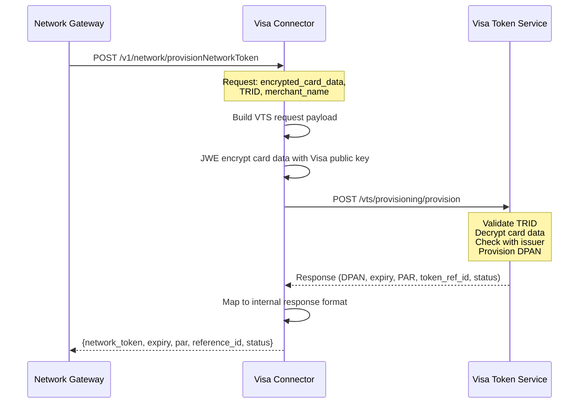
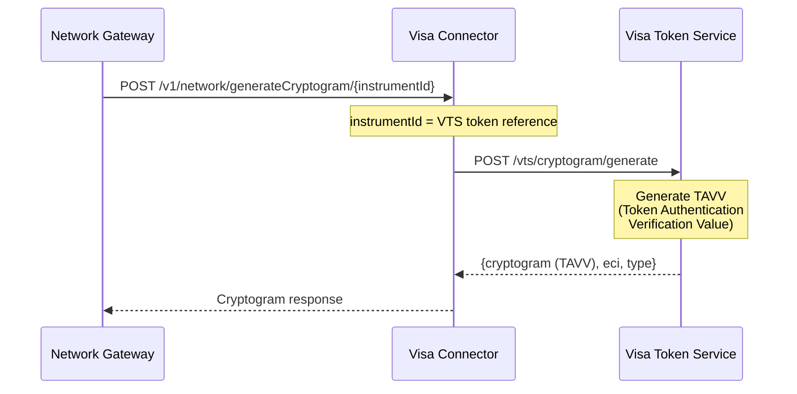
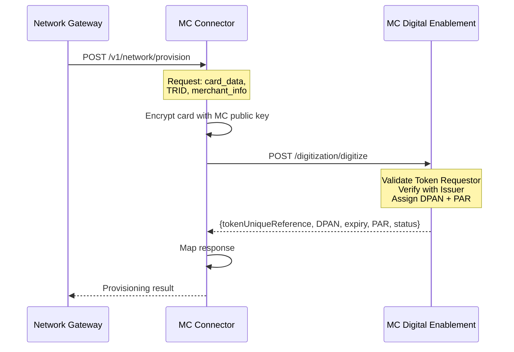
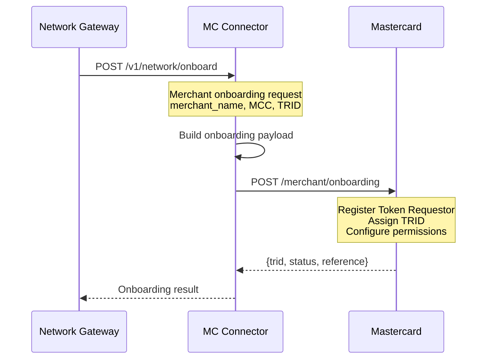
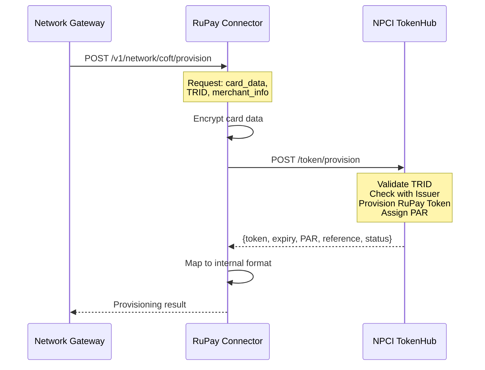
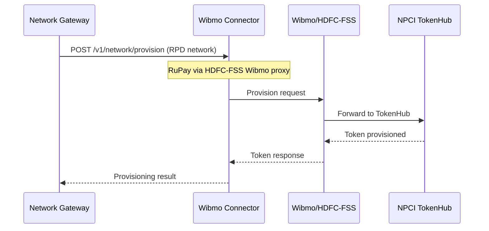
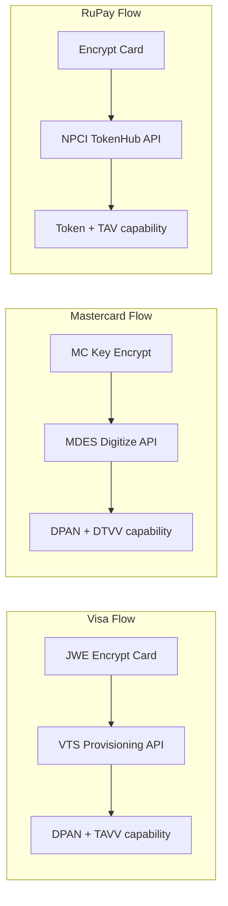

# Network Services (Visa, Mastercard, RuPay)

## Overview

The Network Services layer handles direct communication with card networks for tokenization (CoFT), Payment Account Reference (PAR) lookups, merchant onboarding (TRID), and authentication (Passkey). Each network has a dedicated connector service, orchestrated by the Network Gateway Service.

## Architecture



## Network Routing Decision



---

## Visa Network Connector

### Operations

| Operation | Controller | Endpoint | Description |
|-----------|-----------|----------|-------------|
| Token Provisioning | `CybsNetworkTokenController` | POST `/v1/network/provisionNetworkToken` | Provision DPAN via VTS |
| Cryptogram | `CybsNetworkTokenController` | POST `/v1/network/generateCryptogram/{instrumentId}` | Generate TAVV |
| Token Deletion | `CybsNetworkTokenController` | DELETE `/v1/network/deleteToken/{instrumentId}` | Delete network token |
| Card Encryption | `CybsNetworkTokenController` | GET `/v1/network/encryptCard` | Encrypt card for VTS |
| PAR Lookup | `VisaNetworkConnectorController` | POST `/v1/network/par` | Get Payment Account Reference |
| Guest Checkout | `VisaNetworkConnectorController` | POST `/v1/network/alt-token` | ALT token for guest |
| Passkey Eligibility | `VisaPasskeyController` | POST `/v1/network/passkey/eligibility` | Check VPP eligibility |
| Passkey Lookup | `VisaPasskeyController` | POST `/v1/network/passkey/lookup` | Lookup auth methods |
| Passkey Binding | `VisaPasskeyController` | POST `/v1/network/passkey/binding` | Bind new passkey |

### Visa Token Provisioning Sequence



### Visa Cryptogram Generation



---

## Mastercard Network Connector

### Operations

| Operation | Description |
|-----------|-------------|
| Merchant Onboarding | TRID registration with MC MDES |
| Guest Checkout (ALT Token) | Token for non-enrolled transactions |
| PAR Lookup | Payment Account Reference retrieval |
| Token Provisioning | DPAN provisioning via MDES |
| Cryptogram | DTVV generation |

### Mastercard Token Provisioning Sequence



### Mastercard Merchant Onboarding



---

## RuPay Network Connector

### Operations

| Operation | Service | Description |
|-----------|---------|-------------|
| CoFT Provisioning | `RupayCoftService` | Network token via NPCI TokenHub |
| Cryptogram | `RupayCoftService` | TAV generation |
| Token Deletion | `RupayCoftService` | Remove token from TokenHub |
| PAR Lookup | `RupayCoftService` | Payment Account Reference |
| Webhook Update | `RupayCoftService` | Token lifecycle from NPCI |
| Guest Checkout | `RupayClientService` | ALT token for guest |

### RuPay Token Provisioning Sequence



### RuPay via Wibmo (HDFC-FSS)



---

## Cross-Network Comparison

### Token Provisioning



### Cryptogram Types

| Network | Cryptogram | Name | Use |
|---------|-----------|------|-----|
| Visa | TAVV | Token Authentication Verification Value | Per-transaction auth proof |
| Mastercard | DTVV | Dynamic Token Verification Value | Per-transaction auth proof |
| RuPay | TAV | Token Authentication Value | Per-transaction auth proof |

### PAR (Payment Account Reference)

```mermaid
flowchart TD
    A[Same physical card] --> B[PAR: unique per-card identifier]
    B --> C[Visa DPAN 1 - Merchant A]
    B --> D[Visa DPAN 2 - Merchant B]
    B --> E[MC DPAN 3 - Merchant C]
    
    Note over B: PAR stays same across<br/>all tokens for same card
```

## Security & Authentication

| Network | Auth Method | Encryption |
|---------|------------|------------|
| Visa | Mutual TLS + API Key | JWE (RSA-OAEP, A256GCM) |
| Mastercard | Mutual TLS + OAuth 2.0 | JWE (network-specific) |
| RuPay/NPCI | Mutual TLS + Digital Signature | Network encryption |
| Wibmo | API Key + TLS | Standard TLS |

## Error Handling by Network

| Scenario | Visa | Mastercard | RuPay |
|----------|------|-----------|-------|
| Token provisioning failed | VTS error code mapping | MDES error mapping | TokenHub error codes |
| Cryptogram timeout | Retry (max 2) | Retry (max 2) | Retry (max 2) |
| Network unreachable | Circuit breaker, alert | Circuit breaker, alert | Circuit breaker, alert |
| Invalid TRID | Re-register TRID | Re-register TRID | Re-register TRID |
| Card not eligible | Return ineligible to caller | Return ineligible | Return ineligible |

## Configuration

Each network connector requires:
- **Certificates**: Mutual TLS certs per environment (sandbox/prod)
- **API Credentials**: API keys, OAuth client credentials
- **TRID**: Pre-registered Token Requestor ID
- **Encryption Keys**: Network public keys for card encryption (rotated periodically)
- **Webhook URLs**: Registered with networks for token lifecycle callbacks
