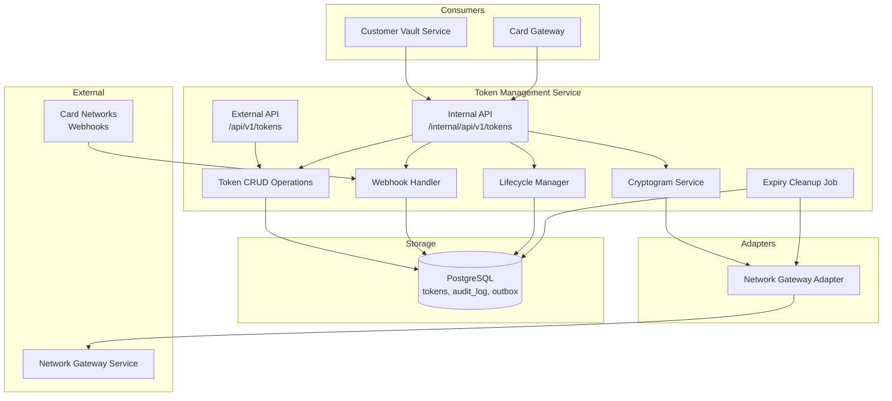
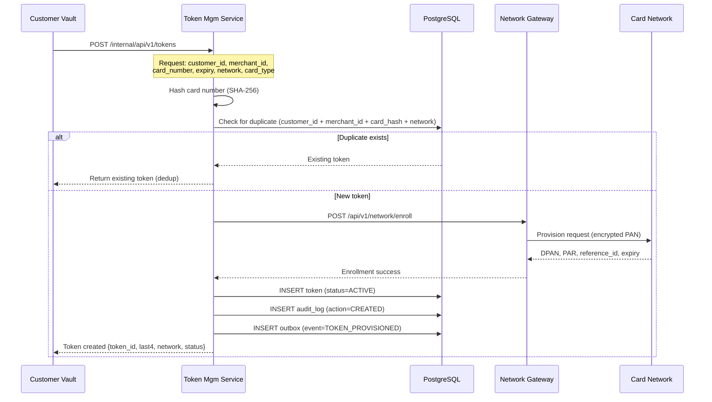
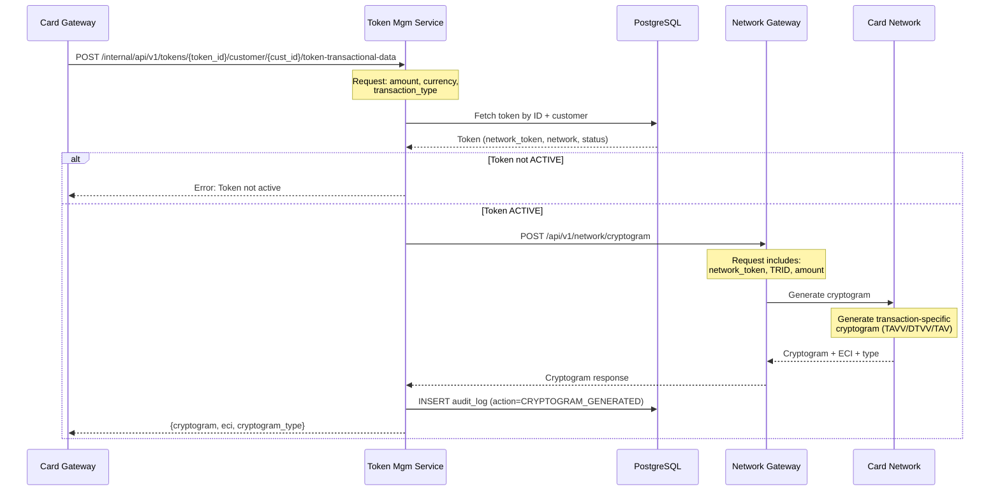
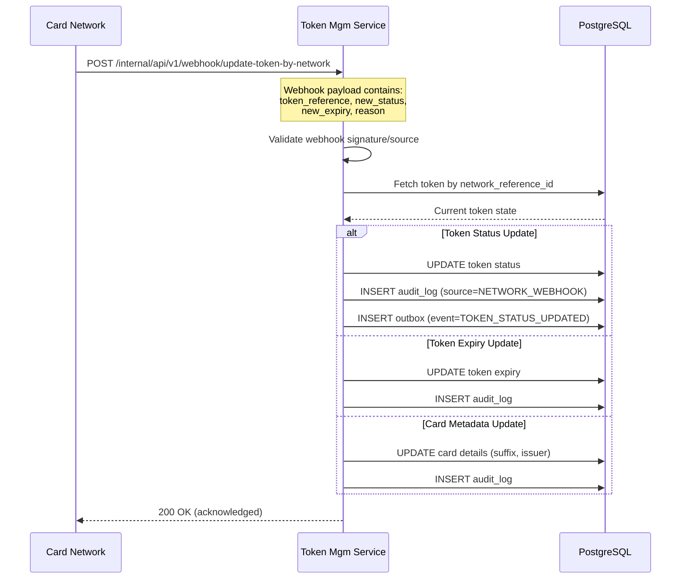
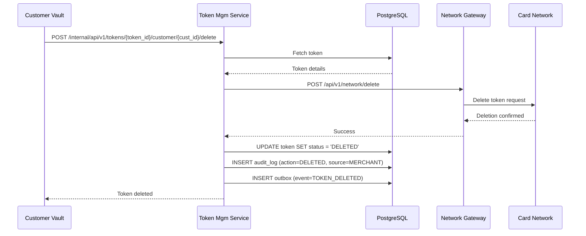
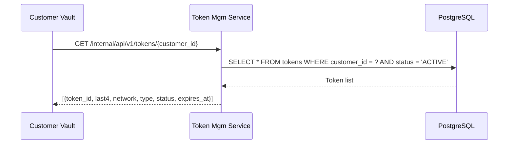
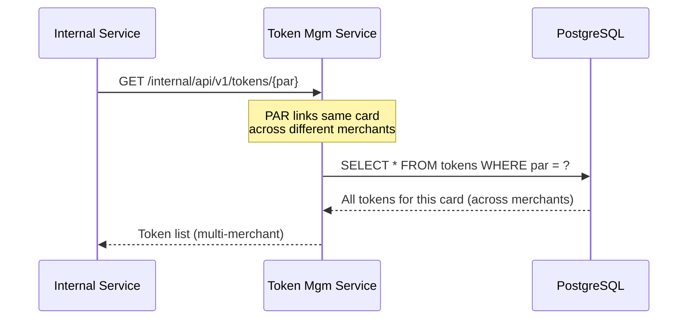
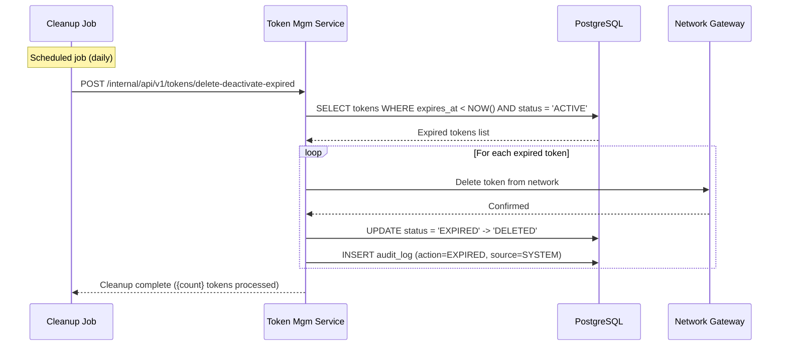
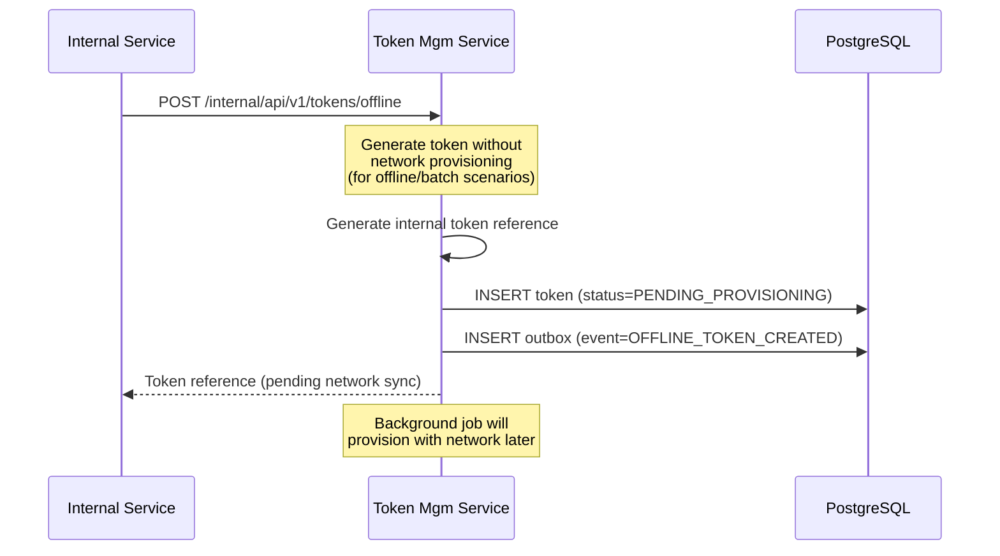

# Network Token Management Service Workflow

## Overview

The Network Token Management Service (`nxt-token-mgm-service`) is responsible for persistent storage and lifecycle management of network tokens. It coordinates with the Network Gateway Service for cryptogram generation and handles network webhooks for token status updates.

## Services Involved

| Service | Role |
|---------|------|
| Token Management Service | Token CRUD, lifecycle, cryptogram delegation |
| Network Gateway Service | Cryptogram generation, token enrollment |
| Customer Vault Service | Upstream caller for customer-token operations |
| Card Networks (via webhooks) | Token lifecycle notifications |

## Architecture

## Token Provisioning Sequence

## Cryptogram Generation Sequence

## Token Lifecycle - Update from Network

## Token Deletion Flow

## Batch Operations

### Fetch All Tokens by Customer

### Fetch Tokens by PAR

### Expired Token Cleanup

## Offline Token Generation

## Activity Diagram - Token Management Operations

```mermaid
flowchart TB
    subgraph CRUD["Token CRUD"]
        direction LR
        Create[Create/Provision] --> Store[Store with ACTIVE status]
        Read[Fetch by ID/Customer/PAR] --> Return[Return token details]
        Update[Update status/expiry] --> Audit[Log in audit_log]
        Delete[Delete token] --> Network_Del[Delete from network]
        Network_Del --> Mark_Del[Mark DELETED]
    end

    subgraph Cryptogram["Cryptogram Generation"]
        direction LR
        CReq[Cryptogram request] --> Validate[Validate token ACTIVE]
        Validate --> Delegate[Delegate to Network Gateway]
        Delegate --> Gen[Network generates cryptogram]
        Gen --> CResp[Return cryptogram + ECI]
    end

    subgraph Webhook["Webhook Processing"]
        direction LR
        WH[Network webhook] --> WValidate[Validate signature]
        WValidate --> WProcess[Process event type]
        WProcess --> WUpdate[Update token in DB]
        WUpdate --> WAudit[Audit log + outbox event]
    end

    subgraph Lifecycle["Lifecycle Jobs"]
        direction LR
        Expire[Expiry scanner] --> EFind[Find expired tokens]
        EFind --> EClean[Cleanup + notify network]
        Dedup[Dedup scanner] --> DFind[Find duplicates]
        DFind --> DMerge[Merge/cleanup duplicates]
    end
```

## API Reference

### Internal APIs (`/internal/api/v1/`)

| Method | Endpoint | Description |
|--------|----------|-------------|
| POST | `/tokens` | Provision new token |
| GET | `/tokens/{token_id}/customer/{customer_id}` | Fetch token by ID |
| PATCH | `/tokens/{token_id}/customer/{customer_id}` | Update token |
| POST | `/tokens/{token_id}/customer/{customer_id}/token-transactional-data` | Generate cryptogram |
| POST | `/tokens/{token_id}/customer/{customer_id}/delete` | Delete token |
| GET | `/tokens` | Fetch tokens (query params) |
| GET | `/tokens/{customer_id}` | Fetch all by customer |
| GET | `/tokens/{par}` | Fetch by PAR |
| POST | `/tokens/delete-deactivate-expired` | Cleanup expired |
| POST | `/tokens/delete` | Batch delete |
| POST | `/tokens/offline` | Generate offline token |
| POST | `/webhook/update-token-by-network` | Network webhook |

### External APIs (`/api/v1/tokens`)

| Method | Endpoint | Description |
|--------|----------|-------------|
| POST | `/tokens` | Provision token (merchant-facing) |
| GET | `/tokens/{token_id}` | Fetch token |
| POST | `/tokens/{token_id}/delete` | Delete token |
| POST | `/tokens/{token_id}/cryptogram` | Generate cryptogram |

## Event Types (Outbox)

| Event | Trigger | Payload |
|-------|---------|---------|
| TOKEN_PROVISIONED | New token created | token_id, customer_id, network, status |
| TOKEN_STATUS_UPDATED | Status change | token_id, old_status, new_status, source |
| TOKEN_DELETED | Token removed | token_id, customer_id, reason |
| CRYPTOGRAM_GENERATED | Cryptogram created | token_id, transaction_ref |
| TOKEN_EXPIRED | Auto-expiry | token_id, expired_at |
| OFFLINE_TOKEN_CREATED | Offline provision | token_id, pending_network_sync |
