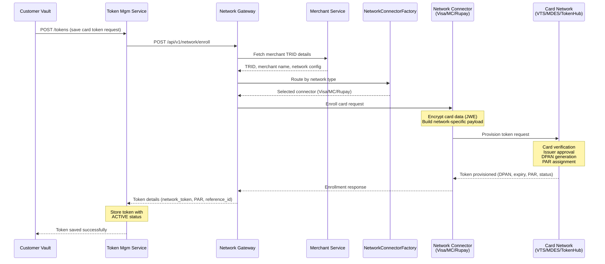
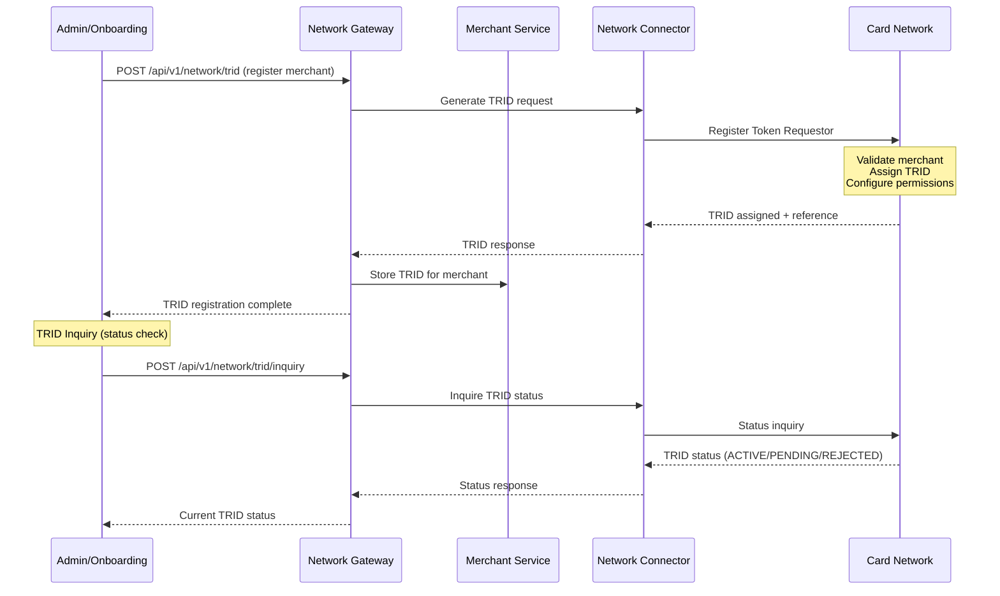
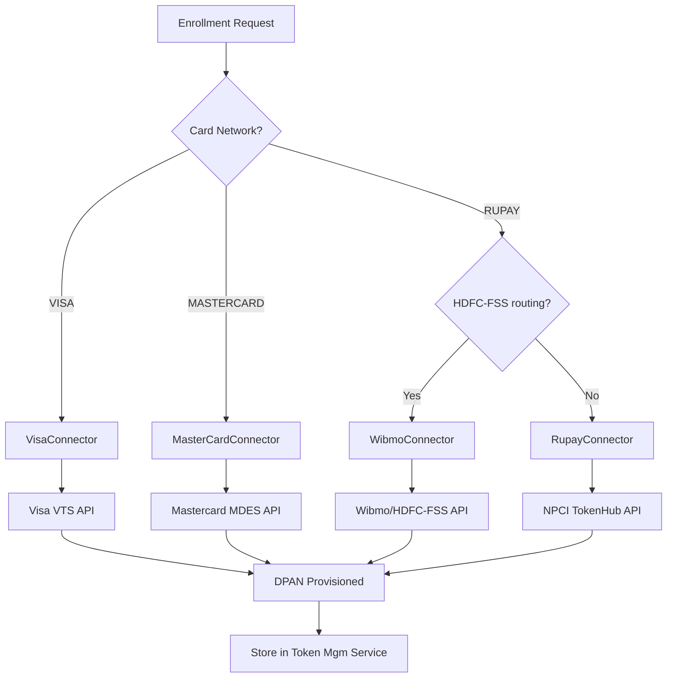
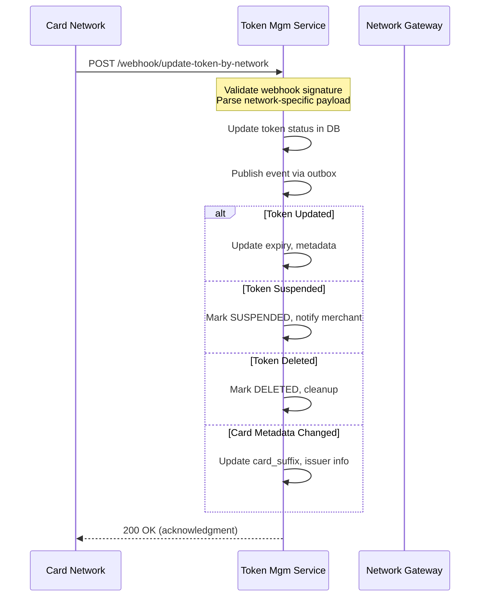

# Network Tokenization Workflow

## Overview

Network Tokenization is the process of replacing a card PAN with a network-issued digital token (DPAN). This is managed by the card networks (Visa VTS, Mastercard MDES, RuPay TokenHub) and orchestrated through Plural's Network Gateway Service.

## Services Involved

| Service | Role |
|---------|------|
| Network Gateway Service | Central orchestrator for all network token operations |
| Visa Network Connector | VTS API integration (provisioning, cryptogram, passkey) |
| Mastercard Network Connector | MDES API integration (digitization, cryptogram) |
| RuPay Network Connector | NPCI TokenHub integration |
| Wibmo Network Connector | RuPay via HDFC-FSS/Wibmo proxy |
| Token Management Service | Persistent token storage and lifecycle |
| Customer Vault Service | Customer-token association |
| Merchant Service | TRID registration and merchant data |

## Token Provisioning (Enrollment) Sequence

## TRID Registration Flow

## Network Routing Logic

## Activity Diagram - Complete Network Token Lifecycle

```mermaid
flowchart TB
    subgraph Registration["Merchant Registration"]
        R1[Merchant onboarding] --> R2[Register TRID with Visa]
        R1 --> R3[Register TRID with Mastercard]
        R1 --> R4[Register TRID with RuPay]
        R2 --> R5[TRID Active]
        R3 --> R5
        R4 --> R5
    end

    subgraph Provisioning["Token Provisioning"]
        P1[Customer saves card] --> P2[Identify card network via BIN]
        P2 --> P3[Encrypt PAN with network public key]
        P3 --> P4[Send to network via connector]
        P4 --> P5{Issuer approves?}
        P5 -->|Yes| P6[DPAN + PAR assigned]
        P5 -->|No| P7[Provisioning failed]
        P6 --> P8[Store token: ACTIVE]
    end

    subgraph Usage["Token Usage (Payment)"]
        U1[Customer pays with saved card] --> U2[Fetch DPAN from token store]
        U2 --> U3[Request cryptogram from network]
        U3 --> U4[Cryptogram generated]
        U4 --> U5[Send DPAN + Cryptogram to acquirer]
        U5 --> U6[Acquirer routes to network]
        U6 --> U7[Network validates token + cryptogram]
        U7 --> U8[Route to issuer with original PAN]
        U8 --> U9[Issuer authorizes]
    end

    subgraph LifecycleManagement["Lifecycle Management"]
        L1[Network sends webhook] --> L2{Event type}
        L2 -->|TOKEN_UPDATED| L3[Update expiry/metadata]
        L2 -->|TOKEN_SUSPENDED| L4[Mark SUSPENDED]
        L2 -->|TOKEN_DEACTIVATED| L5[Mark DEACTIVATED]
        L2 -->|CARD_METADATA_UPDATE| L6[Update card info]
        L2 -->|TOKEN_DELETED| L7[Mark DELETED]
    end

    subgraph Deletion["Token Deletion"]
        D1[Delete request] --> D2{Source?}
        D2 -->|Merchant| D3[Delete via API]
        D2 -->|Customer| D3
        D2 -->|System| D4[Expiry cleanup job]
        D3 --> D5[Call network delete API]
        D4 --> D5
        D5 --> D6[Network confirms deletion]
        D6 --> D7[Mark DELETED in store]
    end
```

## Network-Specific Details

### Visa (VTS - Visa Token Service)
| Operation | API | Notes |
|-----------|-----|-------|
| Provision | VTS Provisioning API | JWE-encrypted card data, returns DPAN + PAR |
| Cryptogram | VTS Cryptogram API | TAVV generation per-transaction |
| Delete | VTS Lifecycle API | Permanent token removal |
| Inquiry | VTS Status API | Check token status |

### Mastercard (MDES - Digital Enablement Service)
| Operation | API | Notes |
|-----------|-----|-------|
| Provision | MDES Digitize API | Asset tokenization, returns DPAN + PAR |
| Cryptogram | MDES Transact API | DTVV generation |
| Delete | MDES Suspend/Delete API | Token lifecycle management |
| Onboard | MDES Merchant Onboarding | TRID + SRC merchant setup |

### RuPay (NPCI TokenHub)
| Operation | API | Notes |
|-----------|-----|-------|
| Provision | TokenHub CoFT API | Direct or via Wibmo for HDFC-FSS |
| Cryptogram | TokenHub TAV API | Token Authentication Value |
| Delete | TokenHub Lifecycle API | Token removal |
| PAR | TokenHub PAR API | Payment Account Reference lookup |

## Webhook Handling

## Error Handling

| Scenario | Recovery |
|----------|----------|
| Network timeout during enrollment | Retry with idempotency key |
| Issuer declines provisioning | Return failure, suggest alternate card |
| TRID not active | Block enrollment, alert operations |
| Invalid card data | Validate BIN before enrollment attempt |
| Duplicate enrollment | Return existing token (dedup by card_hash) |
| Webhook signature invalid | Reject, log security alert |
