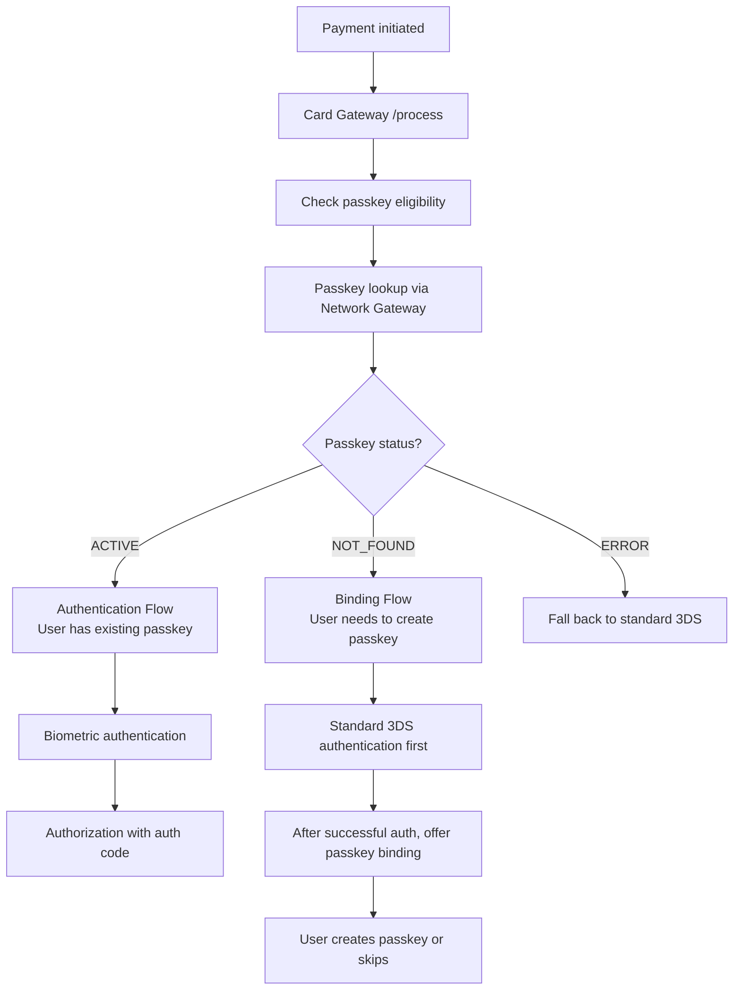
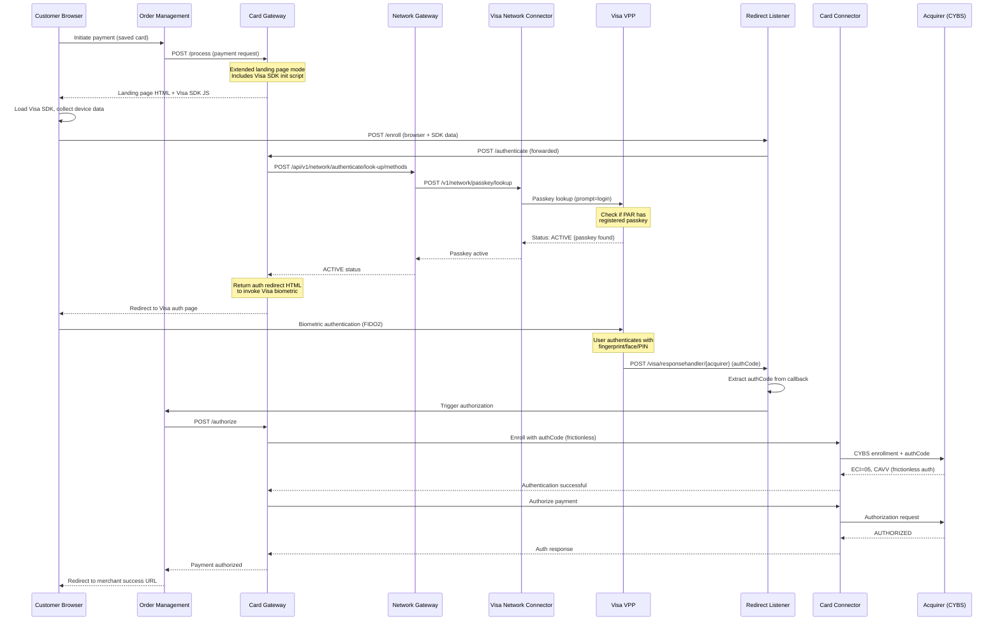
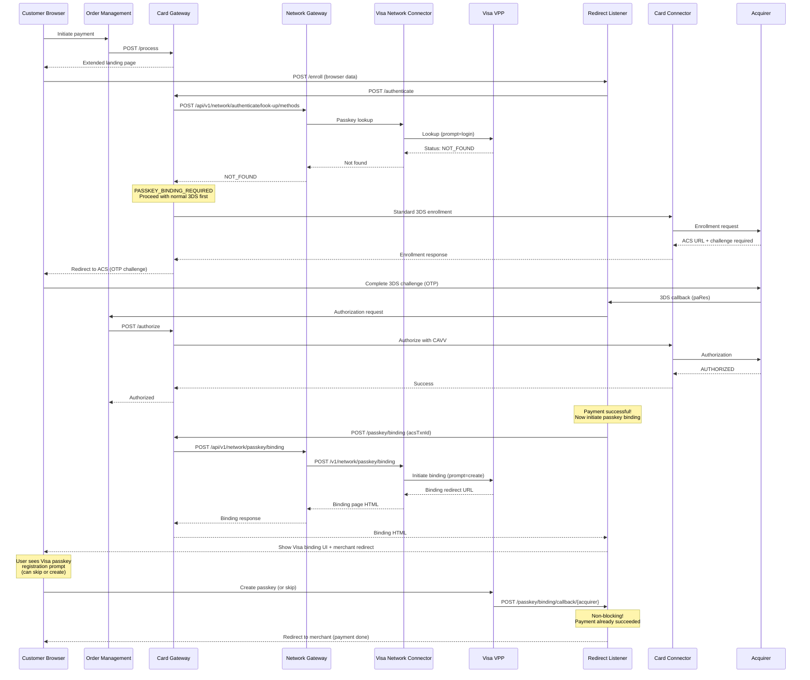
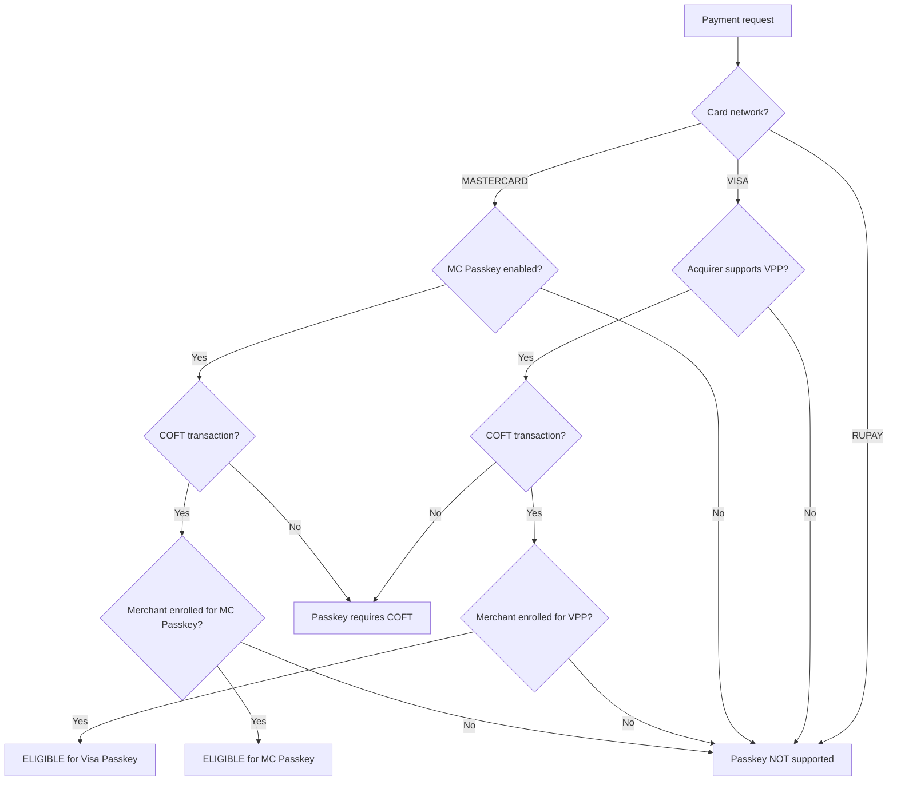

# Passkey Workflow (Visa Payment Passkey / Mastercard SRC)

## Overview

The Passkey workflow enables FIDO2/WebAuthn-based biometric authentication for card payments, replacing traditional OTP-based 3DS authentication. Plural supports Visa Payment Passkey (VPP) and Mastercard SRC Passkey, providing a frictionless checkout experience using device biometrics (fingerprint, face recognition).

## Services Involved

| Service | Role |
|---------|------|
| Card Gateway | Orchestrates passkey flow, extended landing page, status mapping |
| Network Gateway Service | Passkey eligibility, lookup, binding API delegation |
| Visa Network Connector | VPP APIs (eligibility, lookup, binding) |
| Mastercard Network Connector | MC SRC passkey APIs |
| Redirect Listener | Handles passkey auth callbacks from Visa/MC |
| OMS | Order lifecycle + authorization trigger |

## Two Passkey Flows



---

## Authentication Flow (Passkey Exists)



## Binding Flow (Passkey Not Found)



## Passkey Eligibility Check



## Activity Diagram - Complete Passkey Lifecycle

```mermaid
flowchart TB
    subgraph Enrollment["Passkey Enrollment (First Use)"]
        E1[Customer completes first payment] --> E2[3DS challenge completed]
        E2 --> E3[Payment authorized successfully]
        E3 --> E4[Offer passkey binding]
        E4 --> E5{Customer accepts?}
        E5 -->|Yes| E6[Redirect to Visa/MC binding page]
        E6 --> E7[Customer creates FIDO2 credential]
        E7 --> E8[Passkey registered with PAR]
        E5 -->|No| E9[Skip - normal flow continues]
    end

    subgraph Authentication["Passkey Authentication (Subsequent)"]
        A1[Customer initiates payment] --> A2[Extended landing page loads]
        A2 --> A3[SDK collects device data]
        A3 --> A4[Passkey lookup by PAR]
        A4 --> A5{Passkey found?}
        A5 -->|ACTIVE| A6[Prompt biometric auth]
        A6 --> A7[FIDO2 assertion]
        A7 --> A8[Auth code generated]
        A8 --> A9[Frictionless authorization ECI=05]
        A5 -->|NOT_FOUND| A10[Fall back to 3DS + offer binding]
        A5 -->|SUSPENDED| A11[Fall back to 3DS]
    end

    subgraph Lifecycle["Passkey Lifecycle"]
        L1[Passkey created] --> L2[ACTIVE state]
        L2 --> L3{User action}
        L3 -->|Device lost| L4[Revoke passkey]
        L3 -->|New device| L5[Re-register passkey]
        L3 -->|Card expires| L6[Passkey remains via PAR]
    end
```



## Network-Specific Passkey Details

### Visa Payment Passkey (VPP)

| Aspect | Details |
|--------|---------|
| Protocol | FIDO2/WebAuthn via Visa Click to Pay SDK |
| Lookup Key | PAR (Payment Account Reference) |
| Auth Result | authCode (exchanged for CAVV at CYBS) |
| Binding Trigger | After successful 3DS auth |
| Binding Mode | Non-blocking (payment already done) |
| Failure Handling | Hard failure - no 3DS fallback in auth flow |

### Mastercard SRC Passkey

| Aspect | Details |
|--------|---------|
| Protocol | FIDO2/WebAuthn via MC SRC SDK |
| Lookup Key | PAR |
| Auth Result | Direct CAVV generation |
| Callback | GET /mastercard/responsehandler/{acquirer} |
| Failure Handling | Fall back to standard 3DS |

## Redirect Listener Passkey Endpoints

| Endpoint | Method | Network | Purpose |
|----------|--------|---------|---------|
| `/visa/responsehandler/{acquirer}` | POST | Visa | VPP auth completion callback |
| `/mastercard/responsehandler/{acquirer}` | GET | Mastercard | MC passkey auth callback |
| `/passkey/binding/callback/{acquirer}` | POST | Visa | Binding result (non-blocking) |

## Configuration

```sql
-- Passkey enablement in acquirer-network config
PINE_PG_ACQUIRER_NETWORK_CONFIG_TBL:
  IS_PASSKEY_ENABLED = 1
  PASSKEY_TYPE = 'VPP'  -- or 'SRC' for Mastercard
```

## Key Design Decisions

1. **COFT is prerequisite**: Passkey only works with tokenized cards (network tokens)
2. **Binding is non-blocking**: Payment completes first, then passkey enrollment is offered
3. **Auth failure is hard**: If passkey auth fails, no automatic 3DS fallback (phase 1)
4. **Network-branched logic**: Visa and MC have separate code paths at every extension point
5. **Extended landing page**: Custom HTML page that loads network SDK for device fingerprinting

## Error Scenarios

| Error | Impact | Recovery |
|-------|--------|----------|
| Passkey lookup timeout | Auth flow blocked | Fall back to 3DS |
| Biometric failed | Auth rejected | Allow retry (max 3) |
| Binding callback timeout | Non-blocking | Payment already succeeded |
| SDK load failure | Can't initiate passkey | Fall back to standard flow |
| CYBS authCode exchange fails | Authorization blocked | Fail payment |
