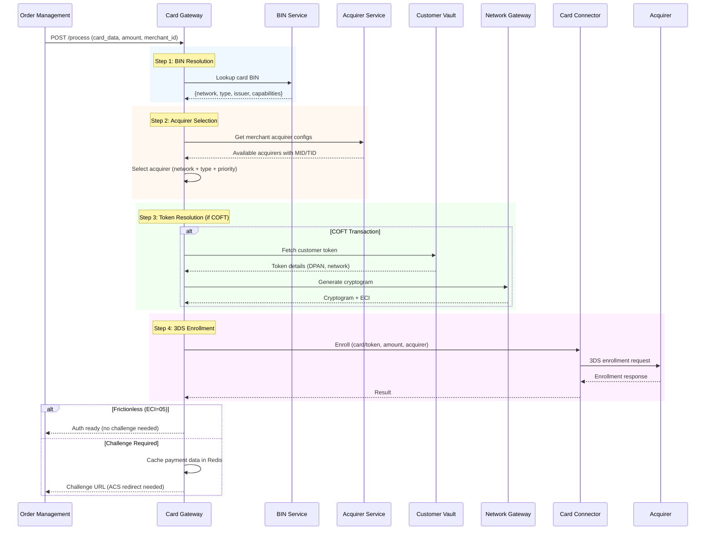
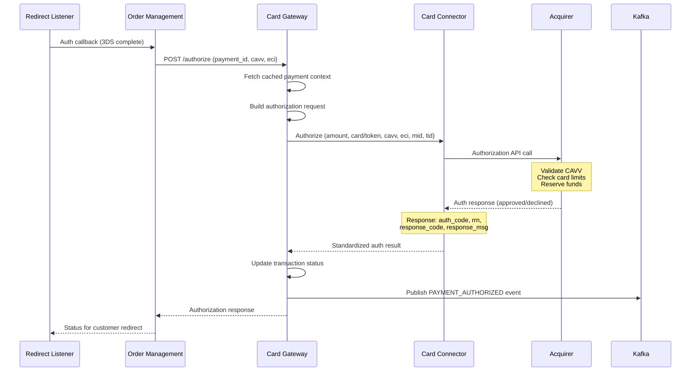
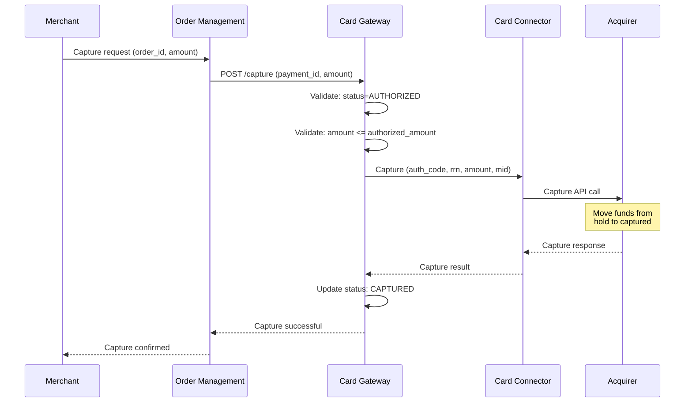
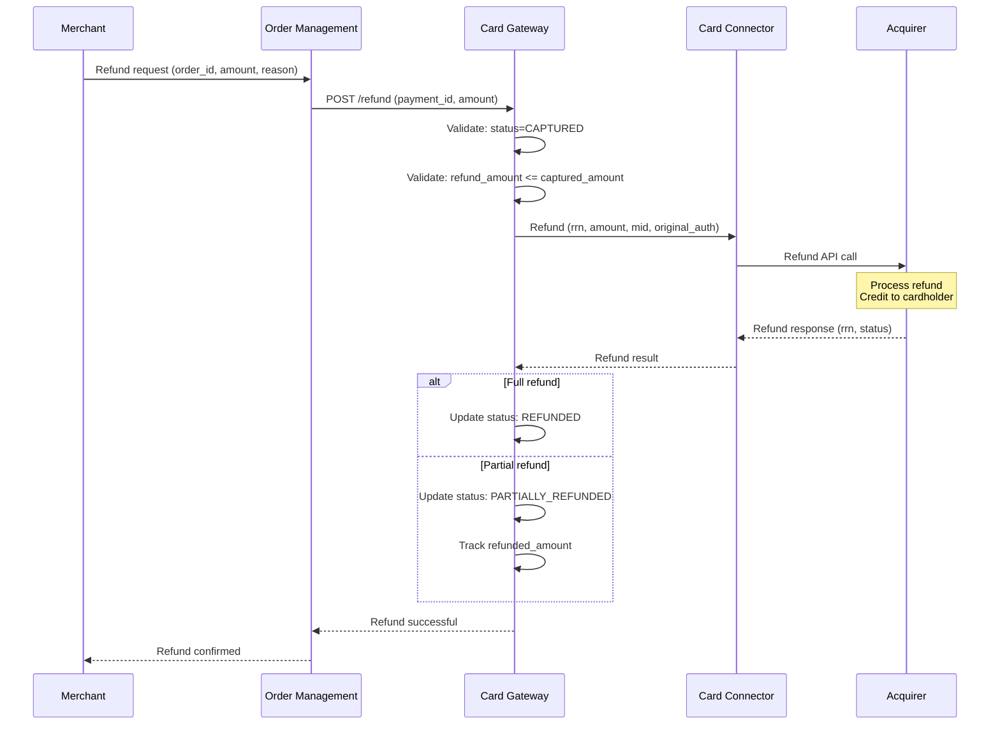
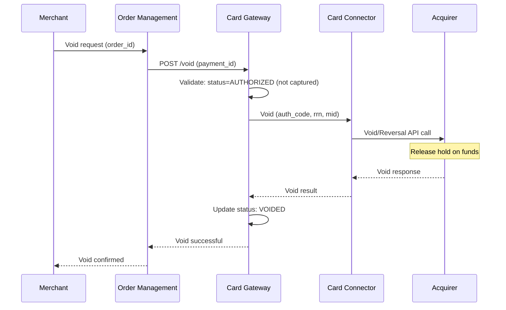
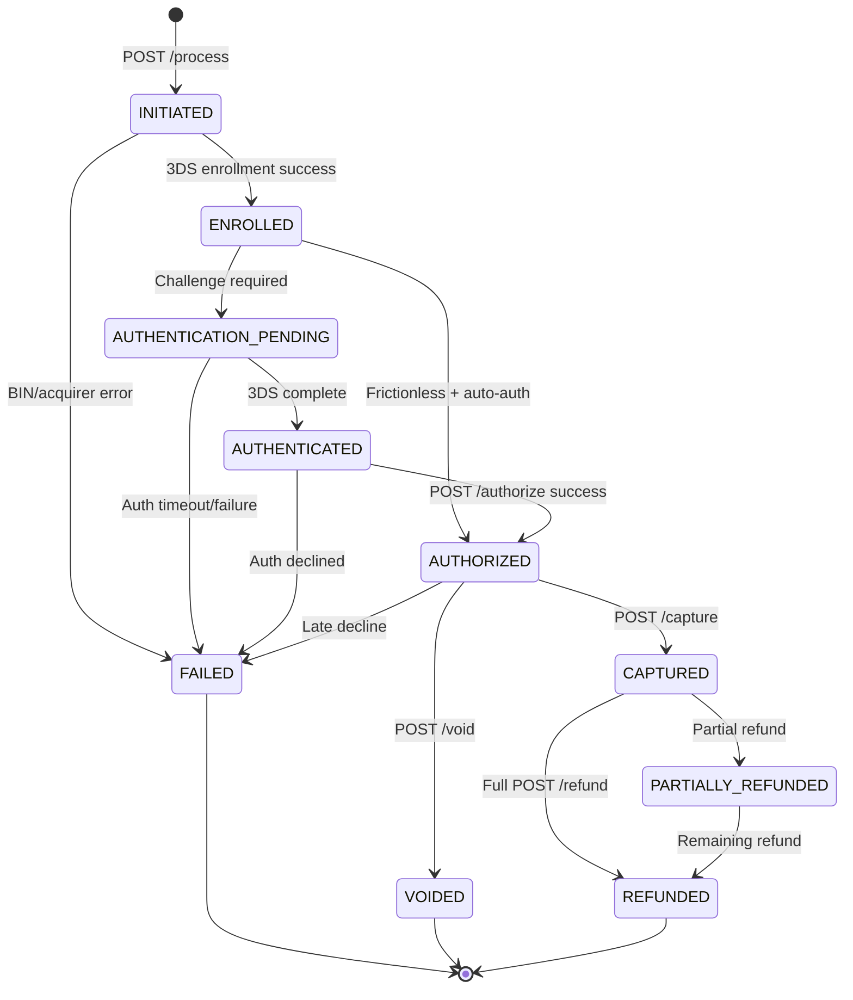
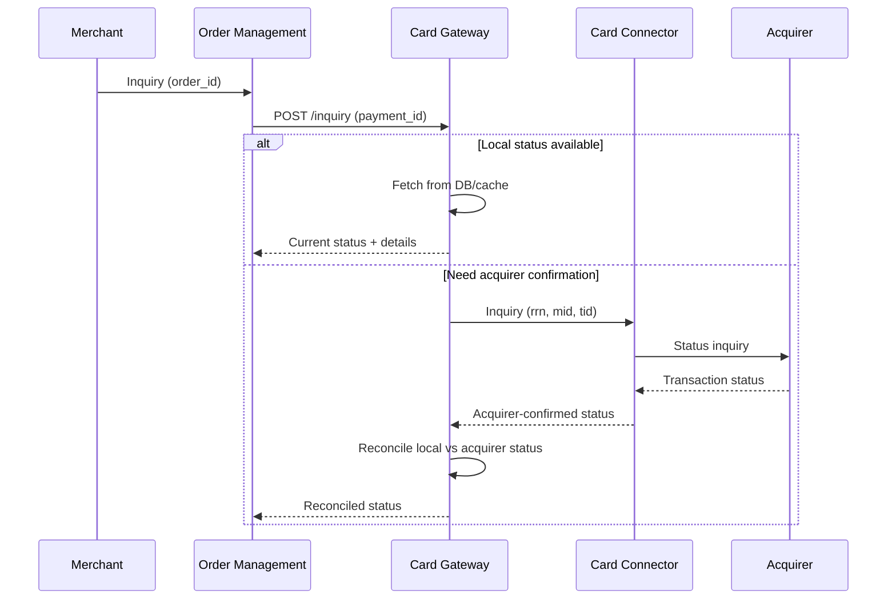

# Payment Processing Workflows

## Overview

The Card Gateway Service orchestrates the complete payment lifecycle through six core operations: Process, Authenticate, Authorize, Capture, Refund, and Void. Each operation is exposed as a REST endpoint and follows a standardized flow through the processing pipeline.

## Core Operations

| Operation | Endpoint | Description |
|-----------|----------|-------------|
| Process | POST `/process` | Initiate payment, BIN lookup, acquirer selection, 3DS enrollment |
| Authenticate | POST `/authenticate` | Handle 3DS authentication callback |
| Authorize | POST `/authorize` | Submit authorization to acquirer |
| Capture | POST `/capture` | Capture pre-authorized amount |
| Refund | POST `/refund` | Refund captured payment |
| Void | POST `/void` | Cancel pre-authorized payment |
| Inquiry | POST `/inquiry` | Check transaction status |

---

## Process Payment Sequence

## Authorization Sequence

## Capture Sequence

## Refund Sequence

## Void Sequence

## Transaction State Machine

## Activity Diagram - Full Payment Flow

```mermaid
flowchart TB
    subgraph Process["Process Phase"]
        P1[Receive payment request] --> P2[BIN lookup]
        P2 --> P3[Acquirer selection]
        P3 --> P4{COFT?}
        P4 -->|Yes| P5[Fetch token + cryptogram]
        P4 -->|No| P6[Use card data directly]
        P5 --> P7[3DS Enrollment]
        P6 --> P7
        P7 --> P8{Enrollment result}
        P8 -->|Frictionless| P9[Direct to authorize]
        P8 -->|Challenge| P10[Cache + redirect to ACS]
        P8 -->|Failed| P11[Return failure]
    end

    subgraph Authenticate["Authentication Phase"]
        A1[Customer at ACS page] --> A2{Auth method}
        A2 -->|OTP| A3[Native OTP / ACS OTP]
        A2 -->|Passkey| A4[Biometric authentication]
        A2 -->|3DS Challenge| A5[Bank challenge page]
        A3 --> A6[Callback to Redirect Listener]
        A4 --> A6
        A5 --> A6
        A6 --> A7[Extract auth data]
    end

    subgraph Authorize["Authorization Phase"]
        AU1[Receive auth data CAVV+ECI] --> AU2[Build auth request]
        AU2 --> AU3[Send to acquirer via connector]
        AU3 --> AU4{Approved?}
        AU4 -->|Yes| AU5[AUTHORIZED]
        AU4 -->|No| AU6[DECLINED]
    end

    subgraph PostAuth["Post-Authorization"]
        PA1[AUTHORIZED] --> PA2{Merchant action}
        PA2 -->|Capture| PA3[Send capture to acquirer]
        PA2 -->|Void| PA4[Send void to acquirer]
        PA3 --> PA5[CAPTURED]
        PA4 --> PA6[VOIDED]
        PA5 --> PA7{Refund?}
        PA7 -->|Full| PA8[REFUNDED]
        PA7 -->|Partial| PA9[PARTIALLY_REFUNDED]
    end
```

## Inquiry Flow

## Response Code Mapping

| Acquirer Code | Plural Status | Description |
|---------------|--------------|-------------|
| 00 | AUTHORIZED | Approved |
| 05 | DECLINED | Do not honor |
| 12 | DECLINED | Invalid transaction |
| 14 | DECLINED | Invalid card number |
| 41 | DECLINED | Card reported lost |
| 43 | DECLINED | Card reported stolen |
| 51 | DECLINED | Insufficient funds |
| 54 | DECLINED | Card expired |
| 55 | DECLINED | Incorrect PIN |
| 61 | DECLINED | Exceeds withdrawal limit |
| 91 | TIMEOUT | Issuer unavailable |

## Error Recovery Patterns

| Scenario | Pattern |
|----------|---------|
| Auth timeout | Inquiry after 30s, if no response -> reversal |
| Capture timeout | Inquiry to confirm, retry if not processed |
| Duplicate auth attempt | Idempotency via payment_id |
| Partial capture | Track remaining authorized amount |
| Multiple partial refunds | Track cumulative refund vs captured |
| Network partition | Circuit breaker + fallback to inquiry |
