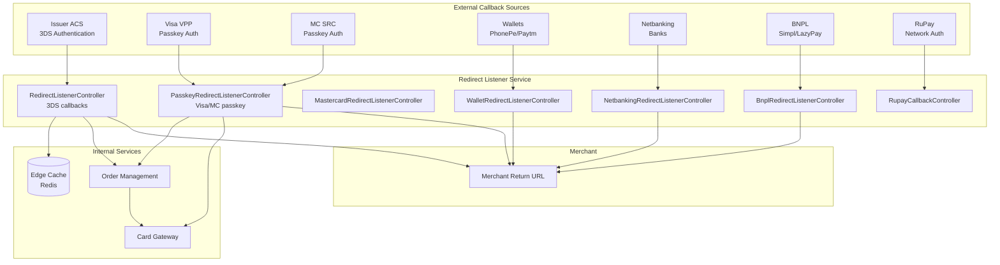
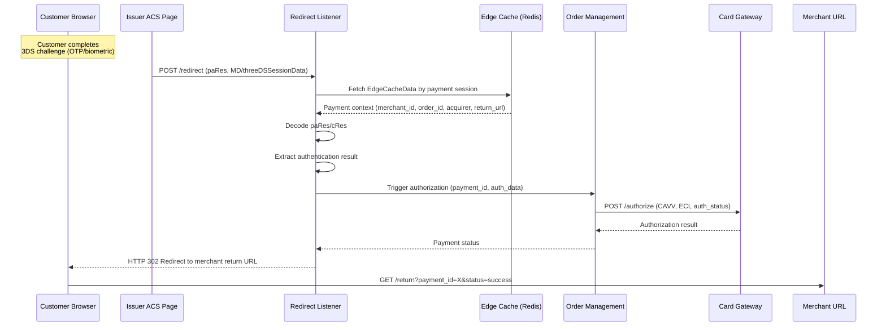
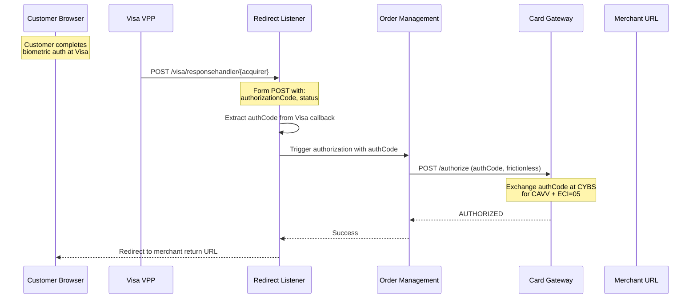
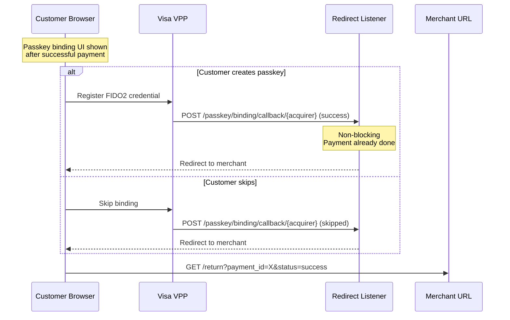
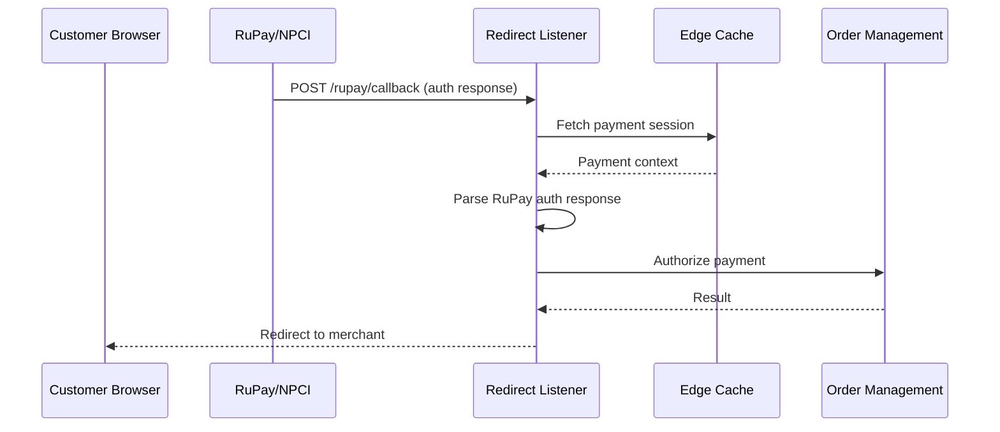
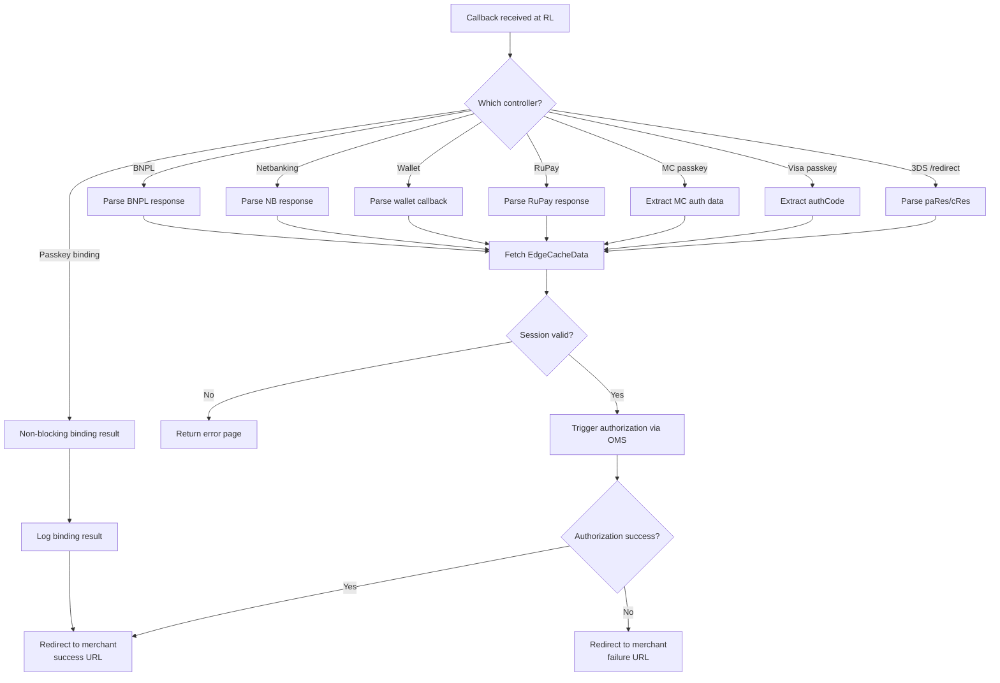

# Redirect Listener Service

## Overview

The Redirect Listener (`Plural_RedirectListenerv21`) is the central callback handler for all asynchronous payment flows. When a customer completes authentication at an external page (3DS, passkey, wallet, netbanking), the bank/network POSTs back to the Redirect Listener, which then orchestrates the next steps (authorization, binding, merchant redirect).

## Services Involved

| Service | Role |
|---------|------|
| Redirect Listener | Receives all async payment callbacks |
| OMS | Triggers authorization after authentication |
| Card Gateway | Process/authorize endpoints |
| Edge Cache (Redis) | Payment session data |
| Merchant | Final redirect destination |

## Architecture



## 3DS Redirect Callback Sequence



## Visa Passkey Callback Sequence



## Passkey Binding Callback Sequence



## RuPay Callback Sequence



## Activity Diagram - Redirect Listener Decision Flow



## Controller Endpoint Reference

### Main 3DS Controller (`RedirectListenerController`)
| Method | Endpoint | Description |
|--------|----------|-------------|
| POST | `/redirect` | Standard 3DS paRes callback |
| POST | `/3ds2/redirect` | 3DS2 cRes callback |
| POST | `/redirect/{acquirer}` | Acquirer-specific 3DS callback |

### Passkey Controller (`PasskeyRedirectListenerController`)
| Method | Endpoint | Description |
|--------|----------|-------------|
| POST | `/visa/responsehandler/{acquirer}` | Visa VPP auth callback |
| GET | `/mastercard/responsehandler/{acquirer}` | MC passkey auth callback |
| POST | `/passkey/binding/callback/{acquirer}` | Visa passkey binding result |

### Mastercard Controller (`MastercardRedirectListenerController`)
| Method | Endpoint | Description |
|--------|----------|-------------|
| POST | `/mastercard/redirect` | MC-specific redirect |

### RuPay Controller (`RupayCallbackController`)
| Method | Endpoint | Description |
|--------|----------|-------------|
| POST | `/rupay/callback` | RuPay auth callback |
| POST | `/rupay/s2s/callback` | RuPay server-to-server callback |

### Wallet Controller (`WalletRedirectListenerController`)
| Method | Endpoint | Description |
|--------|----------|-------------|
| POST | `/wallet/callback` | Wallet payment callback |
| POST | `/wallet/redirect/{provider}` | Provider-specific redirect |

### Netbanking Controller (`NetbankingRedirectListenerController`)
| Method | Endpoint | Description |
|--------|----------|-------------|
| POST | `/netbanking/callback` | Netbanking auth callback |

### BNPL Controller (`BnplRedirectListenerController`)
| Method | Endpoint | Description |
|--------|----------|-------------|
| POST | `/bnpl/callback` | BNPL auth callback |

## Edge Cache Data Structure

```json
{
  "payment_id": "PAY_123456",
  "order_id": "ORD_789",
  "merchant_id": "M001",
  "acquirer_id": "HDFC",
  "amount": 1000.00,
  "currency": "INR",
  "card_hash": "sha256...",
  "return_url": "https://merchant.com/return",
  "cancel_url": "https://merchant.com/cancel",
  "webhook_url": "https://merchant.com/webhook",
  "enrollment_data": {
    "acs_url": "https://acs.bank.com/auth",
    "pareq": "...",
    "md": "...",
    "three_ds_version": "2.2"
  },
  "acquirer_mid": "MID_001",
  "acquirer_tid": "TID_001",
  "created_at": "2024-01-01T10:00:00Z",
  "ttl_seconds": 900
}
```

## Error Handling

| Error | Handling |
|-------|----------|
| Session expired (TTL) | Show error page, redirect to merchant with failure |
| Invalid paRes/signature | Reject, log security event |
| OMS authorization timeout | Retry once, then fail to merchant |
| Merchant return URL unreachable | Log error, show payment status page |
| Duplicate callback | Idempotent - return same result |
| Missing EdgeCacheData | Return 400, log data inconsistency |

## Security

- All callback URLs are HTTPS only
- HMAC/signature validation on callbacks where supported
- EdgeCacheData has TTL (15 minutes default)
- Rate limiting on callback endpoints
- IP whitelisting for known bank/network IPs (optional)
