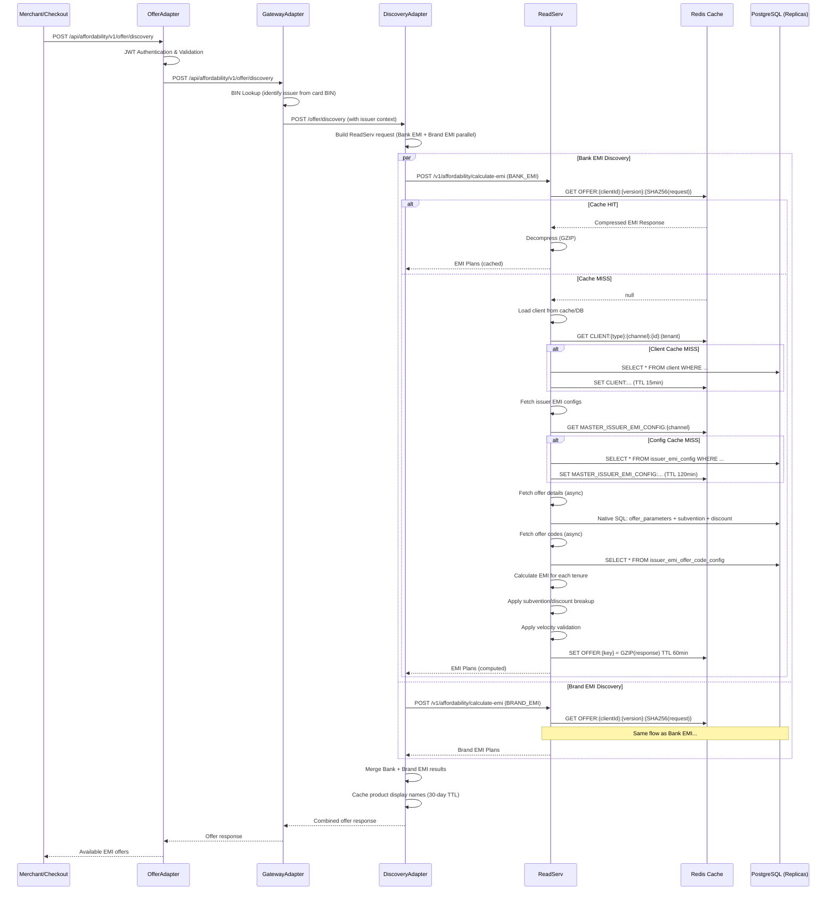
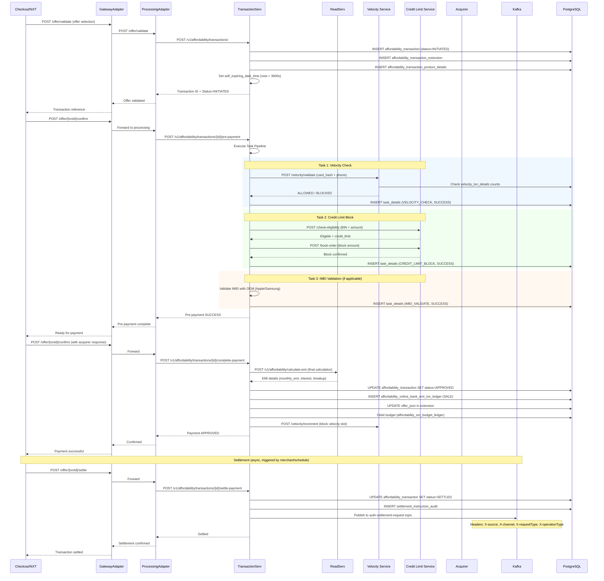
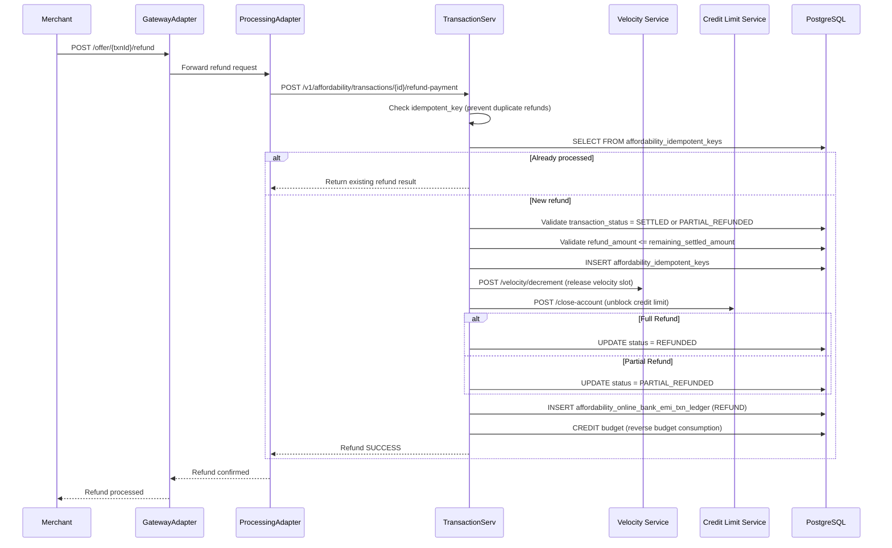
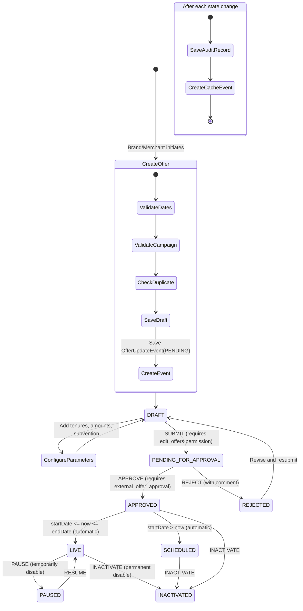
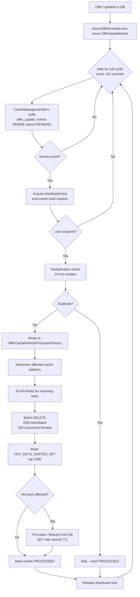
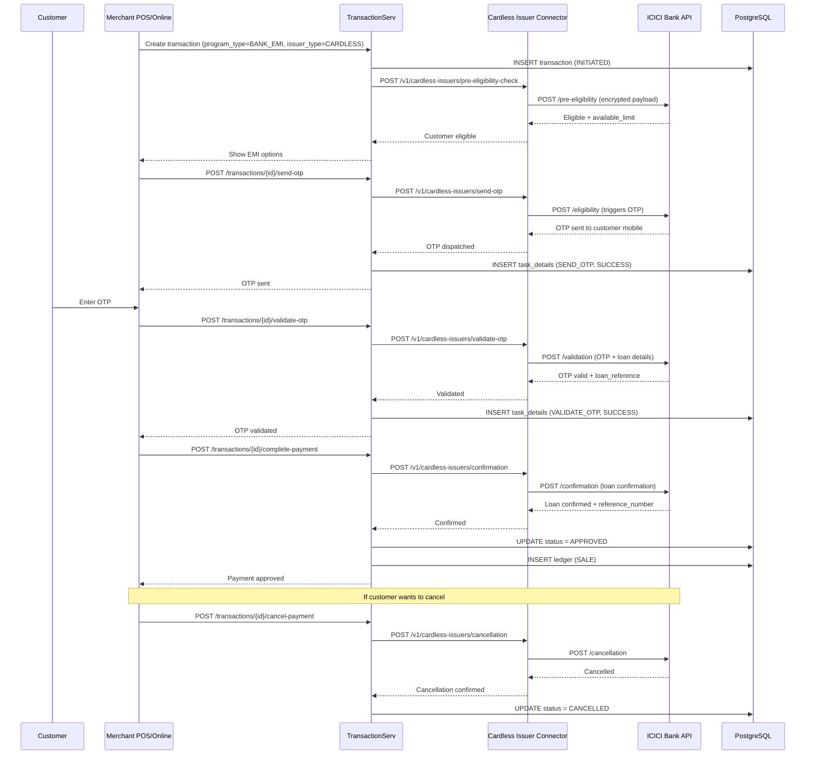
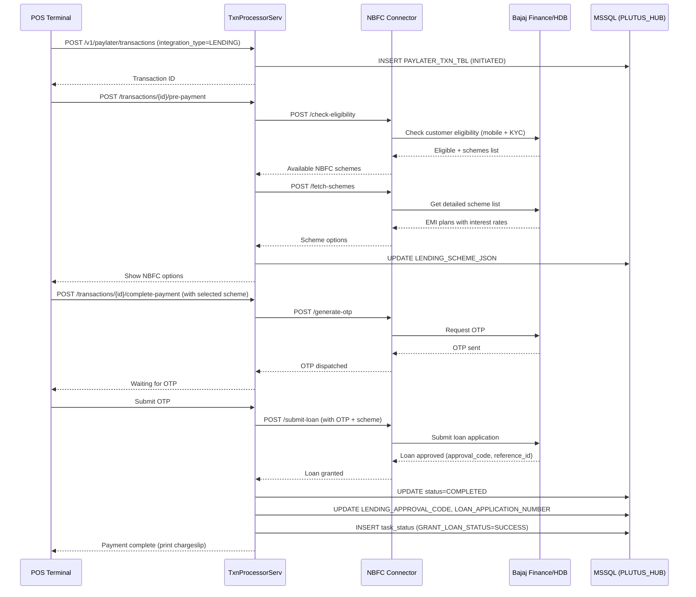
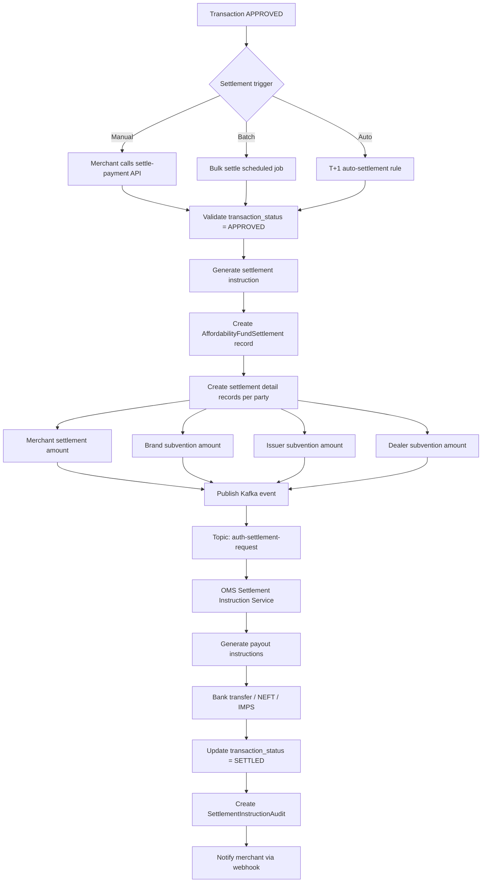

# Affordability Platform - Workflows & Sequence Diagrams

## 1. EMI Offer Discovery Flow

### Sequence Diagram (Mermaid)



---

## 2. EMI Transaction Lifecycle (Online Payment)

### Sequence Diagram



---

## 3. Refund Flow

### Sequence Diagram



---

## 4. Offer Lifecycle (Admin Portal)

### Activity Diagram



---

## 5. Cache Invalidation Workflow

### Activity Diagram



---

## 6. EMI Calculation Engine Flow

### Activity Diagram

```mermaid
flowchart TD
    A[Request: client, products, amount, issuer, tenure] --> B{Request has cardData<br/>or customerDetails?}
    B -->|Yes| C[Skip cache - personalized]
    B -->|No| D[Generate cache key:<br/>SHA256 of normalized request]
    D --> E{Redis cache hit?}
    E -->|Yes| F[Decompress GZIP response]
    F --> G[Return cached response]
    E -->|No| C
    
    C --> H[Load Client entity<br/>from cache/DB]
    H --> I[Resolve Client Group<br/>& Program Types]
    I --> J[Parallel async fetch]
    
    J --> K1[Fetch Issuer EMI Configs<br/>from cache/DB]
    J --> K2[Fetch Offer Details<br/>native SQL query]
    J --> K3[Fetch Offer Codes<br/>from cache/DB]
    J --> K4[Fetch Product Mappings<br/>Redis Hash HMGET]
    
    K1 --> L[CompletableFuture.allOf - wait]
    K2 --> L
    K3 --> L
    K4 --> L
    
    L --> M[Filter by BIN range<br/>sorted set lookup]
    M --> N[Filter by amount bounds<br/>min_amount <= txn_amount <= max_amount]
    N --> O[Filter by tenure<br/>if specific tenure requested]
    O --> P[Filter by applicability<br/>days bitmap, hours, dates]
    
    P --> Q{Program Type?}
    Q -->|BANK_EMI| R1[BankEmiCalculator]
    Q -->|BRAND_EMI| R2[BrandEmiCalculator]
    
    R1 --> S[For each eligible issuer+tenure:]
    R2 --> S
    
    S --> T[Calculate monthly EMI:<br/>P × r × (1+r)^n / ((1+r)^n - 1)]
    T --> U[Calculate total interest]
    U --> V[Apply subvention<br/>sequence-based multi-party split]
    V --> W[Apply discount<br/>merchant + brand + issuer + dealer shares]
    W --> X[Calculate processing fee:<br/>min of fixed, % of amount, max cap]
    X --> Y[Calculate net payment amount]
    Y --> Z[Apply split EMI if applicable]
    Z --> AA[Build tenure response object]
    
    AA --> AB{More tenures?}
    AB -->|Yes| S
    AB -->|No| AC[Assemble full response]
    
    AC --> AD{Cacheable request?}
    AD -->|Yes| AE[GZIP compress + Redis SET<br/>TTL: client.offerCacheTtlMinutes or 60min]
    AD -->|No| AF[Return response directly]
    AE --> AF
```

---

## 7. Cardless EMI Flow (ICICI)

### Sequence Diagram



---

## 8. NBFC Lending Flow

### Sequence Diagram



---

## 9. Settlement & Reconciliation Flow

### Activity Diagram



---

## 10. Velocity Check Workflow

### Activity Diagram

```mermaid
flowchart TD
    A[Pre-payment request with card_hash + phone] --> B[Look up velocity rules]
    B --> C{Multiple rules configured?}
    C -->|Yes| D[Apply all matching rules]
    C -->|No| E[Apply default rule]
    
    D --> F[For each rule:]
    E --> F
    
    F --> G{Rule type?}
    G -->|CARD_HASH| H[Count txns by card_hash in window]
    G -->|MOBILE_NUMBER| I[Count txns by phone in window]
    G -->|CARDLESS| J[Count cardless txns in window]
    
    H --> K{Count < threshold?}
    I --> K
    J --> K
    
    K -->|Yes| L[ALLOWED - proceed]
    K -->|No| M[BLOCKED - reject transaction]
    
    L --> N{On complete-payment}
    N --> O[Increment velocity counter]
    O --> P[Insert velocity_txn_map record]
    
    M --> Q[Return error: Velocity limit exceeded]
    
    Note over L,P: On cancellation/refund
    P --> R{Transaction cancelled/refunded?}
    R -->|Yes| S[Decrement velocity counter]
    S --> T[Insert velocity_txn_map DECREMENT]
```

---

## 11. Budget Enforcement Workflow

```mermaid
flowchart TD
    A[Transaction complete-payment] --> B[Find associated budget]
    B --> C{Budget found?}
    C -->|No| D[Proceed without budget check]
    C -->|Yes| E[Calculate subvention + discount amounts]
    
    E --> F{is_threshold_breach_restricted?}
    F -->|Yes| G[Check: consumed + new_amount <= threshold]
    F -->|No| H[Allow but track consumption]
    
    G --> I{Within budget?}
    I -->|Yes| J[Debit budget ledger]
    I -->|No| K[Reject: Budget exceeded]
    
    H --> J
    
    J --> L[UPDATE budget SET total_consumed += amount]
    L --> M[INSERT affordability_txn_budget_ledger DEBIT]
    
    M --> N{Check health thresholds}
    N --> O{consumed / threshold × 100}
    O -->|< 50%| P[Status: HEALTHY]
    O -->|50-80%| Q[Status: MODERATE - alert]
    O -->|> 80%| R[Status: CRITICAL - alert]
    
    Note over J,M: On refund/void
    M --> S{Refund triggered?}
    S -->|Yes| T[Credit budget: consumed -= refund_amount]
    T --> U[INSERT budget_ledger CREDIT]
```
