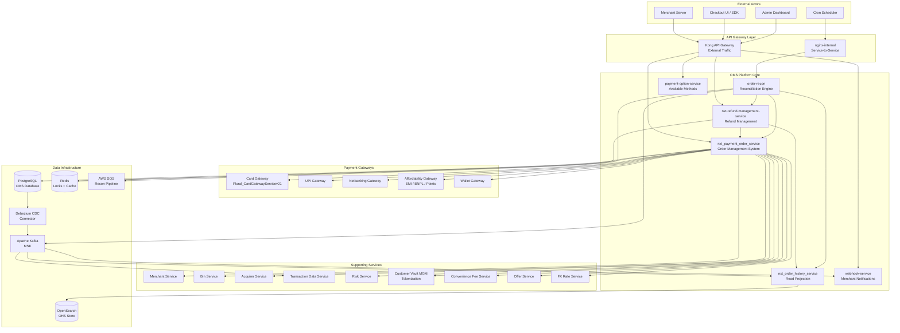
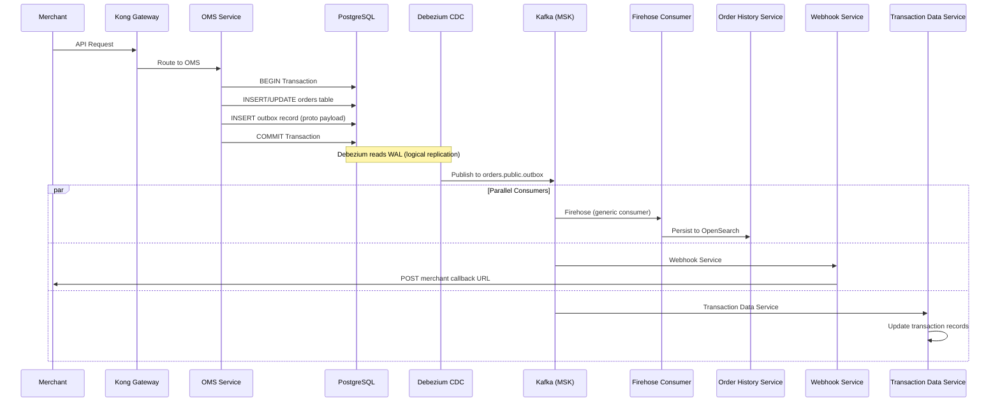

# 01 — Architecture Overview

> High-level system design of the Plural Platform V3 Order Management System

---

## System Context Diagram



---

## Layered Architecture (OMS Internal)

```
┌─────────────────────────────────────────────────────────────────────────┐
│                          API LAYER (Ktor Routing)                        │
│  OrderRoutes │ PaymentRoutes │ InternalRoutes │ OTP │ Invoice │ AWB     │
├─────────────────────────────────────────────────────────────────────────┤
│                        API SERVICE LAYER                                 │
│  OrdersAPIService │ PaymentsAPIService │ CrossBorderService             │
├─────────────────────────────────────────────────────────────────────────┤
│                        OMS CLIENT (Facade)                               │
│  OMSClient — orchestrates OrderService, PaymentService, RefundService   │
├─────────────────────────────────────────────────────────────────────────┤
│                        DOMAIN SERVICE LAYER                              │
│  OrderService │ PaymentService │ RefundService │ OfferService            │
│  LockService │ DowntimeService │ SettlementReversalService              │
├─────────────────────────────────────────────────────────────────────────┤
│                   TRANSACTION HANDLER LAYER (Strategy)                    │
│  NormalTxnHandler │ DccTxnHandler │ ICBTxnHandler │ MccTxnHandler       │
│  CardLessEMIHandler │ MccWalletTxnHandler                               │
├─────────────────────────────────────────────────────────────────────────┤
│                        PAYMENT SDK LAYER                                  │
│  PaymentSDK → routes to Card/UPI/NB/Wallet/EMI/BNPL connectors          │
├─────────────────────────────────────────────────────────────────────────┤
│                        REPOSITORY LAYER                                   │
│  OrderRepository │ OutboxRepository │ PaymentReferenceRepository        │
│  DowntimeRepository │ MerchantRefOrderMapperRepository                  │
├─────────────────────────────────────────────────────────────────────────┤
│                        INFRASTRUCTURE                                     │
│  PostgreSQL (Exposed ORM) │ Redis │ Kafka Producer │ HTTP Clients        │
└─────────────────────────────────────────────────────────────────────────┘
```

---

## Data Flow Architecture



---

## Infrastructure Topology

### Kubernetes Deployment

```
EKS Cluster (ap-south-1)
├── Namespace: nxt-services
│   ├── nxt-payment-order-service (3 replicas, 2 CPU / 4GB)
│   ├── nxt-order-history-service (3 replicas)
│   ├── nxt-refund-management-service (2 replicas)
│   ├── order-recon (2 replicas)
│   ├── webhook-service (3 replicas)
│   └── payment-option-service (2 replicas)
├── Namespace: debezium
│   ├── oms-debezium-server (outbox CDC)
│   └── oms-debezium-server-v1 (outbox_v1 CDC)
└── Namespace: data
    ├── Redis (ElastiCache cluster)
    └── Kafka Connect (MSK Connect)
```

### Database Architecture

```
Aurora PostgreSQL (Multi-AZ)
├── nxt_payment_orders_db
│   ├── orders (RANGE partitioned by partition_date — monthly)
│   ├── outbox (Debezium CDC source)
│   ├── outbox_v1 (Debezium CDC source v1)
│   ├── payment_reference (RANGE partitioned by created_at)
│   ├── merchant_ref_order_mapper (HASH partitioned, 8 buckets)
│   ├── downtimes (downtime tracking)
│   ├── order_update_audit (admin audit trail)
│   ├── mcc_currency_codes (lookup)
│   ├── pa_cb_invoices (cross-border, partitioned)
│   └── pa_cb_awb_mappings (cross-border, partitioned)
└── Extensions: pg_cron, pgcrypto
```

### Kafka Topics

| Topic | Producer | Consumers | Format |
|-------|----------|-----------|--------|
| `orders.public.outbox` | Debezium (outbox) | Firehose, OHS, Webhook, TDS | Protobuf |
| `orders.public.outbox_v1` | Debezium (outbox_v1) | Firehose v2 | Protobuf |
| `update.event.orders` | OMS (direct) | OHS, Webhook | Protobuf |
| `order-recon` | order-recon | OMS | Protobuf |
| `refund-recon` | order-recon | RMS → OMS | Protobuf |
| `long-pending` | order-recon | SQS pipeline | Protobuf |
| `long-pending-refund` | order-recon | SQS pipeline | Protobuf |
| `emi-recon` | order-recon | OMS | Protobuf |
| `sync-payments` | order-recon | OMS | Protobuf |

---

## Cross-Cutting Concerns

### Security
- Merchant authentication via signed headers (HMAC)
- PII encryption at rest (AES-256 on card numbers, customer data)
- Field-level encryption in JSONB via `encryptOrder()` pipeline
- TLS 1.3 for all inter-service communication

### Observability
- **Traces**: OpenTelemetry → OTLP → Last9 (trace context propagated via outbox `traceparent`)
- **Metrics**: Custom counters per merchant/acquirer/payment-method (MetricsInfo)
- **Logs**: Structured JSON via logstash-logback-encoder → Loki
- **Health**: `/health/live` (liveness) + `/health/ready` (readiness) on port 8081

### Resilience
- Distributed locks (Redis) prevent concurrent mutations on same order
- Circuit breakers on all downstream HTTP clients
- Exponential backoff in SQS recon pipeline (30s → 60s → 120s → 240s → 480s)
- Bounded retries with DLQ for exhausted messages
- Feature toggles for graceful degradation

### Performance
- Table partitioning (monthly range, hash) for query performance at scale
- JSONB for flexible payment model storage (avoids schema migrations)
- Coroutine-based async I/O (Ktor + kotlinx.coroutines)
- Connection pooling via HikariCP
- Redis caching for merchant configs, DCC details, feature toggles
