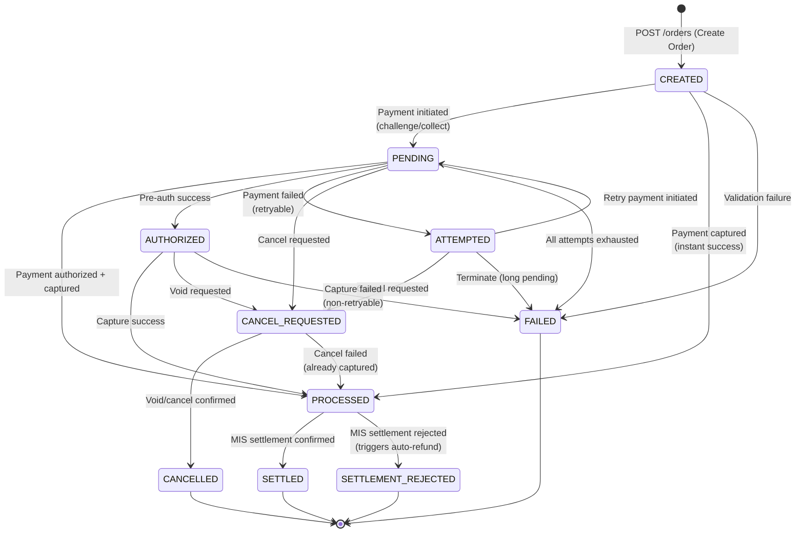
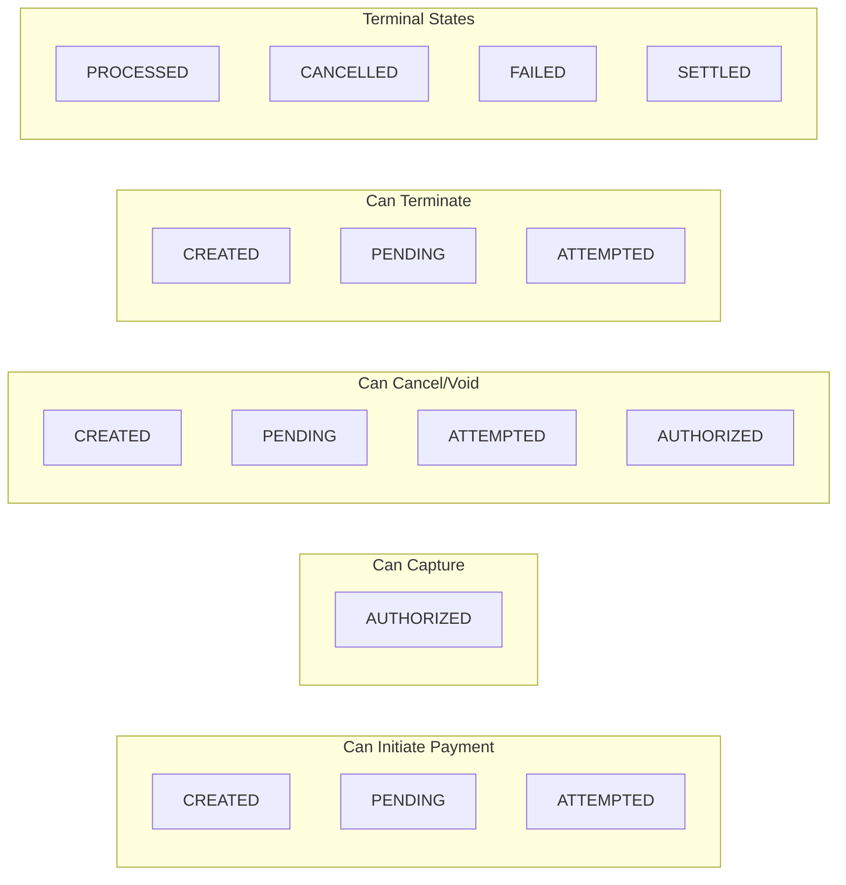
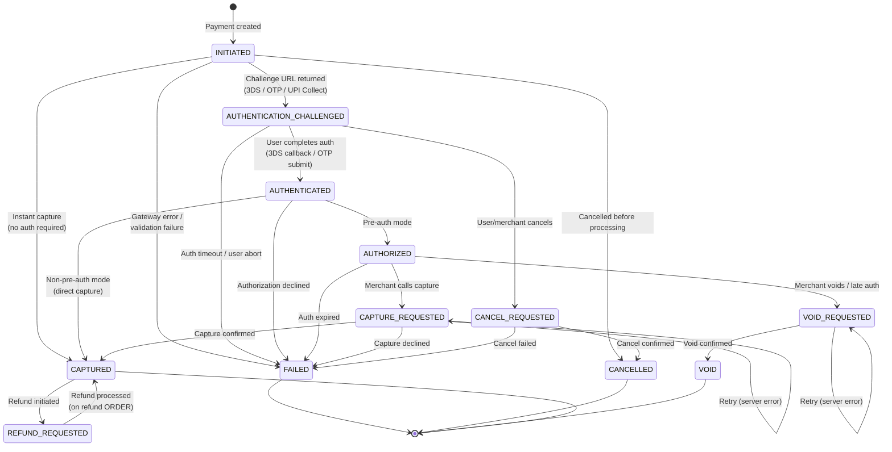
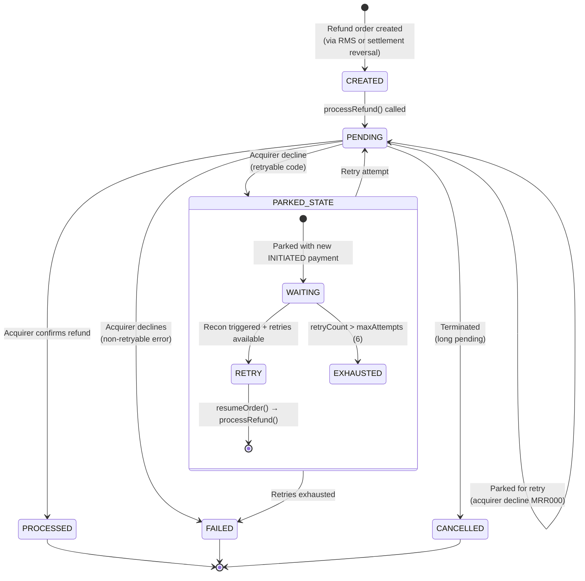
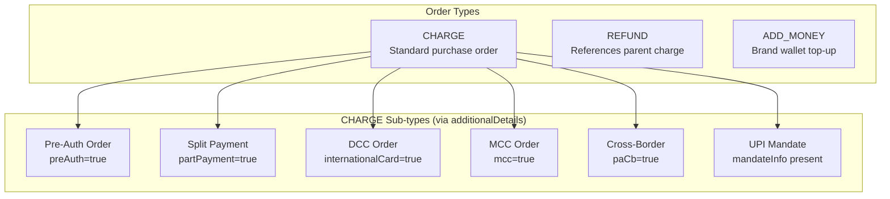

# 02 — State Machines

> Complete lifecycle state diagrams for Orders and Payments in the OMS platform

---

## Order State Machine

### States

| State | Description | Terminal? |
|-------|-------------|-----------|
| `CREATED` | Order created, no payment initiated | No |
| `PENDING` | Payment in progress (auth challenged, UPI collect sent) | No |
| `ATTEMPTED` | Previous payment failed, merchant can retry | No |
| `AUTHORIZED` | Pre-auth successful, awaiting capture | No |
| `PROCESSED` | Payment captured successfully | Yes* |
| `CANCEL_REQUESTED` | Cancellation in progress | No |
| `CANCELLED` | Fully cancelled / voided | Yes |
| `FAILED` | Terminal failure (all attempts exhausted) | Yes |
| `SETTLED` | Post-capture settlement confirmed by acquirer | Yes |
| `SETTLEMENT_REJECTED` | Settlement rejected — triggers auto-reversal | Yes |

*PROCESSED is functionally terminal but can transition to SETTLED/SETTLEMENT_REJECTED via MIS settlement events.

### Order State Diagram



### Order State Transition Rules



### Transition Guards (from code)

| From | To | Guard Condition |
|------|-----|-----------------|
| `CREATED` → `PENDING` | Payment created with challenge URL |
| `CREATED` → `PROCESSED` | Synchronous payment success (no 3DS/OTP) |
| `PENDING` → `PENDING` | New payment on same order (cancel old + create new) |
| `PENDING` → `AUTHORIZED` | `order.preAuth == true` AND authorization success |
| `PENDING` → `ATTEMPTED` | Payment failed but order allows retry |
| `PENDING` → `PROCESSED` | `order.preAuth == false` AND authorization success |
| `AUTHORIZED` → `PROCESSED` | `capturePayment()` success |
| `AUTHORIZED` → `CANCEL_REQUESTED` | Void initiated OR late auth expired |
| `CANCEL_REQUESTED` → `CANCELLED` | All payments voided/cancelled |
| `PROCESSED` → `SETTLED` | MIS settlement event status = SUCCESS |
| `PROCESSED` → `SETTLEMENT_REJECTED` | MIS settlement event status = REJECTED |

---

## Payment State Machine

### States

| State | Description | Terminal? |
|-------|-------------|-----------|
| `INITIATED` | Payment record created | No |
| `AUTHENTICATION_CHALLENGED` | 3DS/OTP/UPI collect pending user action | No |
| `AUTHENTICATED` | User completed auth (3DS success, OTP verified) | No |
| `AUTHORIZED` | Pre-auth hold placed on card | No |
| `CAPTURE_REQUESTED` | Capture API called, awaiting confirmation | No |
| `CAPTURED` | Funds captured successfully | Yes |
| `CANCEL_REQUESTED` | Cancel in progress | No |
| `CANCELLED` | Payment cancelled | Yes |
| `VOID_REQUESTED` | Void in progress (pre-auth reversal) | No |
| `VOID` | Authorization voided | Yes |
| `FAILED` | Payment failed | Yes |
| `REFUND_REQUESTED` | Refund initiated | No |

### Payment State Diagram



### Payment State Transition Matrix

| Current State | Allowed Next States | Trigger |
|---------------|-------------------|---------|
| `INITIATED` | `AUTHENTICATION_CHALLENGED`, `CAPTURED`, `FAILED`, `CANCELLED` | `paymentSDK.createPayment()` response |
| `AUTHENTICATION_CHALLENGED` | `AUTHENTICATED`, `FAILED`, `CANCEL_REQUESTED` | Auth callback / timeout / cancel |
| `AUTHENTICATED` | `AUTHORIZED`, `CAPTURED`, `FAILED` | `paymentSDK.authorizePayment()` response |
| `AUTHORIZED` | `CAPTURE_REQUESTED`, `VOID_REQUESTED`, `FAILED` | Merchant capture / void / expiry |
| `CAPTURE_REQUESTED` | `CAPTURED`, `FAILED` | `paymentSDK.capturePayment()` response |
| `VOID_REQUESTED` | `VOID` | `paymentSDK.voidPayment()` response |
| `CANCEL_REQUESTED` | `CANCELLED`, `FAILED` | `paymentSDK.cancelPayment()` response |
| `CAPTURED` | `REFUND_REQUESTED` | Refund order created |

---

## Refund Order State Machine

Refund orders use the same `OrderStatus` enum but with refund-specific semantics:



### Refund Payment States

| State | Meaning |
|-------|---------|
| `INITIATED` | Refund payment created (or retry payment for parked orders) |
| `REFUND_REQUESTED` | Sent to acquirer |
| `CAPTURED` | Refund confirmed by acquirer (mapped from REFUNDED) |
| `FAILED` | Refund declined |

---

## Combined Order + Payment State Correlation

```
┌─────────────────────────────────────────────────────────────────────────┐
│  ORDER STATE        │  PAYMENT STATE(S)         │  BUSINESS MEANING     │
├─────────────────────┼───────────────────────────┼───────────────────────┤
│  CREATED            │  (none)                   │  Order awaiting       │
│                     │                           │  first payment        │
├─────────────────────┼───────────────────────────┼───────────────────────┤
│  PENDING            │  INITIATED /              │  Payment in flight    │
│                     │  AUTH_CHALLENGED /        │                       │
│                     │  AUTHENTICATED            │                       │
├─────────────────────┼───────────────────────────┼───────────────────────┤
│  ATTEMPTED          │  FAILED + (previous)      │  Last attempt failed  │
│                     │                           │  can retry            │
├─────────────────────┼───────────────────────────┼───────────────────────┤
│  AUTHORIZED         │  AUTHORIZED               │  Pre-auth hold active │
├─────────────────────┼───────────────────────────┼───────────────────────┤
│  PROCESSED          │  CAPTURED                 │  Money collected      │
├─────────────────────┼───────────────────────────┼───────────────────────┤
│  CANCEL_REQUESTED   │  CANCEL_REQUESTED /       │  Cancellation in      │
│                     │  VOID_REQUESTED           │  progress             │
├─────────────────────┼───────────────────────────┼───────────────────────┤
│  CANCELLED          │  CANCELLED / VOID         │  Fully reversed       │
├─────────────────────┼───────────────────────────┼───────────────────────┤
│  FAILED             │  FAILED                   │  Terminal failure     │
└─────────────────────┴───────────────────────────┴───────────────────────┘
```

---

## Order Type Classification


