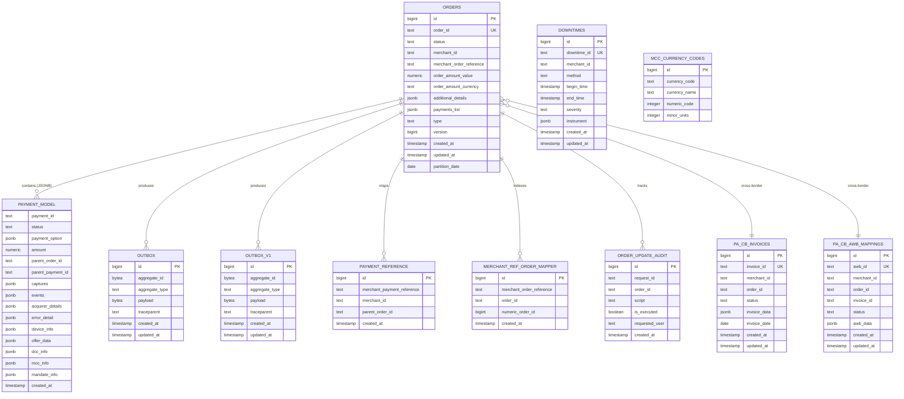

# 03 — Database Schema & Data Model

> Complete database architecture including partitioning strategy, JSONB models, and entity relationships

---

## Entity Relationship Diagram



---

## Table Definitions

### `orders` — Core Order Table

**Partitioning**: `PARTITION BY RANGE (partition_date)` — Monthly partitions

```sql
CREATE TABLE orders (
    id              BIGSERIAL,
    order_id        TEXT NOT NULL,
    status          TEXT NOT NULL,
    merchant_id     TEXT NOT NULL,
    merchant_order_reference TEXT,
    order_amount_value      NUMERIC,
    order_amount_currency   TEXT,
    additional_details      JSONB,
    payments_list           JSONB,       -- Array of PaymentModel objects
    type                    TEXT NOT NULL, -- CHARGE | REFUND | ADD_MONEY
    version                 BIGINT NOT NULL DEFAULT 1,
    created_at              TIMESTAMP WITH TIME ZONE DEFAULT NOW(),
    updated_at              TIMESTAMP WITH TIME ZONE DEFAULT NOW(),
    partition_date          DATE NOT NULL DEFAULT CURRENT_DATE,

    PRIMARY KEY (id, partition_date),
    UNIQUE (order_id, partition_date)
) PARTITION BY RANGE (partition_date);

-- Indices
CREATE INDEX idx_orders_merchant_id ON orders (merchant_id);
CREATE INDEX idx_orders_merchant_order_reference ON orders (merchant_order_reference);
CREATE UNIQUE INDEX idx_orders_order_id ON orders (order_id, partition_date);
CREATE INDEX idx_orders_status ON orders (status) WHERE status NOT IN ('PROCESSED', 'FAILED', 'CANCELLED');
```

**Partition Creation** (via pg_cron):
```sql
-- Monthly partition creation job
SELECT cron.schedule('create-orders-partition', '0 0 25 * *',
    $$SELECT create_monthly_partition('orders', NOW() + INTERVAL '1 month')$$
);
```

### `outbox` — Debezium CDC Source (Legacy)

```sql
CREATE TABLE outbox (
    id              BIGSERIAL PRIMARY KEY,
    aggregateid     BYTEA,           -- Protobuf OrderEventKey (orderId)
    aggregatetype   TEXT NOT NULL,   -- "orders"
    payload         BYTEA NOT NULL,  -- Protobuf Order message
    traceparent     TEXT,            -- OpenTelemetry W3C trace context
    created_at      TIMESTAMP WITH TIME ZONE DEFAULT NOW(),
    updated_at      TIMESTAMP WITH TIME ZONE DEFAULT NOW()
);
```

### `outbox_v1` — Debezium CDC Source (Current)

```sql
CREATE TABLE outbox_v1 (
    id              BIGSERIAL PRIMARY KEY,
    aggregateid     BYTEA NOT NULL,  -- Always includes key (unlike legacy)
    aggregatetype   TEXT NOT NULL,
    payload         BYTEA NOT NULL,
    traceparent     TEXT,
    created_at      TIMESTAMP WITH TIME ZONE DEFAULT NOW(),
    updated_at      TIMESTAMP WITH TIME ZONE DEFAULT NOW()
);
```

### `payment_reference` — Merchant Payment Reference Lookup

**Partitioning**: `PARTITION BY RANGE (created_at)` — Monthly

```sql
CREATE TABLE payment_reference (
    id                          BIGSERIAL,
    merchant_payment_reference  TEXT NOT NULL,
    merchant_id                 TEXT NOT NULL,
    parent_order_id             TEXT NOT NULL,
    created_at                  TIMESTAMP WITH TIME ZONE DEFAULT NOW(),

    PRIMARY KEY (id, created_at),
    UNIQUE (merchant_payment_reference, merchant_id, created_at)
) PARTITION BY RANGE (created_at);
```

### `merchant_ref_order_mapper` — Hash-Partitioned Lookup

**Partitioning**: `PARTITION BY HASH (merchant_order_reference)` — 8 partitions

```sql
CREATE TABLE merchant_ref_order_mapper (
    id                          BIGSERIAL,
    merchant_order_reference    TEXT NOT NULL,
    order_id                    TEXT NOT NULL,
    numeric_order_id            BIGINT,
    created_at                  TIMESTAMP WITH TIME ZONE DEFAULT NOW(),

    PRIMARY KEY (id, merchant_order_reference)
) PARTITION BY HASH (merchant_order_reference);

-- 8 hash partitions
CREATE TABLE merchant_ref_order_mapper_p0 PARTITION OF merchant_ref_order_mapper
    FOR VALUES WITH (MODULUS 8, REMAINDER 0);
-- ... through p7
```

### `downtimes` — Payment Method Downtime Tracking

```sql
CREATE TABLE downtimes (
    id              BIGSERIAL PRIMARY KEY,
    downtime_id     TEXT NOT NULL UNIQUE,
    merchant_id     TEXT NOT NULL,
    method          TEXT NOT NULL,
    begin_time      TIMESTAMP WITH TIME ZONE NOT NULL,
    end_time        TIMESTAMP WITH TIME ZONE,
    severity        TEXT NOT NULL,
    instrument      JSONB,
    created_at      TIMESTAMP WITH TIME ZONE DEFAULT NOW(),
    updated_at      TIMESTAMP WITH TIME ZONE DEFAULT NOW()
);
```

### `order_update_audit` — Admin Change Audit

```sql
CREATE TABLE order_update_audit (
    id              BIGSERIAL PRIMARY KEY,
    request_id      TEXT NOT NULL,
    order_id        TEXT NOT NULL,
    script          TEXT,            -- JSON patch / update script
    is_executed     BOOLEAN DEFAULT FALSE,
    requested_user  TEXT NOT NULL,
    created_at      TIMESTAMP WITH TIME ZONE DEFAULT NOW()
);
```

---

## JSONB Data Models

### `additional_details` (on orders table)

```json
{
  "orderInfo": {
    "preAuth": true,
    "partPayment": false,
    "isParked": false,
    "parkedReason": null,
    "retryCount": 0,
    "totalSaleCheckFailureCount": 0,
    "splitSettlement": { ... },
    "kycCompliance": { ... }
  },
  "orderSettings": {
    "preAuth": true,
    "maxPaymentAttempts": 5,
    "autoCapture": false,
    "lateAuthCutoffMinutes": 30
  },
  "customerDetails": {
    "customerId": "cust_xxx",
    "email": "encrypted",
    "phone": "encrypted",
    "name": "encrypted"
  },
  "crossBorderDetails": {
    "paCb": true,
    "tcsAmount": 100,
    "invoiceId": "inv_xxx"
  },
  "mccDetails": {
    "baseCurrency": "USD",
    "baseAmount": 1000,
    "exchangeRate": 83.5
  },
  "dccDetails": {
    "internationalCard": true,
    "dccOptIn": true,
    "conversionRate": 83.2,
    "foreignCurrency": "USD"
  },
  "mandateInfo": {
    "mandateType": "CREATE_MANDATE",
    "maxAmount": 10000,
    "frequency": "MONTHLY"
  },
  "additionalRefundData": {
    "acquirerRefId": "acq_xxx",
    "source": "MERCHANT"
  }
}
```

### `payments_list` (JSONB Array — PaymentModel)

```json
[
  {
    "paymentId": "pay_xxxxxxxx",
    "status": "CAPTURED",
    "paymentOption": {
      "method": "CARD",
      "cardData": {
        "cardNumber": "encrypted",
        "cardNetwork": "VISA",
        "cardType": "CREDIT",
        "isTokenized": true,
        "tokenReferenceId": "tok_xxx"
      }
    },
    "amount": {
      "value": 10000,
      "currency": "INR"
    },
    "parentOrderId": null,
    "parentPaymentId": null,
    "challengeUrl": null,
    "providerReferenceId": "hdfc_ref_123",
    "acquirerDetails": {
      "acquirerId": "acq_001",
      "acquirerName": "HDFC",
      "rrn": "123456789012",
      "authCode": "AUTH01",
      "acquirerErrorDetail": null
    },
    "captures": [
      {
        "captureId": "cap_xxx",
        "amount": 10000,
        "status": "SUCCESS",
        "capturedAt": "2024-03-15T10:30:00Z"
      }
    ],
    "events": [
      { "status": "INITIATED", "timestamp": "..." },
      { "status": "AUTHENTICATION_CHALLENGED", "timestamp": "..." },
      { "status": "CAPTURED", "timestamp": "..." }
    ],
    "errorDetail": null,
    "deviceInfo": {
      "ip": "1.2.3.4",
      "userAgent": "Mozilla/5.0..."
    },
    "offerData": {
      "offerId": "offer_xxx",
      "offerStatus": "APPROVED",
      "discountAmount": 500
    },
    "dccInfo": { ... },
    "mccInfo": { ... },
    "mandateInfo": { ... },
    "convenienceFeeBreakdown": { ... },
    "featureFeeBreakdown": { ... },
    "consultedGatewayRouter": "CARD_GATEWAY",
    "routingApproach": "MERCHANT_PREFERRED",
    "bankData": { ... },
    "createdAt": "2024-03-15T10:25:00Z"
  }
]
```

---

## Partitioning Strategy

```mermaid
graph TD
    subgraph "Range Partitioned (Monthly)"
        O[orders<br/>partition_date]
        PR[payment_reference<br/>created_at]
        INV[pa_cb_invoices<br/>invoice_date]
        AWB[pa_cb_awb_mappings<br/>created_at]
    end

    subgraph "Hash Partitioned"
        MROM[merchant_ref_order_mapper<br/>HASH(merchant_order_reference)<br/>8 partitions]
    end

    subgraph "Unpartitioned"
        OB[outbox]
        OBV1[outbox_v1]
        DT[downtimes]
        AUDIT[order_update_audit]
        MCC[mcc_currency_codes]
    end
```

### Rationale

| Table | Strategy | Reason |
|-------|----------|--------|
| `orders` | Range (monthly) | Time-based queries, archival of old partitions, parallel vacuum |
| `payment_reference` | Range (monthly) | Same lifecycle as orders, prevents unbounded growth |
| `merchant_ref_order_mapper` | Hash (8 buckets) | Even distribution for point lookups, prevents hotspots |
| `outbox` / `outbox_v1` | None | Short-lived rows (Debezium deletes after capture), always small |
| `pa_cb_invoices` | Range (monthly) | Cross-border invoice lifecycle tied to time |

---

## Optimistic Locking

The `version` column implements optimistic concurrency control:

```kotlin
// OrderRepository.kt
fun updateOrder(order: Order): Order {
    val updated = Orders.update({ 
        (Orders.orderId eq order.orderId) and 
        (Orders.version eq order.version) 
    }) {
        it[status] = order.status
        it[paymentsList] = order.paymentModels
        it[version] = order.version + 1
        it[updatedAt] = Clock.System.now()
    }
    if (updated == 0) throw OptimisticLockException("Order modified concurrently")
    return order.copy(version = order.version + 1)
}
```

Combined with Redis distributed locks, this provides:
1. **Distributed Lock** — prevents concurrent API calls on same order
2. **Optimistic Lock** — safety net for race conditions across lock boundaries

---

## Data Lifecycle

```
┌──────────────────────────────────────────────────────────────────────┐
│                        DATA FLOW LIFECYCLE                            │
├──────────────────────────────────────────────────────────────────────┤
│                                                                      │
│  1. ORDER CREATED                                                    │
│     └─ INSERT orders + INSERT outbox (atomic transaction)            │
│                                                                      │
│  2. DEBEZIUM CAPTURES                                                │
│     └─ Reads WAL → publishes to Kafka → Debezium deletes outbox row │
│                                                                      │
│  3. FIREHOSE CONSUMES                                                │
│     └─ Kafka → Firehose (generic consumer) → OHS (OpenSearch)        │
│                                                                      │
│  4. WEBHOOK DELIVERS                                                 │
│     └─ Kafka → Webhook Service → Merchant callback URL               │
│                                                                      │
│  5. PARTITION ROTATION                                                │
│     └─ pg_cron creates new monthly partition on 25th                  │
│     └─ Old partitions (>90 days) can be detached for cold storage    │
│                                                                      │
│  6. PII CLEANUP                                                      │
│     └─ encryptOrder() pipeline encrypts PII fields in-place          │
│     └─ cleanupData() removes raw data from old orders                │
│                                                                      │
└──────────────────────────────────────────────────────────────────────┘
```
