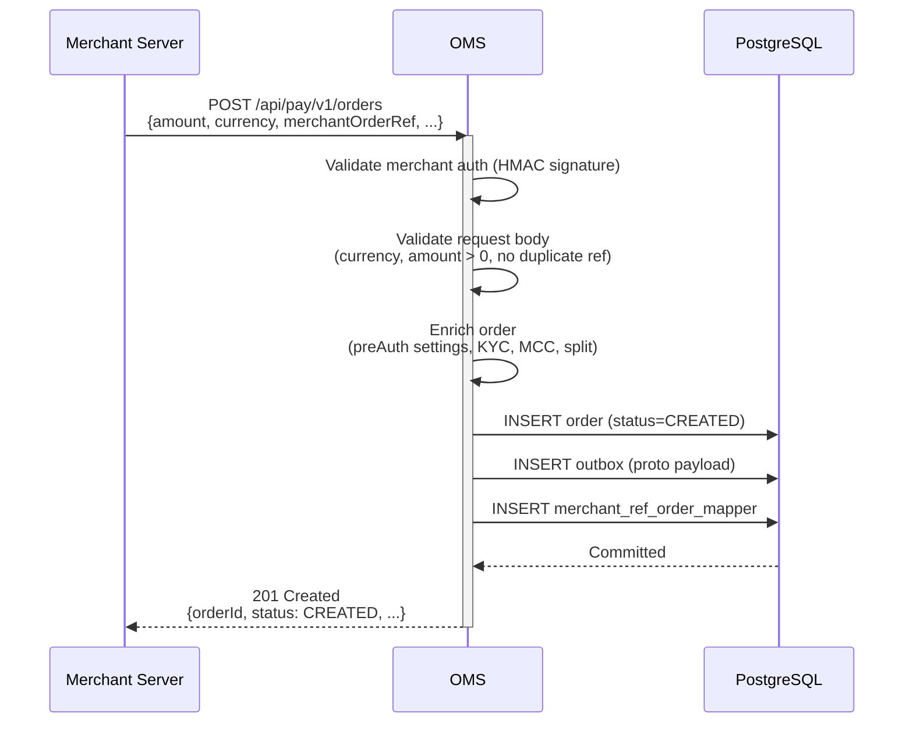
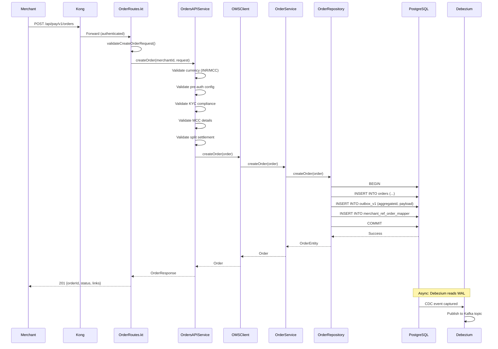
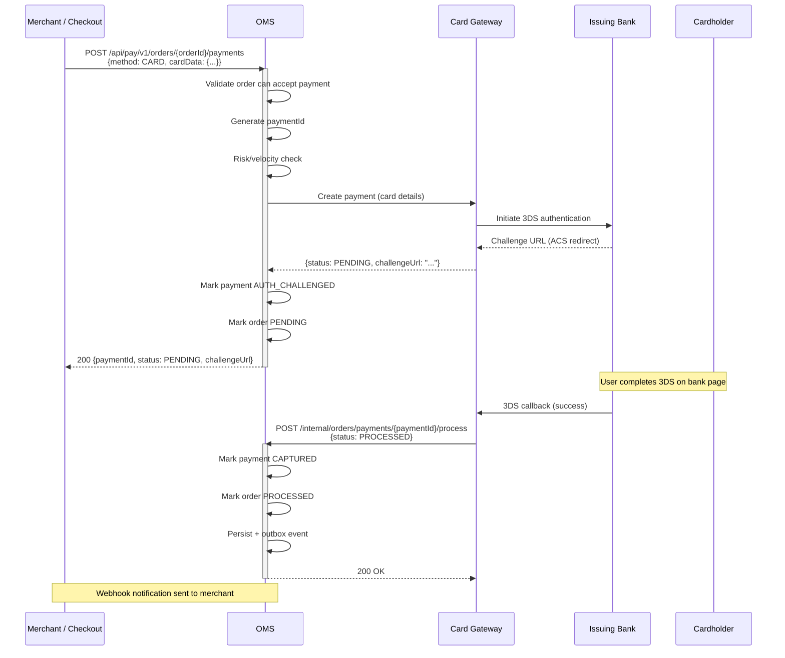
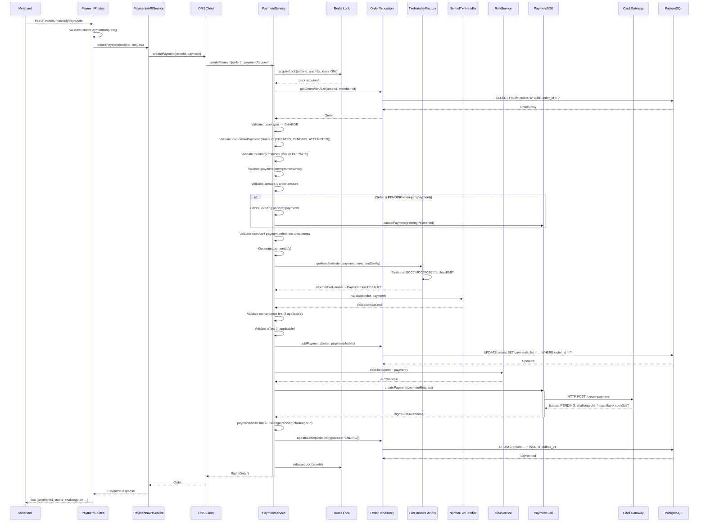
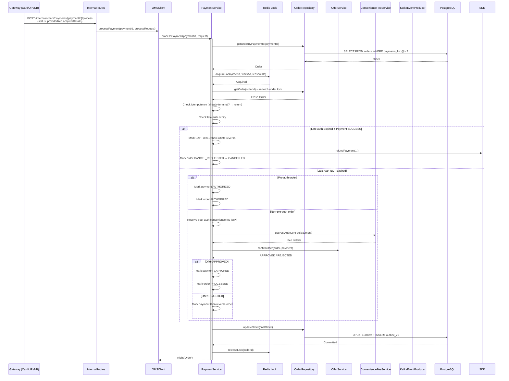
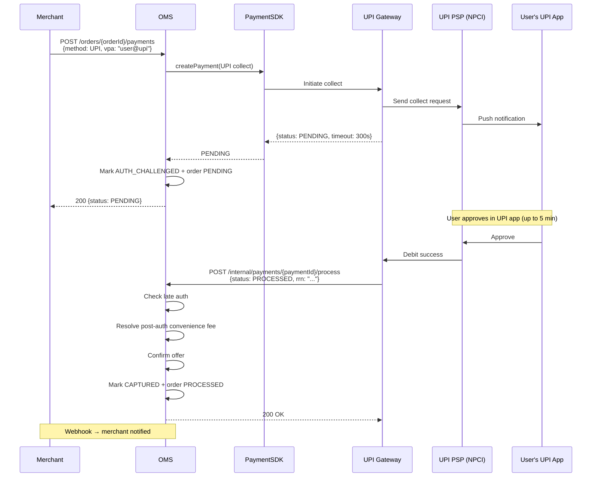
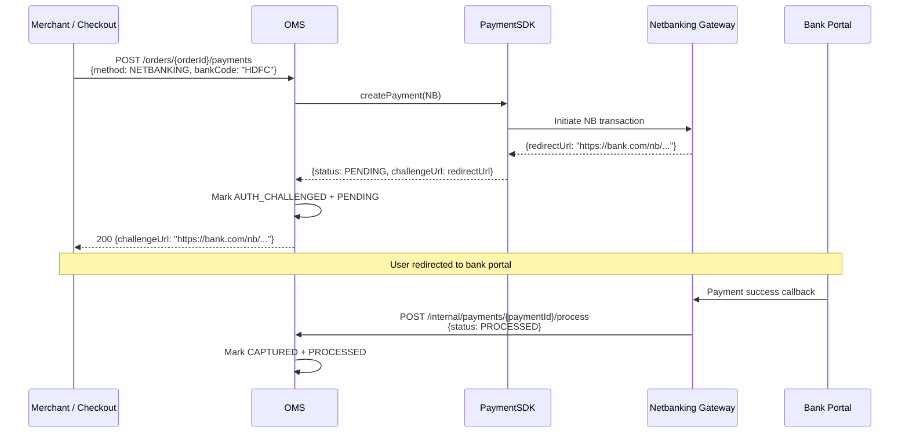
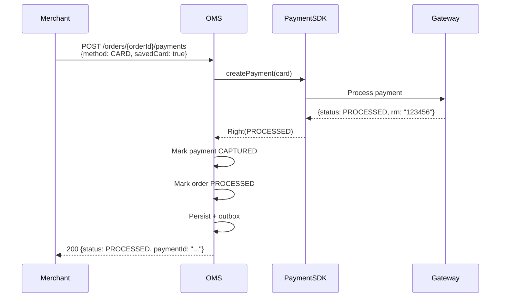
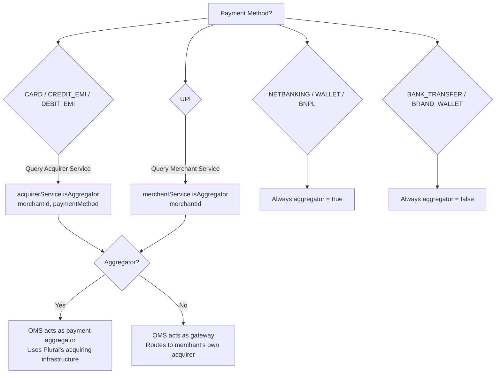

# 04 — Purchase Workflow

> End-to-end payment creation flow — from merchant API call to funds capture

---

## Functional Overview

The purchase workflow covers the standard payment lifecycle:

1. Merchant creates an order
2. Merchant (or checkout UI) initiates a payment on that order
3. Payment is processed through the appropriate gateway
4. Funds are captured (immediately or via pre-auth + capture)

---

## Flow 1: Create Order

### Functional Sequence



### Technical Sequence (Internal Detail)



---

## Flow 2: Create Payment (Standard Card — 3DS)

### Functional Sequence



### Technical Sequence (Card Payment — Full Detail)



---

## Flow 3: Process Payment Callback (Async)

After the user completes authentication (3DS, OTP, UPI collect), the gateway sends a callback to OMS.

### Technical Sequence



---

## Flow 4: UPI Collect Payment

UPI payments have a unique async pattern — the collect request is sent to the user's UPI app, and the response arrives via callback.



---

## Flow 5: Netbanking / Wallet Payment (Redirect)



---

## Flow 6: Instant (No-Redirect) Payment

Some payment methods (saved cards with no 3DS, certain wallets) can complete instantly.



---

## Payment Method Routing

```mermaid
graph TD
    subgraph "PaymentSDK Router"
        SDK[PaymentSDK.createPayment]
    end

    SDK -->|CARD| CGW[Card Gateway Service<br/>Plural_CardGatewayServicev21]
    SDK -->|UPI| UGW[UPI Gateway]
    SDK -->|NETBANKING| NGW[Netbanking Gateway]
    SDK -->|WALLET| WGW[Wallet Gateway]
    SDK -->|BNPL| AGW[Affordability Gateway]
    SDK -->|CREDIT_EMI| AGW
    SDK -->|DEBIT_EMI| AGW
    SDK -->|CARDLESS_EMI| AGW
    SDK -->|POINTS| AGW
    SDK -->|BRAND_WALLET| BWGW[Brand Wallet Gateway]
    SDK -->|BANK_TRANSFER| DIRECT[Direct (no gateway call)]

    subgraph "Gateway → Acquirer"
        CGW --> HDFC[HDFC]
        CGW --> AXIS[Axis]
        CGW --> ICICI[ICICI]
        CGW --> RBL[RBL]
        UGW --> NPCI[NPCI / PSP]
        NGW --> BANKS[Bank Portals]
        AGW --> LENDERS[EMI Lenders / BNPL Providers]
    end
```

---

## Aggregator Mode Determination



---

## Error Handling Matrix

| Scenario | OMS Action | Order Status | Payment Status |
|----------|-----------|--------------|----------------|
| Gateway timeout | Return server error | PENDING (unchanged) | INITIATED (recon will resolve) |
| Gateway returns FAILED | Mark failed, check retryable | ATTEMPTED (if retriable) or FAILED | FAILED |
| Risk check DECLINED | Return error, don't call gateway | CREATED (unchanged) | Not created |
| Duplicate payment ref | Return 409 Conflict | Unchanged | Not created |
| Max attempts exceeded | Return error | Unchanged | Not created |
| Amount validation failure | Return 422 | Unchanged | Not created |
| Lock acquisition timeout | Return 423 Locked | Unchanged | Not created |
