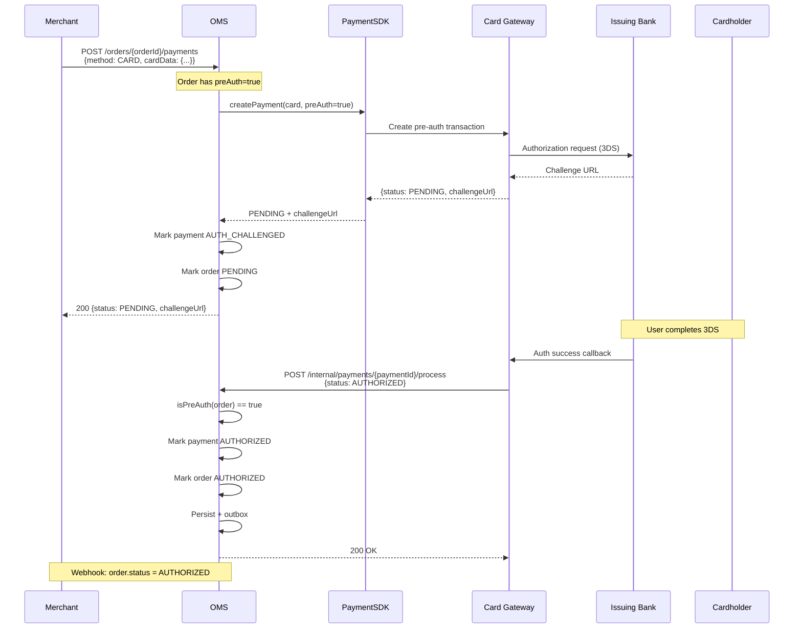
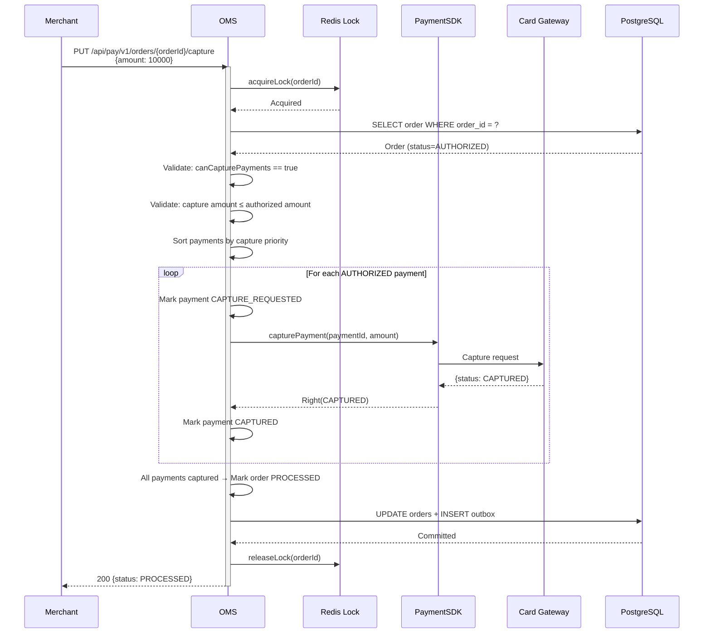
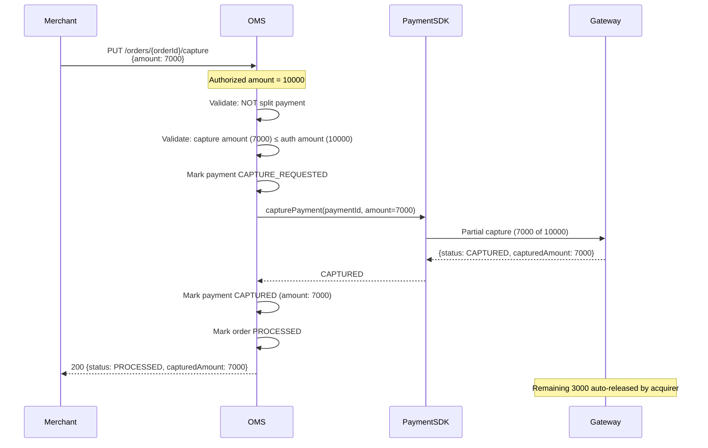
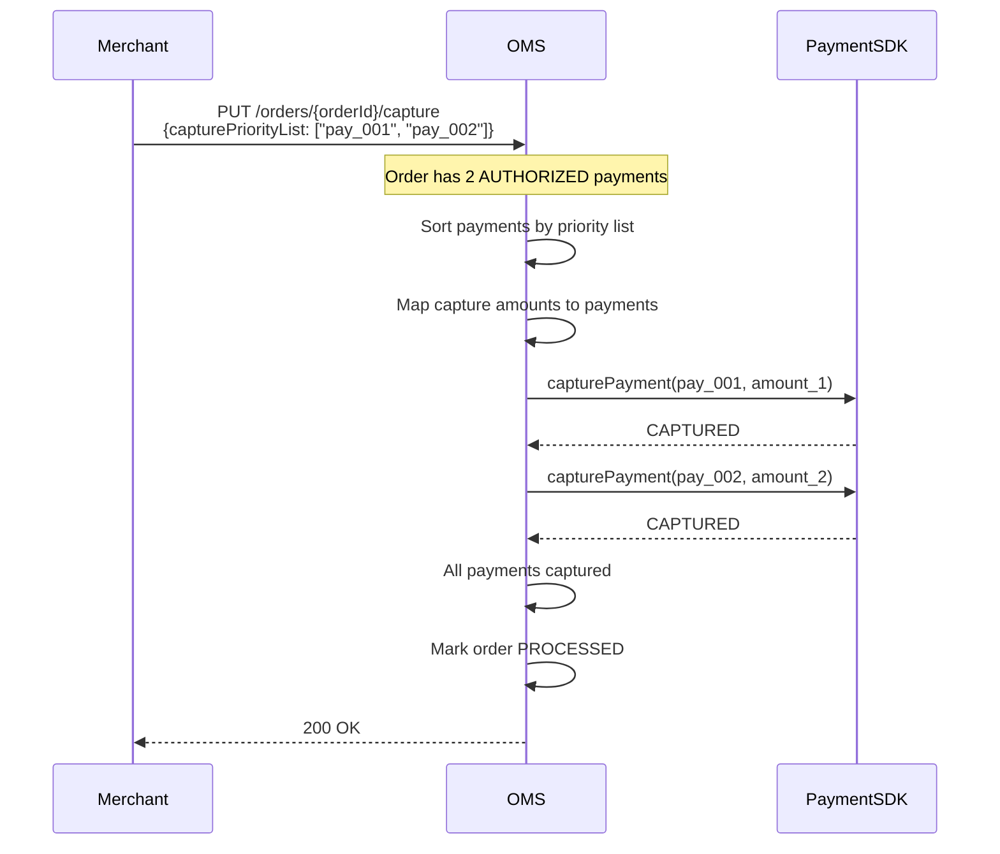
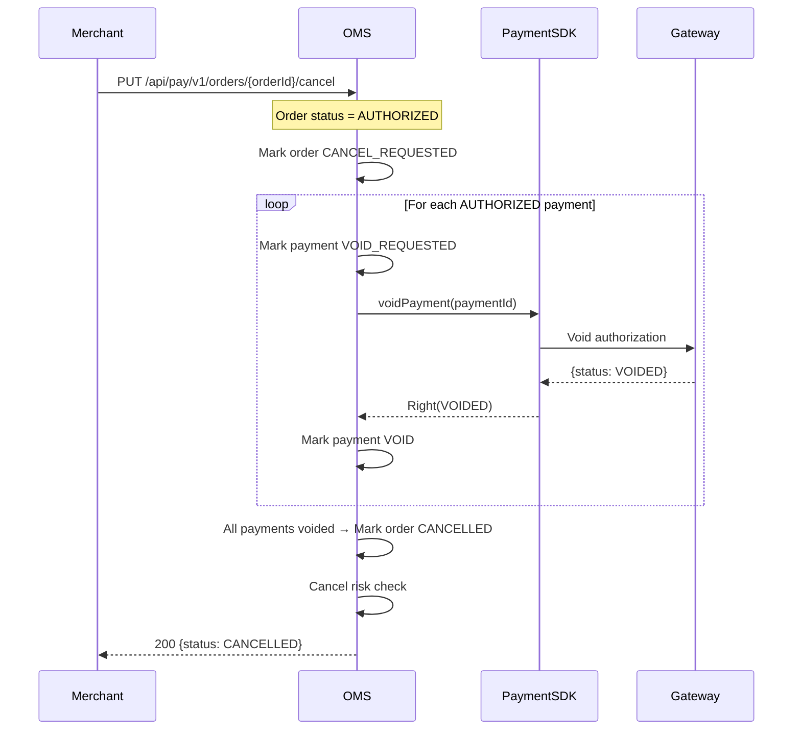
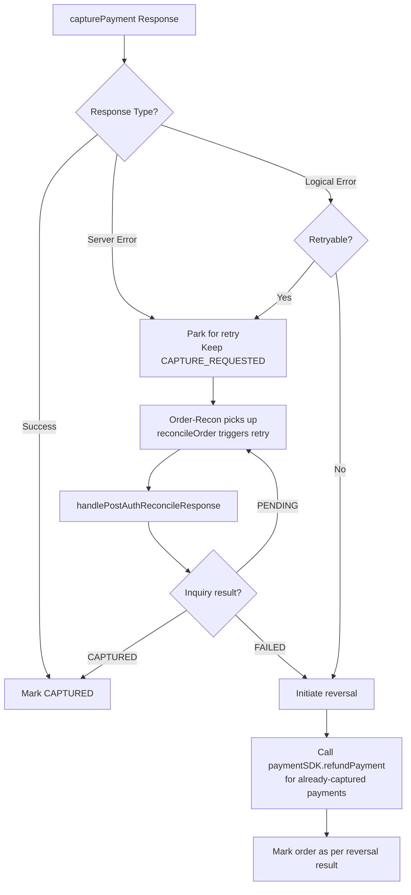

# 05 — Pre-Auth & Capture

> Authorization holds, partial/full capture, capture priority for split payments

---

## Concept

Pre-authorization (pre-auth) is a two-phase payment flow:

1. **Authorization** — Places a hold on the customer's funds without capturing
2. **Capture** — Transfers the held funds to the merchant (full or partial)

This is used for:
- Hotels / travel (capture at checkout, amount may change)
- E-commerce (capture on shipment)
- Marketplaces (capture per seller fulfillment)
- Subscriptions (authorize then capture on billing date)

---

## Pre-Auth Order Settings

Pre-auth is enabled at order creation time:

```json
{
  "amount": 10000,
  "currency": "INR",
  "orderSettings": {
    "preAuth": true,
    "autoCapture": false,
    "lateAuthCutoffMinutes": 30
  }
}
```

### Supported Payment Methods for Pre-Auth

| Method | Pre-Auth Support |
|--------|-----------------|
| CARD | Yes (all card networks) |
| UPI | Yes (UPI 2.0 mandate) |
| NETBANKING | No |
| WALLET | No |
| BNPL | Provider-dependent |
| EMI | No |

---

## Flow 1: Pre-Auth — Authorization Phase



---

## Flow 2: Capture (Full)



---

## Flow 3: Partial Capture

Partial capture allows capturing less than the authorized amount. Only supported for **single-payment orders** (not split payments).



---

## Flow 4: Capture with Priority List (Split/Part Payments)

For orders with multiple authorized payments (split payment), capture order matters.



### Capture Amount Mapping Rules

```
If capturePriorityList provided:
  - Payments are captured in specified order
  - Each payment captures up to its authorized amount
  - Total capture = sum(min(payment.amount, remaining))

If no priority list:
  - CARD payments captured first (sorted by creation time)
  - Then other methods in creation order
```

---

## Flow 5: Void (Cancel Authorization)

When a pre-auth order needs to be cancelled before capture:



---

## Capture Failure Handling



---

## Pre-Auth Timeline

```
┌─────────────────────────────────────────────────────────────────────┐
│                     PRE-AUTH TIMELINE                                │
├─────────────────────────────────────────────────────────────────────┤
│                                                                     │
│  T=0          T=0+3DS       T+30min(late auth)    T+N days          │
│   │              │                │                    │            │
│   ▼              ▼                ▼                    ▼            │
│ CREATE        AUTH SUCCESS     LATE AUTH           CAPTURE          │
│ PAYMENT       → AUTHORIZED    EXPIRY CHECK        WINDOW           │
│                               (if not captured)   CLOSES           │
│                                                                     │
│  If payment callback arrives AFTER late auth cutoff:                │
│  → Capture succeeds → Immediate reversal (refund)                   │
│  → This prevents holding customer funds indefinitely                │
│                                                                     │
│  Late Auth Cutoff Sources (priority):                               │
│  1. Merchant config per payment method                              │
│  2. Global config (globalLateAuthInMinutes)                         │
│                                                                     │
└─────────────────────────────────────────────────────────────────────┘
```

---

## State Transitions Summary

| Trigger | Order Before | Order After | Payment Before | Payment After |
|---------|-------------|-------------|----------------|---------------|
| Auth success (pre-auth) | PENDING | AUTHORIZED | AUTH_CHALLENGED | AUTHORIZED |
| Capture success | AUTHORIZED | PROCESSED | AUTHORIZED | CAPTURED |
| Partial capture | AUTHORIZED | PROCESSED | AUTHORIZED | CAPTURED |
| Capture failure (non-retryable) | AUTHORIZED | FAILED | AUTHORIZED | FAILED |
| Void success | AUTHORIZED | CANCELLED | AUTHORIZED | VOID |
| Late auth → auto-reversal | PENDING | CANCELLED | AUTH_CHALLENGED | FAILED → CAPTURED → refund |
