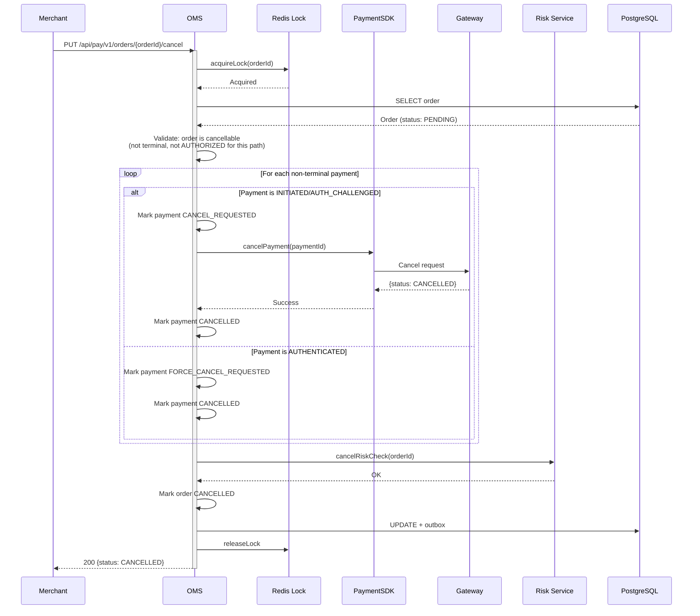
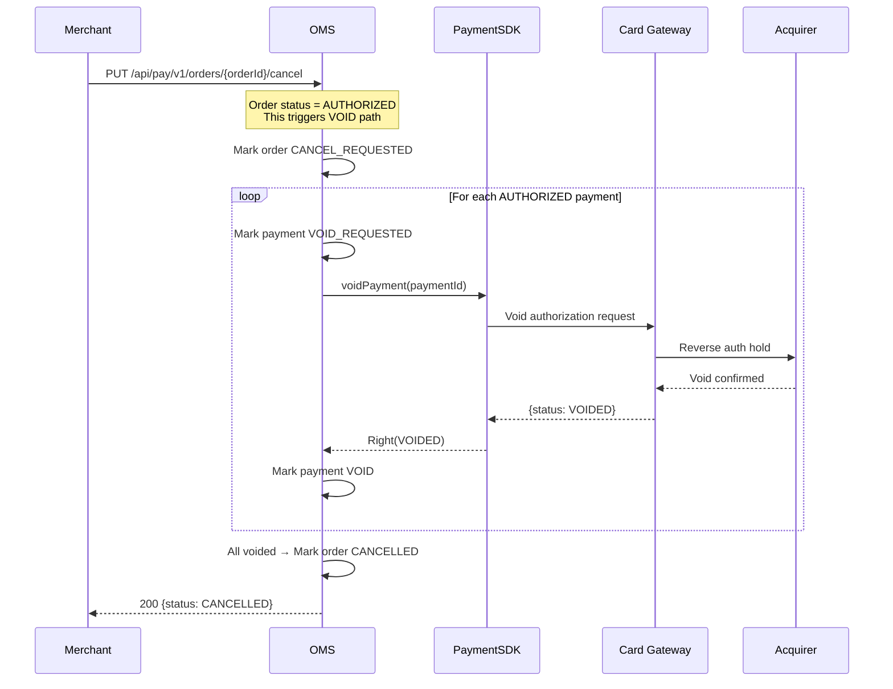
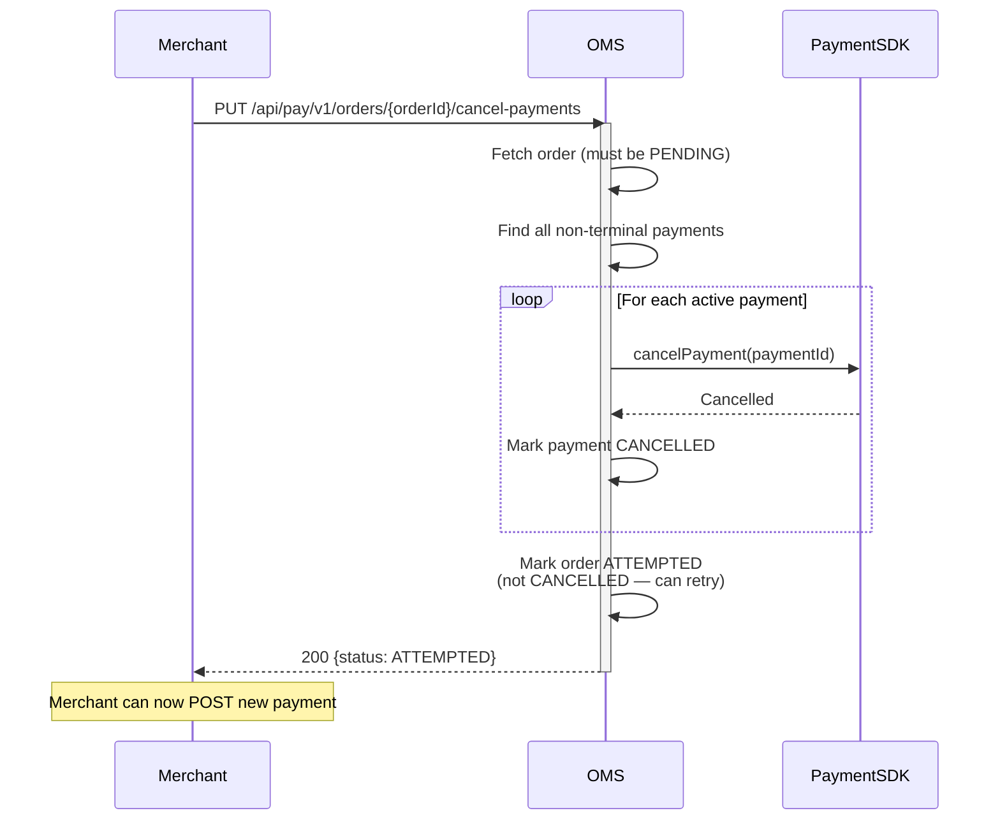
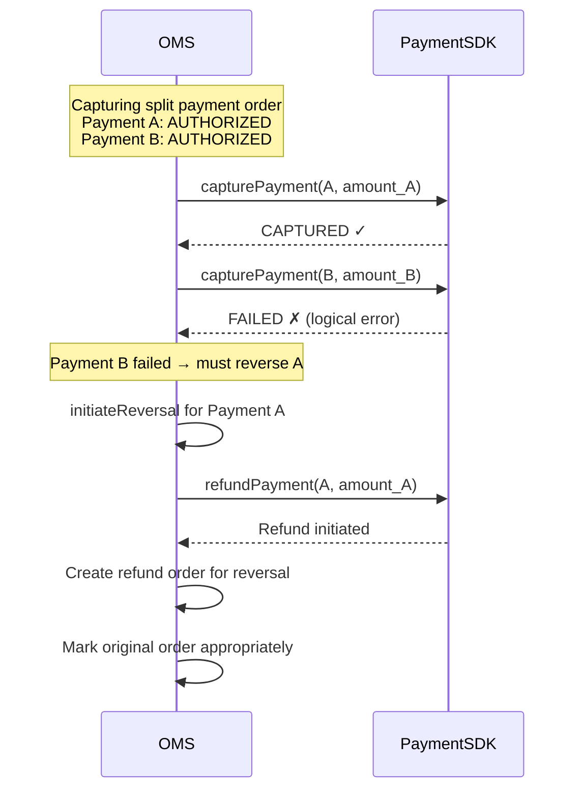
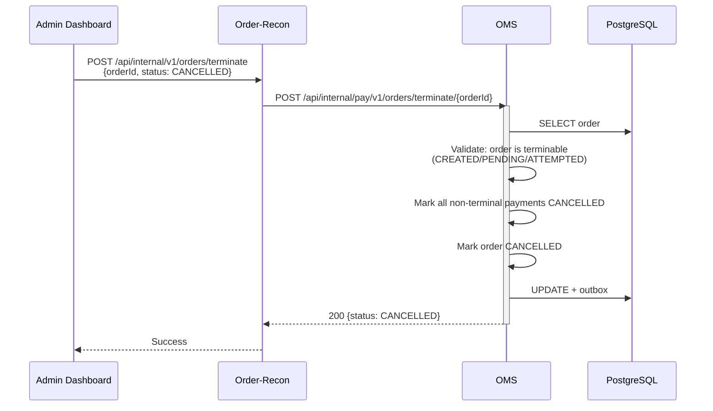
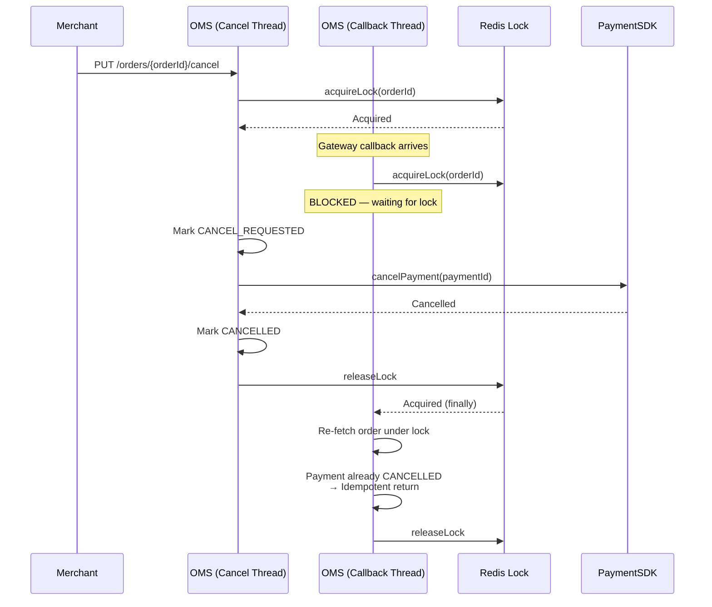
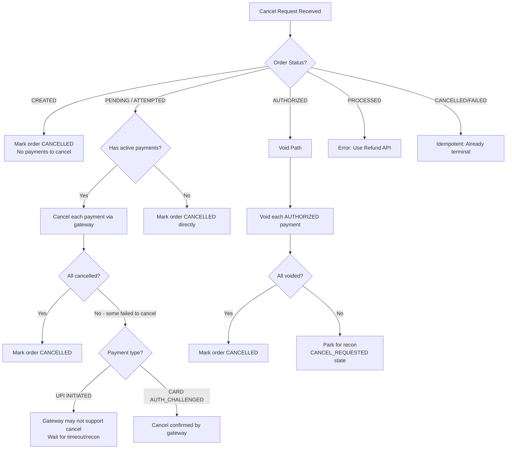

# 06 — Cancel & Void

> Order cancellation, payment cancellation, force cancellation, and void mechanics

---

## Cancel vs Void vs Refund

| Operation | When | Effect | Reversible? |
|-----------|------|--------|-------------|
| **Cancel** | Before capture (PENDING/ATTEMPTED) | Stops payment processing | No |
| **Void** | After authorization, before capture (AUTHORIZED) | Releases auth hold | No |
| **Refund** | After capture (PROCESSED) | Returns funds to customer | Creates refund order |

---

## Flow 1: Cancel Order (Standard — PENDING/ATTEMPTED)

Merchant cancels an order that has pending or attempted payments.

---

## Flow 2: Void Order (AUTHORIZED — Pre-Auth)

When a pre-auth order needs its authorization released.

---

## Flow 3: Cancel Pending Payments (Keep Order Open)

Cancel only the current pending payment without cancelling the order — allows merchant to retry with different method.

---

## Flow 4: Void During Capture Failure (Split Payments)

When capturing multiple payments and one fails — already-captured payments must be reversed.

---

## Flow 5: Force Cancel (Internal — Admin/Recon)

For stuck orders that can't be cancelled via normal flow.

---

## Flow 6: Cancel with Late Auth Race Condition

When a payment callback arrives while cancellation is in progress:

---

## Cancellation Decision Matrix

---

## State Transitions for Cancel/Void

| Scenario | Order: Before → After | Payment: Before → After |
|----------|----------------------|-------------------------|
| Cancel CREATED order | CREATED → CANCELLED | (none) |
| Cancel PENDING order | PENDING → CANCEL_REQUESTED → CANCELLED | INITIATED/AUTH_CHALLENGED → CANCEL_REQUESTED → CANCELLED |
| Cancel ATTEMPTED order | ATTEMPTED → CANCELLED | Already-failed stays FAILED |
| Void AUTHORIZED order | AUTHORIZED → CANCEL_REQUESTED → CANCELLED | AUTHORIZED → VOID_REQUESTED → VOID |
| Cancel-payments only | PENDING → ATTEMPTED | Active → CANCELLED |
| Terminate (admin) | PENDING → CANCELLED | Active → CANCELLED |
| Late auth + cancel race | PENDING → CANCELLED | AUTH_CHALLENGED → CANCELLED (idempotent) |
