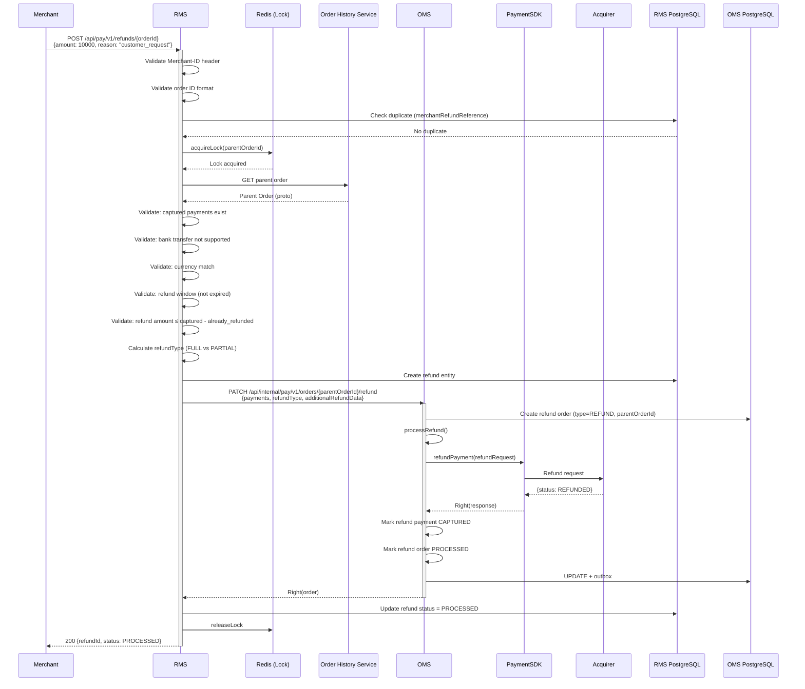
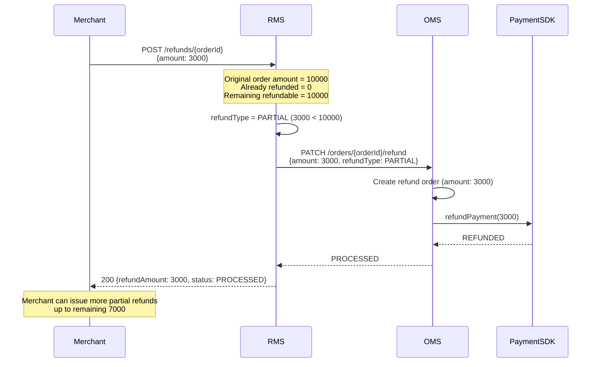
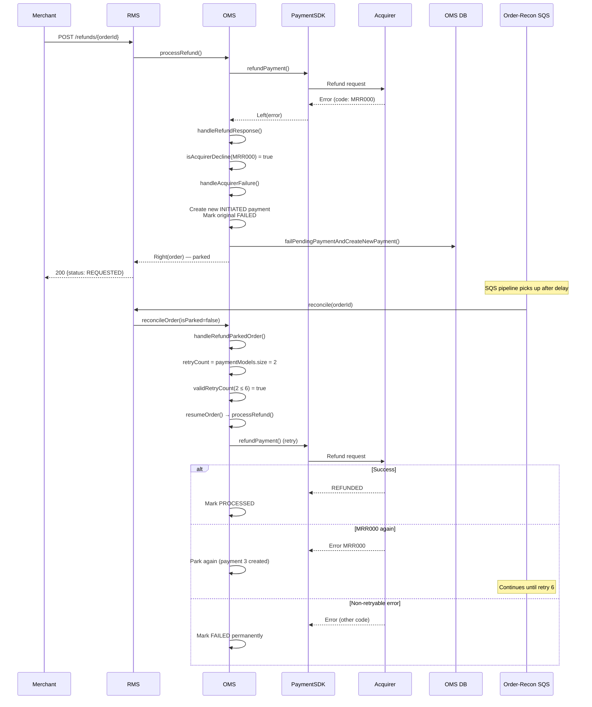
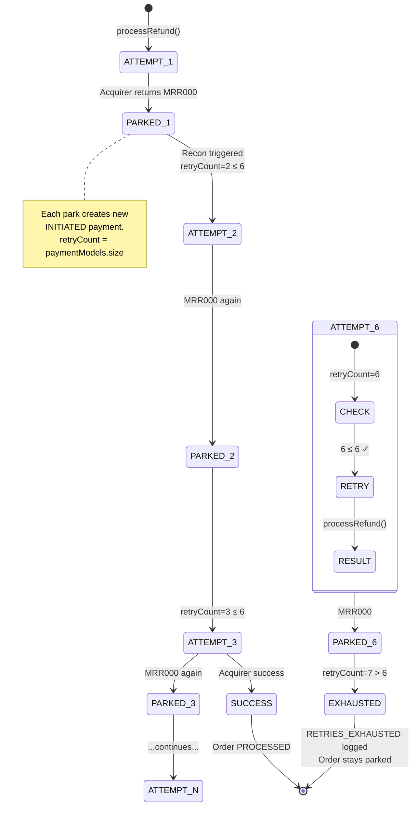
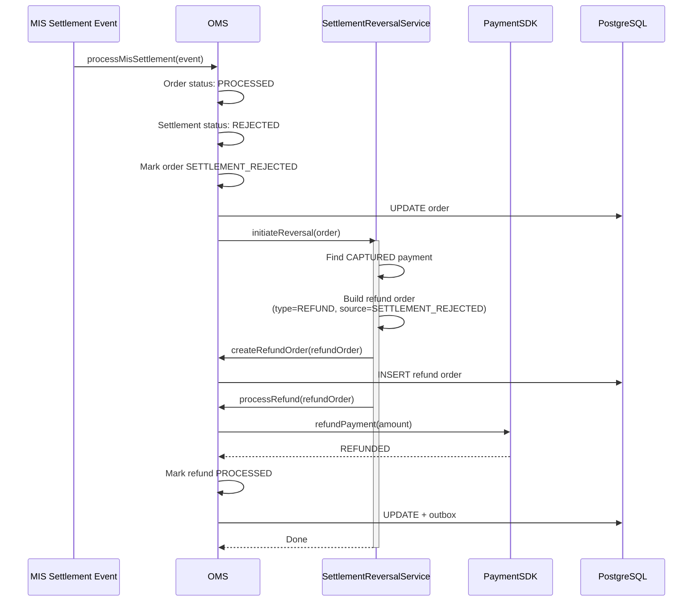
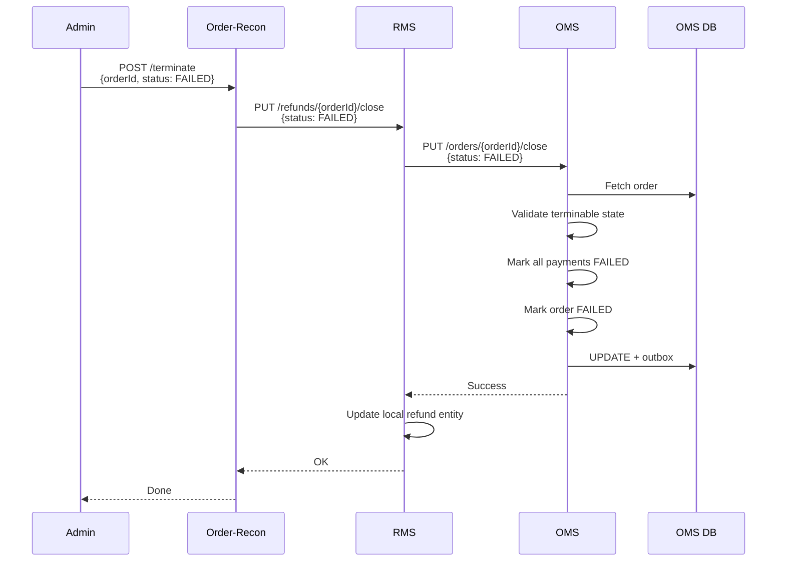
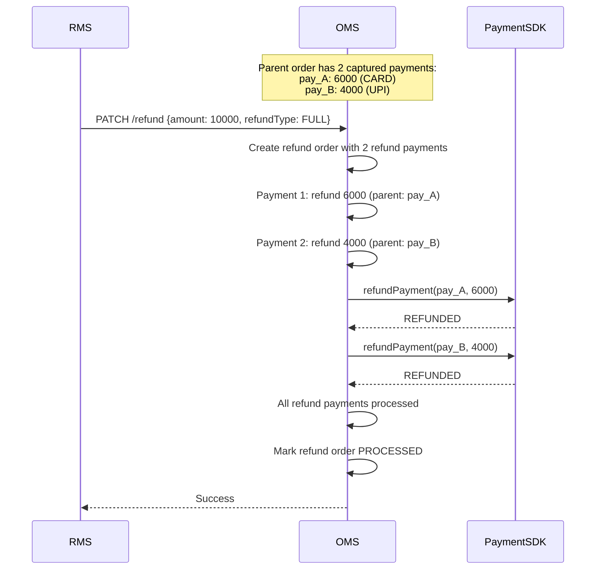

# 07 — Refund Mechanisms

> Full/partial refunds, retry on acquirer decline, settlement reversal, and multi-service orchestration

---

## Refund Architecture Overview

Refunds in Platform V3 involve three services working together:

```mermaid
graph LR
    M[Merchant] -->|POST /refunds| RMS[Refund Management<br/>Service]
    RMS -->|PATCH /orders/{id}/refund| OMS[Payment Order<br/>Service]
    OMS -->|refundPayment| SDK[PaymentSDK]
    SDK --> GW[Gateway / Acquirer]

    RECON[Order-Recon] -->|reconcile| RMS
    RMS -->|reconcileOrder| OMS
    OMS -->|inquirePayment| SDK
```

| Service | Responsibility |
|---------|---------------|
| **RMS** | Validation, deduplication, lock management, refund entity storage |
| **OMS** | Refund order creation, gateway interaction, state management |
| **Order-Recon** | Async reconciliation of pending refunds |

---

## Flow 1: Merchant Initiates Refund (Full)



---

## Flow 2: Partial Refund



---

## Flow 3: Refund Retry on Acquirer Decline

When an acquirer returns a retryable error code (e.g., `MRR000`), OMS parks the order for retry during reconciliation.



### Retry Configuration

```yaml
acquirer_error_code_config:
  card_acquirer_error_codes: "MRR000"      # For CARD, CREDIT_EMI
  sdk_acquirer_error_codes: "MRR000"       # For UPI, NB, Wallet, etc.

acquirer_decline_attempt_config:
  max_attempts: 6                          # Max payment models on order
```

### Retry State Machine



---

## Flow 4: Settlement Reversal (Auto-Refund)

When MIS settlement processing detects a `SETTLEMENT_REJECTED` status, OMS automatically creates a refund.



---

## Flow 5: Force Close Refund (Admin)

For stuck refund orders that need manual resolution.



---

## Refund Validation Rules

| Rule | Check | Error |
|------|-------|-------|
| Duplicate check | merchantRefundReference must be unique per merchant | 409 Conflict |
| Order must be captured | At least one CAPTURED payment on parent order | 422 |
| Bank transfer not supported | Payment method ≠ BANK_TRANSFER | 422 |
| Currency match | Refund currency = order currency | 422 |
| Amount validation | refundAmount ≤ (capturedAmount - alreadyRefunded) | 422 |
| Refund window | Current time within merchant's refund window config | 422 |
| Partner MID | Merchant's partner MID must match | 403 |
| Offer eligibility | If offer applied, validate refund allowed | 422 |

---

## Refund Types

| Type | Trigger | Behavior |
|------|---------|----------|
| **FULL** | refundAmount == capturedAmount | Refunds entire captured amount |
| **PARTIAL** | refundAmount < capturedAmount | Refunds specified amount only |
| **SETTLEMENT_REJECTED** | MIS event with rejected status | Auto-initiated, full amount |
| **BACKPOST_REVERSAL** | Bank-side settlement on failed order | Force-created to reverse unintended capture |
| **CONVENIENCE_FEE** | Fee refund on main txn refund | Separate refund for fee component |

---

## Multi-Payment Refund (Split Order)

For orders with multiple captured payments:



---

## Refund Event Flow (CDC)

```
Refund Order Created/Updated
         │
         ▼
┌─────────────────┐
│  orders table   │ ← Refund order inserted (type=REFUND)
│  outbox table   │ ← Proto event with refund details
└────────┬────────┘
         │ Debezium CDC
         ▼
┌─────────────────┐
│  Kafka Topic    │ orders.public.outbox
└────────┬────────┘
         │
    ┌────┴────┐
    ▼         ▼
┌────────┐ ┌──────────┐
│  OHS   │ │ Webhook  │
│ Update │ │ Merchant │
│ parent │ │ callback │
│ + child│ │ refund   │
│ orders │ │ event    │
└────────┘ └──────────┘
```
