# 08 — Reconciliation, Late Auth & Backposting

> Recon pipelines, late auth expiry handling, force close, and bank-side settlement backposting

---

## Reconciliation Architecture

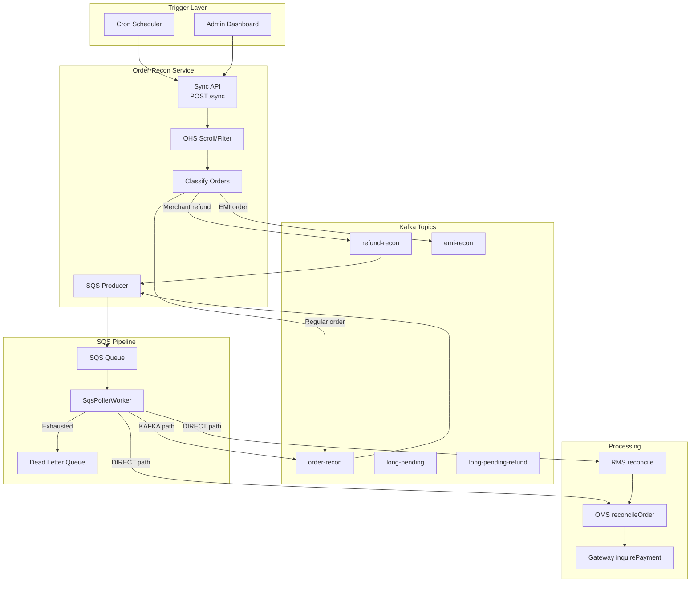

---

## Flow 1: Standard Order Reconciliation

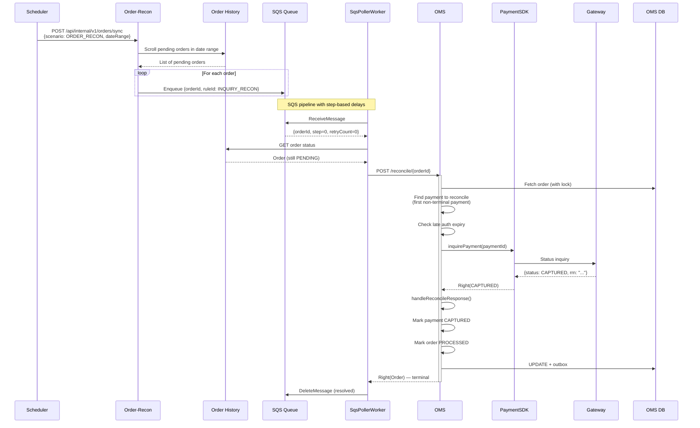

---

## Flow 2: SQS Pipeline Step Progression

The SQS pipeline uses a step-based approach with configurable delays between steps.

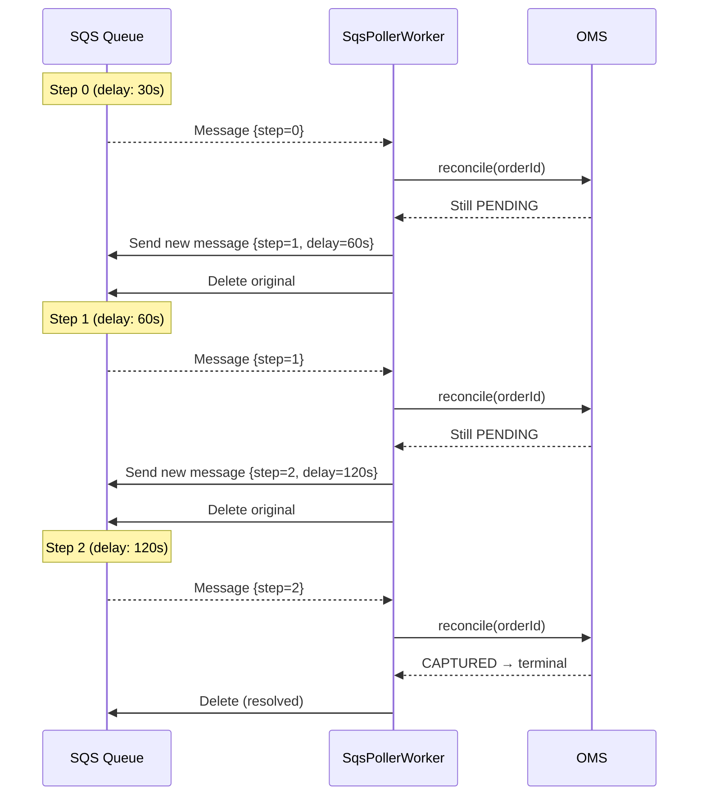

### Delay Configuration

| Step | Delay | Cumulative |
|------|-------|-----------|
| 0 | 30s | 30s |
| 1 | 60s | 1.5 min |
| 2 | 120s | 3.5 min |
| 3 | 240s | 7.5 min |
| 4 | 480s | 15.5 min |
| 5+ | Custom per rule | Varies |

### Failure Handling

- **Same-step retry**: On transient failure, retry same step (max 5 times with backoff: 30→60→120→240→480s)
- **DLQ**: After all steps + retries exhausted, message goes to Dead Letter Queue
- **Deferred messages**: For delays > 900s, uses SQS visibility timeout (max 12h)

---

## Late Auth Handling

### What is Late Auth?

When a payment callback arrives **after** the configured time window, it's considered "late auth." This protects customers from indefinite fund holds.

### Late Auth Detection

```kotlin
fun isLateAuthTimeExpired(paymentModel: PaymentModel, merchantConfig: MerchantConfig): Boolean {
    val cutoffMinutes = merchantConfig.lateAuthCutoff[paymentModel.method]
        ?: globalLateAuthInMinutes  // fallback to global config

    val expiryTime = paymentModel.createdAt + cutoffMinutes.minutes
    return Clock.System.now() > expiryTime
}
```

### Flow: Late Auth During Authorization

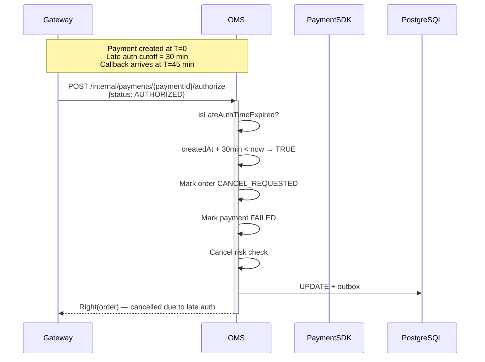

### Flow: Late Auth During Process Payment (UPI Success)

When UPI collect succeeds after late auth window — must capture then immediately reverse.

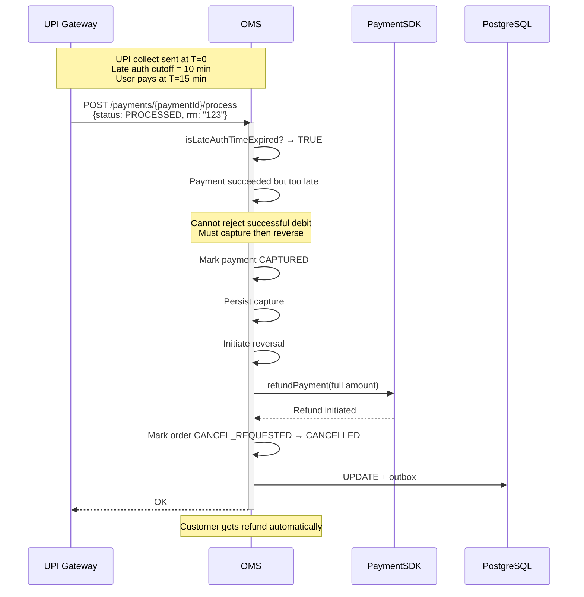

### Flow: Late Auth During Reconciliation

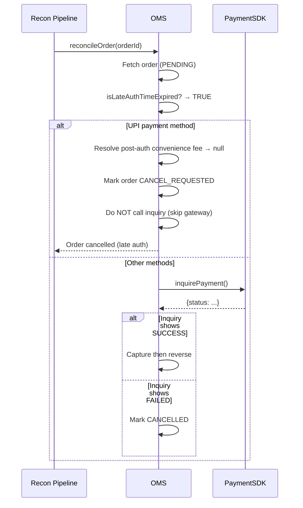

---

## Backposting

### What is Backposting?

Backposting occurs when a bank settles a transaction that OMS considers failed/cancelled. The bank-side settlement arrives via MIS/recon file, creating a state mismatch that must be resolved.

### Backposting Scenarios

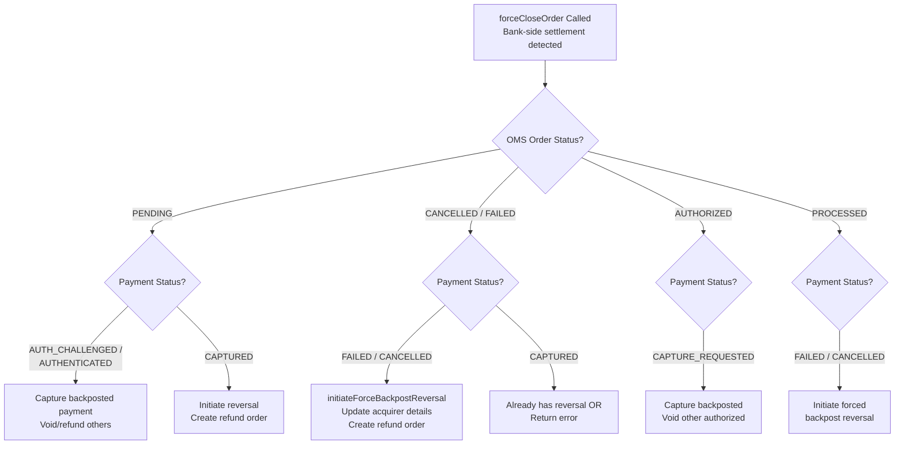

### Flow: Backposting on Failed Order

The most common backpost scenario — order is FAILED/CANCELLED in OMS but bank actually settled.

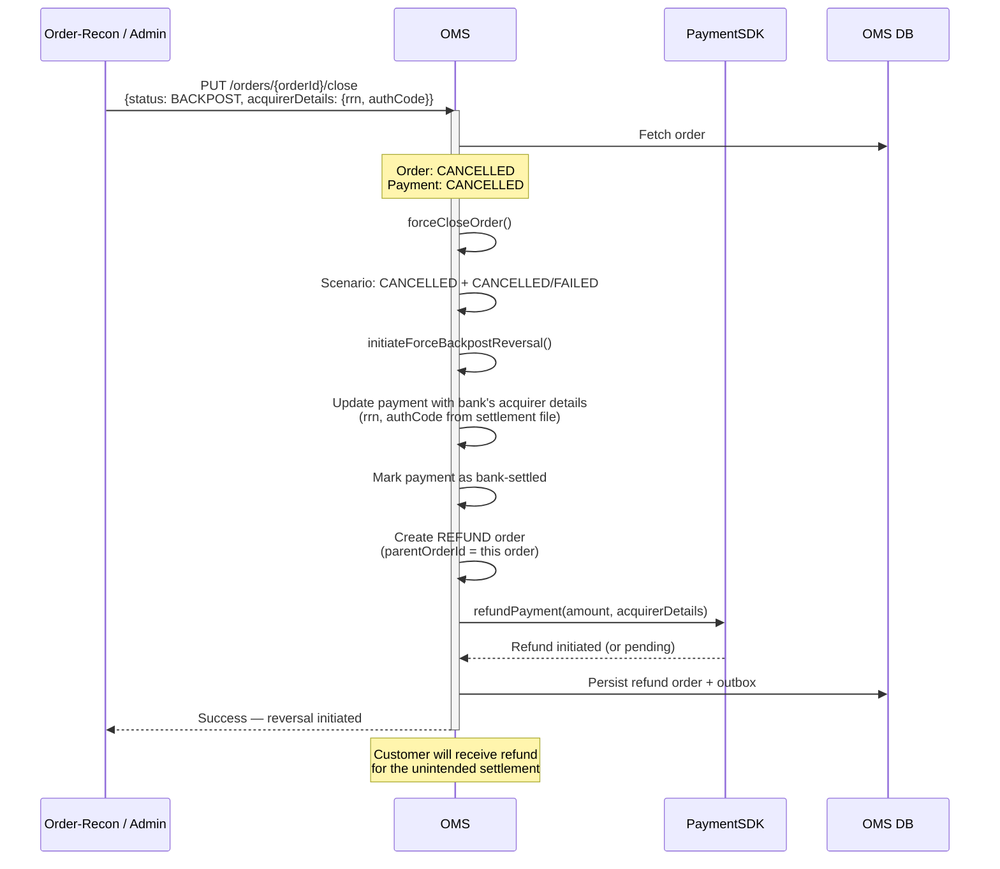

### Flow: Backposting on PENDING Order (Split Payment)

When one payment in a split order settles at bank but OMS shows it as pending.

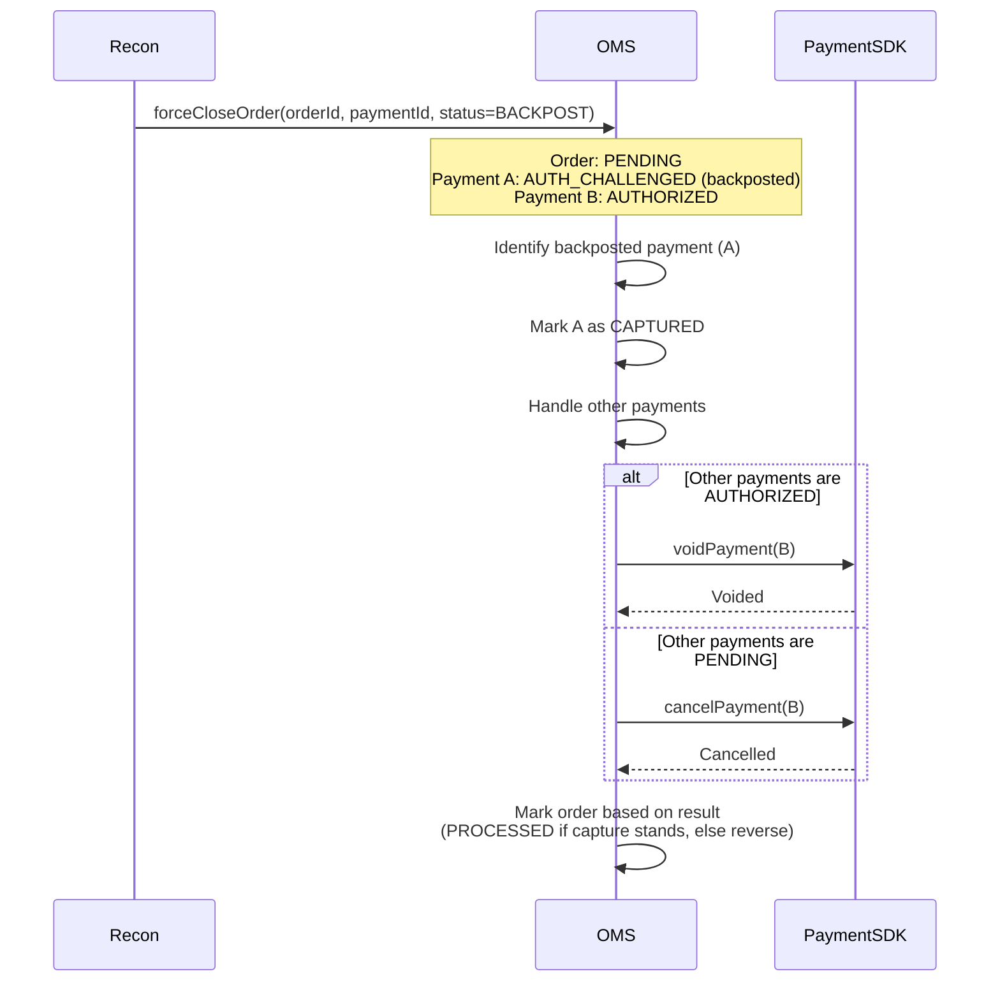

### Backposting Decision Matrix

| Order Status | Payment Status | Action |
|-------------|---------------|--------|
| PENDING | AUTH_CHALLENGED / AUTHENTICATED | Capture backposted, void/refund others |
| PENDING | CAPTURED | Create refund (reversal) |
| CANCELLED | FAILED / CANCELLED | Force backpost reversal (update acquirer details + refund) |
| CANCELLED | CAPTURED | Already reversed OR error |
| AUTHORIZED | CAPTURE_REQUESTED | Capture the backposted, void other authorized |
| PROCESSED | FAILED / CANCELLED | Forced backpost reversal |
| FAILED | FAILED | Force backpost reversal |

### Exception Merchants

Some merchants are configured to **accept** backposted payments instead of reversing:

```kotlin
if (merchantId in exceptionMerchantList) {
    // Capture all pending payments instead of reversing
    captureAllPendingPayments(order)
} else {
    // Standard: reverse the backposted payment
    initiateForceBackpostReversal(order, payment)
}
```

---

## Reconcile Payments (Payment-Level Recon)

For cancelled orders where individual payments may have succeeded bank-side:

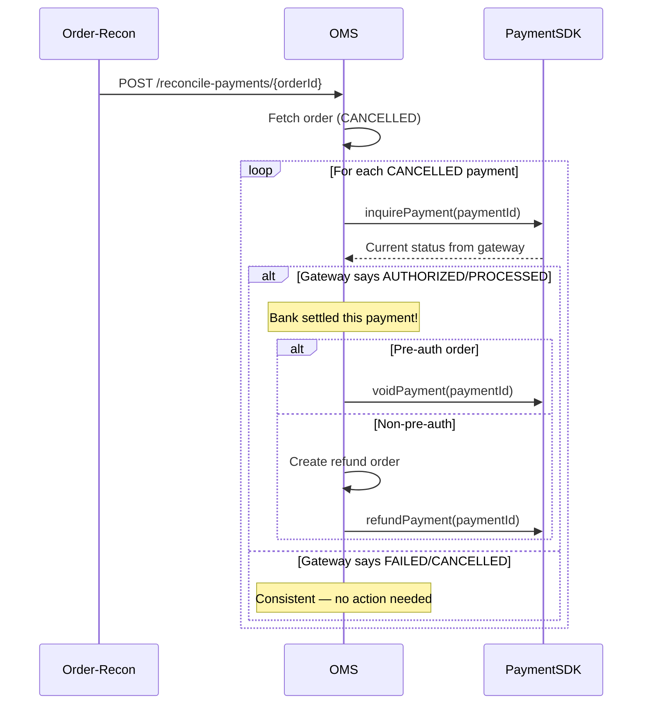

---

## Post-Auth Reconciliation (Capture/Void Retry)

For orders stuck in CAPTURE_REQUESTED or VOID_REQUESTED:

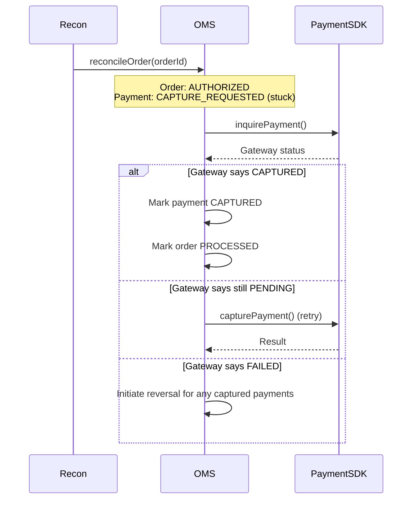

---

## Reconciliation Timeline

```
T=0          T+30s       T+90s       T+210s      T+450s      T+930s
 │            │           │            │           │           │
 ▼            ▼           ▼            ▼           ▼           ▼
Payment     Step 0      Step 1       Step 2      Step 3      Step 4
Created     Inquiry     Inquiry      Inquiry     Inquiry     Inquiry
            (first)     (30s gap)    (60s gap)   (120s gap)  (240s gap)

If still pending after all steps → DLQ (manual investigation)
```

---

## Force Close via Admin

```mermaid
flowchart TD
    A[Admin triggers force close] --> B{Order Type?}

    B -->|CHARGE| C[OMS directly:<br/>PUT /orders/{id}/close]
    B -->|REFUND| D[Route via RMS:<br/>PUT /refunds/{id}/close]

    C --> E{Desired status?}
    D --> F[RMS acquires lock<br/>Delegates to OMS]

    E -->|CANCELLED| G[Mark all payments CANCELLED<br/>Mark order CANCELLED]
    E -->|FAILED| H[Mark all payments FAILED<br/>Mark order FAILED]
    E -->|PROCESSED| I[Mark payment CAPTURED<br/>Mark order PROCESSED<br/>Update acquirer details]

    F --> E
```
