# 09 — Product Workflows

> DCC, MCC, Cross-Border (PA-CB), EMI, Split Payments, Brand Wallet, UPI Mandate, and other specialized flows

---

## Transaction Handler Selection (Strategy Pattern)

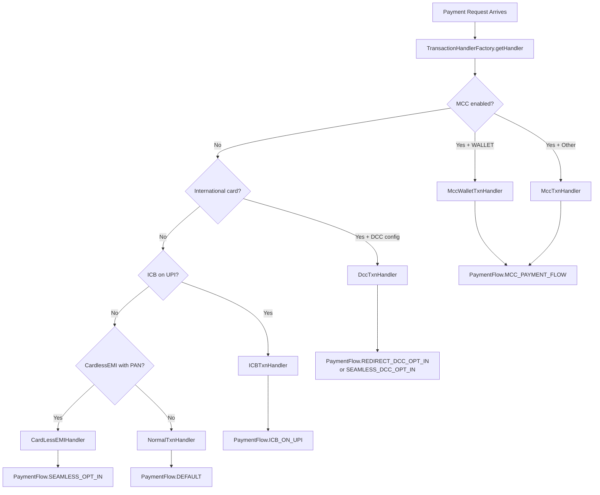

---

## 1. Dynamic Currency Conversion (DCC)

DCC allows international cardholders to pay in their home currency while the merchant receives INR.

### DCC Flow (Async — Redirect)

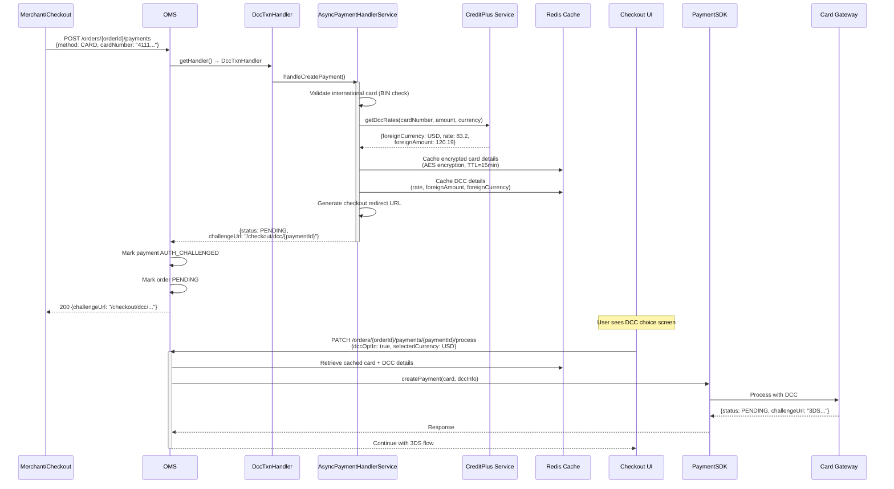

### DCC Modes

| Mode | Description | Trigger |
|------|-------------|---------|
| **REDIRECT_DCC_OPT_IN** | User redirected to checkout for DCC choice | Standard international card |
| **SEAMLESS_DCC_OPT_IN** | Merchant provides DCC opt-in upfront in API | Merchant has DCC-compliant integration |

---

## 2. Multi-Currency Checkout (MCC)

MCC allows merchants to price in foreign currencies. The order amount is in foreign currency; OMS converts to INR for processing.

### MCC Flow

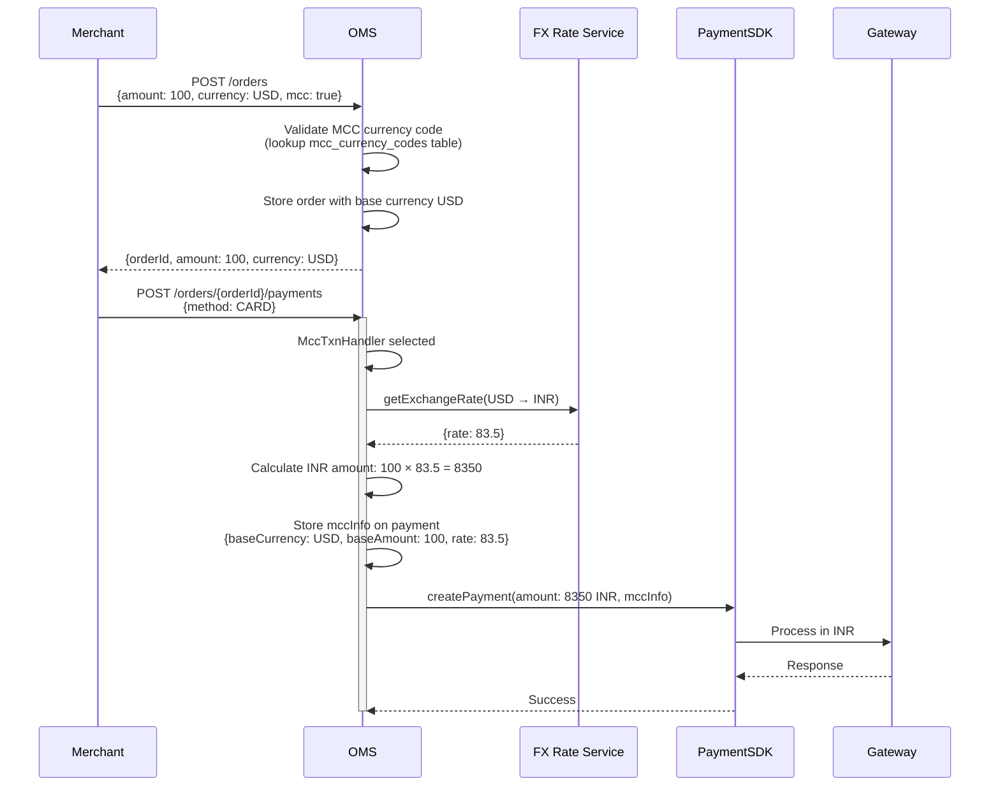

### MCC Validation

- Currency must exist in `mcc_currency_codes` table
- Only supported payment methods can be used with MCC
- Exchange rate is locked at payment creation time

---

## 3. Cross-Border (PA-CB)

Payment Aggregator Cross-Border flow for international trade with regulatory compliance (RBI PA-CB guidelines).

### PA-CB Flow

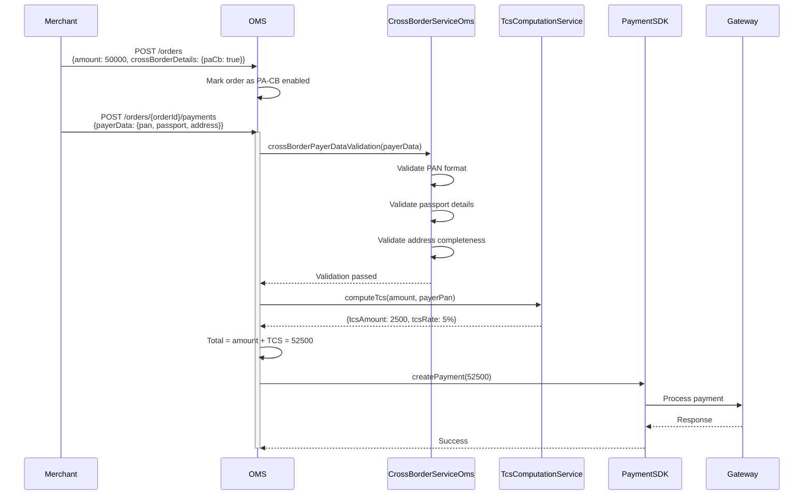

### PA-CB Documents (Invoice & AWB)

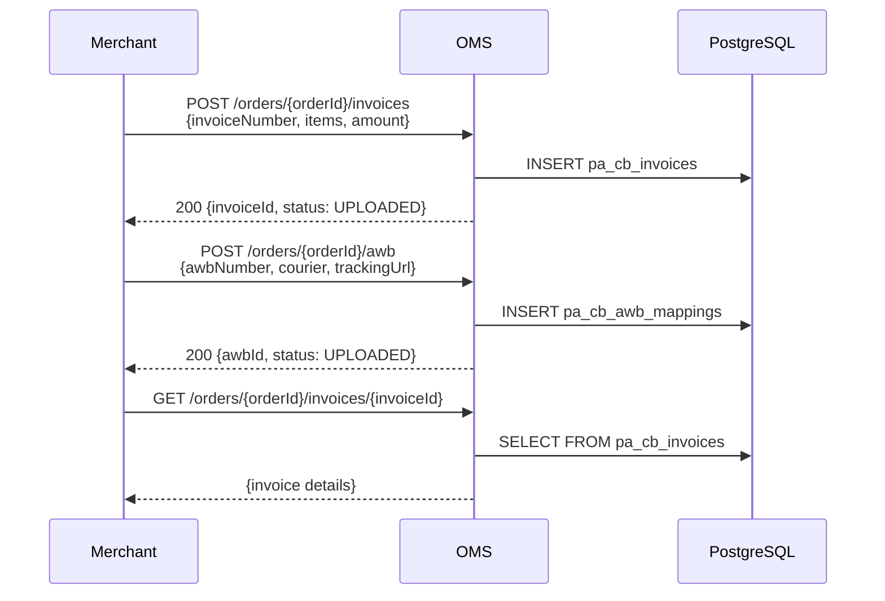

---

## 4. EMI (Equated Monthly Installments)

### EMI Types

| Type | Description | Gateway |
|------|-------------|---------|
| **CREDIT_EMI** | EMI on credit card | Affordability Gateway |
| **DEBIT_EMI** | EMI on debit card | Affordability Gateway |
| **CARDLESS_EMI** | EMI without card (PAN-based) | Affordability Gateway (async) |
| **BNPL** | Buy Now Pay Later | Affordability Gateway |

### Credit EMI Flow

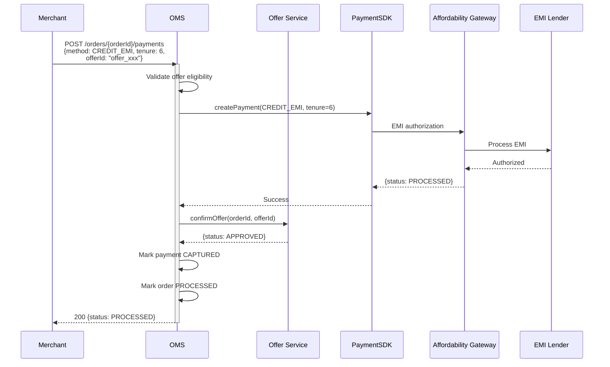

### Cardless EMI Flow (Async)

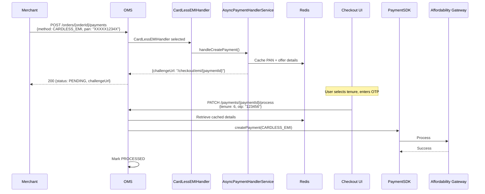

### Offer Confirmation Failure

If the offer service rejects the offer after payment authorization:

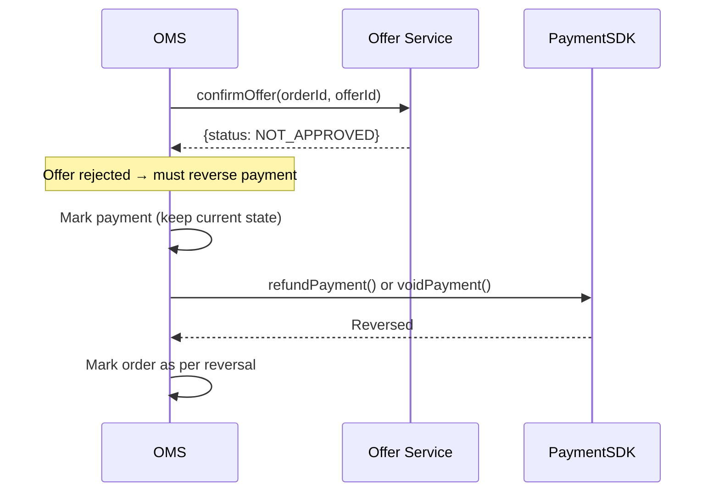

---

## 5. Split Payments (Part Payment)

Multiple payments on a single order using different methods.

### Split Payment Flow

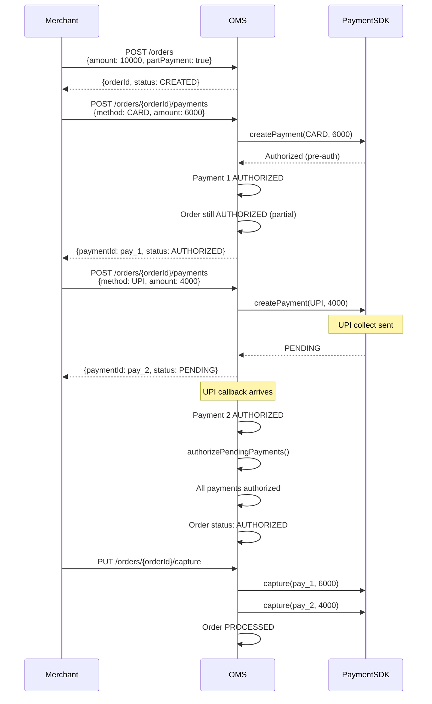

### Split Payment Rules

| Rule | Description |
|------|-------------|
| Amount validation | Sum of payment amounts must equal order amount |
| Partial capture | Not allowed for split (must capture all or none) |
| Convenience fee | Feature fee validated per payment |
| Capture priority | CARD captured first, then others |
| Cancel one payment | Cancels only that payment, order stays open |

---

## 6. Brand Wallet (Add Money)

Brand wallet top-up uses `ADD_MONEY` order type.

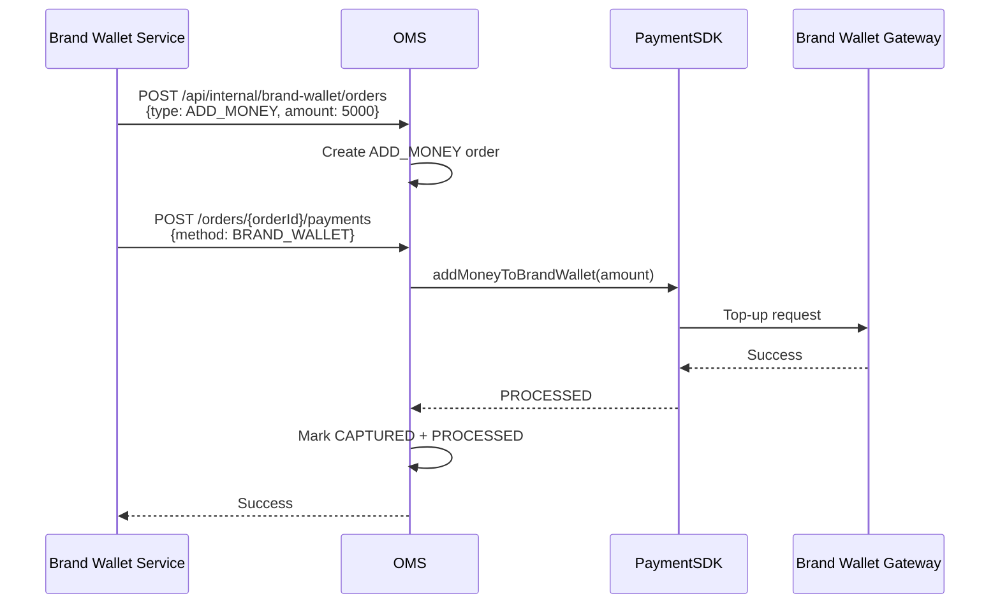

---

## 7. UPI Mandate (Recurring Payments)

UPI mandates allow automatic debits on a recurring basis.

### Mandate Creation Flow

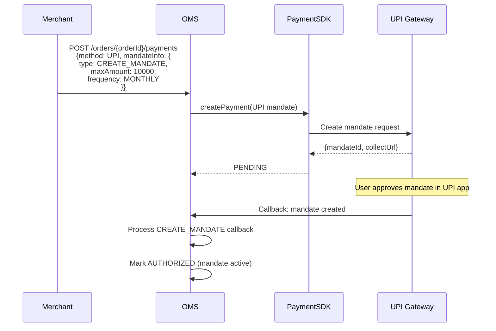

### Mandate Execution Flow

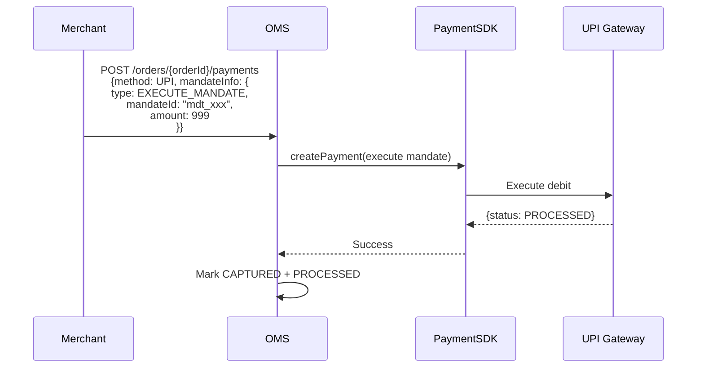

---

## 8. ICB on UPI (Instant Cashback)

Instant cashback on UPI payments — handled by a dedicated service.

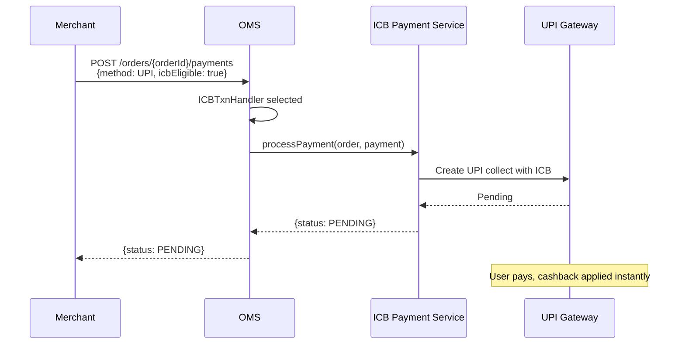

---

## 9. Convenience Fee

Convenience fee can be charged on top of the order amount.

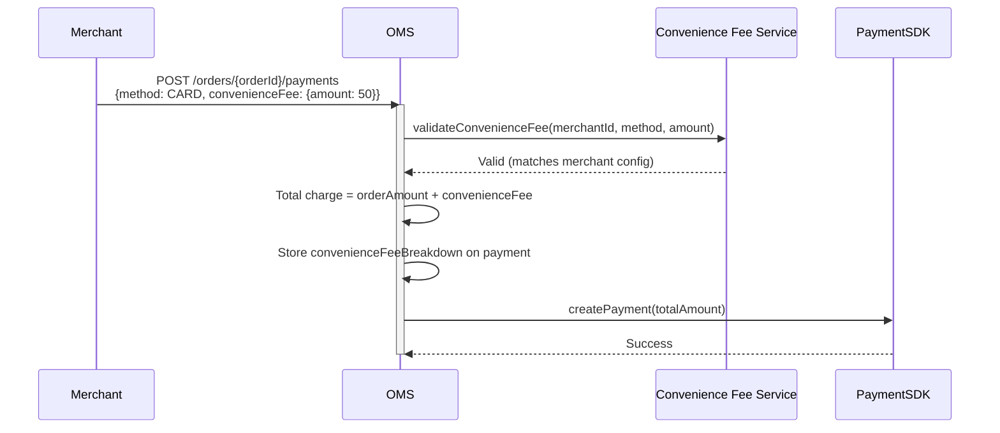

### Post-Auth Convenience Fee (UPI)

For UPI, convenience fee is resolved after successful payment:

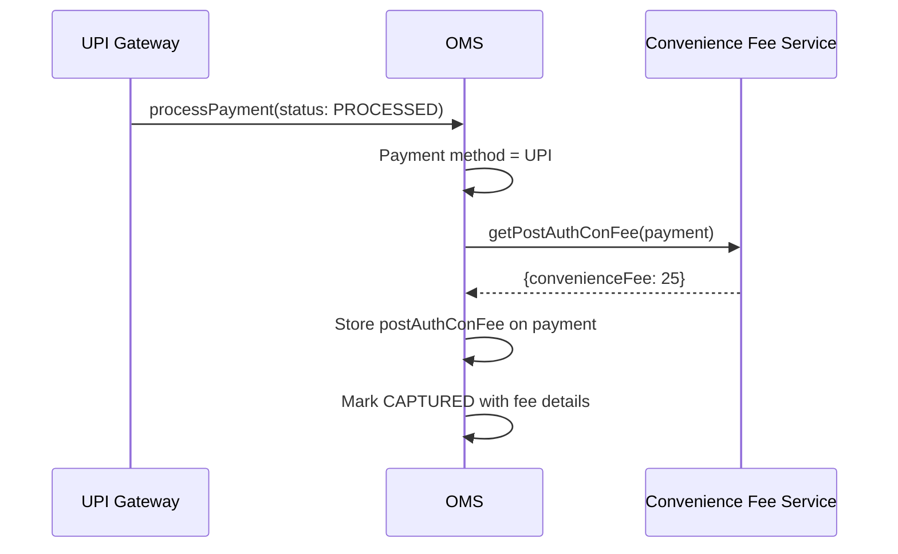

---

## 10. Native OTP (Card)

For cards enrolled in native OTP (bypassing bank ACS page):

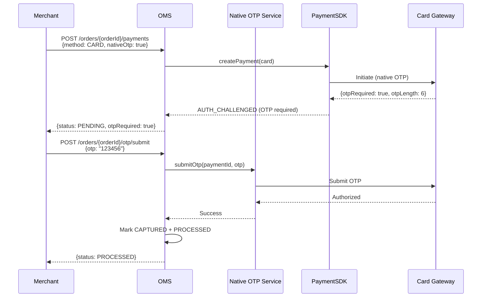
