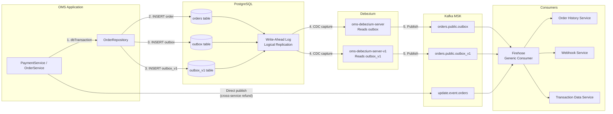
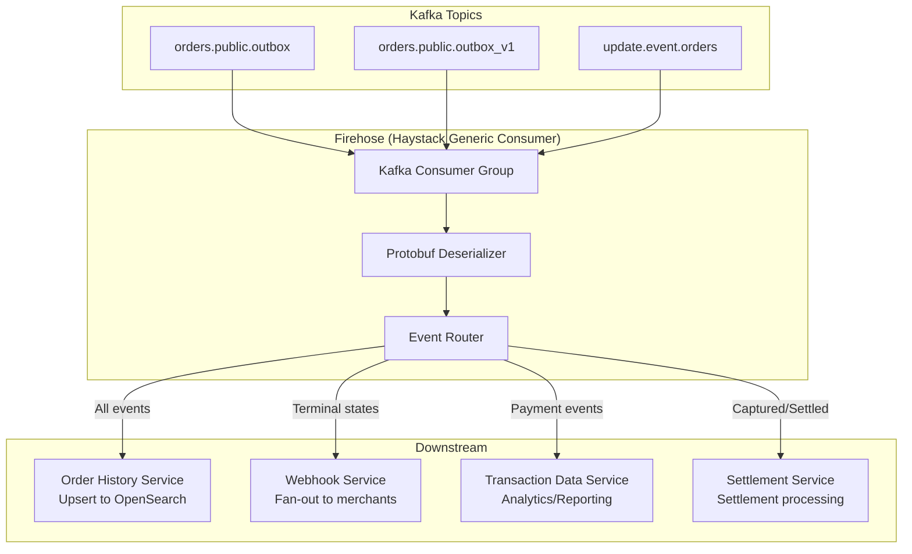

# 10 — Outbox Pattern & CDC

> Transactional outbox implementation, Debezium CDC, Kafka event sourcing, and Firehose consumer architecture

---

## Why Outbox Pattern?

The outbox pattern solves the **dual-write problem**: how to atomically update the database AND publish an event to Kafka. Without it, you risk:

1. DB updated but Kafka publish fails → lost event
2. Kafka published but DB transaction rolls back → phantom event

### Solution: Write event to DB in same transaction, let CDC tool publish to Kafka

```
Traditional (Unsafe):              Outbox (Safe):
┌─────────────┐                    ┌─────────────┐
│ Application │                    │ Application │
└──────┬──────┘                    └──────┬──────┘
       │                                  │
  ┌────┴────┐                        ┌────┴────┐
  │ 1. Write│                        │ SINGLE  │
  │ to DB   │                        │ ATOMIC  │
  └────┬────┘                        │ TX:     │
       │                             │ 1. Write│
  ┌────┴────┐                        │    order│
  │ 2. Pub  │ ← Can fail!           │ 2. Write│
  │ to Kafka│                        │    outbox│
  └─────────┘                        └────┬────┘
                                          │
                                     ┌────┴────┐
                                     │ Debezium│ ← Reads WAL
                                     │ CDC     │   (guaranteed)
                                     └────┬────┘
                                          │
                                     ┌────┴────┐
                                     │ Kafka   │
                                     └─────────┘
```

---

## Architecture



---

## Implementation Detail

### Outbox Write (OrderEntity.kt)

```kotlin
fun createOutbox() {
    val orderMessage = buildOrderMessage()  // Protobuf Order message
    val keyMessage = buildOrderEventKey()   // Protobuf OrderEventKey

    // Write to legacy outbox (behind feature toggle)
    if (!disablePushToOutbox) {
        Outbox.push(OutboxModel(
            entityType = OutboxEntityType.ORDERS,
            entityId = if (disableKeyForOutbox) null else keyMessage.toByteArray(),
            payload = orderMessage.toByteArray()
        ))
    }

    // Write to outbox_v1 (behind feature toggle)
    if (!disablePushToOutboxV1) {
        OutboxV1.push(OutboxModel(
            entityType = OutboxEntityType.ORDERS,
            entityId = keyMessage.toByteArray(),  // Always includes key
            payload = orderMessage.toByteArray()
        ))
    }
}
```

### Atomic Transaction (Repository Pattern)

```kotlin
suspend fun updateOrder(order: Order): Order {
    return DbTransactionUtils.dbTransactionHandler {
        val entity = OrderEntity.find { Orders.orderId eq order.orderId }.first()
        entity.status = order.status
        entity.paymentsList = order.paymentModels
        entity.version = order.version + 1
        entity.updatedAt = Clock.System.now()

        // Outbox write in SAME transaction
        entity.createOutbox()

        entity.toOrder()
    }
}
```

### Outbox Table Push (Outbox.kt)

```kotlin
object Outbox : LongIdTable("outbox") {
    val aggregateId = binary("aggregateid").nullable()
    val aggregateType = text("aggregatetype")
    val payload = binary("payload")
    val traceparent = text("traceparent").nullable()
    val createdAt = timestamp("created_at").defaultExpression(CurrentTimestamp())
    val updatedAt = timestamp("updated_at").defaultExpression(CurrentTimestamp())

    fun push(model: OutboxModel) {
        if (featureToggleDisabled) return

        Outbox.insert {
            it[aggregateId] = if (disableKey) null else model.entityId
            it[aggregateType] = model.entityType.name.lowercase()
            it[payload] = model.payload
            it[traceparent] = extractW3CTraceContext()  // OpenTelemetry
        }
    }
}
```

---

## Debezium Configuration

### Legacy Outbox Connector

```json
{
  "name": "oms-debezium-server",
  "config": {
    "connector.class": "io.debezium.connector.postgresql.PostgresConnector",
    "database.hostname": "${OMS_DB_HOST}",
    "database.dbname": "nxt_payment_orders_db",
    "database.user": "${OMS_DB_USER}",
    "database.password": "${OMS_DB_PASSWORD}",

    "slot.name": "outbox",
    "publication.name": "dbz_publication",
    "table.include.list": "public.outbox",

    "topic.prefix": "orders",
    "transforms": "outbox",
    "transforms.outbox.type": "io.debezium.transforms.outbox.EventRouter",
    "transforms.outbox.table.field.event.key": "aggregateid",
    "transforms.outbox.table.field.event.payload": "payload",
    "transforms.outbox.table.field.event.id": "id",
    "transforms.outbox.route.topic.replacement": "orders.public.outbox",

    "tombstones.on.delete": "false",
    "behavior.on.null.values": "ignore",

    "plugin.name": "pgoutput",
    "publication.autocreate.mode": "filtered"
  }
}
```

### V1 Outbox Connector

```json
{
  "name": "oms-debezium-server-v1",
  "config": {
    "connector.class": "io.debezium.connector.postgresql.PostgresConnector",
    "slot.name": "outbox_v1",
    "publication.name": "dbz_publication_v1",
    "table.include.list": "public.outbox_v1",
    "topic.prefix": "orders",
    "transforms.outbox.route.topic.replacement": "orders.public.outbox_v1"
  }
}
```

### Why Two Outbox Tables?

| Aspect | `outbox` (Legacy) | `outbox_v1` (Current) |
|--------|-------------------|----------------------|
| Key | Conditional (feature toggle) | Always present |
| Consumers | Firehose v1, legacy consumers | Firehose v2, new consumers |
| Migration | Being phased out | Target state |
| Reason | Firehose v1 couldn't handle keyed messages | New consumers expect keys for partitioning |

---

## Protobuf Event Schema

### OrderEventKey (Kafka message key)

```protobuf
message OrderEventKey {
    string order_id = 1;
}
```

### Order Event (Kafka message value)

```protobuf
message Order {
    string order_id = 1;
    string status = 2;
    string merchant_id = 3;
    string merchant_order_reference = 4;
    Amount amount = 5;
    string type = 6;  // CHARGE | REFUND | ADD_MONEY
    repeated Payment payments = 7;
    AdditionalDetails additional_details = 8;
    int64 version = 9;
    google.protobuf.Timestamp created_at = 10;
    google.protobuf.Timestamp updated_at = 11;
}

message Payment {
    string payment_id = 1;
    string status = 2;
    PaymentOption payment_option = 3;
    Amount amount = 4;
    string parent_order_id = 5;
    string parent_payment_id = 6;
    string challenge_url = 7;
    string provider_reference_id = 8;
    AcquirerDetails acquirer_details = 9;
    repeated Capture captures = 10;
    repeated PaymentEvent events = 11;
    ErrorDetail error_detail = 12;
    DeviceInfo device_info = 13;
    OfferData offer_data = 14;
    DccInfo dcc_info = 15;
    MccInfo mcc_info = 16;
    MandateInfo mandate_info = 17;
    google.protobuf.Timestamp created_at = 18;
}
```

---

## OpenTelemetry Trace Propagation

The outbox carries the `traceparent` header from W3C Trace Context, enabling distributed tracing across the async boundary:

```
Request arrives → OMS processes → Writes outbox (with traceparent)
                                         │
                              Debezium picks up (traceparent in message headers)
                                         │
                              Kafka consumer receives (extracts traceparent)
                                         │
                              Continues trace span (Webhook → Merchant)
```

```kotlin
fun extractW3CTraceContext(): String? {
    val span = Span.current()
    if (span.spanContext.isValid) {
        return "00-${span.spanContext.traceId}-${span.spanContext.spanId}-01"
    }
    return null
}
```

---

## Direct Kafka Publisher (Cross-Service Refund)

For cases where the parent order is NOT in the local DB (e.g., cross-service refund updates), OMS publishes directly to Kafka:

```kotlin
// In PaymentService.updateAndPublishOrder()
suspend fun updateAndPublishOrder(parentOrder: Order, updatedPayment: PaymentModel) {
    val updatedOrder = parentOrder.copy(
        payments = parentOrder.payments.map {
            if (it.paymentId == updatedPayment.paymentId) updatedPayment else it
        }
    )

    // Direct Kafka publish (not via outbox)
    omsConfigs.kafkaConfig.orderProducer.publish(
        key = parentOrder.orderId,
        value = updatedOrder.toProto()
    )
}
```

This is used when:
- A refund order processes against a parent order stored in OHS (not local DB)
- The parent order's payment status needs updating in downstream systems

---

## Consumer Architecture (Firehose)



### Firehose Processing Rules

| Event | OHS Action | Webhook Action | TDS Action |
|-------|-----------|----------------|-----------|
| Order CREATED | Insert | None | None |
| Payment AUTH_CHALLENGED | Update | None | None |
| Payment CAPTURED | Update | Send webhook (payment.captured) | Record transaction |
| Order PROCESSED | Update | Send webhook (order.processed) | None |
| Order FAILED | Update | Send webhook (order.failed) | None |
| Refund PROCESSED | Update parent + child | Send webhook (refund.processed) | Record refund |

---

## Feature Toggles

| Toggle | Default | Effect |
|--------|---------|--------|
| `feature_toggles__disable_push_to_outbox` | `false` | Disables legacy outbox writes |
| `feature_toggles__disable_push_to_outbox_v1` | `false` | Disables v1 outbox writes |
| `feature_toggles__disable_key_for_outbox_event` | `false` | Omits key from legacy outbox (Firehose v1 compatibility) |

---

## Operational Concerns

### Replication Slot Monitoring

```sql
-- Check replication lag
SELECT slot_name, 
       pg_wal_lsn_diff(pg_current_wal_lsn(), confirmed_flush_lsn) AS lag_bytes
FROM pg_replication_slots 
WHERE slot_name IN ('outbox', 'outbox_v1');
```

### Outbox Table Growth

Debezium uses the **log-based** approach — it reads from WAL, not polling the table. After capture, the table rows can be cleaned:

```sql
-- pg_cron job: clean outbox rows older than 1 hour
SELECT cron.schedule('clean-outbox', '*/30 * * * *',
    $$DELETE FROM outbox WHERE created_at < NOW() - INTERVAL '1 hour'$$);

SELECT cron.schedule('clean-outbox-v1', '*/30 * * * *',
    $$DELETE FROM outbox_v1 WHERE created_at < NOW() - INTERVAL '1 hour'$$);
```

### Disaster Recovery

- **Replication slot loss**: If Debezium connector fails for extended time, WAL accumulates. Monitor `pg_wal_lsn_diff`.
- **Slot recreation**: Drop slot → recreate → Debezium resumes from latest (may miss events). Use OHS reconciliation to fill gaps.
- **Dual outbox**: Provides redundancy — if one connector fails, the other continues publishing.

---

## Event Ordering Guarantees

| Guarantee | Mechanism |
|-----------|-----------|
| Per-order ordering | Kafka message key = `orderId` → same partition → ordered |
| At-least-once delivery | Debezium + Kafka producer acks=all |
| Idempotent consumers | OHS uses `version` field for dedup; Webhook uses event deduplication |
| No exactly-once | Consumers must handle duplicate events gracefully |
