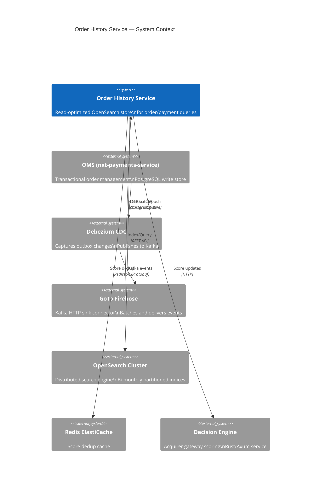
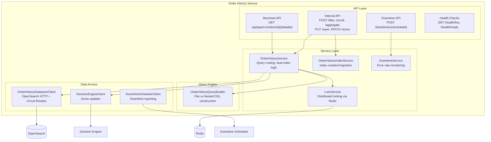
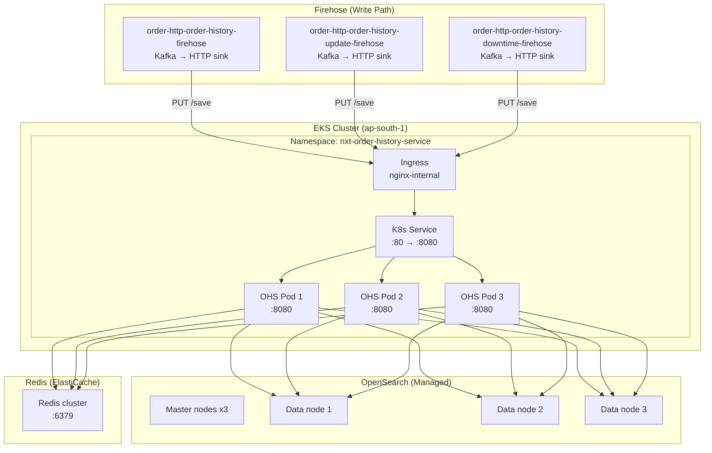
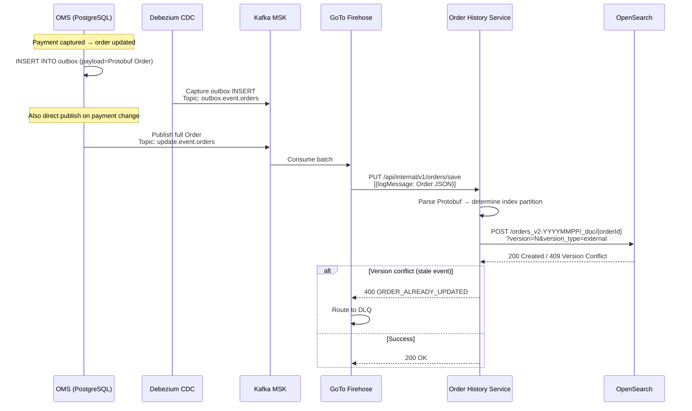
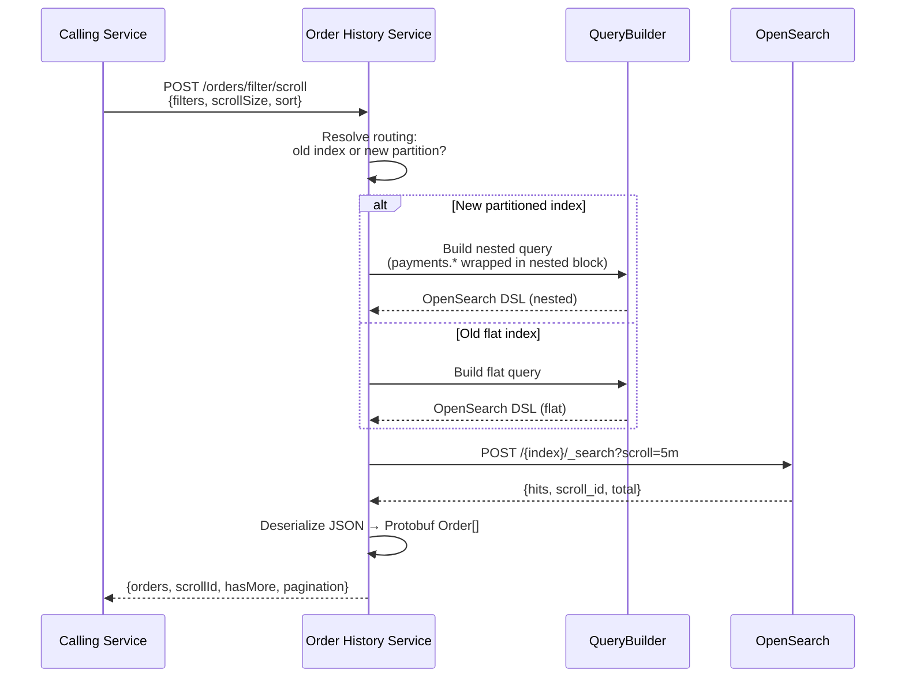

# 01 — Architecture Overview

## System Context

The Order History Service is a **CQRS read model** — a materialized view optimized for queries, fed by CDC events from the transactional OMS database. It bridges the gap between the write-optimized PostgreSQL store (OMS) and the diverse read patterns needed by merchant dashboards, reconciliation, settlement, and analytics.

## Component Architecture

## Layered Architecture

| Layer | Responsibility | Key Classes |
|-------|---------------|-------------|
| **API** | HTTP endpoint definitions, request validation, response mapping | `OrderHistoryRoutes`, `InternalRoutes`, `DowntimeRoutes` |
| **Service** | Business logic, routing decisions, dual-index management | `OrderHistoryService`, `OrderHistoryIndexService`, `DowntimeService` |
| **Query Engine** | OpenSearch DSL construction (flat vs nested variants) | `OrderHistoryQueryBuilder` |
| **Data Access** | OpenSearch HTTP client, circuit breaker, versioning | `OrderHistoryDatastoreClient` |
| **Configuration** | DI wiring, Hoplite config, feature flags | `OrderHistoryServiceConfigs`, `Dependencies` |

## Deployment Topology

## Data Flow: Write Path

## Data Flow: Read Path

## Technology Decisions

| Decision | Choice | Rationale |
|----------|--------|-----------|
| **Datastore** | OpenSearch 2.16 | Full-text + structured queries, nested aggregations, scroll API, index lifecycle |
| **Ingestion** | GoTo Firehose (HTTP Sink) | Managed Kafka→HTTP bridge; handles retries, DLQ, batching without custom consumer code |
| **Serialization** | Protobuf (JSON-encoded) | Type-safe contract from OMS; stored as-is in OpenSearch (no transformation) |
| **Concurrency control** | External versioning | Out-of-order event arrival handled correctly; latest version always wins |
| **Index type** | Nested (for payments) | Accurate per-payment queries without cross-payment false matches |
| **Circuit breaker** | Arrow Resilience | Protects OpenSearch from cascading failures during cluster instability |
| **Migration strategy** | Dual-write | Zero-downtime migration; old index remains available during transition |

## Health & Observability

### Probes

| Probe | Endpoint | Port |
|-------|----------|------|
| Liveness | `/health/live` | 8080 |
| Readiness | `/health/ready` | 8080 |

### Key Metrics

| Metric | Purpose |
|--------|---------|
| `ohs.query.latency` | OpenSearch query response time |
| `ohs.upsert.latency` | Document indexing latency |
| `ohs.version_conflict.count` | Stale events (normal at low rate) |
| `ohs.circuit_breaker.state` | OpenSearch health indicator |
| `ohs.scroll.active` | Active scroll contexts |
| `ohs.downtime.detected` | Payment method downtime signals |

### Capacity & Limits

| Parameter | Value |
|-----------|-------|
| Max page size | 1,000 |
| Default page size | 10 |
| Scroll keep-alive | 5 minutes |
| Scroll batch size | 1,000 |
| HTTP timeout | 10 seconds |
| Connection pool | 600 max connections |
| Circuit breaker failures | 200 before OPEN |
