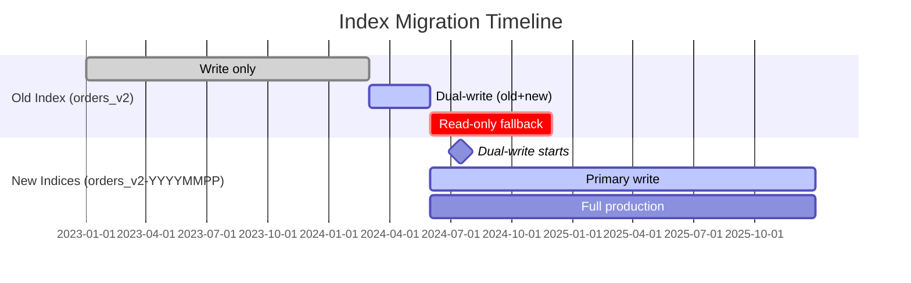

# 02 — Data Model & OpenSearch Schema

## Overview

The Order History Service stores orders as **denormalized JSON documents** in OpenSearch. Each document is a complete order with all its payments embedded as nested objects. The schema is derived from the Protobuf `Order` message contract defined in `nxt-message-contracts`.

## Document Structure (Conceptual)

```mermaid
erDiagram
    ORDER ||--o{ PAYMENT : contains
    ORDER ||--o| ADDITIONAL_DETAILS : has
    PAYMENT ||--o{ CAPTURE : contains
    PAYMENT ||--o{ EVENT : tracks
    PAYMENT ||--o| ACQUIRER_DETAILS : has
    PAYMENT ||--o| PAYMENT_OPTION : has
    PAYMENT_OPTION ||--o| CARD_METADATA : "if card"
    PAYMENT_OPTION ||--o| UPI_METADATA : "if upi"
    ADDITIONAL_DETAILS ||--o| ORDER_INFO : has
    ADDITIONAL_DETAILS ||--o| ORDER_SETTINGS : has
    ADDITIONAL_DETAILS ||--o| PURCHASE_DETAILS : has
    PURCHASE_DETAILS ||--o| CUSTOMER : has
    PURCHASE_DETAILS ||--o{ PRODUCT : lists

    ORDER {
        keyword order_id PK
        keyword merchant_id
        keyword merchant_order_reference
        keyword status "CREATED|PENDING|ATTEMPTED|PROCESSED|FAILED|CANCELLED"
        keyword type "CHARGE|REFUND"
        nested amount "value + currency"
        integer version "external version for OCC"
        date created_at
        date updated_at
    }

    PAYMENT {
        keyword payment_id
        keyword order_id
        keyword status "INITIATED|AUTHENTICATED|CAPTURED|FAILED|..."
        nested amount "value + currency"
        keyword provider_reference_id
        keyword challenge_url
        date created_at
        date updated_at
    }

    ACQUIRER_DETAILS {
        keyword acquirer_id
        keyword acquirer_name
        keyword acquirer_reference_id
        keyword approval_code
        keyword mid
        keyword rrn
        keyword tid
        object raw_data "dynamic key-value"
    }

    CARD_METADATA {
        keyword card_network "VISA|MASTERCARD|RUPAY|AMEX"
        keyword card_type "CREDIT|DEBIT"
        keyword last4
        keyword issuer_name
        keyword card_iin
    }

    UPI_METADATA {
        keyword payer_vpa
        keyword payee_vpa
        keyword payer_account_type
    }
}
```

## OpenSearch Index Mapping

### Index Settings

```json
{
  "settings": {
    "index": {
      "number_of_shards": 1,
      "number_of_replicas": 1
    },
    "analysis": {
      "analyzer": {
        "default": {
          "type": "keyword"
        }
      }
    }
  }
}
```

**Design decisions**:
- **1 shard per index** — Each bi-monthly partition is small enough for a single shard; avoids shard proliferation
- **1 replica** — Standard HA (2 copies of data across nodes)
- **Default keyword analyzer** — All text fields are exact-match by default (payment IDs, merchant IDs, statuses are never full-text searched)

### Complete Field Mapping

#### Top-Level Order Fields

| Field | OpenSearch Type | Protobuf Type | Purpose |
|-------|---------------|---------------|---------|
| `order_id` | keyword | string | Primary key (also document `_id`) |
| `merchant_id` | keyword | string | Merchant identifier |
| `merchant_order_reference` | keyword | string | Merchant's external order ID |
| `status` | keyword | OrderStatus enum | Order state (CREATED→PROCESSED/FAILED) |
| `type` | keyword | OrderType enum | CHARGE or REFUND |
| `amount.value` | long | int64 | Amount in smallest currency unit (paise) |
| `amount.currency` | keyword | Currency enum | INR, USD, EUR, etc. |
| `version` | integer | int32 | Monotonic version for external versioning |
| `created_at` | date | Timestamp | Order creation time |
| `updated_at` | date | Timestamp | Last modification time |

#### Payments (Nested Type)

The `payments` field uses OpenSearch's **nested** type in the new partitioned indices. This is critical for accurate per-payment queries.

| Field | Type | Purpose |
|-------|------|---------|
| `payments.payment_id` | keyword | Payment identifier |
| `payments.order_id` | keyword | Parent order reference |
| `payments.status` | keyword | Payment state |
| `payments.amount.value` | long | Payment amount |
| `payments.amount.currency` | keyword | Currency |
| `payments.provider_reference_id` | keyword | Gateway transaction reference |
| `payments.challenge_url` | keyword | 3DS/OTP redirect URL |
| `payments.created_at` | date | Payment initiation time |
| `payments.updated_at` | date | Last payment update |

#### Payment Option (within payments)

| Field | Type | Purpose |
|-------|------|---------|
| `payments.payment_option.payment_method` | keyword | CARD/UPI/NETBANKING/WALLET/EMI/BNPL |
| `payments.payment_option.card_metadata.card_network` | keyword | VISA/MASTERCARD/RUPAY/AMEX |
| `payments.payment_option.card_metadata.card_type` | keyword | CREDIT/DEBIT/PREPAID |
| `payments.payment_option.card_metadata.last4` | keyword | Last 4 digits |
| `payments.payment_option.card_metadata.issuer_name` | keyword | Issuing bank |
| `payments.payment_option.card_metadata.card_iin` | keyword | First 6-8 digits (BIN) |
| `payments.payment_option.upi_metadata.payer_vpa` | keyword | Customer VPA |
| `payments.payment_option.upi_metadata.payee_vpa` | keyword | Merchant VPA |
| `payments.payment_option.upi_metadata.payer_account_type` | keyword | SAVINGS/CURRENT |

#### Acquirer Details (within payments)

| Field | Type | Purpose |
|-------|------|---------|
| `payments.acquirer_details.acquirer_id` | keyword | Acquirer routing ID |
| `payments.acquirer_details.acquirer_name` | keyword | Human-readable name |
| `payments.acquirer_details.acquirer_reference_id` | keyword | Acquirer's transaction ID |
| `payments.acquirer_details.approval_code` | keyword | Bank approval code |
| `payments.acquirer_details.mid` | keyword | Merchant ID at acquirer |
| `payments.acquirer_details.rrn` | keyword | Retrieval Reference Number |
| `payments.acquirer_details.tid` | keyword | Terminal ID |
| `payments.acquirer_details.raw_data` | object (dynamic) | Acquirer-specific key-value pairs |

#### Captures (within payments)

| Field | Type | Purpose |
|-------|------|---------|
| `payments.captures.merchant_capture_reference` | keyword | Merchant's capture ID |
| `payments.captures.capture_amount.value` | long | Partial capture amount |
| `payments.captures.capture_amount.currency` | keyword | Currency |
| `payments.captures.created_at` | date | Capture timestamp |

#### Events (within payments)

| Field | Type | Purpose |
|-------|------|---------|
| `payments.events.event_type` | keyword | State transition event |
| `payments.events.created_at` | date | Event timestamp |

#### Error Details (within payments)

| Field | Type | Purpose |
|-------|------|---------|
| `payments.error_detail.error_code` | keyword | Platform error code |
| `payments.error_detail.error_message` | keyword | Human-readable message |
| `payments.error_detail.acquirer_error_code` | keyword | Bank error code |
| `payments.error_detail.acquirer_error_message` | keyword | Bank error message |

#### Additional Details

| Field | Type | Purpose |
|-------|------|---------|
| `additional_details.order_info.notes` | keyword | Merchant notes |
| `additional_details.order_info.parent_order_id` | keyword | Parent order (for refunds) |
| `additional_details.order_settings.auto_capture` | boolean | Auto-capture enabled |
| `additional_details.purchase_details.customer.email_id` | keyword | Customer email (PII, encrypted) |
| `additional_details.purchase_details.customer.phone_number` | keyword | Customer phone (PII, encrypted) |
| `additional_details.purchase_details.customer.first_name` | keyword | Customer name |
| `additional_details.purchase_details.merchant_metadata` | object (dynamic) | Custom merchant key-value |
| `additional_details.purchase_details.products[].product_code` | keyword | Product SKU |

## Nested vs Flat: Why It Matters

### The Cross-Object Problem

Without nested types, OpenSearch flattens arrays into multi-valued fields. This causes **false matches** when querying payment-specific combinations:

```
Document: {
  "payments": [
    { "status": "CAPTURED", "payment_method": "CARD" },
    { "status": "FAILED",   "payment_method": "UPI" }
  ]
}

Query: "Find orders where payments.status=CAPTURED AND payments.payment_method=UPI"

Flat index result: ✗ MATCHES (false positive!)
  → OpenSearch sees status=[CAPTURED,FAILED] and method=[CARD,UPI]
  → Both CAPTURED and UPI exist in the document (in different payments)

Nested index result: ✓ DOES NOT MATCH (correct!)
  → Each payment is evaluated independently
  → No single payment has both CAPTURED + UPI
```

### Migration from Flat to Nested



## Protobuf Contract (Source of Truth)

The OpenSearch document structure directly mirrors the Protobuf `Order` message:

```protobuf
// proto/order/v1/order.proto
message Order {
  string id = 1;
  string merchant_id = 2;
  string merchant_order_reference = 3;
  OrderStatus status = 4;
  OrderType type = 5;
  Amount amount = 6;
  int32 version = 7;
  google.protobuf.Timestamp created_at = 8;
  google.protobuf.Timestamp updated_at = 9;
  repeated Payment payments = 10;
  AdditionalDetails additional_details = 11;
}

enum OrderStatus {
  ORDER_STATUS_UNSPECIFIED = 0;
  CREATED = 1;
  PENDING = 2;
  ATTEMPTED = 3;
  PROCESSED = 4;
  FAILED = 5;
  CANCELLED = 6;
  CANCEL_REQUESTED = 7;
}

enum OrderType {
  ORDER_TYPE_UNSPECIFIED = 0;
  CHARGE = 1;
  REFUND = 2;
}
```

```protobuf
// proto/order/v1/payment.proto
message Payment {
  string id = 1;
  string order_id = 2;
  PaymentStatus status = 3;
  Amount amount = 4;
  PaymentOption payment_option = 5;
  AcquirerDetails acquirer_details = 6;
  ErrorDetail error_detail = 7;
  repeated Capture captures = 8;
  repeated PaymentEvent events = 9;
  string provider_reference_id = 10;
  string challenge_url = 11;
  google.protobuf.Timestamp created_at = 12;
  google.protobuf.Timestamp updated_at = 13;
}

enum PaymentStatus {
  PAYMENT_STATUS_UNSPECIFIED = 0;
  INITIATED = 1;
  AUTHENTICATION_CHALLENGED = 2;
  AUTHENTICATED = 3;
  AUTHORIZATION_CHALLENGED = 4;
  AUTHORIZED = 5;
  CAPTURE_REQUESTED = 6;
  CAPTURED = 7;
  CANCEL_REQUESTED = 8;
  CANCELLED = 9;
  FAILED = 10;
}

enum PaymentMethod {
  PAYMENT_METHOD_UNSPECIFIED = 0;
  CARD = 1;
  UPI = 2;
  NETBANKING = 3;
  WALLET = 4;
  EMI = 5;
  BNPL = 6;
  POINTS = 7;
}
```

## JSON Document Example

```json
{
  "order_id": "pay-240615-abc123def456",
  "merchant_id": "M_SHOP_001",
  "merchant_order_reference": "SHOP-ORD-99887",
  "status": "PROCESSED",
  "type": "CHARGE",
  "amount": {
    "value": 150000,
    "currency": "INR"
  },
  "version": 8,
  "created_at": "2024-06-15T10:30:00Z",
  "updated_at": "2024-06-15T10:32:45Z",
  "payments": [
    {
      "payment_id": "pay-240615-abc123def456-p1",
      "order_id": "pay-240615-abc123def456",
      "status": "FAILED",
      "amount": { "value": 150000, "currency": "INR" },
      "payment_option": {
        "payment_method": "UPI",
        "upi_metadata": {
          "payer_vpa": "customer@upi",
          "payee_vpa": "merchant@hdfc"
        }
      },
      "error_detail": {
        "error_code": "UPI_TIMEOUT",
        "error_message": "Transaction timed out"
      },
      "created_at": "2024-06-15T10:30:05Z",
      "updated_at": "2024-06-15T10:31:05Z"
    },
    {
      "payment_id": "pay-240615-abc123def456-p2",
      "order_id": "pay-240615-abc123def456",
      "status": "CAPTURED",
      "amount": { "value": 150000, "currency": "INR" },
      "payment_option": {
        "payment_method": "CARD",
        "card_metadata": {
          "card_network": "VISA",
          "card_type": "CREDIT",
          "last4": "4242",
          "issuer_name": "HDFC Bank",
          "card_iin": "424242"
        }
      },
      "acquirer_details": {
        "acquirer_id": "ACQ_HDFC_001",
        "acquirer_name": "STANDALONE_PG_HDFC",
        "acquirer_reference_id": "HDFC_TXN_789012",
        "rrn": "423456789012",
        "mid": "MERCHANT_HDFC_001",
        "approval_code": "123456"
      },
      "captures": [
        {
          "merchant_capture_reference": "CAP-001",
          "capture_amount": { "value": 150000, "currency": "INR" },
          "created_at": "2024-06-15T10:32:45Z"
        }
      ],
      "events": [
        { "event_type": "INITIATED", "created_at": "2024-06-15T10:31:10Z" },
        { "event_type": "AUTHENTICATED", "created_at": "2024-06-15T10:31:45Z" },
        { "event_type": "CAPTURED", "created_at": "2024-06-15T10:32:45Z" }
      ],
      "created_at": "2024-06-15T10:31:10Z",
      "updated_at": "2024-06-15T10:32:45Z"
    }
  ],
  "additional_details": {
    "order_info": {
      "notes": "Rush delivery requested"
    },
    "order_settings": {
      "auto_capture": true
    },
    "purchase_details": {
      "customer": {
        "email_id": "ENC:aes256:...",
        "phone_number": "ENC:aes256:...",
        "first_name": "Rahul"
      },
      "merchant_metadata": {
        "tenant_id": "DEFAULT",
        "store_id": "STORE_MUM_001"
      }
    }
  }
}
```

## PII Encryption

Sensitive customer fields are encrypted at rest using AES-256-CBC:

| Field | Encrypted | Algorithm |
|-------|-----------|-----------|
| `customer.email_id` | Yes | AES/CBC/PKCS5Padding |
| `customer.phone_number` | Yes | AES/CBC/PKCS5Padding |
| `customer.first_name` | No | — |
| `card_metadata.last4` | No (masked by upstream) | — |
| `card_metadata.card_iin` | No | — |

Encryption is performed by OMS before publishing to Kafka. OHS stores the encrypted values as-is. Decryption happens at the API layer when serving merchant-facing responses.

## Document Size Characteristics

| Scenario | Typical Doc Size | Payments Count |
|----------|-----------------|----------------|
| Single successful payment | ~2-3 KB | 1 |
| Failed + retry success | ~4-5 KB | 2 |
| Multiple attempts (3 failures + success) | ~8-10 KB | 4 |
| Pre-auth + partial captures | ~6-8 KB | 1 (with multiple captures) |
| Refund order | ~2-3 KB | 1 |
