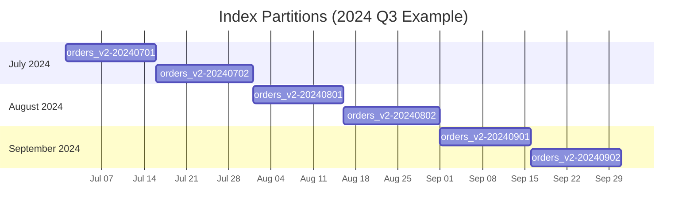
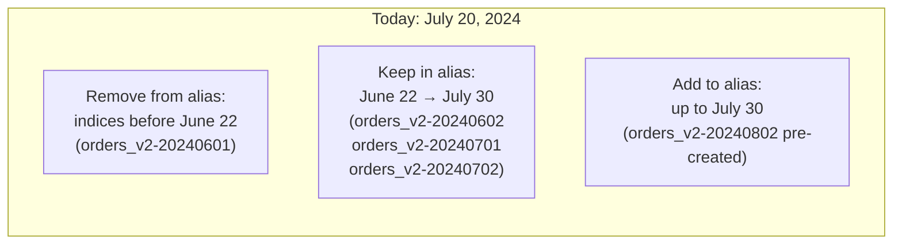
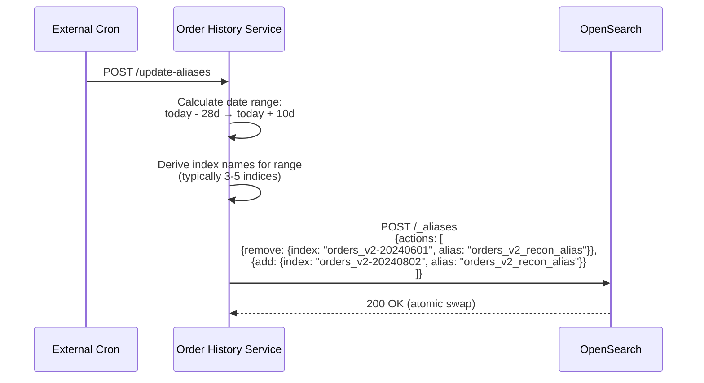
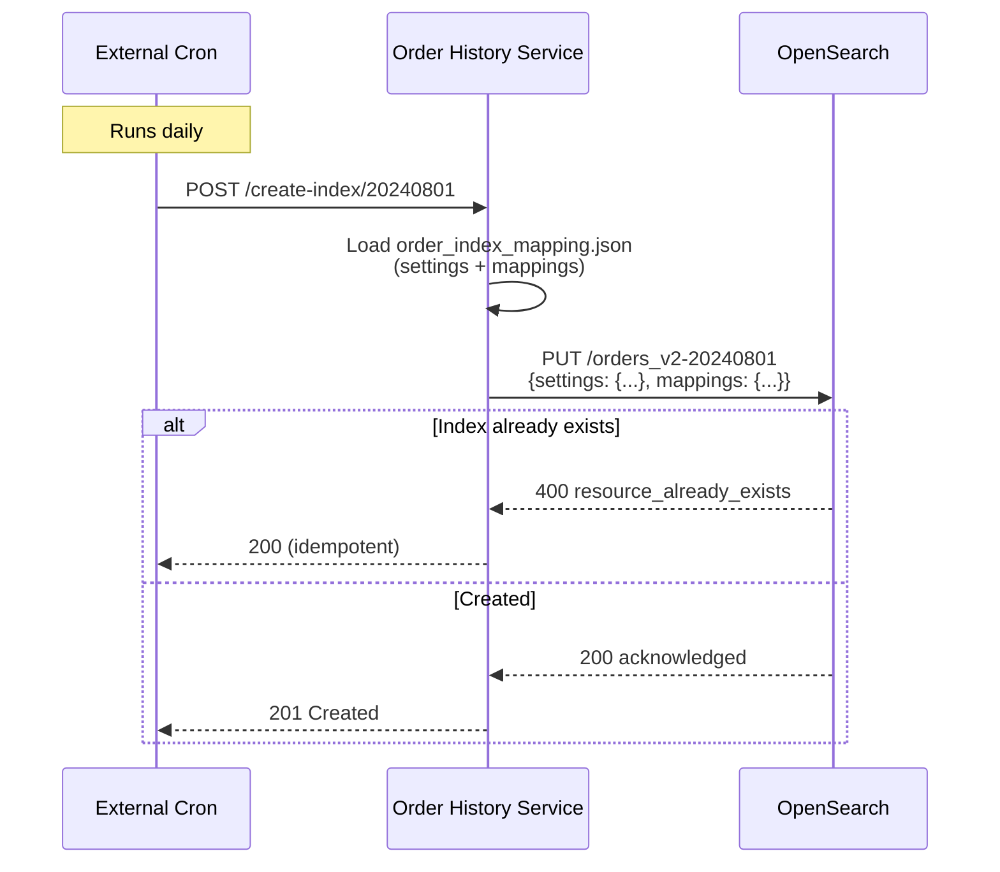
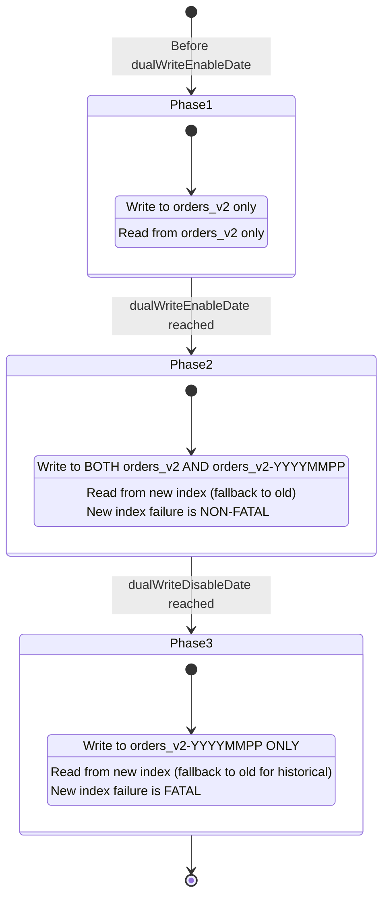
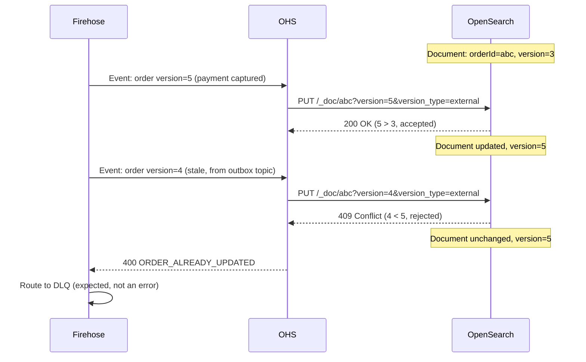
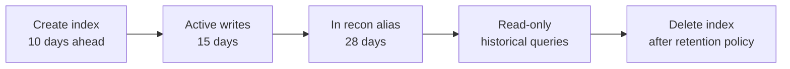

# 03 — Indexing, Partitioning & Lifecycle

## Overview

The Order History Service uses **time-based bi-monthly index partitioning** — each ~15-day window gets its own OpenSearch index. This strategy enables:
- Controlled shard sizes (avoid giant indices)
- Efficient data lifecycle (drop old indices without reindexing)
- Rolling alias management for recon service queries
- Zero-downtime schema migrations

## Partitioning Scheme

### Index Naming Convention

```
orders_v2-{YYYY}{MM}{PP}

Where:
  YYYY = 4-digit year
  MM   = 2-digit month (01-12)
  PP   = partition within month:
         01 = days 1-15
         02 = days 16-31
```

**Examples:**
```
orders_v2-20240101  →  January 2024, days 1-15
orders_v2-20240102  →  January 2024, days 16-31
orders_v2-20240201  →  February 2024, days 1-15
orders_v2-20240202  →  February 2024, days 16-28
orders_v2-20241201  →  December 2024, days 1-15
orders_v2-20241202  →  December 2024, days 16-31
```

### Partition Derivation from OrderId

Order IDs embed their creation date:

```
Format: {prefix}-{yyMMdd}-{random}
Example: pay-240615-abc123def456
                ↑
         yy=24, MM=06, dd=15
         → Year: 2024, Month: 06, Day: 15
         → Day 15 ≤ 15, so partition = 01
         → Index: orders_v2-20240601
```

```kotlin
// Utils.kt — Index name derivation
fun getIndexNameFromOrderId(orderId: String): String {
    val datePart = orderId.split("-")[1]  // "240615"
    val yy = datePart.substring(0, 2)    // "24"
    val mm = datePart.substring(2, 4)    // "06"
    val dd = datePart.substring(4, 6)    // "15"

    val partition = if (dd.toInt() <= 15) "01" else "02"
    return "orders_v2-20${yy}${mm}${partition}"
}
```

### Partition Timeline Visualization



**~24 indices per year** (2 per month × 12 months)

## Alias Management

### Alias Types

| Alias | Purpose | Rolling Window |
|-------|---------|----------------|
| `orders_v2_read` | General read queries (merchant dashboard, get-order) | All active indices |
| `orders_v2_recon_alias` | Recon service queries (time-bounded) | Last 28 days + 10 days future |

### Rolling Recon Alias

The recon alias covers a **38-day window** (28 days back + 10 days forward):

```
REMOVE_OFFSET_DAYS = -28  (remove indices older than 28 days)
ADD_OFFSET_DAYS    = +10  (add indices up to 10 days in the future)
```



### Alias Update API

```
POST /api/internal/v1/orders/update-aliases
```

This endpoint (called by a cron job) performs atomic alias rotation:



### Alias Configuration

```yaml
orderHistoryConfigs:
  rollingIndexAlias: "orders_v2_recon_alias"
```

## Index Creation

### Pre-Creation Strategy

New indices are created **before** they're needed (via the `ADD_OFFSET_DAYS = 10` lookahead):



### Index Settings (from order_index_mapping.json)

```json
{
  "settings": {
    "index": {
      "number_of_shards": 1,
      "number_of_replicas": 1
    },
    "analysis": {
      "analyzer": {
        "default": { "type": "keyword" }
      }
    }
  },
  "mappings": {
    "properties": {
      "order_id": { "type": "keyword" },
      "payments": {
        "type": "nested",
        "properties": { ... }
      }
      // ... full mapping
    }
  }
}
```

## Dual-Write Migration

### Migration Phases

The service migrated from a single flat index (`orders_v2`) to partitioned nested indices without downtime:



### Write Routing Logic

```kotlin
fun upsertOrderRequest(order: Order): WriteDecision {
    val orderDate = getDateFromOrderId(order.id)

    return when {
        // Old-world order (before migration)
        orderDate < dualWriteEnableDate -> {
            WriteDecision.OLD_ONLY  // Write to orders_v2
        }
        // During dual-write window
        orderDate in dualWriteEnableDate..dualWriteDisableDate -> {
            WriteDecision.DUAL_WRITE  // Write to both; new index failure = non-fatal
        }
        // After dual-write (new world)
        else -> {
            WriteDecision.NEW_ONLY  // Write to partition only; failure = fatal
        }
    }
}
```

### Read Routing Logic

```mermaid
flowchart TD
    QUERY[Incoming query] --> HAS_INDEX{Explicit indexName<br/>specified?}

    HAS_INDEX -->|Yes| USE_EXPLICIT[Use specified index]
    HAS_INDEX -->|No| CHECK_PIVOT{System past<br/>pivot date?}

    CHECK_PIVOT -->|No| USE_OLD[Query orders_v2<br/>(flat, legacy)]
    CHECK_PIVOT -->|Yes| USE_ALIAS[Query orders_v2_recon_alias<br/>(nested, partitioned)]

    USE_ALIAS --> RESULT{Results found?}
    RESULT -->|Yes| RETURN[Return results]
    RESULT -->|No/Error| FALLBACK[Fallback to orders_v2]
    FALLBACK --> RETURN
```

## External Versioning (Optimistic Concurrency)

### Problem: Out-of-Order Events

CDC events can arrive out of order due to:
- Kafka partition rebalancing
- Firehose retry/DLQ replay
- Dual-topic (outbox + update) race conditions

### Solution: External Version Type

```
POST /orders_v2-20240701/_doc/pay-240701-abc123?version=5&version_type=external
```

OpenSearch's external versioning guarantees:
- If document's stored version >= request version → **409 Conflict** (rejected)
- If document's stored version < request version → **200 OK** (accepted)



### Version Increment in OMS

The OMS uses database-level optimistic locking with a `version` column:
```sql
UPDATE orders SET status='PROCESSED', version=version+1
WHERE id='abc' AND version=4;
```

Every state change increments the version, which flows through CDC to OHS.

## Index Lifecycle

### Capacity Planning

| Metric | Value |
|--------|-------|
| Orders per day | ~500,000–1,000,000 |
| Avg document size | ~4 KB |
| Index size (15 days) | ~30–60 GB |
| Total active indices | ~5–6 (recon alias) |
| Total historical indices | ~48 (2 years retained) |
| Shard count per index | 1 primary + 1 replica |

### Data Retention



| Phase | Duration | Status |
|-------|----------|--------|
| Pre-created | Up to 10 days before first write | Empty, in alias |
| Active | 15 days (bi-monthly window) | Receiving writes |
| Recon window | 28 days after last write | In recon alias, queryable |
| Historical | Varies (months to years) | Read-only, queryable by explicit name |
| Deleted | After retention policy | Removed from cluster |

### Index Health Monitoring

| Check | Alert Condition |
|-------|-----------------|
| Shard size > 50 GB | P2 — Consider splitting |
| Unassigned shards > 0 | P1 — Cluster capacity issue |
| Index creation failure | P1 — Pre-creation cron failed |
| Alias has 0 indices | P1 — Recon queries will fail |
| Version conflict rate > 10% | P2 — Event ordering degradation |
