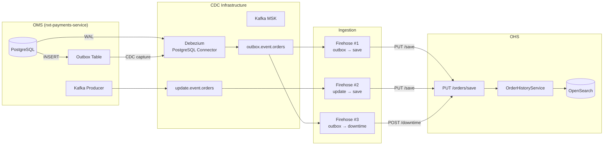
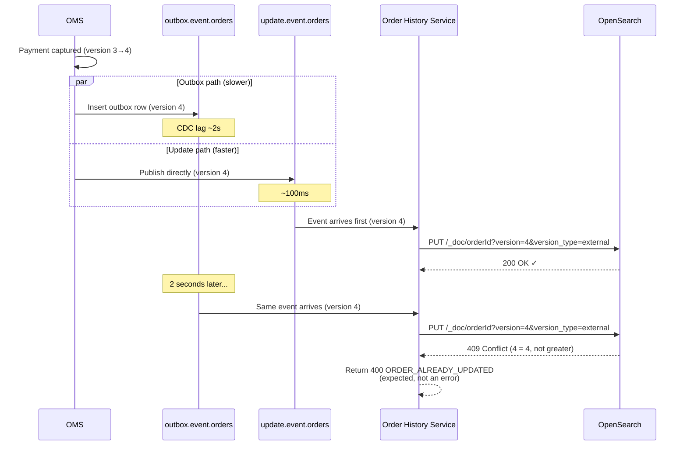
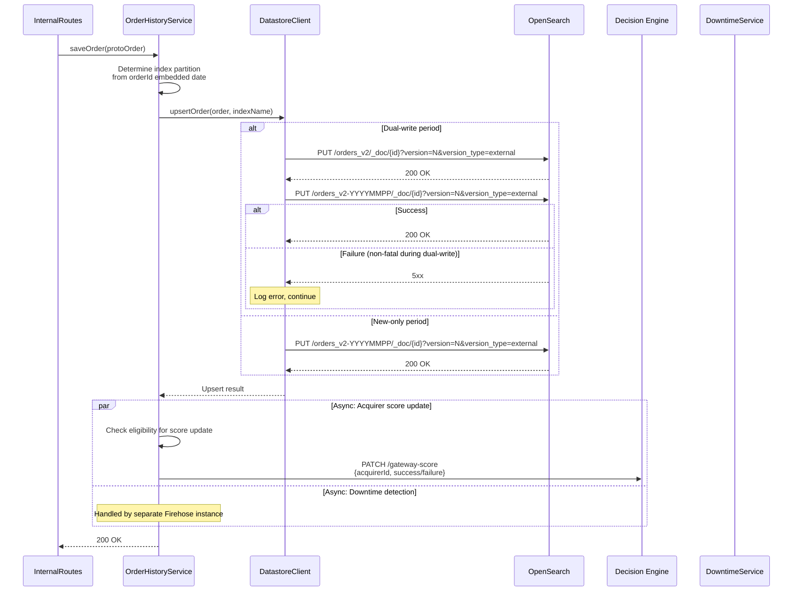
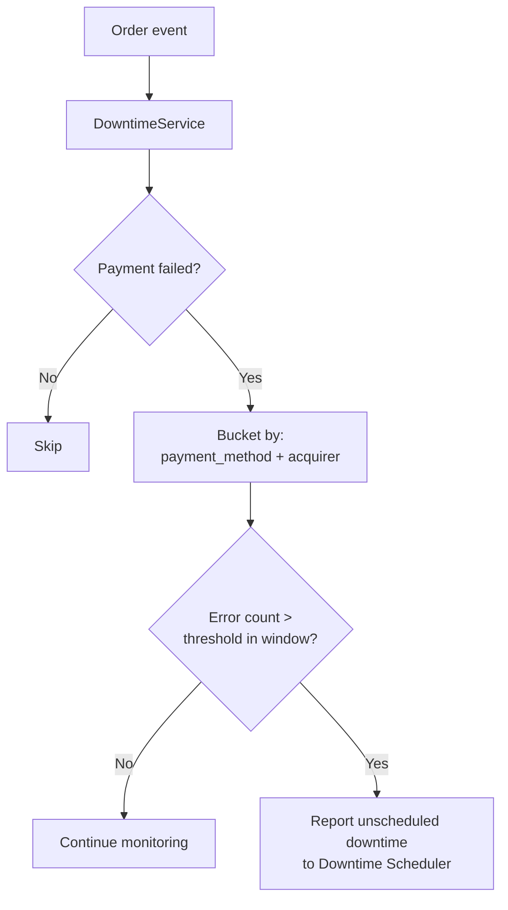

# 04 — CDC Ingestion Pipeline

## Overview

The Order History Service receives order data through a **CDC-based event pipeline**. The OMS (nxt-payments-service) writes to a PostgreSQL outbox table, which Debezium captures and publishes to Kafka. A GoTo Firehose HTTP sink connector batches these events and pushes them to OHS via HTTP.

**Key design principle**: OHS performs **zero transformation** — it receives a pre-built Protobuf Order (serialized as JSON by OMS), and indexes it directly into OpenSearch. The "brains" are in OMS; OHS is a dumb but fast indexer.

## End-to-End Pipeline



## Dual Event Sources

### Why Two Kafka Topics?

| Topic | Producer | Trigger | Latency |
|-------|----------|---------|---------|
| `outbox.event.orders` | Debezium CDC (outbox table) | Order create/initial state | ~1-5s (CDC lag) |
| `update.event.orders` | OMS direct Kafka producer | Every payment state change | ~100ms |

The **dual-source** ensures both completeness and freshness:
- `outbox.event.orders` guarantees at-least-once delivery via the transactional outbox pattern
- `update.event.orders` provides lower-latency updates for real-time queries

Both carry the **full Order protobuf** (not a delta), so the latest version always represents complete state.

### Race Handling

When both topics publish near-simultaneously, external versioning resolves the race:



## Outbox Pattern in OMS

### Outbox Table Schema

```sql
CREATE TABLE outbox (
    id             UUID PRIMARY KEY DEFAULT gen_random_uuid(),
    aggregate_type VARCHAR(255) NOT NULL,  -- 'orders'
    aggregate_id   BYTEA NOT NULL,         -- Protobuf OrderEventKey
    payload        BYTEA NOT NULL,         -- Protobuf Order (full)
    traceparent    VARCHAR(255),           -- OpenTelemetry context
    created_at     TIMESTAMP DEFAULT NOW()
);
```

### OMS Write Flow

```kotlin
// In nxt_payment_order_service
@Transactional
fun capturePayment(orderId: String, paymentId: String) {
    // 1. Update order in PostgreSQL
    val order = orderRepository.findById(orderId)
    order.payments[0].status = PaymentStatus.CAPTURED
    order.status = OrderStatus.PROCESSED
    order.version++
    orderRepository.save(order)

    // 2. Insert into outbox (same transaction!)
    val protoOrder = order.buildOrderMessage()  // Full protobuf
    outboxRepository.insert(
        aggregateType = "orders",
        aggregateId = OrderEventKey(orderId).toByteArray(),
        payload = protoOrder.toByteArray()
    )

    // 3. Also publish directly to Kafka (fire-and-forget)
    kafkaProducer.publish("update.event.orders", orderId, protoOrder)
}
```

**Transactional guarantee**: The outbox INSERT is in the same DB transaction as the order UPDATE. If the transaction rolls back, no outbox row exists, and no CDC event is emitted.

## Firehose Configuration

### Firehose #1: Order Save (from outbox)

```yaml
# order-http-order-history-firehose.env
SOURCE_KAFKA_CONSUMER_GROUP_ID: "order-http-order-history-firehose"
SOURCE_KAFKA_TOPIC: "outbox.event.orders"
INPUT_SCHEMA_PROTO_CLASS: "dev.plural.protos.payments.orders.Order"
SINK_HTTP_SERVICE_URL: "http://nxt-order-history-service-svc.../api/internal/v1/orders/save"
SINK_HTTP_REQUEST_METHOD: "PUT"
SINK_HTTP_JSON_BODY_TEMPLATE: '{"logMessage":"%s","topic":"%s"}'
ERROR_TYPES_FOR_DLQ: "DEFAULT_ERROR,SINK_UNKNOWN_ERROR"
REPLICA_COUNT: 2
```

### Firehose #2: Order Save (from update topic)

```yaml
# order-http-order-history-update-firehose.env
SOURCE_KAFKA_CONSUMER_GROUP_ID: "order-http-order-history-update-firehose"
SOURCE_KAFKA_TOPIC: "update.event.orders"
SINK_HTTP_SERVICE_URL: "http://nxt-order-history-service-svc.../api/internal/v1/orders/save"
SINK_HTTP_REQUEST_METHOD: "PUT"
```

### Firehose #3: Downtime Detection (from outbox)

```yaml
# order-http-order-history-downtime-firehose.env
SOURCE_KAFKA_CONSUMER_GROUP_ID: "order-http-order-history-downtime-firehose"
SOURCE_KAFKA_TOPIC: "outbox.event.orders"
SINK_HTTP_SERVICE_URL: "http://nxt-order-history-service-svc.../api/internal/v1/downtime/unscheduled"
SINK_HTTP_REQUEST_METHOD: "POST"
```

## Event Processing in OHS

### Event Deserialization

```mermaid
flowchart TD
    HTTP[PUT /api/internal/v1/orders/save] --> BODY[Parse request body<br/>List of Event objects]
    BODY --> EXTRACT[Extract first event<br/>with non-null logMessage]
    EXTRACT --> PROTO[Protobuf JSON Parser<br/>JsonFormat.parser().merge()]
    PROTO --> ORDER[OrderOuterClass.Order object]
    ORDER --> SAVE[orderHistoryService.saveOrder()]
```

```kotlin
// Event.kt — Deserialization
data class Event(
    val logMessage: String?,   // JSON-encoded Protobuf Order
    val topic: String?
) {
    fun toOrder(): Order? {
        if (logMessage == null) return null
        val builder = Order.newBuilder()
        JsonFormat.parser()
            .ignoringUnknownFields()
            .merge(logMessage, builder)
        return builder.build()
    }
}
```

### Save Order Flow



### Upsert Implementation

```kotlin
// OrderHistoryDatastoreClient.kt (simplified)
suspend fun upsertOrder(order: Order, indexName: String): Either<ClientError, Unit> {
    val orderId = order.id
    val version = order.version
    val jsonBody = jsonPrinter().print(order)  // Protobuf → JSON

    return circuitBreaker.protectEither {
        httpClient.put("${datastoreUrl}/${indexName}/_doc/${orderId}") {
            parameter("version", version)
            parameter("version_type", "external")
            contentType(ContentType.Application.Json)
            setBody(jsonBody)
        }
    }.mapLeft { error ->
        when {
            error.statusCode == 409 -> ClientError("ORDER_ALREADY_UPDATED")
            else -> ClientError("DATASTORE_ERROR: ${error.message}")
        }
    }
}
```

### JSON Serialization Configuration

```kotlin
// Utils.kt — Protobuf JSON Printer
fun jsonPrinter(): JsonFormat.Printer = JsonFormat.printer()
    .preservingProtoFieldNames()      // Use snake_case (not camelCase)
    .includingDefaultValueFields(     // Always include these booleans
        setOf(
            Order.getDescriptor().findFieldByName("auto_capture"),
            Payment.getDescriptor().findFieldByName("is_aggregator"),
            Payment.getDescriptor().findFieldByName("is_force_cancelled"),
            Payment.getDescriptor().findFieldByName("is_tokenized_txn")
        )
    )
```

## Error Handling

### Version Conflicts (Expected)

```mermaid
flowchart TD
    UPSERT[Upsert attempt] --> RESULT{Response?}

    RESULT -->|200 OK| SUCCESS[Document indexed ✓]
    RESULT -->|409 Conflict| STALE[Stale event<br/>Newer version already indexed]

    STALE --> RETURN_400[Return 400 to Firehose<br/>ORDER_ALREADY_UPDATED]
    RETURN_400 --> DLQ[Firehose routes to DLQ<br/>(expected, harmless)]
```

Version conflicts are **normal** and expected. They indicate that a newer state was already indexed (e.g., update topic arrived before outbox topic). The DLQ entries from version conflicts can be safely ignored.

### Failure Modes

| Failure | OHS Behavior | Firehose Behavior |
|---------|-------------|-------------------|
| OpenSearch 200 | Return 200 | Ack message |
| OpenSearch 409 (version conflict) | Return 400 | Route to DLQ |
| OpenSearch 5xx | Return 500 | Retry (then DLQ) |
| OpenSearch timeout | Circuit breaker counts | Retry (then DLQ) |
| Circuit breaker OPEN | Return 503 | Retry (then DLQ) |
| Protobuf parse failure | Return 400 | Route to DLQ |
| Invalid orderId (can't derive index) | Return 400 | Route to DLQ |

### Circuit Breaker Configuration

```yaml
datastore:
  circuitBreaker:
    maxFailures: 200
    resetTimeout: 10000      # 10 seconds
    backoffFactor: 1.2
    maxResetTimeout: 60000   # 60 seconds
```

## Throughput & Latency

| Metric | Value |
|--------|-------|
| Events per second (peak) | ~10,000 |
| Upsert latency (p50) | ~5ms |
| Upsert latency (p99) | ~50ms |
| CDC end-to-end latency | ~2-5s (outbox path) |
| Direct publish latency | ~200ms (update path) |
| Version conflict rate | ~5-10% (normal) |

## Acquirer Score Updates

After indexing, OHS optionally sends gateway performance scores to the Decision Engine:

```mermaid
flowchart TD
    SAVE[Order saved to OpenSearch] --> ELIGIBLE{Score update eligible?}

    ELIGIBLE -->|No| DONE[Done]
    ELIGIBLE -->|Yes| REDIS_CHECK{Redis: score sent<br/>in last N seconds?}

    REDIS_CHECK -->|Yes (cached)| DONE
    REDIS_CHECK -->|No| SEND[Send score to Decision Engine<br/>PATCH /gateway-score]

    SEND --> CACHE[Cache in Redis<br/>(prevent duplicates)]
```

**Eligibility criteria**:
- Payment is in terminal state (CAPTURED/FAILED)
- Order has acquirer details
- Not a retry/reprocessed score
- Rate-limited via Redis TTL cache

## Downtime Detection

A separate Firehose instance sends the same order events to the downtime endpoint:



This enables automatic detection of acquirer/payment-method outages without polling.
